# المخطط الشجري لطبقات الصلاحيات الضمنية (57 صلاحية)

## (Hierarchical Implied Permissions Tree & Layer Architecture)

**تاريخ التوليد:** 10 أكتوبر 2026  
**الملف البرمجي المرتبط:** [`internal/services/permissions_services/permissions.go`](file:///home/osm/StudioProjects/permissions_youtrack/internal/services/permissions_services/permissions.go)  
**ملف كود المخطط (Mermaid):** [`docs/all_implied_permissions_tree_layers.mmd`](file:///home/osm/StudioProjects/permissions_youtrack/docs/all_implied_permissions_tree_layers.mmd)  
**ملف المخطط الصوري عالي الدقة (SVG):** [`docs/all_implied_permissions_tree_layers.svg`](file:///home/osm/StudioProjects/permissions_youtrack/docs/all_implied_permissions_tree_layers.svg)  

---

## 1. فلسفة المخطط الشجري للصلاحيات الضمنية (Implied Permissions)

يمثل هذا المخطط **هندسة التضمين التلقائي (Automatic Implication Architecture)** عند منح الأدوار (`Role Granting`) في YouTrack:

1. **مفهوم الصلاحية الضمنية (Implied Permission):**  
   عند إسناد صلاحية عليا أو متقدمة للمستخدم في دور معين، يقوم النظام بمنحه تلقائياً الصلاحيات الأدنى والأساسية المرتبطة بها دون الحاجة لإضافتها يدوياً.
2. **علاقة الصلاحيات الجذرية (Root Anchors):**  
   تُعد الصلاحيات الجذرية (مثل `READ_PROJECT_BASIC` و `READ_USER_BASIC` و `READ_ORGANIZATION` و `ADMIN_READ_APP`) هي **قواعد الارتكاز التأسيسية** التي تصب فيها كافة سلاسل التضمين.
3. **سريان الأسهم في المخطط الشجري (`A ==>|يتضمن ضمناً| B`):**  
   السهم العريض يوضح أن الصلاحية `A` تشمل وتتضمن تلقائياً الصلاحية `B`، مما يشكل شجرة متكاملة تبدأ من القواعد الجذرية وترتقي عبر الطبقات الهرمية.

---

## 2. جدول توزيع الطبقات الهرمية ودليل السمة الداكنة (Dark Theme & Palette)

صُمم المخطط بالكامل على **خلفية ليلية داكنة فاخرة (`#0B0F19`)**، مع إلغاء تام لأي خلفيات بيضاء في المخطط أو الحاويات:

| الطبقة الهرمية | الوصف المعماري | عدد الصلاحيات | كود اللون (Hex) | دلالة الطبقة وسريان التضمين |
| :--- | :--- | :---: | :---: | :--- |
| **الخلفية العامة (Canvas)** | **مساحة المخطط الكلية** | — | `#0B0F19` (أسود أوبسيديان ليلي) | تلغي اللون الأبيض تماماً وتوفر راحة بصرية فائقة. |
| **حاويات الطبقات (Subgraphs)** | **أطر تصنيف الطبقات** | — | `#0F172A` / `#1E293B` (سليت داكن وفحمي) | عزل داكن ناعم يمنح عمقاً بصرياً بدون بياض. |
| **الطبقة 0 (Layer 0)** | **الصلاحيات الجذرية التأسيسية (Core Foundation Roots)** | **11** | `#1E1B4B` (بنفسجي نيلي ملكي غامق) | **الجذور التأسيسية**: الصلاحيات القاعدية التي يستقر عندها التضمين، وتُمنح حتماً عند اختيار أي عملية فرعية. |
| **الطبقة 1 (Layer 1)** | **التضمين المباشر (1st Degree Implied Tier)** | **17** | `#064E3B` (أخضر زمردي عميق) | **العمليات المباشرة**: تتضمن الجذور التأسيسية مباشرة (مثل `READ_PROJECT` تتضمن `READ_PROJECT_BASIC`). |
| **الطبقة 2 (Layer 2)** | **التضمين المتعدي (2nd Degree Implied Tier)** | **10** | `#78350F` (بني كهرماني دافئ) | **الإدارة والعمليات العليا**: تتضمن صلاحيات الطبقة 1، ويتعدى تضمينها بالتبعية إلى جذور الطبقة 0. |
| **الطبقة 3 (Layer 3)** | **التضمين المتعدي الثلاثي (3rd Degree Implied Tier)** | **3** | `#4A044E` (فوشيا بنفسجي عميق) | **أعلى مستويات التضمين**: عمليات تعليقات المقالات (`CREATE/UPDATE/DELETE_ARTICLE_COMMENT`). |
| **الطبقة المستقلة (Standalone)** | **الصلاحيات المستقلة ذاتية الاكتفاء (0 Implied / 0 Impliers)** | **16** | `#1F2937` (رمادي حجري أنيق) | **صلاحيات قائمة بذاتها**: لا تتضمن أي صلاحية أخرى، ولا تتضمنها أي صلاحية، وتمنح منفردة. |
| **المجموع الكلي** | **تغطية شاملة لكافة صلاحيات النظام** | **57** | — | **مطابقة بنسبة 100% مع الكود البرمجي والتوثيق الرسمي** |

---

## 3. تفصيل الأشجار الهرمية حسب المسارات الوظيفية

### 1) شجرة مسار المشاريع والتذاكر (Projects & Issues Tree)

- **الجذر الأساسي (Layer 0):** `READ_PROJECT_BASIC` + `UPDATE_ISSUE`
- **المستوى الأول (Layer 1):**  
  - `READ_PROJECT` ==> تتضمن `READ_PROJECT_BASIC`
  - `CREATE_ISSUE` ==> تتضمن `READ_PROJECT_BASIC`
  - `READ_ISSUE` ==> تتضمن `READ_PROJECT_BASIC`
  - `VIEW_VOTERS` ==> تتضمن `READ_PROJECT_BASIC`
  - `VIEW_WATCHERS` ==> تتضمن `READ_PROJECT_BASIC`
  - `PRIVATE_READ_ISSUE` ==> تتضمن `READ_PROJECT_BASIC`
- **المستوى الثاني (Layer 2):**  
  - `UPDATE_PROJECT` ==> تتضمن `READ_PROJECT` (ومتعدياً `READ_PROJECT_BASIC`)
  - `DELETE_PROJECT` ==> تتضمن `READ_PROJECT` (ومتعدياً `READ_PROJECT_BASIC`)
  - `READ_HIDDEN_STUFF` ==> تتضمن `PRIVATE_READ_ISSUE` (ومتعدياً `READ_PROJECT_BASIC`)
  - `PRIVATE_UPDATE_ISSUE` ==> تتضمن `PRIVATE_READ_ISSUE` و `UPDATE_ISSUE`

### 2) شجرة مسار المستخدمين والحسابات (Users Hierarchy Tree)

- **الجذر الأساسي (Layer 0):** `READ_USER_BASIC` + `UPDATE_PROFILE`
- **المستوى الأول (Layer 1):** `READ_USER` ==> تتضمن `READ_USER_BASIC`
- **المستوى الثاني (Layer 2):**  
  - `UPDATE_USER` ==> تتضمن `READ_USER` و `UPDATE_PROFILE` (ومتعدياً `READ_USER_BASIC`)
  - `DELETE_USER` ==> تتضمن `READ_USER` (ومتعدياً `READ_USER_BASIC`)

### 3) شجرة مسار المؤسسات (Organizations Tree)

- **الجذر الأساسي (Layer 0):** `READ_ORGANIZATION`
- **المستوى الأول (Layer 1):**  
  - `CREATE_ORGANIZATION` ==> تتضمن `READ_ORGANIZATION`
  - `UPDATE_ORGANIZATION` ==> تتضمن `READ_ORGANIZATION`
  - `DELETE_ORGANIZATION` ==> تتضمن `READ_ORGANIZATION`

### 4) شجرة مسار النظام والتطبيقات (System & App Content Tree)

- **الجذور الأساسية (Layer 0):** `ADMIN_READ_APP` و `READ_APP_CONTENT`
- **المستوى الأول (Layer 1):**  
  - `ADMIN_UPDATE_APP` ==> تتضمن `ADMIN_READ_APP`
  - `UPDATE_APP_CONTENT` ==> تتضمن `READ_APP_CONTENT`

### 5) شجرة مسار التعليقات وبنود العمل (Interactions & Work Items Tree)

- **الجذور الأساسية (Layer 0):** `READ_COMMENT` و `CREATE_WORK_ITEM` و `READ_WORK_ITEM` و `UPDATE_WORK_ITEM`
- **المستوى الأول (Layer 1):**  
  - `UPDATE_NOT_OWN_COMMENT` ==> تتضمن `READ_COMMENT`
  - `DELETE_NOT_OWN_COMMENT` ==> تتضمن `READ_COMMENT`
  - `CREATE_NOT_OWN_WORK_ITEM` ==> تتضمن `CREATE_WORK_ITEM`
  - `UPDATE_NOT_OWN_WORK_ITEM` ==> تتضمن `READ_WORK_ITEM` و `UPDATE_WORK_ITEM`

### 6) شجرة مسار قاعدة المعرفة والمقالات (Knowledge Base & Articles Tree)

- **المستوى الأول (Layer 1):** `READ_ARTICLE` *(مرتبطة سياقياً بـ `READ_PROJECT_BASIC` في الوثائق)*
- **المستوى الثاني (Layer 2):**  
  - `CREATE_ARTICLE` ==> تتضمن `READ_ARTICLE`
  - `UPDATE_ARTICLE` ==> تتضمن `READ_ARTICLE`
  - `DELETE_ARTICLE` ==> تتضمن `READ_ARTICLE`
  - `READ_ARTICLE_COMMENT` ==> تشترط سياقياً `READ_ARTICLE`
- **المستوى الثالث (Layer 3):**  
  - `CREATE_ARTICLE_COMMENT` ==> تتضمن `READ_ARTICLE_COMMENT`
  - `UPDATE_ARTICLE_COMMENT` ==> تتضمن `READ_ARTICLE_COMMENT`
  - `DELETE_ARTICLE_COMMENT` ==> تتضمن `READ_ARTICLE_COMMENT`

### 7) الصلاحيات المستقلة (Standalone Group - 16 صلاحية)

لا تتضمن أي صلاحية ولا تتضمنها صلاحية أخرى:

- **المشاريع والتذاكر:** `CREATE_PROJECT`, `DELETE_ISSUE`, `LINK_ISSUE`, `UPDATE_WATCHERS`, `APPLY_COMMANDS_SILENTLY`, `CREATE_USER`
- **المرفقات:** `CREATE_ATTACHMENT_ISSUE`, `UPDATE_ATTACHMENT_ISSUE`, `DELETE_ATTACHMENT_ISSUE`
- **التعليقات الذاتية:** `CREATE_COMMENT`, `UPDATE_COMMENT`, `DELETE_COMMENT`
- **البحث المحفوظ والوسوم:** `CREATE_WATCH_FOLDER`, `UPDATE_WATCH_FOLDER`, `DELETE_WATCH_FOLDER`, `SHARE_WATCH_FOLDER`

---

## 4. كود المخطط التفاعلي بالسمة الداكنة (Interactive Dark Flowchart)

```mermaid
%%{init: {
  'theme': 'dark',
  'themeVariables': {
    'darkMode': true,
    'background': '#0B0F19',
    'mainBkg': '#0B0F19',
    'textColor': '#F9FAFB',
    'lineColor': '#818CF8',
    'fontFamily': 'Cairo, Inter, system-ui, -apple-system, sans-serif',
    'fontSize': '13px',
    'edgeLabelBackground': '#1F2937',
    'clusterBkg': '#0F172A',
    'clusterBorder': '#334155',
    'titleColor': '#F8FAFC'
  }
}}%%
flowchart TB

    %% أنماط الطبقات الهرمية
    classDef layerRoot fill:#1E1B4B,stroke:#6366F1,stroke-width:3px,color:#FFFFFF,font-weight:bold;
    classDef layer1 fill:#064E3B,stroke:#10B981,stroke-width:2.5px,color:#FFFFFF,font-weight:bold;
    classDef layer2 fill:#78350F,stroke:#F59E0B,stroke-width:2px,color:#FFFFFF,font-weight:bold;
    classDef layer3 fill:#4A044E,stroke:#E879F9,stroke-width:2px,color:#FFFFFF,font-weight:bold;
    classDef layerArticle fill:#581C87,stroke:#A855F7,stroke-width:2.5px,color:#FFFFFF,font-weight:bold;
    classDef layerArticleSub fill:#3B0764,stroke:#C084FC,stroke-width:2px,color:#FFFFFF,font-weight:bold;
    classDef standalone fill:#1F2937,stroke:#6B7280,stroke-width:2px,color:#F3F4F6,font-weight:bold;

    %% الطبقة 0
    subgraph L0 ["الطبقة 0: الصلاحيات الجذرية التأسيسية (Layer 0: Core Foundation Roots)"]
        direction TB
        subgraph L0_PROJ ["جذر المشاريع والتذاكر الرئيسي"]
            READ_PROJECT_BASIC["READ_PROJECT_BASIC<br/><b>Read Project Basic</b><br/><i>(الجذر الأكبر لكافة عمليات المشاريع والتذاكر)</i>"]:::layerRoot
            UPDATE_ISSUE["UPDATE_ISSUE<br/><b>Update Issue</b><br/><i>(جذر تعديل الحقول العامة للتذاكر)</i>"]:::layerRoot
        end

        subgraph L0_USER ["جذور هوية وحسابات المستخدمين"]
            READ_USER_BASIC["READ_USER_BASIC<br/><b>Read User Basic</b><br/><i>(جذر هوية المستخدمين الأساسية)</i>"]:::layerRoot
            UPDATE_PROFILE["UPDATE_PROFILE<br/><b>Update Self</b><br/><i>(جذر تعديل الملف الشخصي وأمان الحساب الذاتي)</i>"]:::layerRoot
        end

        subgraph L0_ORG ["جذر المؤسسات"]
            READ_ORGANIZATION["READ_ORGANIZATION<br/><b>Read Organization</b><br/><i>(جذر استعراض المؤسسات وبياناتها)</i>"]:::layerRoot
        end

        subgraph L0_SYS ["جذور النظام والتطبيقات"]
            ADMIN_READ_APP["ADMIN_READ_APP<br/><b>Low-level Admin Read</b><br/><i>(جذر قراءة إعدادات النظام)</i>"]:::layerRoot
            READ_APP_CONTENT["READ_APP_CONTENT<br/><b>Read App Content</b><br/><i>(جذر قراءة وتصدير محتوى التطبيقات)</i>"]:::layerRoot
        end

        subgraph L0_INTERACTION ["جذور التفاعلات وسجلات العمل الذاتية"]
            READ_COMMENT["READ_COMMENT<br/><b>Read Issue Comment</b><br/><i>(جذر استعراض تعليقات التذاكر)</i>"]:::layerRoot
            CREATE_WORK_ITEM["CREATE_WORK_ITEM<br/><b>Create Work Item</b><br/><i>(جذر تسجيل بنود العمل الذاتية)</i>"]:::layerRoot
            READ_WORK_ITEM["READ_WORK_ITEM<br/><b>Read Work Item</b><br/><i>(جذر استعراض بنود العمل)</i>"]:::layerRoot
            UPDATE_WORK_ITEM["UPDATE_WORK_ITEM<br/><b>Update Work Item</b><br/><i>(جذر تعديل وقت العمل الذاتي)</i>"]:::layerRoot
        end
    end

    %% الطبقة 1
    subgraph L1 ["الطبقة 1: التضمين المباشر - الدرجة الأولى (Layer 1: 1st Degree Implied Tier)"]
        direction TB
        subgraph L1_PROJ_OPS ["عمليات التذاكر والمشاريع الأساسية"]
            READ_PROJECT["READ_PROJECT<br/><b>Read Project Full</b>"]:::layer1
            CREATE_ISSUE["CREATE_ISSUE<br/><b>Create Issue</b>"]:::layer1
            READ_ISSUE["READ_ISSUE<br/><b>Read Issue</b>"]:::layer1
            PRIVATE_READ_ISSUE["PRIVATE_READ_ISSUE<br/><b>Read Private Fields</b>"]:::layer1
            VIEW_VOTERS["VIEW_VOTERS<br/><b>View Voters</b>"]:::layer1
            VIEW_WATCHERS["VIEW_WATCHERS<br/><b>View Watchers</b>"]:::layer1
        end

        subgraph L1_USERS ["تفاصيل المستخدمين"]
            READ_USER["READ_USER<br/><b>Read User Details</b>"]:::layer1
        end

        subgraph L1_ADMIN ["إدارة النظام والمحتوى والمؤسسات"]
            ADMIN_UPDATE_APP["ADMIN_UPDATE_APP<br/><b>Low-level Admin Write</b>"]:::layer1
            UPDATE_APP_CONTENT["UPDATE_APP_CONTENT<br/><b>Update App Content</b>"]:::layer1
            CREATE_ORGANIZATION["CREATE_ORGANIZATION<br/><b>Create Organization</b>"]:::layer1
            UPDATE_ORGANIZATION["UPDATE_ORGANIZATION<br/><b>Update Organization</b>"]:::layer1
            DELETE_ORGANIZATION["DELETE_ORGANIZATION<br/><b>Delete Organization</b>"]:::layer1
        end

        subgraph L1_INTERACTION_OPS ["عمليات التفاعل وبنود العمل المتقدمة"]
            UPDATE_NOT_OWN_COMMENT["UPDATE_NOT_OWN_COMMENT<br/><b>Update Other Comment</b>"]:::layer1
            DELETE_NOT_OWN_COMMENT["DELETE_NOT_OWN_COMMENT<br/><b>Delete Other Comment</b>"]:::layer1
            CREATE_NOT_OWN_WORK_ITEM["CREATE_NOT_OWN_WORK_ITEM<br/><b>Create Other Work Item</b>"]:::layer1
            UPDATE_NOT_OWN_WORK_ITEM["UPDATE_NOT_OWN_WORK_ITEM<br/><b>Update Other Work Item</b>"]:::layer1
        end

        subgraph L1_KNOWLEDGE_BASE ["قاعدة المعرفة"]
            READ_ARTICLE["READ_ARTICLE<br/><b>Read Article</b><br/><i>(جذر مسار المقالات المعرفية)</i>"]:::layerArticle
        end
    end

    %% الطبقة 2
    subgraph L2 ["الطبقة 2: التضمين المتعدي - الدرجة الثانية (Layer 2: 2nd Degree Implied Tier)"]
        direction TB
        subgraph L2_PROJ_MGMT ["إدارة وتعديل وحذف المشروع"]
            UPDATE_PROJECT["UPDATE_PROJECT<br/><b>Update Project</b>"]:::layer2
            DELETE_PROJECT["DELETE_PROJECT<br/><b>Delete Project</b>"]:::layer2
        end

        subgraph L2_ISSUE_PRIV ["إدارة الحقول الخاصة والمخفية للتذاكر"]
            READ_HIDDEN_STUFF["READ_HIDDEN_STUFF<br/><b>Override Visibility</b>"]:::layer2
            PRIVATE_UPDATE_ISSUE["PRIVATE_UPDATE_ISSUE<br/><b>Update Private Fields</b>"]:::layer2
        end

        subgraph L2_USER_MGMT ["إدارة وتعديل وحذف المستخدمين"]
            UPDATE_USER["UPDATE_USER<br/><b>Update User</b>"]:::layer2
            DELETE_USER["DELETE_USER<br/><b>Delete User</b>"]:::layer2
        end

        subgraph L2_ARTICLE_OPS ["عمليات المقالات وقراءة تعليقاتها"]
            CREATE_ARTICLE["CREATE_ARTICLE<br/><b>Create Article</b>"]:::layerArticleSub
            UPDATE_ARTICLE["UPDATE_ARTICLE<br/><b>Update Article</b>"]:::layerArticleSub
            DELETE_ARTICLE["DELETE_ARTICLE<br/><b>Delete Article</b>"]:::layerArticleSub
            READ_ARTICLE_COMMENT["READ_ARTICLE_COMMENT<br/><b>Read Article Comment</b>"]:::layerArticleSub
        end
    end

    %% الطبقة 3
    subgraph L3 ["الطبقة 3: التضمين المتعدي - الدرجة الثالثة (Layer 3: 3rd Degree Implied Tier)"]
        direction TB
        subgraph L3_ARTICLE_COMMENTS ["إدارة تعليقات المقالات"]
            CREATE_ARTICLE_COMMENT["CREATE_ARTICLE_COMMENT<br/><b>Create Article Comment</b>"]:::layer3
            UPDATE_ARTICLE_COMMENT["UPDATE_ARTICLE_COMMENT<br/><b>Update Article Comment</b>"]:::layer3
            DELETE_ARTICLE_COMMENT["DELETE_ARTICLE_COMMENT<br/><b>Delete Article Comment</b>"]:::layer3
        end
    end

    %% الطبقة المستقلة
    subgraph L_STANDALONE ["الصلاحيات المستقلة ذاتية الاكتفاء (Standalone - 16 Permissions)"]
        direction TB
        subgraph SA_USERS_PROJ ["مستقلات الحسابات والمشاريع والتذاكر"]
            CREATE_USER["CREATE_USER<br/><b>Create User</b>"]:::standalone
            CREATE_PROJECT["CREATE_PROJECT<br/><b>Create Project</b>"]:::standalone
            DELETE_ISSUE["DELETE_ISSUE<br/><b>Delete Issue</b>"]:::standalone
            LINK_ISSUE["LINK_ISSUE<br/><b>Link Issues</b>"]:::standalone
            UPDATE_WATCHERS["UPDATE_WATCHERS<br/><b>Update Watchers</b>"]:::standalone
            APPLY_COMMANDS_SILENTLY["APPLY_COMMANDS_SILENTLY<br/><b>Silent Commands</b>"]:::standalone
        end

        subgraph SA_ATTACHMENTS ["مرفقات التذاكر"]
            CREATE_ATTACHMENT_ISSUE["CREATE_ATTACHMENT_ISSUE<br/><b>Add Attachment</b>"]:::standalone
            UPDATE_ATTACHMENT_ISSUE["UPDATE_ATTACHMENT_ISSUE<br/><b>Update Attachment</b>"]:::standalone
            DELETE_ATTACHMENT_ISSUE["DELETE_ATTACHMENT_ISSUE<br/><b>Delete Attachment</b>"]:::standalone
        end

        subgraph SA_COMMENTS ["تعليقات التذاكر"]
            CREATE_COMMENT["CREATE_COMMENT<br/><b>Create Comment</b>"]:::standalone
            UPDATE_COMMENT["UPDATE_COMMENT<br/><b>Update Comment</b>"]:::standalone
            DELETE_COMMENT["DELETE_COMMENT<br/><b>Delete Comment</b>"]:::standalone
        end

        subgraph SA_WATCH_FOLDERS ["البحث المحفوظ والوسوم"]
            CREATE_WATCH_FOLDER["CREATE_WATCH_FOLDER<br/><b>Create Tag/Search</b>"]:::standalone
            UPDATE_WATCH_FOLDER["UPDATE_WATCH_FOLDER<br/><b>Edit Tag/Search</b>"]:::standalone
            DELETE_WATCH_FOLDER["DELETE_WATCH_FOLDER<br/><b>Delete Tag/Search</b>"]:::standalone
            SHARE_WATCH_FOLDER["SHARE_WATCH_FOLDER<br/><b>Share Custom View</b>"]:::standalone
        end
    end

    %% روابط L2 ==> L1
    UPDATE_PROJECT ==>|يتضمن ضمناً| READ_PROJECT
    DELETE_PROJECT ==>|يتضمن ضمناً| READ_PROJECT

    READ_HIDDEN_STUFF ==>|يتضمن ضمناً| PRIVATE_READ_ISSUE
    PRIVATE_UPDATE_ISSUE ==>|يتضمن ضمناً| PRIVATE_READ_ISSUE
    PRIVATE_UPDATE_ISSUE ==>|يتضمن ضمناً| UPDATE_ISSUE

    UPDATE_USER ==>|يتضمن ضمناً| READ_USER
    UPDATE_USER ==>|يتضمن ضمناً| UPDATE_PROFILE
    DELETE_USER ==>|يتضمن ضمناً| READ_USER

    CREATE_ARTICLE ==>|يتضمن ضمناً| READ_ARTICLE
    UPDATE_ARTICLE ==>|يتضمن ضمناً| READ_ARTICLE
    DELETE_ARTICLE ==>|يتضمن ضمناً| READ_ARTICLE
    READ_ARTICLE_COMMENT -.->|مشروط بـ| READ_ARTICLE

    %% روابط L3 ==> L2
    CREATE_ARTICLE_COMMENT ==>|يتضمن ضمناً| READ_ARTICLE_COMMENT
    UPDATE_ARTICLE_COMMENT ==>|يتضمن ضمناً| READ_ARTICLE_COMMENT
    DELETE_ARTICLE_COMMENT ==>|يتضمن ضمناً| READ_ARTICLE_COMMENT

    %% روابط L1 ==> L0
    READ_PROJECT ==>|يتضمن ضمناً| READ_PROJECT_BASIC
    CREATE_ISSUE ==>|يتضمن ضمناً| READ_PROJECT_BASIC
    READ_ISSUE ==>|يتضمن ضمناً| READ_PROJECT_BASIC
    PRIVATE_READ_ISSUE ==>|يتضمن ضمناً| READ_PROJECT_BASIC
    VIEW_VOTERS ==>|يتضمن ضمناً| READ_PROJECT_BASIC
    VIEW_WATCHERS ==>|يتضمن ضمناً| READ_PROJECT_BASIC

    READ_USER ==>|يتضمن ضمناً| READ_USER_BASIC

    ADMIN_UPDATE_APP ==>|يتضمن ضمناً| ADMIN_READ_APP
    UPDATE_APP_CONTENT ==>|يتضمن ضمناً| READ_APP_CONTENT

    CREATE_ORGANIZATION ==>|يتضمن ضمناً| READ_ORGANIZATION
    UPDATE_ORGANIZATION ==>|يتضمن ضمناً| READ_ORGANIZATION
    DELETE_ORGANIZATION ==>|يتضمن ضمناً| READ_ORGANIZATION

    UPDATE_NOT_OWN_COMMENT ==>|يتضمن ضمناً| READ_COMMENT
    DELETE_NOT_OWN_COMMENT ==>|يتضمن ضمناً| READ_COMMENT

    CREATE_NOT_OWN_WORK_ITEM ==>|يتضمن ضمناً| CREATE_WORK_ITEM
    UPDATE_NOT_OWN_WORK_ITEM ==>|يتضمن ضمناً| READ_WORK_ITEM
    UPDATE_NOT_OWN_WORK_ITEM ==>|يتضمن ضمناً| UPDATE_WORK_ITEM

    READ_ARTICLE -.->|مشروط سياقياً بـ| READ_PROJECT_BASIC

    %% تنسيقات الخلفيات الداكنة للحاويات
    style L0 fill:#0F172A,stroke:#334155,stroke-width:2px,color:#F8FAFC
    style L1 fill:#0F172A,stroke:#334155,stroke-width:2px,color:#F8FAFC
    style L2 fill:#0F172A,stroke:#334155,stroke-width:2px,color:#F8FAFC
    style L3 fill:#0F172A,stroke:#334155,stroke-width:2px,color:#F8FAFC
    style L_STANDALONE fill:#0F172A,stroke:#334155,stroke-width:2px,color:#F8FAFC

    style L0_PROJ fill:#1E293B,stroke:#475569,stroke-width:1.5px,color:#CBD5E1
    style L0_USER fill:#1E293B,stroke:#475569,stroke-width:1.5px,color:#CBD5E1
    style L0_ORG fill:#1E293B,stroke:#475569,stroke-width:1.5px,color:#CBD5E1
    style L0_SYS fill:#1E293B,stroke:#475569,stroke-width:1.5px,color:#CBD5E1
    style L0_INTERACTION fill:#1E293B,stroke:#475569,stroke-width:1.5px,color:#CBD5E1

    style L1_PROJ_OPS fill:#1E293B,stroke:#475569,stroke-width:1.5px,color:#CBD5E1
    style L1_USERS fill:#1E293B,stroke:#475569,stroke-width:1.5px,color:#CBD5E1
    style L1_ADMIN fill:#1E293B,stroke:#475569,stroke-width:1.5px,color:#CBD5E1
    style L1_INTERACTION_OPS fill:#1E293B,stroke:#475569,stroke-width:1.5px,color:#CBD5E1
    style L1_KNOWLEDGE_BASE fill:#1E293B,stroke:#475569,stroke-width:1.5px,color:#CBD5E1

    style L2_PROJ_MGMT fill:#1E293B,stroke:#475569,stroke-width:1.5px,color:#CBD5E1
    style L2_ISSUE_PRIV fill:#1E293B,stroke:#475569,stroke-width:1.5px,color:#CBD5E1
    style L2_USER_MGMT fill:#1E293B,stroke:#475569,stroke-width:1.5px,color:#CBD5E1
    style L2_ARTICLE_OPS fill:#1E293B,stroke:#475569,stroke-width:1.5px,color:#CBD5E1

    style L3_ARTICLE_COMMENTS fill:#1E293B,stroke:#475569,stroke-width:1.5px,color:#CBD5E1

    style SA_USERS_PROJ fill:#1E293B,stroke:#475569,stroke-width:1.5px,color:#CBD5E1
    style SA_ATTACHMENTS fill:#1E293B,stroke:#475569,stroke-width:1.5px,color:#CBD5E1
    style SA_COMMENTS fill:#1E293B,stroke:#475569,stroke-width:1.5px,color:#CBD5E1
    style SA_WATCH_FOLDERS fill:#1E293B,stroke:#475569,stroke-width:1.5px,color:#CBD5E1
```

