# المخطط الشامل لطبقات الاعتمادية لجميع الصلاحيات (57 صلاحية)

## (Unified Hierarchical Dependency Layers of All 57 YouTrack Permissions)

**تاريخ التوليد:** 10 أكتوبر 2026  
**الملف البرمجي المرتبط:** [`internal/services/permissions_services/permissions.go`](file:///home/osm/StudioProjects/permissions_youtrack/internal/services/permissions_services/permissions.go)  
**ملف المخطط الصوري (SVG):** [`docs/all_permissions_dependency_layers.svg`](file:///home/osm/StudioProjects/permissions_youtrack/docs/all_permissions_dependency_layers.svg)  
**ملف كود المخطط (Mermaid):** [`docs/all_permissions_dependency_layers.mmd`](file:///home/osm/StudioProjects/permissions_youtrack/docs/all_permissions_dependency_layers.mmd)  
**المخطط المعياري المرجعي المتبع:** [`docs/read_project_basic_layers.mmd`](file:///home/osm/StudioProjects/permissions_youtrack/docs/read_project_basic_layers.mmd)

---

## 1. الفارق الجوهري: مخطط الاعتمادية (Dependency) مقابل مخطط التضمين (Implied)

لتجنب أي التباس مفاهيمي، يوضح هذا الدليل الفرق الأساسي بين نوعي المخططات:

| وجه المقارنة | مخطط التضمين (Implied Permissions Diagram) | مخطط طبقات الاعتمادية (Dependency Layers Diagram) |
| :--- | :--- | :--- |
| **سياق التشغيل** | **عند المنح والإضافة (Role Granting)** | **عند السحب والإلغاء المتتالي (Cascading Revocation)** |
| **اتجاه الأسهم** | من الصلاحية العليا إلى الصلاحية المتضمنة (`A implies B`) | من الصلاحية الأساسية (الجذر) إلى الصلاحيات التابعة (`Foundation --> Dependent`) |
| **المعنى الوظيفي** | *"منح الصلاحية A يمنح تلقائياً الصلاحية B ضمناً"* | *"الصلاحية B تعتمد في وجودها وتشغيلها على الصلاحية A، وسحب A يسقط B"* |
| **الهيكلية البصرية** | تجميعات وظيفية حسب النطاق أو الكيان | **طبقات هرمية صلبة (Layers 0, 1, 2, 3)** توضح درجات التبعية التشغيلية |

---

## 2. دليل الألوان وتصنيف الطبقات الهرمية (Legend & Layer Architecture)

صُممت الهيكلية بنفس النمط المعتمد في [`read_project_basic_layers.mmd`](file:///home/osm/StudioProjects/permissions_youtrack/docs/read_project_basic_layers.mmd)، حيث تم توزيع كامل صلاحيات YouTrack الـ 57 عبر **4 طبقات اعتمادية + مجموعة الصلاحيات المستقلة**:

| الطبقة (Layer) | التوصيف المعماري | عدد الصلاحيات | اللون في المخطط | تأثير السحب والإلغاء (Revocation Effect) |
| :--- | :--- | :---: | :---: | :--- |
| **الطبقة 0 (Layer 0: Roots)** | الصلاحيات التأسيسية الجذرية (Core Roots) | **11** | 🟣 بنفسجي ليلي غامق (`#1E1B4B`) | **أحجار الزاوية**: سحب أي منها يطلق سلسلة إسقاط متتالية (Cascading Drop) لكافة الاعتماديات المباشرة والمتعدية. |
| **الطبقة 0 (Standalone)** | الصلاحيات المستقلة ذاتية الاكتفاء | **16** | ⚫ رمادي حجري غامق (`#1F2937`) | **مستقلة تماماً**: لا تعتمد على أي صلاحية سابقة، ولا تعتمد عليها أي صلاحية لاحقة (0 Dependents). |
| **الطبقة 1 (Layer 1)** | الاعتماديات المباشرة (1st Degree) | **17** | 🟢 أخضر زمردي غامق (`#064E3B`) | **التبعية المباشرة**: تسقط **فوراً** بمجرد سحب الجذر المرتبط بها في الطبقة 0. |
| **الطبقة 2 (Layer 2)** | الاعتماديات المتعدية (2nd Degree) | **10** | 🟠 بني كهرماني غامق (`#78350F`) | **التبعية المتعدية**: تسقط **تلقائياً** بمجرد سقوط وسيطها في الطبقة 1. |
| **الطبقة 3 (Layer 3)** | الاعتماديات المتعدية (3rd Degree) | **3** | 🟪 فوشيا بنفسجي غامق (`#4A044E`) | **أعلى درجات التبعية**: تسقط متعدياً عبر وسيطي الطبقة 1 والطبقة 2 (عمليات تعليقات المقالات). |
| **الإجمالي العام** | **تغطية شاملة 100% لكافة الصلاحيات** | **57** | — | **لا توجد أي صلاحية مهملة أو خارج الهيكل** |

---

## 3. المخطط الشامل التفاعلي (Interactive Flowchart)

```mermaid
flowchart TB

    %% =========================================================================
    %% إعدادات التنسيق والألوان العامة للطبقات (Theme & Hierarchy Styling)
    %% تصميم مستوحى 100% من نمط read_project_basic_layers.mmd
    %% =========================================================================
    classDef layer0 fill:#1E1B4B,stroke:#6366F1,stroke-width:3px,color:#FFFFFF,font-weight:bold;
    classDef layer1 fill:#064E3B,stroke:#10B981,stroke-width:2.5px,color:#FFFFFF,font-weight:bold;
    classDef layer2 fill:#78350F,stroke:#F59E0B,stroke-width:2px,color:#FFFFFF,font-weight:bold;
    classDef layer3 fill:#4A044E,stroke:#E879F9,stroke-width:2px,color:#FFFFFF,font-weight:bold;
    classDef layerArticle fill:#581C87,stroke:#A855F7,stroke-width:2px,color:#FFFFFF,font-weight:bold;
    classDef layerComment fill:#4A044E,stroke:#E879F9,stroke-width:2px,color:#FFFFFF,font-weight:bold;
    classDef standalone fill:#1F2937,stroke:#6B7280,stroke-width:2px,color:#F3F4F6,font-weight:bold;

    %% =========================================================================
    %% الطبقة 0: الجذور التأسيسية والصلاحيات المستقلة (Layer 0 - Core Foundation Roots & Standalone)
    %% =========================================================================
    subgraph L0 ["الطبقة 0: الصلاحيات التأسيسية والمستقلة (Layer 0: Core Foundation Roots & Standalone)"]
        direction TB

        subgraph L0_SYS ["جذور النظام والتطبيقات"]
            ADMIN_READ_APP["ADMIN_READ_APP<br/><b>Low-level Admin Read</b><br/><i>(جذر قراءة إعدادات النظام)</i>"]:::layer0
            READ_APP_CONTENT["READ_APP_CONTENT<br/><b>Read App Content</b><br/><i>(جذر استعراض محتوى التطبيقات)</i>"]:::layer0
        end

        subgraph L0_ORG ["جذر المؤسسات"]
            READ_ORGANIZATION["READ_ORGANIZATION<br/><b>Read Organization</b><br/><i>(جذر استعراض المؤسسات)</i>"]:::layer0
        end

        subgraph L0_USER ["جذور المستخدمين الذاتية والأساسية"]
            READ_USER_BASIC["READ_USER_BASIC<br/><b>Read User Basic</b><br/><i>(جذر هوية المستخدمين الأساسية)</i>"]:::layer0
            UPDATE_PROFILE["UPDATE_PROFILE<br/><b>Update Self</b><br/><i>(جذر تعديل الملف الشخصي الذاتي)</i>"]:::layer0
        end

        subgraph L0_PROJ ["الجذور المركزية للمشاريع والتذاكر"]
            READ_PROJECT_BASIC["READ_PROJECT_BASIC<br/><b>Read Project Basic</b><br/><i>(الجذر الأكبر لكافة عمليات المشاريع)</i>"]:::layer0
            UPDATE_ISSUE["UPDATE_ISSUE<br/><b>Update Issue</b><br/><i>(جذر تعديل الحقول القياسية)</i>"]:::layer0
        end

        subgraph L0_INTERACTION ["جذور التفاعلات وسجلات العمل الذاتية"]
            READ_COMMENT["READ_COMMENT<br/><b>Read Issue Comment</b><br/><i>(جذر استعراض التعليقات)</i>"]:::layer0
            CREATE_WORK_ITEM["CREATE_WORK_ITEM<br/><b>Create Work Item</b><br/><i>(جذر تسجيل الوقت الذاتي)</i>"]:::layer0
            READ_WORK_ITEM["READ_WORK_ITEM<br/><b>Read Work Item</b><br/><i>(جذر استعراض سجلات العمل)</i>"]:::layer0
            UPDATE_WORK_ITEM["UPDATE_WORK_ITEM<br/><b>Update Work Item</b><br/><i>(جذر تعديل وقت العمل الذاتي)</i>"]:::layer0
        end

        subgraph L0_STANDALONE ["صلاحيات مستقلة بدون اعتماديات (Standalone - 0 Dependents)"]
            CREATE_USER["CREATE_USER<br/><b>Create User</b>"]:::standalone
            CREATE_PROJECT["CREATE_PROJECT<br/><b>Create Project</b>"]:::standalone
            DELETE_ISSUE["DELETE_ISSUE<br/><b>Delete Issue</b>"]:::standalone
            LINK_ISSUE["LINK_ISSUE<br/><b>Link Issues</b>"]:::standalone
            UPDATE_WATCHERS["UPDATE_WATCHERS<br/><b>Update Watchers</b>"]:::standalone
            APPLY_COMMANDS_SILENTLY["APPLY_COMMANDS_SILENTLY<br/><b>Silent Commands</b>"]:::standalone
            CREATE_ATTACHMENT_ISSUE["CREATE_ATTACHMENT_ISSUE<br/><b>Add Attachment</b>"]:::standalone
            UPDATE_ATTACHMENT_ISSUE["UPDATE_ATTACHMENT_ISSUE<br/><b>Update Attachment</b>"]:::standalone
            DELETE_ATTACHMENT_ISSUE["DELETE_ATTACHMENT_ISSUE<br/><b>Delete Attachment</b>"]:::standalone
            CREATE_COMMENT["CREATE_COMMENT<br/><b>Create Comment</b>"]:::standalone
            UPDATE_COMMENT["UPDATE_COMMENT<br/><b>Update Comment</b>"]:::standalone
            DELETE_COMMENT["DELETE_COMMENT<br/><b>Delete Comment</b>"]:::standalone
            CREATE_WATCH_FOLDER["CREATE_WATCH_FOLDER<br/><b>Create Tag/Search</b>"]:::standalone
            UPDATE_WATCH_FOLDER["UPDATE_WATCH_FOLDER<br/><b>Edit Tag/Search</b>"]:::standalone
            DELETE_WATCH_FOLDER["DELETE_WATCH_FOLDER<br/><b>Delete Tag/Search</b>"]:::standalone
            SHARE_WATCH_FOLDER["SHARE_WATCH_FOLDER<br/><b>Share Custom View</b>"]:::standalone
        end
    end

    %% =========================================================================
    %% الطبقة 1: الاعتماديات المباشرة - الدرجة الأولى (Layer 1 - Direct Dependents)
    %% =========================================================================
    subgraph L1 ["الطبقة 1: الاعتماديات المباشرة في الكود والوثائق (Direct Dependents - 1st Degree)"]
        direction TB

        subgraph L1_ADMIN ["إدارة النظام والمحتوى والمؤسسات"]
            ADMIN_UPDATE_APP["ADMIN_UPDATE_APP<br/><b>Low-level Admin Write</b>"]:::layer1
            UPDATE_APP_CONTENT["UPDATE_APP_CONTENT<br/><b>Update App Content</b>"]:::layer1
            CREATE_ORGANIZATION["CREATE_ORGANIZATION<br/><b>Create Organization</b>"]:::layer1
            UPDATE_ORGANIZATION["UPDATE_ORGANIZATION<br/><b>Update Organization</b>"]:::layer1
            DELETE_ORGANIZATION["DELETE_ORGANIZATION<br/><b>Delete Organization</b>"]:::layer1
        end

        subgraph L1_USERS ["تفاصيل المستخدمين"]
            READ_USER["READ_USER<br/><b>Read User Details</b>"]:::layer1
        end

        subgraph L1_PROJ_CORE ["عمليات التذاكر والمشاريع الأساسية"]
            READ_PROJECT["READ_PROJECT<br/><b>Read Project Full</b>"]:::layer1
            CREATE_ISSUE["CREATE_ISSUE<br/><b>Create Issue</b>"]:::layer1
            READ_ISSUE["READ_ISSUE<br/><b>Read Issue</b>"]:::layer1
            PRIVATE_READ_ISSUE["PRIVATE_READ_ISSUE<br/><b>Read Private Fields</b>"]:::layer1
            VIEW_VOTERS["VIEW_VOTERS<br/><b>View Voters</b>"]:::layer1
            VIEW_WATCHERS["VIEW_WATCHERS<br/><b>View Watchers</b>"]:::layer1
        end

        subgraph L1_DOCS ["مسار المعرفة (في الوثائق الرسمية)"]
            READ_ARTICLE["READ_ARTICLE<br/><b>Read Article</b><br/><i>(مشروط بـ Read Project Basic)</i>"]:::layerArticle
        end

        subgraph L1_INTERACTION ["إدارة تعليقات وبنود عمل الآخرين"]
            UPDATE_NOT_OWN_COMMENT["UPDATE_NOT_OWN_COMMENT<br/><b>Update Other Comment</b>"]:::layer1
            DELETE_NOT_OWN_COMMENT["DELETE_NOT_OWN_COMMENT<br/><b>Delete Other Comment</b>"]:::layer1
            CREATE_NOT_OWN_WORK_ITEM["CREATE_NOT_OWN_WORK_ITEM<br/><b>Create Other Work Item</b>"]:::layer1
            UPDATE_NOT_OWN_WORK_ITEM["UPDATE_NOT_OWN_WORK_ITEM<br/><b>Update Other Work Item</b>"]:::layer1
        end
    end

    %% =========================================================================
    %% الطبقة 2: الاعتماديات المتعدية - الدرجة الثانية (Layer 2 - Transitive Dependents)
    %% =========================================================================
    subgraph L2 ["الطبقة 2: الاعتماديات المتعدية - الدرجة الثانية (Transitive Dependents - 2nd Degree)"]
        direction TB

        subgraph L2_USERS ["إدارة وتعديل وحذف المستخدمين"]
            UPDATE_USER["UPDATE_USER<br/><b>Update User</b>"]:::layer2
            DELETE_USER["DELETE_USER<br/><b>Delete User</b>"]:::layer2
        end

        subgraph L2_PROJ_MGMT ["إدارة وتعديل وحذف المشروع"]
            UPDATE_PROJECT["UPDATE_PROJECT<br/><b>Update Project</b>"]:::layer2
            DELETE_PROJECT["DELETE_PROJECT<br/><b>Delete Project</b>"]:::layer2
        end

        subgraph L2_ISSUE_PRIV ["الحقول والقيود الخاصة بالتذاكر"]
            READ_HIDDEN_STUFF["READ_HIDDEN_STUFF<br/><b>Override Visibility</b>"]:::layer2
            PRIVATE_UPDATE_ISSUE["PRIVATE_UPDATE_ISSUE<br/><b>Update Private Fields</b>"]:::layer2
        end

        subgraph L2_ARTICLE_OPS ["عمليات مقالات قاعدة المعرفة"]
            CREATE_ARTICLE["CREATE_ARTICLE<br/><b>Create Article</b>"]:::layerArticle
            UPDATE_ARTICLE["UPDATE_ARTICLE<br/><b>Update Article</b>"]:::layerArticle
            DELETE_ARTICLE["DELETE_ARTICLE<br/><b>Delete Article</b>"]:::layerArticle
            READ_ARTICLE_COMMENT["READ_ARTICLE_COMMENT<br/><b>Read Article Comment</b>"]:::layerArticle
        end
    end

    %% =========================================================================
    %% الطبقة 3: الاعتماديات المتعدية - الدرجة الثالثة (Layer 3 - Tertiary Dependents)
    %% =========================================================================
    subgraph L3 ["الطبقة 3: الاعتماديات المتعدية - الدرجة الثالثة (Transitive Dependents - 3rd Degree)"]
        subgraph L3_COMMENTS ["عمليات تعليقات المقالات"]
            CREATE_ARTICLE_COMMENT["CREATE_ARTICLE_COMMENT<br/><b>Create Article Comment</b>"]:::layerComment
            UPDATE_ARTICLE_COMMENT["UPDATE_ARTICLE_COMMENT<br/><b>Update Article Comment</b>"]:::layerComment
            DELETE_ARTICLE_COMMENT["DELETE_ARTICLE_COMMENT<br/><b>Delete Article Comment</b>"]:::layerComment
        end
    end

    %% =========================================================================
    %% روابط تدفق الاعتمادية من الطبقة 0 إلى الطبقة 1 (Dependency Flow: L0 -> L1)
    %% =========================================================================
    ADMIN_READ_APP --> ADMIN_UPDATE_APP
    READ_APP_CONTENT --> UPDATE_APP_CONTENT

    READ_ORGANIZATION --> CREATE_ORGANIZATION
    READ_ORGANIZATION --> UPDATE_ORGANIZATION
    READ_ORGANIZATION --> DELETE_ORGANIZATION

    READ_USER_BASIC --> READ_USER

    READ_COMMENT --> UPDATE_NOT_OWN_COMMENT
    READ_COMMENT --> DELETE_NOT_OWN_COMMENT

    CREATE_WORK_ITEM --> CREATE_NOT_OWN_WORK_ITEM
    READ_WORK_ITEM --> UPDATE_NOT_OWN_WORK_ITEM
    UPDATE_WORK_ITEM --> UPDATE_NOT_OWN_WORK_ITEM

    READ_PROJECT_BASIC --> READ_PROJECT
    READ_PROJECT_BASIC --> CREATE_ISSUE
    READ_PROJECT_BASIC --> READ_ISSUE
    READ_PROJECT_BASIC --> PRIVATE_READ_ISSUE
    READ_PROJECT_BASIC --> VIEW_VOTERS
    READ_PROJECT_BASIC --> VIEW_WATCHERS

    READ_PROJECT_BASIC -.-> READ_ARTICLE

    %% =========================================================================
    %% روابط تدفق الاعتمادية من الطبقة 1 إلى الطبقة 2 (Dependency Flow: L1 -> L2)
    %% =========================================================================
    READ_USER --> UPDATE_USER
    UPDATE_PROFILE --> UPDATE_USER
    READ_USER --> DELETE_USER

    READ_PROJECT --> UPDATE_PROJECT
    READ_PROJECT --> DELETE_PROJECT

    PRIVATE_READ_ISSUE --> READ_HIDDEN_STUFF
    PRIVATE_READ_ISSUE --> PRIVATE_UPDATE_ISSUE
    UPDATE_ISSUE --> PRIVATE_UPDATE_ISSUE

    READ_ARTICLE -.-> CREATE_ARTICLE
    READ_ARTICLE -.-> UPDATE_ARTICLE
    READ_ARTICLE -.-> DELETE_ARTICLE
    READ_ARTICLE -.-> READ_ARTICLE_COMMENT

    %% =========================================================================
    %% روابط تدفق الاعتمادية من الطبقة 2 إلى الطبقة 3 (Dependency Flow: L2 -> L3)
    %% =========================================================================
    READ_ARTICLE_COMMENT -.-> CREATE_ARTICLE_COMMENT
    READ_ARTICLE_COMMENT -.-> UPDATE_ARTICLE_COMMENT
    READ_ARTICLE_COMMENT -.-> DELETE_ARTICLE_COMMENT
```

---

## 4. المسارات التشغيلية وسيناريوهات الإسقاط المتتالي (Cascading Revocation Paths)

توضح الطبقات بوضوح كيف تؤثر عملية إلغاء أي صلاحية تأسيسية على بقية أجزاء النظام:

### 4.1 مسار المشاريع والتذاكر (Project & Issue Subtree)
1. إذا ألغيت **`READ_PROJECT_BASIC`** (الطبقة 0):
   - تسقط مباشرة (الطبقة 1): `READ_PROJECT`, `CREATE_ISSUE`, `READ_ISSUE`, `PRIVATE_READ_ISSUE`, `VIEW_VOTERS`, `VIEW_WATCHERS`.
   - وتسقط تلقائياً بالتبعية (الطبقة 2): `UPDATE_PROJECT`, `DELETE_PROJECT`, `READ_HIDDEN_STUFF`, `PRIVATE_UPDATE_ISSUE`.
   - ويسقط مسار المقالات سياقياً (الطبقات 1 و 2 و 3): `READ_ARTICLE` وصولاً لتعليقات المقالات.

### 4.2 مسار المستخدمين والحسابات (User Subtree)
1. إذا ألغيت **`READ_USER_BASIC`** (الطبقة 0):
   - تسقط مباشرة (الطبقة 1): `READ_USER`.
   - وتسقط متعدياً (الطبقة 2): `UPDATE_USER`, `DELETE_USER`.
2. إذا ألغيت **`UPDATE_PROFILE`** (الطبقة 0):
   - تسقط متعدياً (الطبقة 2): `UPDATE_USER` (لأن تعديل المستخدمين يتطلب امتلاك حق تعديل الملف الشخصي).

### 4.3 مسار بنود العمل وتتبع الوقت (Work Items Subtree)
1. صلاحية **`CREATE_WORK_ITEM`** (الطبقة 0) تمكن المستخدم من تسجيل عمله الخاص؛ وسحبها يسقط تلقائياً **`CREATE_NOT_OWN_WORK_ITEM`** (الطبقة 1).
2. صلاحية **`UPDATE_NOT_OWN_WORK_ITEM`** (الطبقة 1) تعتمد متعدياً على جذرين من الطبقة 0: `READ_WORK_ITEM` و `UPDATE_WORK_ITEM`؛ سحب أي منهما يسقط إمكانية تعديل بنود عمل الآخرين.

### 4.4 مسار مقالات المعرفة والتعليقات (Knowledge Articles Subtree)
- يبدأ المسار من **`READ_ARTICLE`** (الطبقة 1) -> تتفرع منه عمليات المقالات الأساسية وقراءة التعليقات **`READ_ARTICLE_COMMENT`** (الطبقة 2) -> وتتفرع منها أعلى طبقات التبعية **`CREATE/UPDATE/DELETE_ARTICLE_COMMENT`** (الطبقة 3).

---

## 5. مراجع الملفات وروابط الكود

- كود الصلاحيات ومصفوفات التبعية والتضمين: [`internal/services/permissions_services/permissions.go`](file:///home/osm/StudioProjects/permissions_youtrack/internal/services/permissions_services/permissions.go)
- ملف المصدر الرسومي المولد: [`docs/all_permissions_dependency_layers.mmd`](file:///home/osm/StudioProjects/permissions_youtrack/docs/all_permissions_dependency_layers.mmd)
- الصورة المتجهة للمخطط الشامل: [`docs/all_permissions_dependency_layers.svg`](file:///home/osm/StudioProjects/permissions_youtrack/docs/all_permissions_dependency_layers.svg)
- مخطط العينة المرجعي: [`docs/read_project_basic_layers.mmd`](file:///home/osm/StudioProjects/permissions_youtrack/docs/read_project_basic_layers.mmd)
- تقرير البحث والتدقيق الرسمي 100%: [`docs/research/youtrack_implied_permissions_verification_research.md`](file:///home/osm/StudioProjects/permissions_youtrack/docs/research/youtrack_implied_permissions_verification_research.md)
