# المخطط الشامل الموحد لجميع صلاحيات يوتراك (All 57 Permissions Unified Diagram)

**تاريخ التوليد:** 10 أكتوبر 2026  
**الملف البرمجي الأساسي:** [`internal/services/permissions_services/permissions.go`](file:///home/osm/StudioProjects/permissions_youtrack/internal/services/permissions_services/permissions.go)  
**ملف المخطط الصوري (SVG عالي الدقة):** [`docs/all_permissions_unified_diagram.svg`](file:///home/osm/StudioProjects/permissions_youtrack/docs/all_permissions_unified_diagram.svg)  
**ملف كود المخطط (Mermaid Source):** [`docs/all_permissions_unified_diagram.mmd`](file:///home/osm/StudioProjects/permissions_youtrack/docs/all_permissions_unified_diagram.mmd)  

---

## 1. دليل ألوان النطاقات والقراءة (Scopes & Legend)

يجمع هذا المخطط الموحد كافة صلاحيات النظام البالغ عددها **57 صلاحية**، مصنفة في **11 وحدة وظيفية** ومميزة لونياً وفق **مستويات النطاق (Scope Levels)** الثلاثة في YouTrack:

| النطاق (Scope) | كود اللون | التمثيل اللوني | الدلالة الإدارية |
| :--- | :---: | :---: | :--- |
| **Global Scope (عام)** | `#FEF3C7` (حدود `#D97706`) | 🟡 أصفر / كهرماني | تسري على مستوى الخادم بالكامل بغض النظر عن أي مشروع. |
| **Organization Scope (مؤسسة)** | `#EDE9FE` (حدود `#7C3AED`) | 🟣 بنفسجي | تسري على مستوى مؤسسة ومشاريعها التابعة. |
| **Project Scope (مشروع)** | `#E0F2FE` (حدود `#0284C7`) | 🔵 أزرق سماوي | تسري فقط داخل حدود المشروع أو المشاريع المعينة للدور. |

> 🔗 **دلالة الأسهم:**  
> السهم $A \longrightarrow B$ يعني أن امتلاك الصلاحية $A$ يمنح تلقائياً الصلاحية $B$ (**Implies**).  
> وبالعكس: إذا سُحبت الصلاحية $B$ من الدور، تسقط الصلاحية $A$ تلقائياً (**Dependent Revocation**).

---

## 2. المخطط الشامل التفاعلي (Unified Diagram)

```mermaid
flowchart TB

    %% =========================================================================
    %% أنماط النطاقات اللونية (Scope Styling)
    %% =========================================================================
    classDef scopeGlobal fill:#FEF3C7,stroke:#D97706,stroke-width:2.5px,color:#92400E,font-weight:bold;
    classDef scopeOrg fill:#EDE9FE,stroke:#7C3AED,stroke-width:2.5px,color:#5B21B6,font-weight:bold;
    classDef scopeProj fill:#E0F2FE,stroke:#0284C7,stroke-width:2.5px,color:#075985,font-weight:bold;

    %% =========================================================================
    %% 1. إدارة النظام (System - Global)
    %% =========================================================================
    subgraph G_SYSTEM ["1. النظام العام (System - Global)"]
        ADMIN_UPDATE_APP["ADMIN_UPDATE_APP<br/><b>Low-level Admin Write</b>"]:::scopeGlobal
        ADMIN_READ_APP["ADMIN_READ_APP<br/><b>Low-level Admin Read</b>"]:::scopeGlobal

        ADMIN_UPDATE_APP --> ADMIN_READ_APP
    end

    %% =========================================================================
    %% 2. إدارة المستخدمين (Users - Global)
    %% =========================================================================
    subgraph G_USERS ["2. المستخدمين والحسابات (Users - Global)"]
        CREATE_USER["CREATE_USER<br/><b>Create User</b>"]:::scopeGlobal
        UPDATE_USER["UPDATE_USER<br/><b>Update User</b>"]:::scopeGlobal
        DELETE_USER["DELETE_USER<br/><b>Delete User</b>"]:::scopeGlobal
        UPDATE_PROFILE["UPDATE_PROFILE<br/><b>Update Self</b>"]:::scopeGlobal
        READ_USER["READ_USER<br/><b>Read User Details</b>"]:::scopeGlobal
        READ_USER_BASIC["READ_USER_BASIC<br/><b>Read User Basic</b>"]:::scopeGlobal

        UPDATE_USER --> UPDATE_PROFILE
        UPDATE_USER --> READ_USER
        DELETE_USER --> READ_USER
        READ_USER --> READ_USER_BASIC
    end

    %% =========================================================================
    %% 3. إدارة المؤسسات (Organizations - Global & Org)
    %% =========================================================================
    subgraph G_ORGS ["3. المؤسسات (Organizations)"]
        CREATE_ORGANIZATION["CREATE_ORGANIZATION<br/><b>Create Organization</b>"]:::scopeGlobal
        UPDATE_ORGANIZATION["UPDATE_ORGANIZATION<br/><b>Update Organization</b>"]:::scopeOrg
        DELETE_ORGANIZATION["DELETE_ORGANIZATION<br/><b>Delete Organization</b>"]:::scopeOrg
        READ_ORGANIZATION["READ_ORGANIZATION<br/><b>Read Organization</b>"]:::scopeOrg

        CREATE_ORGANIZATION --> READ_ORGANIZATION
        UPDATE_ORGANIZATION --> READ_ORGANIZATION
        DELETE_ORGANIZATION --> READ_ORGANIZATION
    end

    %% =========================================================================
    %% 4. محتوى التطبيقات وسير العمل (App & Workflows - Project)
    %% =========================================================================
    subgraph G_APP ["4. محتوى التطبيقات وسير العمل (App Content)"]
        UPDATE_APP_CONTENT["UPDATE_APP_CONTENT<br/><b>Update App Content</b>"]:::scopeProj
        READ_APP_CONTENT["READ_APP_CONTENT<br/><b>Read App Content</b>"]:::scopeProj

        UPDATE_APP_CONTENT --> READ_APP_CONTENT
    end

    %% =========================================================================
    %% 5. المشاريع والتذاكر (Projects & Issues Core)
    %% =========================================================================
    subgraph G_PROJECTS_ISSUES ["5. المشاريع والتذاكر (Projects & Issues)"]
        CREATE_PROJECT["CREATE_PROJECT<br/><b>Create Project</b>"]:::scopeGlobal
        UPDATE_PROJECT["UPDATE_PROJECT<br/><b>Update Project</b>"]:::scopeProj
        DELETE_PROJECT["DELETE_PROJECT<br/><b>Delete Project</b>"]:::scopeProj
        READ_PROJECT["READ_PROJECT<br/><b>Read Project Full</b>"]:::scopeProj
        READ_PROJECT_BASIC["READ_PROJECT_BASIC<br/><b>Read Project Basic</b>"]:::scopeProj

        CREATE_ISSUE["CREATE_ISSUE<br/><b>Create Issue</b>"]:::scopeProj
        READ_ISSUE["READ_ISSUE<br/><b>Read Issue</b>"]:::scopeProj
        VIEW_VOTERS["VIEW_VOTERS<br/><b>View Voters</b>"]:::scopeProj
        VIEW_WATCHERS["VIEW_WATCHERS<br/><b>View Watchers</b>"]:::scopeProj

        READ_HIDDEN_STUFF["READ_HIDDEN_STUFF<br/><b>Override Visibility</b>"]:::scopeProj
        PRIVATE_READ_ISSUE["PRIVATE_READ_ISSUE<br/><b>Read Private Fields</b>"]:::scopeProj
        PRIVATE_UPDATE_ISSUE["PRIVATE_UPDATE_ISSUE<br/><b>Update Private Fields</b>"]:::scopeProj
        UPDATE_ISSUE["UPDATE_ISSUE<br/><b>Update Issue</b>"]:::scopeProj

        DELETE_ISSUE["DELETE_ISSUE<br/><b>Delete Issue</b>"]:::scopeProj
        LINK_ISSUE["LINK_ISSUE<br/><b>Link Issues</b>"]:::scopeProj
        UPDATE_WATCHERS["UPDATE_WATCHERS<br/><b>Update Watchers</b>"]:::scopeProj
        APPLY_COMMANDS_SILENTLY["APPLY_COMMANDS_SILENTLY<br/><b>Silent Commands</b>"]:::scopeProj

        %% روابط إدارة المشاريع
        UPDATE_PROJECT --> READ_PROJECT
        DELETE_PROJECT --> READ_PROJECT
        READ_PROJECT --> READ_PROJECT_BASIC

        %% روابط التذاكر إلى جذر المشروع
        CREATE_ISSUE --> READ_PROJECT_BASIC
        READ_ISSUE --> READ_PROJECT_BASIC
        VIEW_VOTERS --> READ_PROJECT_BASIC
        VIEW_WATCHERS --> READ_PROJECT_BASIC

        %% روابط الحقول الخاصة
        READ_HIDDEN_STUFF --> PRIVATE_READ_ISSUE
        PRIVATE_READ_ISSUE --> READ_PROJECT_BASIC
        PRIVATE_UPDATE_ISSUE --> PRIVATE_READ_ISSUE
        PRIVATE_UPDATE_ISSUE --> UPDATE_ISSUE
    end

    %% =========================================================================
    %% 6. مرفقات التذاكر (Issue Attachments)
    %% =========================================================================
    subgraph G_ATTACHMENTS ["6. مرفقات التذاكر (Issue Attachments)"]
        CREATE_ATTACHMENT_ISSUE["CREATE_ATTACHMENT_ISSUE<br/><b>Add Attachment</b>"]:::scopeProj
        UPDATE_ATTACHMENT_ISSUE["UPDATE_ATTACHMENT_ISSUE<br/><b>Update Attachment</b>"]:::scopeProj
        DELETE_ATTACHMENT_ISSUE["DELETE_ATTACHMENT_ISSUE<br/><b>Delete Attachment</b>"]:::scopeProj
    end

    %% =========================================================================
    %% 7. تعليقات التذاكر (Issue Comments)
    %% =========================================================================
    subgraph G_COMMENTS ["7. تعليقات التذاكر (Issue Comments)"]
        CREATE_COMMENT["CREATE_COMMENT<br/><b>Create Comment</b>"]:::scopeProj
        UPDATE_COMMENT["UPDATE_COMMENT<br/><b>Update Comment</b>"]:::scopeProj
        DELETE_COMMENT["DELETE_COMMENT<br/><b>Delete Comment</b>"]:::scopeProj
        UPDATE_NOT_OWN_COMMENT["UPDATE_NOT_OWN_COMMENT<br/><b>Update Other Comment</b>"]:::scopeProj
        DELETE_NOT_OWN_COMMENT["DELETE_NOT_OWN_COMMENT<br/><b>Delete Other Comment</b>"]:::scopeProj
        READ_COMMENT["READ_COMMENT<br/><b>Read Comment</b>"]:::scopeProj

        UPDATE_NOT_OWN_COMMENT --> READ_COMMENT
        DELETE_NOT_OWN_COMMENT --> READ_COMMENT
    end

    %% =========================================================================
    %% 8. بنود العمل وتتبع الوقت (Issue Work Items)
    %% =========================================================================
    subgraph G_WORK_ITEMS ["8. بنود العمل وتتبع الوقت (Work Items)"]
        CREATE_NOT_OWN_WORK_ITEM["CREATE_NOT_OWN_WORK_ITEM<br/><b>Create Other Work Item</b>"]:::scopeProj
        CREATE_WORK_ITEM["CREATE_WORK_ITEM<br/><b>Create Work Item</b>"]:::scopeProj
        UPDATE_NOT_OWN_WORK_ITEM["UPDATE_NOT_OWN_WORK_ITEM<br/><b>Update Other Work Item</b>"]:::scopeProj
        UPDATE_WORK_ITEM["UPDATE_WORK_ITEM<br/><b>Update Work Item</b>"]:::scopeProj
        READ_WORK_ITEM["READ_WORK_ITEM<br/><b>Read Work Item</b>"]:::scopeProj

        CREATE_NOT_OWN_WORK_ITEM --> CREATE_WORK_ITEM
        UPDATE_NOT_OWN_WORK_ITEM --> READ_WORK_ITEM
        UPDATE_NOT_OWN_WORK_ITEM --> UPDATE_WORK_ITEM
    end

    %% =========================================================================
    %% 9. مقالات قاعدة المعرفة (Knowledge Base Articles)
    %% =========================================================================
    subgraph G_ARTICLES ["9. مقالات قاعدة المعرفة (Articles)"]
        CREATE_ARTICLE["CREATE_ARTICLE<br/><b>Create Article</b>"]:::scopeProj
        UPDATE_ARTICLE["UPDATE_ARTICLE<br/><b>Update Article</b>"]:::scopeProj
        DELETE_ARTICLE["DELETE_ARTICLE<br/><b>Delete Article</b>"]:::scopeProj
        READ_ARTICLE["READ_ARTICLE<br/><b>Read Article</b>"]:::scopeProj

        CREATE_ARTICLE --> READ_ARTICLE
        UPDATE_ARTICLE --> READ_ARTICLE
        DELETE_ARTICLE --> READ_ARTICLE
    end

    %% =========================================================================
    %% 10. تعليقات المقالات (Article Comments)
    %% =========================================================================
    subgraph G_ARTICLE_COMMENTS ["10. تعليقات المقالات (Article Comments)"]
        CREATE_ARTICLE_COMMENT["CREATE_ARTICLE_COMMENT<br/><b>Create Article Comment</b>"]:::scopeProj
        UPDATE_ARTICLE_COMMENT["UPDATE_ARTICLE_COMMENT<br/><b>Update Article Comment</b>"]:::scopeProj
        DELETE_ARTICLE_COMMENT["DELETE_ARTICLE_COMMENT<br/><b>Delete Article Comment</b>"]:::scopeProj
        READ_ARTICLE_COMMENT["READ_ARTICLE_COMMENT<br/><b>Read Article Comment</b>"]:::scopeProj

        CREATE_ARTICLE_COMMENT --> READ_ARTICLE_COMMENT
        UPDATE_ARTICLE_COMMENT --> READ_ARTICLE_COMMENT
        DELETE_ARTICLE_COMMENT --> READ_ARTICLE_COMMENT
    end

    %% =========================================================================
    %% 11. الوسوم ومجلدات المتابعة (Watch Folders & Tags)
    %% =========================================================================
    subgraph G_WATCH_FOLDERS ["11. الوسوم ومجلدات المتابعة (Watch Folders)"]
        CREATE_WATCH_FOLDER["CREATE_WATCH_FOLDER<br/><b>Create Tag / Search</b>"]:::scopeProj
        UPDATE_WATCH_FOLDER["UPDATE_WATCH_FOLDER<br/><b>Edit Tag / Search</b>"]:::scopeProj
        DELETE_WATCH_FOLDER["DELETE_WATCH_FOLDER<br/><b>Delete Tag / Search</b>"]:::scopeProj
        SHARE_WATCH_FOLDER["SHARE_WATCH_FOLDER<br/><b>Share Custom View</b>"]:::scopeProj
    end
```

---

## 3. توزيع الصلاحيات الـ 57 عبر الوحدات الوظيفية

| # | الوحدة الوظيفية (Subsystem) | عدد الصلاحيات | النطاق الغالب | طبيعة الروابط الضمنية |
| :-: | :--- | :---: | :---: | :--- |
| **1** | **النظام العام (System)** | 2 | `GLOBAL` | الكتابة تتضمن القراءة (`Write` $\to$ `Read`). |
| **2** | **المستخدمين والحسابات (Users)** | 6 | `GLOBAL` | تعديل الحسابات يتضمن تعديل الملف الشخصي وتفاصيل الحسابات، وقراءة التفاصيل تتضمن القراءة الأساسية. |
| **3** | **المؤسسات (Organizations)** | 4 | `GLOBAL` / `ORGANIZATION` | الإنشاء والتعديل والحذف يتضمن قراءة بيانات المؤسسة. |
| **4** | **محتوى التطبيقات وسير العمل (App)** | 2 | `PROJECT` | تعديل محتوى التطبيقات وسير العمل يتضمن قراءتها. |
| **5** | **المشاريع والتذاكر (Projects & Issues)** | 17 | `GLOBAL` / `PROJECT` | الشجرة المركزية: كل مسارات التذاكر والمشاريع تصب في `Read Project Basic`. |
| **6** | **مرفقات التذاكر (Attachments)** | 3 | `PROJECT` | مستقلة عن الروابط الضمنية (تُدار بحقوق الملكية المتأصلة Inherent Rights). |
| **7** | **تعليقات التذاكر (Comments)** | 6 | `PROJECT` | تعديل وحذف تعليقات الآخرين يتضمن قراءة التعليق. |
| **8** | **بنود العمل وتتبع الوقت (Work Items)** | 5 | `PROJECT` | إدارة بنود عمل الآخرين تتضمن قراءة وتعديل بنود العمل. |
| **9** | **مقالات قاعدة المعرفة (Articles)** | 4 | `PROJECT` | الإنشاء والتعديل والحذف يتضمن قراءة المقال. |
| **10** | **تعليقات المقالات (Article Comments)** | 4 | `PROJECT` | الإنشاء والتعديل والحذف يتضمن قراءة تعليقات المقال. |
| **11** | **الوسوم ومجلدات المتابعة (Watch Folders)** | 4 | `PROJECT` | عمليات مستقلة لإدارة الوسوم وطرق العرض المخصصة. |
| **المجموع** | **11 وحدة وظيفية** | **57 صلاحية** | - | **تطابق بنسبة 100% مع كتالوج النظام.** |
