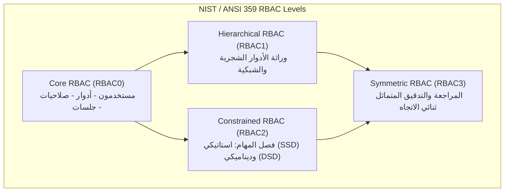
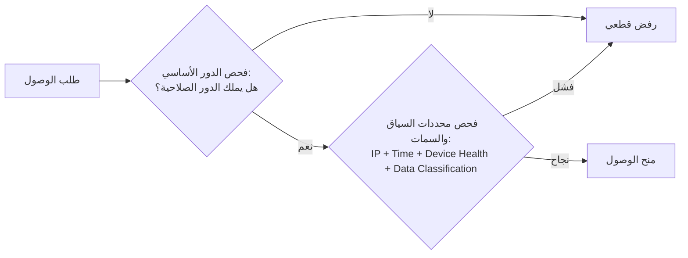
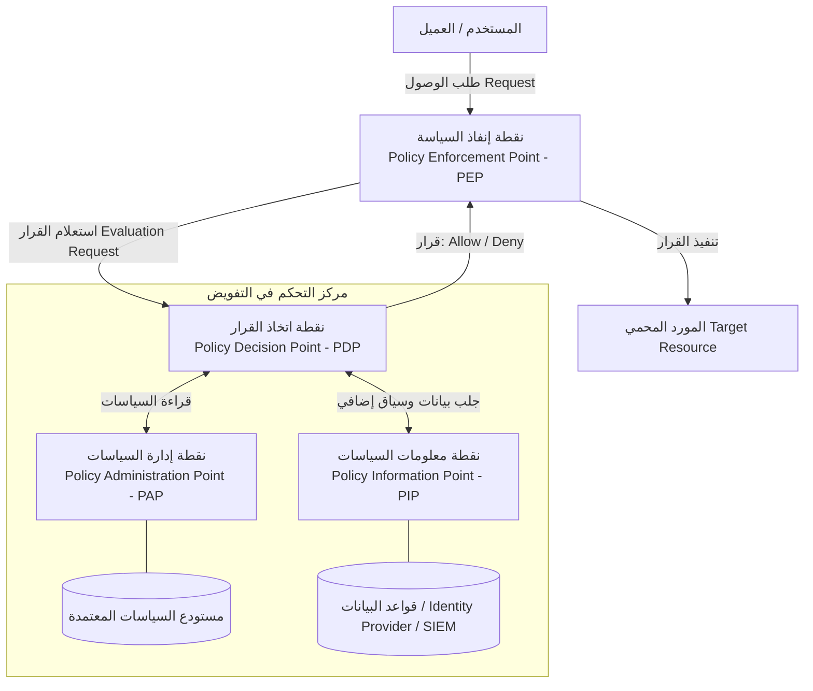
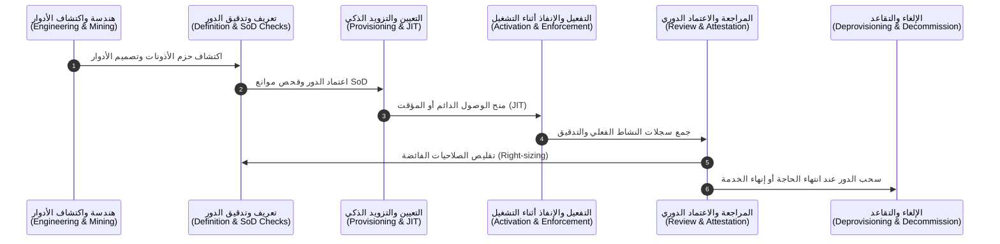

# الدليل المرجعي الشامل لنظام التحكم في الوصول القائم على الأدوار (RBAC)

## المعايير العالمية الرسمية، التقنيات والآليات الحديثة، ودورة حياة الأمان الشاملة

---

## فهرس المحتويات

1. [المقدمة والمرجعيات الدولية الرسمية](#1-المقدمة-والمرجعيات-الدولية-الرسمية)
2. [النموذج المعياري لـ RBAC ومستوياته الوظيفية (NIST / ANSI Standards)](#2-النموذج-المعياري-لـ-rbac-ومستوياته-الوظيفية)
3. [الآليات والتقنيات الحديثة في أنظمة التحكم بالوصول](#3-الآليات-والتقنيات-الحديثة-في-أنظمة-التحكم-بالوصول)
4. [البنية الهندسية للإنفاذ والتفويض الحديث (Authorization Architecture)](#4-البنية-الهندسية-للإنفاذ-والتفويض-الحديث)
5. [دورة حياة نظام الأمان وإدارة الأدوار (Role Lifecycle Management - RLM)](#5-دورة-حياة-نظام-الأمان-وإدارة-الأدوار)
6. [التكامل مع بيئات الحوسبة السحابية وانعدام الثقة (Cloud IAM & Zero Trust)](#6-التكامل-مع-بيئات-الحوسبة-السحابية-وانعدام-الثقة)
7. [أبرز المخاطر والثغرات الأمنية واستراتيجيات المعالجة](#7-أبرز-المخاطر-والثغرات-الأمنية-واستراتيجيات-المعالجة)
8. [المقارنة الشاملة بين نماذج التحكم في الوصول المعاصرة](#8-المقارنة-الشاملة-بين-نماذج-التحكم-في-الوصول)
9. [المراجع الرسمية والدولية المعتمدة](#9-المراجع-الرسمية-والدولية-المعتمدة)

---

## 1. المقدمة والمرجعيات الدولية الرسمية

يعتبر نظام **التحكم في الوصول القائم على الأدوار (Role-Based Access Control - RBAC)** حجر الزاوية في أمن المعلومات الحديث وإدارة الهوية والوصول (**Identity and Access Management - IAM**). يقوم المبدأ الأساسي لـ RBAC على فك الارتباط المباشر بين المستخدمين والصلاحيات؛ حيث تُمنح الصلاحيات لـ "أدوار" وظيفية محددة داخل المنظمة، ثم يُعيّن المستخدمون في تلك الأدوار بناءً على وظائفهم ومسؤولياتهم، مما يضمن تطبيق **مبدأ الحد الأدنى من الامتيازات (Principle of Least Privilege - PoLP)**.

### المرجعيات الرسمية العالمية

* **NIST / ANSI/INCITS 359-2004 و INCITS 359-2012 (Reaffirmed 2022):**
  المعيار الوطني الأمريكي والدولي المعتمد من المعهد الوطني للمعايير والتقنية (**NIST**) واللجنة الدولية لمعايير تكنولوجيا المعلومات (**INCITS**)، والذي وضعه رواد المجال *David Ferraiolo* و *Rick Kuhn*. يحدد هذا المعيار الرياضيات البنيوية، والنموذج المرجعي، ومستويات الدعم الوظيفي لـ RBAC.
* **NIST Special Publication 800-162:**
  الدليل الإرشادي الرسمي للتحكم في الوصول القائم على السمات (**ABAC**)، ويوضح كيفية تطوير ودمج أنظمة RBAC التقليدية مع معايير السمات والسياق.
* **NIST Special Publication 800-207 (Zero Trust Architecture):**
  يوثق كيفية نقل RBAC من نموذج ثابت (Static) إلى نموذج ديناميكي متكيف يعتمد على التقييم المستمر للجلسات والمخاطر.
* **ISO/IEC 27001 / ISO/IEC 27002 (المعيار الدولي لأمن المعلومات):**
  الضوابط المتعلقة بالتحكم في الوصول (التحكم A.9 / A.8 في التحديثات الحديثة)، والتي تفرض مراجعة حقوق الوصول، وإدارة دورة حياة الحسابات، وفصل المهام.
* **OWASP Top 10 (A01:2021 - Broken Access Control):**
  يصنف الفشل في إدارة التفويض والتحكم بالوصول كأخطر تهديد أمني لتطبيقات الويب عالمياً.
* **معايير الامتثال التنظيمي (SOX 404, HIPAA Security Rule, PCI-DSS v4.0, GDPR):**
  تفرض جميعها وجود آليات توثيق صارمة وفصل مهام (**SoD**) ومراجعة دورية للأذونات تضمن الشفافية والمساءلة.

---

## 2. النموذج المعياري لـ RBAC ومستوياته الوظيفية

وفقاً للمعيار القياسي **ANSI/INCITS 359**، ينقسم نموذج RBAC إلى أربعة مستويات تراكمية تلبي احتياجات المنظمات باختلاف تعقيدها الأمني:

### 2.1. المستوى الأساسي: Core RBAC (أو RBAC0)

يمثل النواة الهيكلية التي لا يمكن لنظام RBAC العمل بدونها. يتكون رياضياً ومفاهيمياً من خمس مجموعات أساسية:

1. **المستخدمون (Users - $U$):** الكيانات البشرية أو البرمجية الفاعلة في النظام.
2. **الأدوار (Roles - $R$):** توصيف مجرد للمنصب أو الوظيفة التنظيمية التي تخول صلاحيات معينة.
3. **الصلاحيات (Permissions - $P$):** موافقة صريحة على تنفيذ عملية محددة على كائن محدد ($P \subseteq Operations \times Objects$).
4. **تعيين المستخدمين بالأدوار (User Assignment - $UA$):** علاقة متعدد-إلى-متعدد ($UA \subseteq U \times R$).
5. **تعيين الصلاحيات بالأدوار (Permission Assignment - $PA$):** علاقة متعدد-إلى-متعدد ($PA \subseteq P \times R$).
6. **الجلسات (Sessions - $S$):** تعيين مؤقت يربط المستخدم بمجموعة فرعية نشطة من أدواره المصرح بها أثناء جلسة العمل الواحدة.

> **ملاحظة أمنية معيارية:** في Core RBAC لا يمارس المستخدم الصلاحيات مباشرة، بل تنشط الصلاحيات فقط عندما يفعل المستخدم الدور المرتبط داخل جلسة فعالة.

---

### 2.2. النموذج الهرمي: Hierarchical RBAC (أو RBAC1)

يوسع النموذج الأساسي بإدخال مفهوم **وراثة الأدوار (Role Inheritance)** عبر ترتيب جزئي رياضي ($\ge$):

* إذا كان الدور $R_1 \ge R_2$، فإن $R_1$ يرث تلقائياً جميع صلاحيات الدور $R_2$.
* المستخدم المعين في $R_1$ يمتلك إمكانية تفعيل صلاحيات $R_1$ وصلاحيات $R_2$.

#### أنواع الهرمية المعيارية

1. **الهرمية العامة (General Role Hierarchies):**
   تدعم الوراثة المتعددة (Multiple Inheritance) وهياكل الشبكات الموجهة غير الدائرية (DAG - Directed Acyclic Graph)، حيث يمكن لدور أن يرث من أكثر من دور في آن واحد.
2. **الهرمية المحدودة (Limited Role Hierarchies):**
   تقتصر على الأشجار البسيطة (Trees أو Inverted Trees)، حيث يرث كل دور من دور أب واحد فقط لتجنب التعقيد الحسابي والتضارب.

---

### 2.3. النموذج المقيد وفصل المهام: Constrained RBAC (أو RBAC2)

يضيف قيوداً أمنية بالغة الأهمية لمنع الاحتيال وتضارب المصالح عبر **فصل المهام (Separation of Duties - SoD)**:

#### 1. الفصل الاستاتيكي للمهام (Static Separation of Duties - SSD)

* **التعريف:** فرض قيود تمنع تعيين المستخدم نفسه في دورين متضاربين في آن واحد أثناء مرحلة تعيين الأدوار ($UA$).
* **المثال الشائع:** لا يمكن للمستخدم الذي يحمل دور "مُنشئ أوامر الشراء" أن يُمنح دور "مُعتمد المدفوعات".
* **التطبيق الرياضي:** تحديد مجموعة من الأدوار المتضاربة وقيمة عتبة $n$ بحيث لا يجوز لأي مستخدم امتلاك أكثر من $n-1$ من هذه الأدوار.

#### 2. الفصل الديناميكي للمهام (Dynamic Separation of Duties - DSD)

* **التعريف:** السماح للمستخدم بامتلاك الأدوار المتضاربة على مستوى التعيين المؤسسي، ولكن **يُمنع منعاً باتاً تفعيل الدورين المتضاربين في جلسة عمل واحدة** أو في نفس العملية التجارية.
* **المثال الشائع:** موظف مؤهل للقيام بدور "أمين الصندوق" ودور "مدقق الحسابات"، يمكنه التبديل بينهما في أوقات مختلفة، ولكن لا يمكنه تفعيل كلاهما في نفس الجلسة للتدقيق على عملياته هو شخصياً.

---

### 2.4. النموذج المتماثل: Symmetric RBAC (أو RBAC3)

المستوى الذي يجمع بين الهرمية والقيود، مع التركيز على **التماثل في الاستعلام والتدقيق (Symmetric Review Ability)**:

* القدرة على الاستعلام اللحظي من منظور المستخدم: "ما هي كافة الصلاحيات والأدوار المباشرة والموروثة لهذا المستخدم؟"
* القدرة على الاستعلام المعاكس من منظور الصلاحية أو الكائن: "من هم جميع المستخدمين والأدوار القادرين على الوصول لهذا الكائن أو تنفيذ هذه العملية؟"
* هذا التماثل إلزامي للامتثال للمراجعات الأمنية الدولية (Security Auditing & Attestation).

---

## 3. الآليات والتقنيات الحديثة في أنظمة التحكم بالوصول

مع تطور البنى السحابية وتطبيقات الخدمات المصغرة (Microservices)، ظهرت تحديات حقيقية لنظام RBAC التقليدي أبرزها معضلة **"انفجار الأدوار" (Role Explosion)**؛ حيث تضطر المنظمات لإنشاء مئات الأدوار المنفصلة لتغطية حالات استثنائية (مثل: `Regional_Manager_EMEA_Weekend_Only`). لمواجهة ذلك، ابتكرت الصناعة المعايير التالية:

### 3.1. النموذج الهجين: RBAC المعزز بالسمات (ABAC-Augmented RBAC / Hybrid)

يوصي معيار **NIST SP 800-162** بدمج مزايا RBAC (سهولة الهيكلة الإدارية) مع مزايا **ABAC** (المرونة ودقة السياق):

* الدور يحدد الأهلية المبدئية للوصول (Coarse-Grained Authorization).
* السمات البيئية والسياقية تحكم القرار النهائي (Fine-Grained Contextual Evaluation):
  * **سمات الفاعل (Subject Attributes):** القسم، الدرجة الوظيفية، شهادات الأمان.
  * **سمات الكائن (Resource/Object Attributes):** تصنيف السرية، المالك، المشروع.
  * **سمات البيئة والسياق (Environmental Attributes):** الموقع الجغرافي (Geo-IP)، توقيت الطلب، حالة الجهاز (Device Health/Compliance)، درجة خطورة التهديد (Risk Score).

---

### 3.2. التحكم القائم على العلاقات: ReBAC (Google Zanzibar Paradigm)

ابتكرت Google نظام **Zanzibar** للتحكم في الوصول الملياري على مستوى خدماتها (Google Drive, Cloud IAM, YouTube)، والذي أسس لما يعرف بـ **Relationship-Based Access Control (ReBAC)**:

* يتم تمثيل الوصول كعلاقات رسمية في رسم بياني (Graph of Relation Tuples):
  $$\langle \text{object} \rangle \# \langle \text{relation} \rangle @ \langle \text{subject} \rangle$$
* **مثال:** `document:2026_strategy#viewer@user:alice`
* يمتاز ReBAC بالقدرة الفائقة على تمثيل هياكل الملكية والمشاركة الجماعية وتفويض العلاقات بين الكيانات بدون الحاجة لخلق أدوار وظيفية صلبة جديدة.

---

### 3.3. التفويض القائم على السياسات البرمجية (Policy-as-Code & PBAC)

في البيئات السحابية والأنظمة الموزعة، تم فصل منطق التفويض عن الشيفرة المصدرية للتطبيقات وتحويله إلى سياسات قابلة للاختبار والإدارة عبر Git (Policy-as-Code):

* **Open Policy Agent (OPA) ولغة Rego:**
  مشروع تخرج من مؤسسة الحوسبة السحابية الأصلية (**CNCF**). يوفر محركاً موحداً للتفويض يمكن دمجه مع Kubernetes، بوابات API، والتطبيقات الدقيقة عبر معايير REST/gRPC.
* **Amazon Cedar:**
  لغة سياسات سريعة وآمنة ومصممة خصيصاً للتفويض الدقيق (Fine-grained Authorization) تدعم كلاً من RBAC و ABAC والتحقق الشكلي الصارم (Formal Verification).
* **معمارية المصادقة المفتوحة OpenFGA و Permify:**
  مشاريع مفتوحة المصدر تنفذ معمارية Google Zanzibar داخل بيئات المؤسسات.

---

## 4. البنية الهندسية للإنفاذ والتفويض الحديث

تعتمد المعايير الدولية المعاصرة (المشتقة من مواصفة **OASIS XACML 3.0** والمتبناة في **NIST SP 800-207**) على البنية الهندسية المنفصلة للتفويض:

### عناصر المنظومة الوظيفية

1. **PEP (Policy Enforcement Point):** الحارس الميداني الذي يعترض الطلبات عند مدخل النظام (مثل API Gateway أو Reverse Proxy أو Service Mesh Sidecar)، ويمنع الوصول ما لم يستلم قراراً إيجابياً صريحاً من الـ PDP.
2. **PDP (Policy Decision Point):** العقل المفكر المستقل؛ يقيم بيانات الطلب مقابل السياسات المحددة ويصدر قراراً حتمياً (`Permit`, `Deny`, `NotApplicable`, `Indeterminate`).
3. **PAP (Policy Administration Point):** الواجهة أو الأداة المخصصة لمديري النظام لإنشاء وتحديث واختبار السياسات وحفظها في مستودع آمن ومراقب بإصدارات (Version-controlled).
4. **PIP (Policy Information Point):** المصدر الذي يزود الـ PDP بالبيانات التكميلية اللازمة للتقييم (مثل: جلب صلاحيات المستخدم من الدليل النشط LDAP، أو جلب تقييم خطورة الجهاز من نظام EDR).

---

## 5. دورة حياة نظام الأمان وإدارة الأدوار (Role Lifecycle Management)

إن أحد أكبر أسباب اختراق المؤسسات هو **تراكم الصلاحيات (Privilege Creep)** وعدم إدارة دورة حياة الأدوار. تتكون دورة حياة الأمان الشاملة للأدوار من ست مراحل مترابطة تضمن الحوكمة الصارمة:

---

### المرحلة 1: هندسة الأدوار واكتشافها (Role Engineering & Mining)

تصميم الأدوار هو الأساس الأمني الحاسم لمنع الفوضى:

* **النهج من الأعلى إلى الأسفل (Top-Down Approach):**
  تحليل هيكلية الأعمال، واللوائح التنظيمية، ومسؤوليات الوظائف عبر ورش عمل مع مديري الأقسام لتعريف الأدوار نظرياً.
* **النهج من الأسفل إلى الأعلى (Bottom-Up Approach - Role Mining):**
  استخدام خوارزميات الذكاء الاصطناعي والتنقيب عن البيانات (Data Mining & Clustering Algorithms) لفحص الصلاحيات الفعلية الممنوحة لمئات المستخدمين على خوادم وقواعد البيانات، واكتشاف الأنماط المشتركة لتحويلها إلى أدوار مقترحة تلقائياً.
* **النهج الهجين (Hybrid Approach):**
  الممارسة الفضلى عالمياً؛ دمج التحليل التنظيمي (Top-Down) مع التحقق الإحصائي الميداني (Bottom-Up).

---

### المرحلة 2: تعريف الدور واعتماده (Role Definition & Approval)

* تحديد **مالك الدور (Role Owner):** تعيين مسؤول تنفيذي من قطاع الأعمال (وليس مجرد مهندس تقني) يكون مسؤولاً عن صحة الصلاحيات المنوطة بالدور.
* فحص تضارب المهام المسبق (**Pre-assignment SoD Simulation**): محاكاة إدخال الدور للتأكد من عدم توليد أي انتهاكات استاتيكية.
* توثيق الدور في **كتالوج الأدوار المؤسسي (Role Catalog)** متضمناً مبرر الأعمال لكل صلاحية.

---

### المرحلة 3: التزويد والتعيين (Provisioning & Smart Assignment)

* **الصلاحيات التلقائية (Birthright Access):**
  أدوار أساسية يحصل عليها الموظف تلقائياً بمجرد إنشاء سجله في نظام الموارد البشرية (HRIS) بناءً على إدارته وموقعه.
* **الوصول عند الطلب (Self-Service & Approval Workflows):**
  طلب أدوار إضافية عبر بوابات الخدمة الذاتية مع مسار موافقات متعدد المستويات (مدير الموظف + مالك الدور + فريق الأمان).
* **الوصول اللحظي في الوقت الفعلي (Just-In-Time - JIT Access):**
  إلغاء الصلاحيات الدائمة المرتفعة (Standing Privileges). بدلاً من امتلاك المستخدم لدور "مسؤول قاعدة البيانات" بشكل دائم، يطلب الدور فقط عند الحاجة لتنفيذ مهمة محددة، ويُمنح لمدة زمنية مقيدة (مثلاً: ساعتان) مع تسجيل ومراقبة حية للجلسة، ثم يُسحب الدور تلقائياً.
* **إدارة الوصول المميز (PAM) وإجراءات كسر الزجاج (Break-Glass):**
  حسابات وأدوار طوارئ فائقة الصلاحيات تبقى مقفلة ومشفرة، ولا تفتح إلا عند حدوث كوارث تشغيلية مع إطلاق إنذارات فورية لكافة قنوات الأمان.

---

### المرحلة 4: التفعيل والإنفاذ أثناء التشغيل (Runtime Activation & Enforcement)

* تفعيل الأدوار داخل جلسات معزولة وتطبيق محددات **DSD** (الفصل الديناميكي).
* تطبيق التقييم التكيفي المستمر (**Continuous Adaptive Risk and Trust Assessment - CARTA**):
  إذا تغير سياق المستخدم أثناء الجلسة (مثلاً: انتقال مفاجئ لموقع جغرافي مشبوه، أو إصابة الجهاز ببرمجية خبيثة)، يتم تعليق تفعيل الدور فوراً وإنهاء الجلسة.

---

### المرحلة 5: المراجعة والاعتماد الدوري (Access Review & Attestation / Certification)

تفرض المعايير الدولية (مثل SOX و ISO 27001) مراجعة دورية منتظمة (شهرياً أو ربع سنوياً):

* **حملات مراجعة الحسابات والأدوار (Attestation Campaigns):**
  مطالبة المديرين وملاك الأدوار بتأكيد أحقية كل موظف في أدواره الحالية.
* **كشف الانحراف الأمني (Outlier & Anomaly Detection):**
  تحليل المستخدمين الذين يمتلكون أدواراً لا يستخدمون 80% من صلاحياتها الفعلية، واقتراح تجريدهم منها (**Role Right-Sizing**).
* **إلغاء التراكم الوظيفي (Anti-Privilege Creep):**
  التأكد من أن انتقال الموظف من قسم لآخر يؤدي لإلغاء أدواره السابقة تلقائياً (Movers Process).

---

### المرحلة 6: سحب الصلاحيات وتقاعد الدور (Deprovisioning & Role Decommissioning)

* **الإلغاء الفوري (Offboarding):** سحب كافة التعيينات فور تسجيل خروج الموظف في نظام الموارد البشرية لمنع "الحسابات الشبحية" (Orphaned Accounts).
* **تقاعد الأدوار المهجورة (Stale Roles Decommissioning):**
  إجراء مراجعة سنوية لكتالوج الأدوار؛ أي دور لم يُعيّن لأي مستخدم خلال فترة محددة أو أن مشروعه انتهى، يُحال إلى التقاعد ويُحذف من النظام بعد أرشفة سجله لأغراض التدقيق القانوني.

---

## 6. التكامل مع بيئات الحوسبة السحابية وانعدام الثقة (Cloud IAM & Zero Trust)

### 6.1. تكامل RBAC مع بنية انعدام الثقة (Zero Trust Architecture - NIST SP 800-207)

في نموذج انعدام الثقة (Zero Trust)، القاعدة الذهبية هي: **"لا تثق أبداً، وتحقق دائماً" (Never Trust, Always Verify)**:

* في الأنظمة القديمة، كان التحقق من صحة الدور يتم مرة واحدة عند تسجيل الدخول (Perimeter Defense).
* في Zero Trust، يعمل RBAC كمدخل أولي فقط لتحديد الصلاحية النظرية، بينما يُشترط مع كل طلب منفرد (Per-request evaluation) إعادة تقييم صحة الدور، وصحة جلسة العمل، وموثوقية الهوية والجهاز عبر الـ PEP والـ PDP.

### 6.2. المقارنة مع أنظمة السحابة العملاقة (Cloud Providers RBAC)

* **AWS IAM:** يعتمد على سياسات JSON تجمع بين الهوية (Identity-based) والموارد (Resource-based) مع شروط دقيقة (`Condition` blocks) تُشكل نموذجاً هجيناً متقدماً (RBAC + ABAC).
* **Google Cloud IAM:** يعتمد هيكلية مبسطة وصارمة: (Identity $\rightarrow$ Role $\rightarrow$ Resource Scope)، مع دعم شروط IAM Conditions للتحكم الزمني والجغرافي.
* **Microsoft Azure RBAC:** يعتمد مبدأ نطاقات الموارد (Management Group $\rightarrow$ Subscription $\rightarrow$ Resource Group $\rightarrow$ Resource) مع تعيين أدوار محددة عند كل نطاق، مدعوماً بنظام **Microsoft Entra PIM** للتزويد في الوقت الفعلي (JIT).

---

## 7. أبرز المخاطر والثغرات الأمنية واستراتيجيات المعالجة

| الخطر الأمني | التوصيف الفني | استراتيجية المعالجة المعيارية |
| :--- | :--- | :--- |
| **انفجار الأدوار (Role Explosion)** | تضاعف عدد الأدوار ليفوق عدد الموظفين بسبب إنشاء دور جديد لكل استثناء فرعي. | الانتقال للنموذج الهجين (RBAC + ABAC)، واستخدام Role Mining لدمج الأدوار المتشابهة. |
| **تراكم الصلاحيات (Privilege Creep)** | تراكم الصلاحيات لدى الموظفين القدامى عند تنقلهم بين الأقسام دون إلغاء أدوارهم السابقة. | أتمتة دورة حياة الموظف (JML: Joiner, Mover, Leaver) وإلزامية المراجعات الدورية (Access Recertification). |
| **الأدوار المفرطة (Over-Privileged Roles)** | منح الدور صلاحيات أوسع بكثير من الاحتياج الفعلي للوظيفة لتسهيل العمل وتجنب شكاوى الموظفين. | تطبيق مبدأ الحد الأدنى من الامتيازات (PoLP) عبر تحليل سجلات التدقيق (Access Logs Analysis) لتقليص الأذونات. |
| **كسر التحكم بالوصول (BOLA / IDOR)** | اعتماد التطبيق على معرّفات مرسلة من العميل دون التحقق من امتلاك الدور لصلاحية الوصول للكائن المحدد. | التحقق الصارم في الـ PDP على مستوى الكائن الفردي (Object-Level Authorization) وليس فقط مستوى نوع العملية. |
| **الأدوار السامة (Toxic Combinations)** | امتلاك مستخدم لمجموعة أدوار تمكنه من ارتكاب احتيال مالي أو أمني دون رقيب. | تفعيل قيود فصل المهام الصارمة (Static & Dynamic SoD) بموجب متطلبات SOX و ISO 27001. |

---

## 8. المقارنة الشاملة بين نماذج التحكم في الوصول

| المعيار | RBAC (القائم على الأدوار) | ABAC (القائم على السمات) | ReBAC (القائم على العلاقات) | MAC (الإلزامي العسكري) | DAC (تقديري اختياري) |
| :--- | :--- | :--- | :--- | :--- | :--- |
| **أساس القرار** | الدور الوظيفي للمستخدم ($Role$) | سمات الفاعل والمورد والبيئة | شجرة العلاقات والارتباطات | شارات الأمان وتصنيف السرية | رغبة مالك الكائن والمورد |
| **المعيار الحاكم** | ANSI/INCITS 359 | NIST SP 800-162 | Google Zanzibar | TCSEC (Orange Book) | POSIX Permissions |
| **مستوى الدقة** | متوسط (Coarse-Grained) | عالي جداً (Fine-Grained) | عالي وديناميكي للكائنات | صارم وثابت | منخفض ومتقلب |
| **سهولة الإدارة** | بسيطة ومباشرة للمؤسسات | تتطلب صياغة سياسات معقدة | ممتازة للشبكات والمشاركة | مركزية ومعقدة | لا مركزية وصعبة التدقيق |
| **خطر النظام الشائع** | انفجار الأدوار (Role Proliferation) | بطء المعالجة وصعوبة المراجعة | تعقيد الاستعلامات الشجرية | جمود النظام وصعوبة الاستخدام | ثغرات التجاوز وفقدان الحوكمة |

---

## 9. المراجع الرسمية والدولية المعتمدة

1. **National Institute of Standards and Technology (NIST) & ANSI:**
   * *ANSI/INCITS 359-2012 (R2022)*: Information Technology - Role Based Access Control.
   * *NIST Special Publication 800-162*: Guide to Attribute Based Access Control (ABAC) Definition and Considerations.
   * *NIST Special Publication 800-207*: Zero Trust Architecture.
   * *NIST Special Publication 800-192*: Verification and Test of Access Control Policies.
   * *Ferraiolo, D.F., Sandhu, R., Gavrila, S., Kuhn, D.R., & Chandramouli, R.* (2001). "Proposed NIST Standard for Role-Based Access Control." *ACM Transactions on Information and System Security (TISSEC)*.
2. **Cloud Security Alliance (CSA):**
   * *Identity and Access Management and Zero Trust Guidance (2024)*.
3. **Open Web Application Security Project (OWASP):**
   * *OWASP Top 10:2021 - A01: Broken Access Control*.
   * *Authorization Cheat Sheet & Access Control Design Guidelines*.
4. **OASIS Standards Consortium:**
   * *eXtensible Access Control Markup Language (XACML) Version 3.0*.
5. **Google Research & Engineering:**
   * *Google Zanzibar: A Large-Scale, Distributed Systems Authorization System (USENIX ATC 2019)*.
6. **Cloud Native Computing Foundation (CNCF):**
   * *Open Policy Agent (OPA) / Rego Framework Documentation*.
