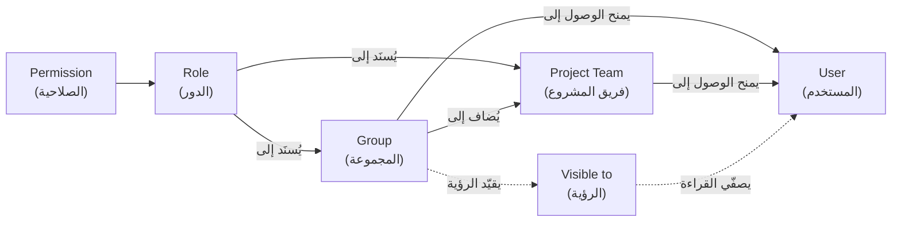
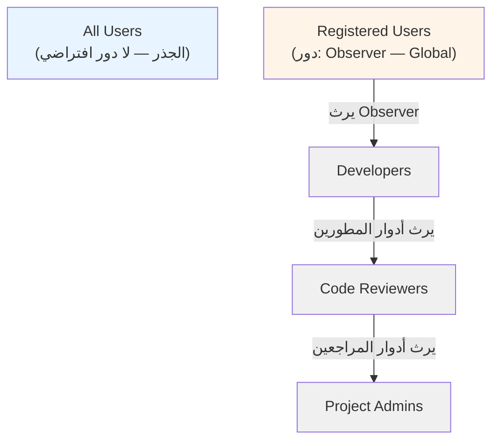
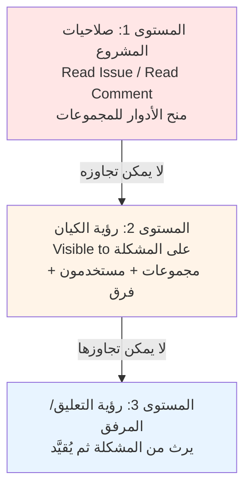
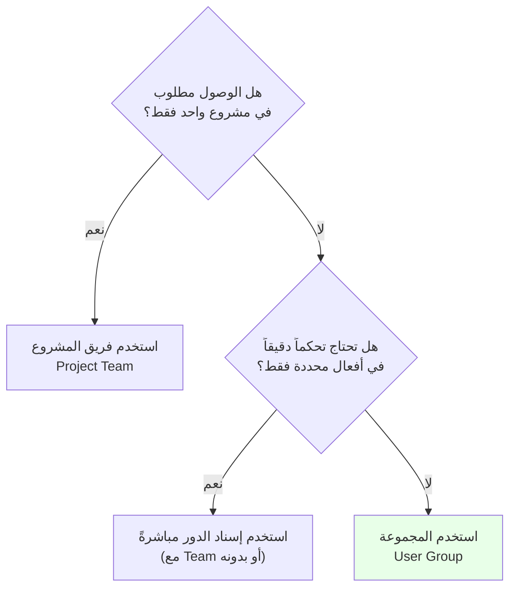

# دليل شامل عن نظام المجموعات (Groups) في YouTrack ودوره في آليات تعيين الصلاحيات

> **المصدر الرسمي:** [YouTrack Server 2026.2 Documentation](https://www.jetbrains.com/help/youtrack/server/) + [YouTrack Developer Portal](https://www.jetbrains.com/help/youtrack/devportal/)
> **تاريخ إعداد هذا الدليل:** 5 أكتوبر 2026

---

## جدول المحتويات

1. [التعريف الرسمي للمجموعة ودورها في نموذج الوصول](#1-التعريف-الرسمي-للمجموعة-ودورها-في-نموذج-الوصول)
2. [المجموعة مقابل فريق المشروع (Group vs Project Team)](#2-المجموعة-مقابل-فريق-المشروع-group-vs-project-team)
3. [أنواع المجموعات](#3-أنواع-المجموعات)
4. [المجموعات الافتراضية والنظامية](#4-المجموعات-الافتراضية-والنظامية)
5. [العضوية والدور الموروث (Group Membership & Inheritance)](#5-العضوية-والدور-الموروث-group-membership--inheritance)
6. [آليات تعيين الصلاحيات عبر المجموعات](#6-آليات-تعيين-الصلاحيات-عبر-المجموعات)
7. [حقول التحكم الإداري: Visible to و Updatable by](#7-حقول-التحكم-الإداري)
8. [المجموعات في إعدادات الرؤية (Visibility)](#8-المجموعات-في-إعدادات-الرؤية-visibility)
9. [دورة حياة المجموعة](#9-دورة-حياة-المجموعة)
10. [مصفوفة الصلاحيات المطلوبة لإدارة المجموعات](#10-مصفوفة-الصلاحيات-المطلوبة-لإدارة-المجموعات)
11. [البحث والتصفية في المجموعات](#11-البحث-والتصفية-في-المجموعات)
12. [الوصول البرمجي للمجموعات عبر REST API](#12-الوصول-البرمجي-للمجموعات)
13. [مزامنة المجموعات مع مزودي الهوية الخارجيين](#13-مزامنة-المجموعات-مع-مزودي-الهوية)
14. [أنماط التصميم الموصى بها](#14-أنماط-التصميم-الموصى-بها)
15. [المصادر الرسمية](#15-المصادر-الرسمية)

---

## 1. التعريف الرسمي للمجموعة ودورها في نموذج الوصول

### النص الرسمي

> *"A group is a collection of user accounts. Groups let you manage multiple accounts more efficiently. You can grant and restrict access to specific features in YouTrack for all group members at once."*
>
> — [Groups | YouTrack Server Documentation](https://www.jetbrains.com/help/youtrack/server/manage-user-groups.html)

### المبدأ الحاكم للنموذج

> *"User access in YouTrack is defined on a per-project basis by the roles that are assigned to a user. A role is a set of permissions... Please note that permissions are only granted by assigning roles, and not directly."*
>
> *"Generally, users inherit roles from the groups they belong to."*
>
> — [Access Management | YouTrack Server Documentation](https://www.jetbrains.com/help/youtrack/server/access-management.html)

### الخلاصة المعمارية

هذه العبارات الثلاث تُشكّل حجر الأساس في فهم النظام، لأنها تُثبت ثلاث قواعد غير قابلة للتفاوض:

| القاعدة | الأثر العملي |
| :--- | :--- |
| **الصلاحية تُمنح بالدور فقط** | لا توجد آلية لمنح صلاحية مباشرة لمستخدم أو مجموعة. أي تصميم يعتمد على منح صلاحية مباشرة هو تصميم غير متوافق مع YouTrack. |
| **المجموعة هي الناقل الافتراضي (Default Carrier) للأدوار** | منح الأدوار للمستخدمين مباشرةً هو الاستثناء وليس القاعدة، ويُستخدم فقط عندما لا تكفي الأدوار الموروثة. |
| **الوراثة متعدّدة المستويات عبر الشجرة** | المجموعة ترث أدوار المجموعة الأب، فتنقل الموروثة تلقائياً إلى كل المستويات الأدنى. |



---

## 2. المجموعة مقابل فريق المشروع (Group vs Project Team)

هذا هو التمييز الأكثر أهمية في نظام الصلاحيات بـ YouTrack، وسبب أخطاء التكوين الشائعة.

| المعيار | المجموعة (Group) | فريق المشروع (Project Team) |
| :--- | :--- | :--- |
| **النطاق** | عابر للمشاريع — قد يُستخدم في عدة مشاريع | مرتبط بمشروع واحد فقط |
| **العدد** | عدد غير محدود | فريق واحد لكل مشروع بالضبط |
| **الأدوار** | يمكن إسناد أدوار مختلفة في كل مشروع | له دور فريق واحد (Default Team Role) |
| **مصدر الإسناد** | `Administration > Access Management > Groups` | `Project Settings > People` |
| **مثال الاستخدام** | مجموعة تُدار عبر مشاريع متعددة، أو مجموعة RBAC متخصصة | الوصول الموحّد لمشغّلي مشروع واحد |
| **هل يمكن حجب فرد** | لا — لا يمكن استثناء عضو مفرد من فريق المشروع مُضاف عبر مجموعة | لا — الإضافة تتم على مستوى المجموعة كاملة |

> *"Use a project team when users need the same role in a single project. Each project has one project team, and its role assignments apply only to that project."*
>
> *"Create a user group when you want to manage the same collection of users across multiple projects or other resources."*

### قواعد التكوين التي يجب Commitments إليها

**قاعدة 1 — لا يمكن استثناء عضو مفرد من مجموعة مضافة لفريق مشروع:**

> *"You cannot exclude single group members from the project team. If the group contains any members that you want to exclude from the project, you should either create a new group that contains the desired subset of users or add group members to the project team as single users."*
>
> — [Manage Project Members and Access](https://www.jetbrains.com/help/youtrack/server/manage-project-access.html)

**قاعدة 2 — هناك فرق بين دور فريق المشروع والمنح المباشر:**

> *"Adding users or groups to the project team grants them the access level defined by the team default role. Granting a role to a user or group directly lets you specify exactly what actions a user or group can perform in the project. This enables fine-grained access management."*

**قاعدة 3 — إزالة عضو من مجموعة مضافة لفريق يُخرجه من المشروع:**

> *"By using a group to manage membership, new users who are added to the group are automatically added to all the project teams that include the group. Conversely, removing a user from a group removes the user from all project teams that include the group."*

---

## 3. أنواع المجموعات

يوثّق YouTrack **نوعين** من المجموعات عند الإنشاء (`New Group > Group type`):

| النوع | الوصف | يدعم الأدوار | قابل للتداخل |
| :--- | :--- | :--- | :--- |
| **User group** (مجموعة مستخدمين) | المجموعة القياسية المعتمدة في نموذج RBAC | نعم | نعم |
| **Customer group** (مجموعة عملاء) | لمشاريع Helpdesk، لتنظيم المُبلّغين حسب الشركة أو القسم أو الفريق | **لا** | **لا** |

### القيود الرسمية لمجموعات العملاء (Customer Groups)

> *"Customer groups don't grant roles or permissions. They only provide helpdesk ticket access when the group is used in helpdesk-specific settings."*

| القيد | التفصيل |
| :--- | :--- |
| لا إسناد أدوار | الأدوار لا يمكن إسنادها لمجموعات العملاء إطلاقاً |
| لا تحويل النوع | النوع يُحدَّد عند الإنشاء ولا يمكن تحويل مجموعة مستخدمين إلى مجموعة عملاء أو العكس |
| لا استيراد خارجي | المجموعات المتزامنة من مزود هوية خارجي غير مدعومة كمجموعات عملاء |
| لا تداخل | لا يمكن جعلها مجموعة فرعية ولا أن تحتوي على مجموعات فرعية |
| لا انضمام لفرق المشاريع | لا يمكن إضافتها إلى فريق مشروع أو استخدامها في حقول المجموعات المخصصة |
| لا استخدام في الرؤية العامة | لا يمكن استخدامها في إعدادات الرؤية للمقالات والتعليقات والمرفقات ولوحات أجايل والتقارير ولوحات المعلومات أو المشكلات العادية |

> **ملاحظة معمارية مهمة:** مجموعة العملاء هي **استثناء جوهري** عن قاعدة "الصلاحيات تأتي عبر الأدوار". فهي قناة صلاحيات ثانوية لا تدخل في دورة الأدوار، وتفتح فقط وصول عرض التذاكر والتعليق العام. هذا يعني أن أي نموذج تصميم يفترض أن كل مجموعة تمنح صلاحيات يحتاج إلى استثناء صريح لمجموعات العملاء.

---

## 4. المجموعات الافتراضية والنظامية

### 4.1 المجموعات الافتراضية (Default Groups)

> *"There are two default groups in YouTrack: All Users and Registered Users."*

| الاسم | Auto-join | الدور الافتراضي | ملاحظات |
| :--- | :--- | :--- | :--- |
| **All Users** | مفعّل | **None** | تضم كل حسابات المستخدمين تلقائياً. لا يُسند إليها أي دور افتراضياً |
| **Registered Users** | مفعّل | **Observer** (على مستوى Global) | تُضاف تلقائياً عند إنشاء أي حساب. **حساب الضيف (guest) مستثنى** منها |

**القيود على المجموعتين الافتراضيتين:**

> *"As an administrator, you can edit the roles and permissions assigned to this group but cannot change the group name, disable the Auto-join option, or delete the All Users group."*

#### دور Observer الافتراضي — لماذا هو مهم أمنياً

الدور `Observer` المبدئي على مستوى `Global` يمنح المستخدمين المسجلين القدرة على **عرض تفاصيل الملف الشخصي الإضافية للمستخدمين الآخرين المسجلين** فقط. إذا كان هذا المستوى غير مناسب لتثبيتك، توثّق JetBrains صراحةً الحل:

> *"The default Observer role lets registered users view additional profile details for other registered users. If this level of access is not appropriate for your installation, replace the default role assignment with a more restrictive custom role."*

هذا يعني أن **كل تثبيت جديد لـ YouTrack يبدأ بحالة وصول متساهلة افتراضياً** يجب على المسؤول الأمني معالجتها.

### 4.2 المجموعات المولّدة آلياً (System-generated Groups)

تُنشئ هذه المجموعات آلية أثناء الترقية (Upgrade) للحفاظ على الوصول القائم في مواجهة تبسيط نموذج الصلاحيات في YouTrack 2026.1.

> *"When simplifying the permission model, certain permissions may be removed and replaced with the ability to manage access through an optional feature. To ensure access is preserved during this transition, the system automatically creates a group..."*

| المجموعة المولّدة | سبب الإنشاء | الدور الممنوح |
| :--- | :--- | :--- |
| **Reports Feature Group** | استبدال صلاحيات `Read Report` / `Create Report` بميزة `Reports` الاختيارية (منذ 2026.1) | صلاحية ميزة `Reports` |
| **Read Groups Feature Group** | إلغاء صلاحيات المجموعة نهائياً والتحول إلى نموذج `Visible to` / `Updatable by` | صلاحية ميزة `Read Groups` |
| **Read User Details Group** (سابقاً `Read User Full Group`) | إزالة `Read User Full` (نطاق عام) من أدوار `Project Admin` و `Contributor` | `Read User Details Role` على مستوى Global |
| **Create Project Group** | إزالة `Create Project` (نطاق عام) من دور `Project Admin` | `Project Creator` |
| **Create User Group** | إزالة `Create User` (نطاق عام) من دور `Project Admin` | `User Manager` |
| **Read Organization Group** | إزالة `Read Organization` (نطاق عام) من `Project Admin` و `Contributor` | `Read Organization Role` على مستوى Global |

#### النمط المعماري الحاكم في هذه المجموعات

> *"This isolates a sensitive permission into a single place... This isolates a powerful global permission from a project-scoped role while still preserving existing access rights."*

**الاستنتاج:** YouTrack يستخدم نمط **"عزل الصلاحية الحساسة"** (Permission Isolation). الصلاحيات ذات النطاق العام (Global-scoped) كانت مدمجة داخل أدوار نطاق المشروع، مما ينشئ تسريباً لنطاق غير مقصود. الحل: عزلها في دور عام مخصص ومجموعة مخصّصة.

**أسماء المجموعات القديمة المولّدة آلياً:** `<project name> user group managers` — أنشئت عند الترقية إلى 2025.3 للحفاظ على صلاحيات `Update Group` على مستوى المشروع قبل إلغائها.

### 4.3 مزايا الميزات على مستوى المجموعة (Optional Features)

بعض الوظائف لا تُمنح بصلاحية بل بميزة اختيارية (Optional Feature) مُسنَدة لمجموعة. هذا نموذج **صلاحيات بالمجموعة وليس بالدور**.

| الميزة | الوظيف |
| :--- | :--- |
| **Read Groups** | السماح للمستخدمين غير الإداريين برؤية قائمة المجموعات وخصائصها والمجموعات الفرعية. عند إيقافها يعود الوصول إلى نموذج الصلاحيات التقليدي (`Update Project` أو `Low-level Admin Read`) |
| **Update Groups** | السماح لأعضاء مجموعة محددة بتحديث إعدادات المجموعات وعضويتها بدون `Update Project` |
| **Reports** | إنشاء التقارير وقراءتها (حلّت محل `Create Report` و `Read Report`) |
| **Share Reports** | مشاركة التقارير مع مستخدمين آخرين (حلّت محل `Share Report`) |

> *"When this feature is switched off, access to read groups defaults to the permission model where groups are only visible to users with either Update Project or Low-level Admin Read permissions. This functionality was previously managed using the Read Group permission, which has been removed from the system."*

---

## 5. العضوية والدور الموروث (Group Membership & Inheritance)

### 5.1 الفكرة الأساسية: كل مجموعة هي مجموعة فرعية

> *"Technically, every group you create in YouTrack is a nested group, as every group is nested under the All Users group. Each new group inherits all the roles that are assigned to All Users."*

هذه الجملة تحمل ثقلاً معمارياً كبيراً: **لا توجد مجموعات "جذرية"**. شجرة المجموعات لها جذر وحيد هو `All Users`، وأي دور يُسند إليه ينتقل إلى كل المجموعة subtree بالكامل.



### 5.2 نمط الوراثة التدريجي (Progressive Access Levels)

يقدّم YouTrack نمطاً رسمياً موصى به لبناء مستويات وصول متدرجة:

> *"You want to make sure that when you add permissions to a specific role, all the users who have broader responsibilities are granted this permission as well. For example, you have code reviewers, developers, and project administrators... nest the group of developers under the group of reviewers, then nest the group of project administrators under the group of developers."*

| المجموعة | الدور الموروث | السلسلة |
| :--- | :--- | :--- |
| Code Reviewers | صلاحية قراءة فقط | الأساس |
| Developers | + صلاحيات تحرير | يرث من Code Reviewers |
| Project Admins | + صلاحيات كاملة | يرث من Developers |

**الميزة الحاسمة:** إضافة صلاحية جديدة لدور ما تُورَّث تلقائياً لكل المستويات الأعلى. لا حاجة لتحديث كل مجموعة على حدة.

### 5.3Pattern نمط "المشروع الفرعي الجانبي" (Side Project Pattern)

الحالة العملية الثانية للوراثة:

> *"You have separate projects to manage the marketing efforts for different products... Here, you can create one group that provides access to the set of common projects, then nest the group that provides access to the side projects under it."*

### 5.4 الوراثة غير مرئية في الواجهة

تحذير عملي مهم:

> *"The group also inherits roles that are assigned to a parent group... Roles that are assigned to parent groups are not shown in the sidebar."*

**الأثر:** عند مراجعة صلاحيات مجموعة في الـ UI، لن ترى الأدوار الموروثة من المجموعة الأب. يجب صعود الشجرة يدوياً للتحقق. هذا مصدر شائع لأخطاء التدقيق الأمني.

### 5.5 عكس التداخل

> *"If you ever want to reverse this operation, select the nested group in the list and nest it under the All Users group instead."*

---

## 6. آليات تعيين الصلاحيات عبر المجموعات

هذا هو المحور الأساسي. يوفّر YouTrack **أربع آليات مستقلة** لتعيين وصول فعّال عبر المجموعات، ولكل منها موقعها في دورة الصلاحيات.

### 6.1 الآلية الأولى: إسناد الأدوار مباشرةً للمجموعة (Direct Role Assignment)

> *"You can grant a role to a group directly. Members of the group are granted all access permissions that are assigned to this role."*
>
> — [Manage Group Access](https://www.jetbrains.com/help/youtrack/server/configure-access-for-a-user-group.html)

**المسار:** `Administration > Access Management > Groups > [Group] > Roles tab > Assign role`

**الخطوات:**

1. من القائمة الرئيسية اختر `Administration > Access Management > Groups`.
2. اختر المجموعة من القائمة.
3. افتح تبويب `Roles` في الشريط الجانبي.
4. اضغط زر `Assign role`.
5. في نافذة `Assign Role` اختر الدور.
6. اختر مشروعاً أو أكثر أو منظمة أو `Global`.
7. اضغط `Assign role`.

**الصلاحيات المطلوبة (متدرّجة بحسب النطاق):**

| نطاق الدور | الصلاحية المطلوبة |
| :--- | :--- |
| Global (نطاق عام) | `Low-level Admin Write` |
| Organization (نطاق منظمة) | `Update Organization` |
| Project (نطاق مشروع) | `Update Project` |

**قاعدة النطاق الحاكمة (Scope Rule):**

> *"YouTrack separates role definition from role assignment. While you can create roles with mixed scopes, the system only activates permissions compatible with the specific level where the role is assigned."*

| مستوى الإسناد | النتيجة |
| :--- | :--- |
| Global | كل الصلاحيات في الدور تُعتبر صالحة |
| Organization | الصلاحيات ذات النطاق العام **تُتجاهل ولا يكون لها أي أثر** |
| Project | صلاحيات النطاق العام والمنظمتين **تُتجاهل**، و YouTrack **يمنع الإسناد** ما لم يكن الدور يحتوي على صلاحية واحدة على الأقل بنطاق مشروع |

### 6.2 الآلية الثانية: إضافة المجموعة إلى فريق المشروع (Project Team Membership)

> *"The group inherits any role assigned to the project team in the current project. Members of this group inherit access to the project based on their membership in the group."*

**المسار:** `Project Settings > People > Add people > Add to team ON`

**الصلاحيات المطلوبة:** `Read User Basic`, `Update Project`

**قاعدة الصلاحية المتساوية أو الأعلى:**

> *"When you add users to the project team, they inherit the roles that are assigned directly to the team. To perform this operation, your permissions must be equal to or higher than those that are granted directly to the team in the project."*

### 6.3 الآلية الثالثة:Grant الوصول خارج فريق المشروع (Grant Access Outside Team)

تتيح `Project Settings > People > Other People with Access` منح دور محدد لمجموعة أو مستخدم **دون** إدراجه في فريق المشروع:

> *"Adding users or groups to the project team grants them the access level defined by the team default role. Granting a role to a user or group directly lets you specify exactly what actions a user or group can perform in the project."*

**الخطوات:** `Add people` → إيقاف `Add to team` → اختيار الدور من قائمة `Roles` → `Invite`

**الصلاحيات المطلوبة:** `Read User Basic`, `Update Project`

#### قيد مهم: استحالة سحب الصلاحيات على مستوى المشروع

> *"Roles with global scopes grant access to all projects in the system. These role assignments cannot be revoked at the project level. The option to deselect these roles on the People page is deactivated."*

**الأثر العملي:** أي إسناد بدور عام هو التزام دائم على مستوى تلك المجموعة. التراجع يتم فقط من `Roles tab` في ملف تعريف المجموعة أو المستخدم.

### 6.4 الآلية الرابعة:قوائم الرؤية (Visibility Lists)

ليست منحاً للصلاحيات بل **تقييداً لها**. راجع القسم 8.

### 6.5 جدول مقارنة شامل للآليات

| المعيار | إسناد الأدوار مباشرةً | الإضافة لفريق المشروع | الوصول خارج الفريق | قوائم الرؤية |
| :--- | :--- | :--- | :--- | :--- |
| **نوع الأثر** | منح صلاحيات | منح صلاحيات | منح صلاحيات | **تقييد** صلاحيات |
| **المستوى** | Global / Org / Project | Project فقط | Project فقط | Issue / Comment / Attachment |
| **الموقع** | `Groups > Roles` | `Project Settings > People` | `Project Settings > People` | إعداد داخل الكيان |
| **قابل للسحب** | نعم (مع استثناء النطاق العام) | نعم | نعم | نعم (Reset visibility) |
| **يتجاوز الصلاحيات؟** | لا | لا | لا | **لا — لا يمكن تجاوز صلاحيات المشروع** |
| **يتجاوزه المستخدم؟** | — | — | — | نعم، عبر `Override Visibility Restrictions` |
| **أثر على المشكلات** | لا | لا | لا | قصر القراءة على مجموعة |

### 6.6 تسلسل الإسناد الموصى به رسمياً

> *"We suggest that you configure user access in the following order:*
>
> 1. *Create new roles or configure predefined roles.*
> 2. *Create new groups or configure predefined groups.*
> 3. *Assign roles to groups on a per-project basis.*
> 4. *Create user accounts or enable self-registration for users.*
> 5. *Enable and configure auth modules.*
> 6. *Configure group membership for YouTrack users."*

---

## 7. حقول التحكم الإداري

هذه الحقول تمثل **نموذج صلاحيات إدارة مستقلاً تماماً** عن الأدوار، أضافته YouTrack في الإصدار 2025.3 وإلغاء الصلاحيات المرتبطة به في 2026.1.

### 7.1 نموذج 2025.3+

> *"Starting with version 2025.3, access to user groups in YouTrack is determined globally:*
>
> - *Users can view a group if they are members of a group stored in the Visible to setting for the group.*
> - *Users can update a group if they are members of a group stored in the Updatable by setting for the group."*

| الإعداد | الوظيفة | الصلاحية المطلوبة | ملاحظات |
| :--- | :--- | :--- | :--- |
| **Visible to** | من غير الإداريين يمكنهم رؤية المجموعة وإعداداتها | — | ساري فقط لأعضاء المجموعات التي فيها ميزة `Read Groups` مفعّلة |
| **Updatable by** | من غير الإداريين يمكنهم رؤية المجموعة وتعديل إعداداتها | — | ساري فقط مع تفعيل `Read Groups` **و** `Update Groups` |

### 7.2 حدود صلاحية `Updatable by` — قائمة محظورات

هذه القائمة هي الضمان الأمني الأهم في النظام، لأنها تحدد ما **لا يمكن** للمستخدم غير الإداري فعله رغم امتلاكه صلاحية التحديث:

> *"This setting does not give users the ability to:*
>
> - *Assign or revoke roles for the group.*
> - *Nest the group under another group.*
> - *Merge the group into another group or project team.*
> - *Delete the group."*

| العملية | مُسموحة عبر `Updatable by`؟ |
| :--- | :--- |
| عرض إعدادات المجموعة | ✅ نعم |
| تعديل الإعدادات الأساسية | ✅ نعم |
| تعديل العضويات | ✅ نعم |
| **إسناد أو سحب الأدوار** | ❌ **لا** |
| **تغيير المجموعة الأم** | ❌ **لا** |
| **الدمج** | ❌ **لا** |
| **الحذف** | ❌ **لا** |

**الاستنتاج الأمني:** `Updatable by` يمنح تفويضاً **تشغيلياً محصوراً** (Operational Delegation) على المستوى السفلي فقط. Creative actions على نموذج الوصول (إسناد الأدوار، إعادة الهيكلة، التدمير) محجوزة حصراً لمن يملك `Update Project` أو `Low-level Admin Write`. هذا يخفّض فعالية_pass-the-hash من متسلسل إداري منخفض الصلاحية إلى مدير وصول كامل.

### 7.3 حقول أخرى في تبويب Settings

| الحقل | الوصف | الأثر على الصلاحيات |
| :--- | :--- | :--- |
| **Name** | اسم فريد لا يمكن أن يطابق اسم فريق مشروع | معرّف الهوية |
| **Description** | وصف اختياري | توثيقي |
| **Logo** | صورة تُستخدم أيضاً لتزيين الصور الرمزية في قوائم اختيار المستخدمين (المسؤول/المكلَّف، `@mentions`، المراقبون، وإعدادات الرؤية) | بصري |
| **Auto-join** | إضافة المستخدمين الجدد تلقائياً. للمجموعات المحلية يُستخدم لمطابقة نطاق البريد | **يوسّع العضوية تلقائياً — canal وصول غير مقصود** |
| **Two-factor authentication** | إلزام-factor والمصادقة | عند التفعيل: **تُقيَّد حقوق وصول الأعضاء إلى `Update Self` فقط** حتى يفعّلوا 2FA |

#### خطر `Auto-join` الأمني

> *"Enable this option when you use this group to provide a standard level of access to all users."*

عند دمج `Auto-join` مع دور ذي صلاحيات عالية، تصبح **كل حسابات النظام الجديدة** عضواً في تلك الصلاحيات تلقائياً بلا مراجعة. هذا نمط خطير في بيئات الإنتاج ويُنصح بعزله في مجموعات مخصصة.

#### آلية `Two-factor authentication` كإجراء تقييد

> *"When enabled, group members are required to set up two-factor authentication (2FA) for YouTrack. Access rights for members of this group who have not enabled 2FA are restricted to Update Self. Once a user has enabled 2FA, the access rights that are granted to their account are restored."*

**نقطة دقيقة:** الطبقة القائمة هنا **مؤقتة وتلقائية**. الفشل في استيفاء شرط المصادقة لا يُلغي الدور بل يُجمّد فعاليته ويخفضها إلى `Update Self`.

**مرشّحات تدقيق ما قبل التطبيق:**

```text
not has: 2FA
in: <group name> and not has: 2FA
in: <group name> and not is: supporting2FA
```

---

## 8. المجموعات في إعدادات الرؤية (Visibility)

### 8.1 المستويات الثلاثة للرؤية

توفّر YouTrack ثلاث طبقات متتالية للقراءة، والمجموعة هي أداة الطبقة الثانية والثالثة:



### 8.2 المستوى الأول: صلاحيات المشروع

> *"The first level of visibility is set at the project level. The Read Issue permission is granted on a per-project basis. Only users and members of groups who are granted this permission in a project are able to view the issues that are assigned to this project."*

هنا تكون المجموعات **مانحةً** صلاحية القراءة عبر الأدوار.

### 8.3 المستوى الثاني: رؤية الكيان — المجموعات كقوائم حجب

> *"Issue-level visibility settings cannot override the access permissions that are defined for the project but can limit the visibility to a smaller subset of users."*
>
> *"For example, if groups A and B are granted roles that let them read issues in a project, you can restrict the visibility of an issue to group A or group B, or to users who are members of either group. While it is possible to set the visibility of an issue to another group, for example, group C, the members of this group do not have access permissions in the project and cannot view the issue."*

**القاعدة الحاكمة:** الرؤية **لا ترفع** مستوى الوصول، بل **يخفضه فقط** (مونوتوني تنازلي). تعيين مجموعة بلا `Read Issue` في Visible to يخلق **إعداداً صامتاً بلا أثر** — لا خطأ ولا تحذير.

**المستخدمون الذين يتجاوزون الرؤية تلقائياً:**

| المستفيد | الأساس |
| :--- | :--- |
| صاحب المشكلة (Reporter) | تُضاف تلقائياً إلى القائمة إن لم يكن مشمولاً |

> *"Issues are always visible to the user who reported the issue. If the visibility for an issue is restricted to a set of users that excludes the reporter, the name of the reporter is added to the list automatically."*

### 8.4 ترشيح قائمة الرؤية

> *"The available set of options for visibility settings is filtered to include:*
>
> - *The complete list of users and groups with permission to Read Issue in the current project.*
> - *Any group or project team where the current user is a member.*
> - *The Project Team for the current project...*
> - *Any other user who has access to the same projects as the current user."*
>
> *"None of these conditions guarantee that these users or groups have access to the current issue. They can all be overridden by permission-based visibility restrictions at the project level."*

**نقطة أمنية حرجة:** الترشيح يعمل على مستوى **الصلاحية في المشروع**، لا على مستوى **الرؤية الفعلية للكيان**. لذلك تظهر مجموعات في القائمة قد لا تملك حق رؤية هذه المشكلة تحديداً — وهذا مصدر expecting misunderstandings متكرر.

### 8.5 تجاوز قيود الرؤية

> *"The Override Visibility Restrictions permission lets users view any issue, comment, or attachment regardless of its visibility settings."*
>
> *"This permission only overrides visibility restrictions. Users must also have the corresponding permission to read the restricted item, such as Read Issue or Read Issue Comment."*

**القيد المزدوج:** التجاوز لا يلغي شرط القراءة — يجب امتلاك `Read Issue` **و** `Override Visibility Restrictions` معاً.

### 8.6 إعدادات الرؤية الافتراضية على مستوى المشروع

| الإعداد | الوظيفة | الصلاحية المطلوبة |
| :--- | :--- | :--- |
| **Default visibility** | مجموعة أو فريق يُطبَّق تلقائياً كقيمة أولية لـ `Visible to` في المشكلات والمقالات الجديدة. **لا يؤثر على العناصر القائمة** | `Update Project` |
| **Recommended visibility options** | قائمة مجموعات/فرق تظهر كاقتراحات — الغرض منها **اكتشاف المجموعات** لا فرض قيود | `Update Project` |

> *"Project administrators can use this setting to help users discover groups that have been set up specifically to handle issues in their projects."*

#### لماذا يظهر خطأ شائع حول إنشاء المجموعة

> *"Creating a group doesn't automatically make it available as an option in the Visible to list for issues, comments, and attachments. To select a group in visibility settings, you generally need to be a member of this group. A project administrator can also make the group easier to discover by adding it as the default visibility group or as a recommended visibility option in project settings."*

القاعدة: **ظهور المجموعة في قائمة الرؤية يتطلب** إما عضوية المستخدم في المجموعة، **أو** صلاحيات المشروع، **أو** إدراجها كقيمة افتراضية/موصى بها.

---

## 9. دورة حياة المجموعة

### 9.1 الإنشاء

**الصلاحيات:** `Update Project` أو `Low-level Admin Write`

**المسار:** `Administration > Access Management > Groups > New group`

| الخطوة | الإجراء |
| :--- | :--- |
| 1 | اختر `New group` |
| 2 | أدخل الاسم |
| 3 | اختر النوع: `User group` أو `Customer group` |
| 4 | اضغط `Create` |

> *"The group is created. However, it does not have any members or role assignments."*

**تحذير:** المجموعة تُنشأ **فارغة تماماً** — بلا أعضاء وبلا أدوار. هذه حالة صامتة: مجموعة موجودة لا confers أي وصول.

**التبويبات المتاحة بعد الإنشاء:**

| التبويب | العملية |
| :--- | :--- |
| `Members` | إضافة عضو واحد أو أكثر |
| `Roles` | منح دور في مشروع واحد أو أكثر لكل الأعضاء |
| `Project Teams` | إضافة المجموعة إلى فريق أو أكثر |
| `Settings` | الإعدادات الأساسية |

### 9.2 إدارة العضويات

**الصلاحيات:** `Update Project` أو `Low-level Admin Write`

#### قاعدة الصلاحيات المتساوية أو الأعلى عند الإضافة

> *"To add users to a group, you must already have every permission granted to the target group. This restriction doesn't apply when removing members or to users who have the Low-level Admin Write permission."*

| العملية | متطلب الصلاحية |
| :--- | :--- |
| **إضافة** عضو | امتلاك **كل** صلاحيات المجموعة المستهدفة |
| **إزالة** عضو | `Update Project` أو `Low-level Admin Write` (بدون شرط الصلاحيات المتساوية) |

**عدم التماثل مقصود:** الإضافة تتطلب تفويضاً متطابقاً، والإزالة لا تتطلبه. هذا يحمي من رفع الصلاحيات عبر الاستيلاء على مجموعات مميزة.

**مسارات الإدارة الثلاثة:**

| المسار | الوصف |
| :--- | :--- |
| تبويب `Members` في المجموعة | إضافة عضو أو أكثر |
| قائمة `Users` → `Add to group` | إضافة مستخدمين متعددين دفعة واحدة |
| تبويب `Groups` في ملف المستخدم | إدارة عضوية مستخدم واحد |

**خيارات للمستخدمين غير الإداريين:** يمكنهم التحديث عندما تكون ميزتا `Read Groups` و `Update Groups` مفعّلتين له، **والمجموعة تسردهم تحت `Updatable by`**.

### 9.3 التداخل (Nesting)

**الصلاحيات:** `Update Project` أو `Low-level Admin Write`

> *"To nest a group under another group, you must already have every permission granted to the target parent group. This restriction doesn't apply to users who have the Low-level Admin Write permission."*

**الخطوات:** `Groups` → اختيار مجموعة أو أكثر → `Nest group under` → اختيار المجموعة الأب

### 9.4 الدمج (Merge) — حالتان مختلفتان

| المعيار | دمج المجموعات (Merge Groups) | دمج مجموعة في فريق مشروع (Merge into Team) |
| :--- | :--- | :--- |
| **النتيجة** | مجموعة واحدة مدمجة | **حذف المجموعة** واستبدالها بعضوية الفريق |
| **عدد المجموعات** | ينخفض | ينخفض |
| **الأدوار** | تبقى مدمجة | **تسحب** |
| **الهدف** | توحيد عضويات متداخلة | إزالة تكرار مع فريق المشروع |

#### 9.4.1 Merge Groups

**الصلاحيات:** `Update Project` أو `Low-level Admin Write`

**السمات المدموجة:**

- الأعضاء ← يُضافون إلى المجموعة الناتجة
- **كل الأدوار** المسندة ← تُمنح للمجموعة الناتجة
- المجموعات الفرعية ← تتداخل تحت المجموعة الناتجة
- عضوية فرق المشاريع ← تنتقل
- لوحات المعلومات المشتركة ← تُشارَك مع المجموعة الناتجة
- بقية المراجع في المشاريع والخدمات المتصلة ← تُستبدل

**خطوة ما بعد الدمج:** تُضاف معرّفات المعرفات (IDs) للمجموعات المدموجة إلى المجموعة الناتجة كـ **aliases**، فطلبات API التي تستخدم معرّف مجموعة مدموجة تُرجع المجموعة الناتجة.

#### 9.4.2 Merge into Team

**الأثر الكامل المُعلن:**

> - *Members of the selected group become members of the project team.*
> - *If there are any groups that are nested under the selected group, these subgroups are added as groups to the project team.*
> - *Members of the group and its subgroups are granted access as defined by the roles that are assigned to the team in the project.*
> - *The selected group is deleted from YouTrack.*
> - *Roles and access permissions that are granted to users as members of the deleted group are revoked.*
> - *References to the deleted group in all projects and connected services are set to the project team.*

**⚠️ خطر تشغيلي:** هذه العملية **لا رجعة فيها**. الأدوار المسندة للمجموعة تُسحب نهائياً. للتعافي يجب إعادة إنشاء الأدوات ومنحها يدوياً. يوصى بالتحقق من تبويب `Groups and Teams` المدمج قبل التنفيذ.

#### الخلفية التاريخية للدمج

> *"Prior to the introduction of project teams in YouTrack 2017.3, access to projects was managed by marking roles as a team role and assigning these roles to groups in a project."*

كانت المجموعات المسماة `<project name>-team` تُنشأ تلقائياً لتمنح دور `Contributor`. عند الترقية دمجتها YouTrack تلقائياً في فرق المشاريع.

### 9.5 الحذف (Delete)

**الصلاحيات:** `Update Project` أو `Low-level Admin Write`

**الخطوات:** `Groups` → اختيار مجموعة أو أكثر → `Delete` → في نافذة التأكيد **اختيار مجموعة بديلة** → `Delete group`

**الأثر:**

| البند | النتيجة |
| :--- | :--- |
| الأدوار والصلاحيات | **تُسحب** من الأعضاء السابقين |
| المراجع العامة | تُحذف حيث يمكن حذفها بأمان |
| مراجع **الرؤية** | **تُستبدل بالمجموعة البديلة** |
| المعرّف | يُضاف إلى المجموعة البديلة كـ alias |

#### لماذا طلب التوثيق مجموعة بديلة؟

> *"For example, if you delete a group that is used as a Visibility group for a project in YouTrack, the replacement group is set as the new Visibility group. Otherwise, the issues that were visible to the deleted group would be visible to all users."*

**خطر أمني محدد:** حذف مجموعة مستخدمة في الرؤية **بلا مجموعة بديلة** يعني **انفتاح المشكلات على كل المستخدمين** — تسريب بيانات جماعي. هذا إجراء عالي الخطورة ويستوجب مراجعة يدوية لقوائم الرؤية قبل الحذف.

**استثناء مجموعات العملاء:** تُحذف بلا مجموعة بديلة وتُزال من إعدادات مشاريع Helpdesk وقوائم المُبلّغين المصرّح لهم والتذاكر المُشارَكة بها.

---

## 10. مصفوفة الصلاحيات المطلوبة لإدارة المجموعات

### 10.1 المصفوفة التجميعية

| العملية | الصلاحية المطلوبة | النطاق |
| :--- | :--- | :--- |
| **عرض قائمة المجموعات** | `Update Project` أو `Low-level Admin Read` | عام |
| **عرض قائمة المجموعات (بدون صلاحية)** | ميزة `Read Groups` مفعّلة + ليس أنت في `Visible to` | عام |
| **عرض صلاحيات مجموعة** (نطاق عام) | `Low-level Admin Read` | عام |
| **عرض صلاحيات مجموعة** (نطاق منظمة) | `Read Organization` + (`Read Project Full` أو `Update Organization`) | منظمة |
| **عرض صلاحيات مجموعة** (نطاق مشروع) | `Read Project Full` | مشروع |
| **إنشاء مجموعة** | `Update Project` أو `Low-level Admin Write` | — |
| **حذف مجموعة** | `Update Project` أو `Low-level Admin Write` | — |
| **دمج مجموعات** | `Update Project` أو `Low-level Admin Write` | — |
| **دمج في فريق مشروع** | `Update Project` أو `Low-level Admin Write` | — |
| **تداخل مجموعات** | `Update Project` أو `Low-level Admin Write` + **كل صلاحيات المجموعة الأب** | — |
| **إضافة عضو** | `Update Project` أو `Low-level Admin Write` + **كل صلاحيات المجموعة** | — |
| **إزالة عضو** | `Update Project` أو `Low-level Admin Write` | — |
| **تعديل الإعدادات** | `Update Project` أو `Low-level Admin Write` | — |
| **تعديل الإعدادات كغير إداري** | ميزتا `Read Groups` + `Update Groups` + الإدراج في `Updatable by` | — |
| **إسناد دور** (نطاق مشروع) | `Update Project` | مشروع |
| **إسناد دور** (نطاق منظمة) | `Update Organization` | منظمة |
| **إسناد دور** (نطاق عام) | `Low-level Admin Write` | عام |
| **سحب دور** | مطابق للنطاق المُسنَد | — |
| **إضافة مجموعة لفريق مشروع** | `Read User Basic`, `Update Project` | مشروع |
| **منح وصول خارج الفريق** | `Read User Basic`, `Update Project` | مشروع |
| **إلزام 2FA** | `Update Project` أو `Low-level Admin Write` | — |
| **فتح مزامنة الهوية** | `Low-level Admin Write` (اللوجستيات) | — |

### 10.2 قاعدة "الصلاحيات المتساوية أو الأعلى" — ملخص

هذه القاعدة تظهر في ثلاث عمليات مختلفة وتستحق تلخيصاً:

| العملية | الشرط |
| :--- | :--- |
| إضافة عضو إلى مجموعة | `صلاحياتك ⊇ كل صلاحيات المجموعة` |
| تداخل مجموعة تحت أخرى | `صلاحياتك ⊇ كل صلاحيات المجموعة الأب` |
| إضافة عضو إلى فريق مشروع | `صلاحياتك ≥ الصلاحيات الممنوحة للفريق` |

**الاستنتاج:** YouTrack يستخدم **سردية تصعيد محلي صارمة** (Strict Local Escalation Guard). لا يمكنك استخدام صلاحية إدارية منخفضة لتوسيع مجموعة إدارية عالية — إلا إذا كنت تحمل `Low-level Admin Write` الذي يُعفى من الشرط في حالتي الإضافة والتداخل.

---

## 11. البحث والتصفية في المجموعات

### 11.1 عوامل التصفية المدعومة

| العامل | الوصف |
| :--- | :--- |
| `Auto-join` | المجموعات التي خيار الانضمام التلقائي مفعّل فيها |
| `Has subgroups` | المجموعات التي تحتوي مجموعة فرعية واحدة على الأقل |
| `Is project team` | هل المجموعة فريق مشروع أم لا |
| `Is customer group` | هل المجموعة مجموعة عملاء لمشروع Helpdesk أم لا |
| `Member` | المجموعات التي المستخدم المحدد عضو فيها |
| `Parent group` | المجموعات الفرعية للمجموعة الأب المحددة |
| `Permission` | **المجموعات التي مُسندة إليها صلاحية محددة** |
| `Project team` | المجموعات المضافة إلى فريق المشروع المحدد |
| `Requires 2FA` | المجموعات التي إلزام 2FA مفعّل فيها |
| `Role` | **المجموعات التي مُسندة إليها دور محدد** |

### 11.2 قيمة التدقيق: عاملَا `Role` و `Permission`

هذان العاملان هما أداة التدقيق الأمني الحقيقية:

- **`Role is <name>`** → أين يُمنح دور معين؟ (هل给了他 دور خاطئ؟)
- **`Permission is <name>`** → أي المجموعات تملك صلاحية حساسة؟ (كشف التراكم غير المقصود)

بالدمج مع تبويب `Roles` في الشريط الجانبي:

> *"Use the search box to filter the list by a role, project, or even a particular permission to find out if the group has the required access to a resource or operation."*

### 11.3 طريقة تحقق Transitive

للتحقق من الوصول الفعلي لأي مستخدم في أي مشروع:

```text
1. افتح تبويب Groups في ملف المستخدم → حدد المجموعة
2. اضغط Show Details لعرض معاملات المجموعة العامة
3. صعد شجرة التداخل حتى All Users للتحقق من الأدوار الموروثة غير المعروضة
4. في Project Settings > People، تحقق من Project Team و Other People with Access
5. راجع قوائم Visible to على الكيانات الحساسة
```

---

## 12. الوصول البرمجي للمجموعات

### 12.1 الفصل بين YouTrack و Hub

> *"Starting with YouTrack 2026.1, YouTrack REST API supports user, group, and access management operations directly. Hub REST API remains available for Hub-specific operations, but YouTrack REST API is the recommended API."*

| الكيان | YouTrack REST API (2026.1+) | Hub REST API |
| :--- | :--- | :--- |
| المجموعات | `/api/groups` و `/api/groups/{id}` | `/hub/api/rest/usergroups` |
| الأدوار المسندة | `/api/assignedRoles` | `/hub/api/rest/users/{id}/projectroles` |
| الصلاحيات | `/api/permissions` | `/hub/api/rest/permissions` |

**متى تستخدم واجهة Hub؟** الإصدار أقدم من 2026.1، أو عند التعامل مع **بيانات الاعتماد والرموز وإعدادات 2FA والمفاتيح والشهادات**.

### 12.2 موارد المجموعات

| المورد | الوصف |
| :--- | :--- |
| `/api/groups` | `GET` قائمة المجموعات، `POST` إنشاء |
| `/api/groups/{groupID}` | `GET` / `POST` / `DELETE` |
| `/api/groups/{groupID}/users` | جميع المستخدمين شاملاً العابرين |
| `/api/groups/{groupID}/ownUsers` | المستخدمون المضافون مباشرةً |
| `/api/groups/{groupID}/subGroups` | المجموعات الفرعية |

### 12.3 حقول كيان `UserGroup`

| الحقل | النوع | الوصف |
| :--- | :--- | :--- |
| `id` | String | معرّف المجموعة — للقراءة فقط |
| `name` | String | اسم المجموعة |
| `usersCount` | Long | عدد المستخدمين — للقراءة فقط |
| `users` | Array of Users | جميع المستخدمين شاملاً العابرين — للقراءة فقط |
| `icon` | String | رابط شعار المجموعة — للقراءة فقط |
| `allUsersGroup` | Boolean | هل تضم هذه المجموعة كل المستخدمين — للقراءة فقط |
| `ringId` | String | معرّف المجموعة في Hub، للمطابقة بين الخدمتين — للقراءة فقط، قد يكون `null` |

### 12.4 حقول `NestedGroup` (المتداخلة)

| الحقل | النوع | الوصف |
| :--- | :--- | :--- |
| `parentGroup` | NestedGroup | المجموعة الأم |
| `subGroups` | NestedGroup | المجموعات الفرعية |
| `ownUsers` | User | المستخدمون المضافون مباشرةً |
| `autoJoin` | Boolean | انضمام تلقائي عند أول تسجيل دخول |
| `autoJoinDomain` | String | نطاق الانضمام التلقائي، قد يكون `null` |
| `requireTwoFactorAuthentication` | Boolean | إلزام 2FA |
| `viewers` | Array of User / UserGroup | محتوى إعداد `Visible to` |
| `updaters` | Array of User / UserGroup | محتوى إعداد `Updatable by` |

### 12.5 الصلاحيات المطلوبة في الـ API

| العملية | المتطلب |
| :--- | :--- |
| `GET /api/groups` | ميزة `Read Groups` **أو** `Update Project` **أو** `Low-level Admin Read` — **و** ألا تكون مُرشَّحاً بسبب `Visible to` |
| `GET /api/groups/{id}` | نفس المتطلبات — **و** ألا تكون مُرشَّحاً بسبب `Visible to` |
| `POST /api/groups` | `Update Project` أو `Low-level Admin Write` |
| `POST /api/groups/{id}` | `Update Project` أو `Low-level Admin Write` — **و** ألا تكون مُرشَّحاً بسبب `Updatable by` |
| `DELETE /api/groups/{id}` | `Update Project` أو `Low-level Admin Write` |

**مثال — قراءة مع تحقق متعدد الأبعاد:**

```http
GET /api/groups/3-2?fields=id,name,usersCount,parentGroup(name),subGroups(name)
```

```json
{
  "subGroups": [],
  "parentGroup": { "name": "Reporters", "$type": "NestedGroup" },
  "usersCount": 3,
  "name": "Accounting",
  "id": "3-2",
  "$type": "NestedGroup"
}
```

**ملاحظة معمارية:** الترشيح في الـ API يعكس واجهة المستخدم بدقة. استخدام حساب بصلاحيات عالية كـ service token **لن** يتجاوز `Visible to` — الطبقة مفروضة على مستوى البيانات لا على مستوى الواجهة.

---

## 13. مزامنة المجموعات مع مزودي الهوية

### 13.1 الوحدات المدعومة للاستيراد

| الوحدة | ملاحظات |
| :--- | :--- |
| **Microsoft Entra ID** (سابقاً Azure AD) | يدعم استيراد المستخدمين والمجموعات |
| **Okta** | يدعم استيراد المستخدمين والمجموعات |
| **JetBrains Account** | يدعم استيراد المستخدمين والمجموعات |

**المتطلب:** صلاحية `Low-level Write` على موقع YouTrack.

> *"You can import users and groups from external identity providers into your organization by setting up authentication modules... It also means you don't need to create and manage these groups and user accounts manually in YouTrack."*

### 13.2 مخططا المزامنة

| المخطط | التوقيت | النطاق |
| :--- | :--- | :--- |
| **المزامنة عند تسجيل الدخول** | كل مرة يسجّل فيها مستخدم الدخول | مستخدم واحد وعضوياته |
| **المزامنة المجدولة** | `Hourly` / `Every 3 hours` / `Daily at 9 AM` | كل المستخدمين والمجموعات |

- المزامنة تعمل فقط عندما تكون الوحدة `Enabled`.
- `Sync now` يتيح التشغيل اليدوي فوراً.
- عند تعطيل الجدولة تبقى مزامنة العضوية لكل مستخدم عند تسجيل الدخول فعّالة.

### 13.3 SCIM 2.0 Provisioning

| السمة | التفصيل |
| :--- | :--- |
| المعيار | SCIM 2.0 |
| التهيئة | لكل وحدة مصادقة على حدة، ببيانات اعتماد (Token) مستقلة |
| النطاق | المستخدمون الذين مرتبط بياناتهم الاعتمادية بتلك الوحدة فقط |
| **التعارض** | **SCIM 2.0 والمزامنة المجدولة لا يمكن استخدامهما معاً.** تفعيل SCIM يُعطّل خيار `Scheduled sync` |
| تفعيل | يولّد YouTrack **Base URI فريداً** للوحدة + يتطلب إنشاء **Token واحد على الأقل** |

> *"YouTrack is not on Google's [SCIM] list of supported SCIM apps, which limits our ability to connect them directly through the Google Admin console."*

### 13.4 خطر التكرار

> *"Most of the groups that could be safely merged into a project team without resulting in a permission loss have already been merged. However, you may still have groups that can be merged into a project team without affecting access rights in other projects."*

**المخاطرة:** المجموعات المتزامنة قد تتكرر مع المجموعات اليدوية، فينتج ازدواج في العضويات وتراكم أدوار.Merge into Team هو أداة التنظيف الرسمية لهذا.

---

## 14. أنماط التصميم الموصى بها

### 14.1 متى تستخدم المجموعة؟



### 14.2 متى تستخدم التداخل؟

| الحالة | الحل |
| :--- | :--- |
| مستويات وصول متدرجة | اجعل الأدنى أساساً والأعلى تحته |
| مشروع جانبي لمجموعة فرعية | مجموعة فرعية تحت مجموعة شاملة |
| ضمان اكتساب الصلاحيات الجديدة تلقائياً | اجعل المجموعة الأعلى تحت الأدنى |

### 14.3 مبدأ فصل الصلاحيات الحساسة

لتطبيق النمط الرسمي في `System-generated Groups` يدوياً:

1. اعزل الصلاحية الحساسة في **دور مخصص** بنطاق `Global`.
2. أنشئ مجموعة مخصصة واحدةتحمل هذا الدور.
3. انزع الصلاحية من الأدوار العامة.
4. أضف المستخدمين إلى المجموعة المخصصة فقط.

### 14.4 قائمة التحقق الأمنية

- [ ] مراجعة الدور `Observer` المبدئي على `Registered Users` في مستوى `Global`
- [ ] التحقق من عدم استخدام `Auto-join` مع أدوار عالية الصلاحية
- [ ] التدقيق في كل مجموعات `Auto-join` عبر عامل التصفية
- [ ] مراجعة نطاقات `Visible to` قبل أي عملية حذف لمجموعة
- [ ] التحقق من عدم وجود مجموعات زائدة عن الحاجة في قوائم الرؤية (فحص صامت)
- [ ] تطبيق 2FA على `All Users` بعد التحقق من جاهزية الأعضاء
- [ ] مراجعة تراكم الصلاحيات الحساسة باستخدام `Permission is <name>`
- [ ] فحص أدوار `Merge into Team` قبل تنفيذها (عملية لا رجعة فيها)
- [ ] التحقق من exclusions مجموعات المشاهدين قبل منح `Update Groups`

---

## 15. المصادر الرسمية

جميع البيانات في هذا الدليل مستمدة من المصادر الرسمية التالية لـ JetBrains:

### توثيق YouTrack Server 2026.2

| الصفحة |
| :--- |
| [Groups](https://www.jetbrains.com/help/youtrack/server/manage-user-groups.html) |
| [Access Management](https://www.jetbrains.com/help/youtrack/server/access-management.html) |
| [Create a Group](https://www.jetbrains.com/help/youtrack/server/create-user-group.html) |
| [Manage Group Access](https://www.jetbrains.com/help/youtrack/server/configure-access-for-a-user-group.html) |
| [Add and Remove Members](https://www.jetbrains.com/help/youtrack/server/configure-group-members.html) |
| [Manage Group Memberships](https://www.jetbrains.com/help/youtrack/server/configure-group-membership-for-an-account.html) |
| [Nest a Group under Another Group](https://www.jetbrains.com/help/youtrack/server/nest-group-under-group.html) |
| [Merge Groups](https://www.jetbrains.com/help/youtrack/server/merge-groups.html) |
| [Merge a Group into a Project Team](https://www.jetbrains.com/help/youtrack/server/merge-group-into-team.html) |
| [Delete Groups](https://www.jetbrains.com/help/youtrack/server/delete-user-groups.html) |
| [Default Groups](https://www.jetbrains.com/help/youtrack/server/default-user-groups.html) |
| [System-generated Groups](https://www.jetbrains.com/help/youtrack/server/system-generated-groups.html) |
| [Edit Basic Group Settings](https://www.jetbrains.com/help/youtrack/server/edit-basic-settings-of-a-group.html) |
| [Search for Groups](https://www.jetbrains.com/help/youtrack/server/search-groups.html) |
| [Helpdesk Customer Groups](https://www.jetbrains.com/help/youtrack/server/helpdesk-customer-groups.html) |
| [Manage Project Members and Access](https://www.jetbrains.com/help/youtrack/server/manage-project-access.html) |
| [Set Issue, Comment, and Attachment Visibility](https://www.jetbrains.com/help/youtrack/server/set-visibility-of-issue-or-comment.html) |
| [Manage Visibility](https://www.jetbrains.com/help/youtrack/server/manage-default-visibility.html) |
| [Optional Features](https://www.jetbrains.com/help/youtrack/server/experimental-features.html) |
| [Require Two-factor Authentication](https://www.jetbrains.com/help/youtrack/server/require-two-factor-authentication.html) |
| [Auth Modules](https://www.jetbrains.com/help/youtrack/server/managing-auth-modules.html) |
| [User Import and Sync](https://www.jetbrains.com/help/youtrack/server/user-import-and-synchronization.html) |
| [Create and Edit Roles](https://www.jetbrains.com/help/youtrack/server/create-and-edit-roles.html) |

### بوابة مطوّري YouTrack

| الصفحة |
| :--- |
| [User Groups (REST API)](https://www.jetbrains.com/help/youtrack/devportal/resource-api-groups.html) |
| [Operations with Specific UserGroup](https://www.jetbrains.com/help/youtrack/devportal/operations-api-groups.html) |
| [Nested Groups](https://www.jetbrains.com/help/youtrack/devportal/resource-api-groups-groupID-subGroups.html) |
| [NestedGroup (Entity)](https://www.jetbrains.com/help/youtrack/devportal/api-entity-NestedGroup.html) |
| [Users, Groups, and Access Management](https://www.jetbrains.com/help/youtrack/devportal/api-users-yt-vs-hub.html) |
