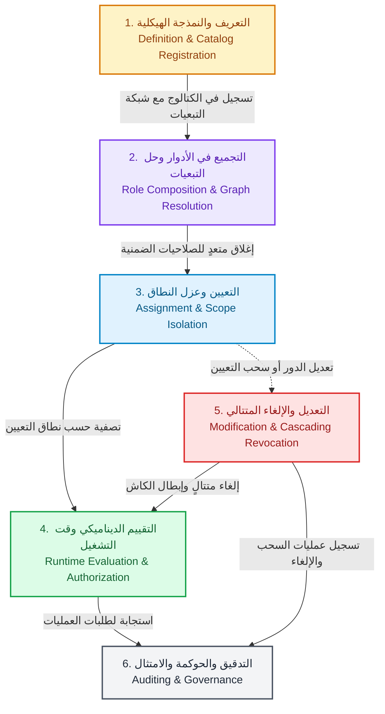
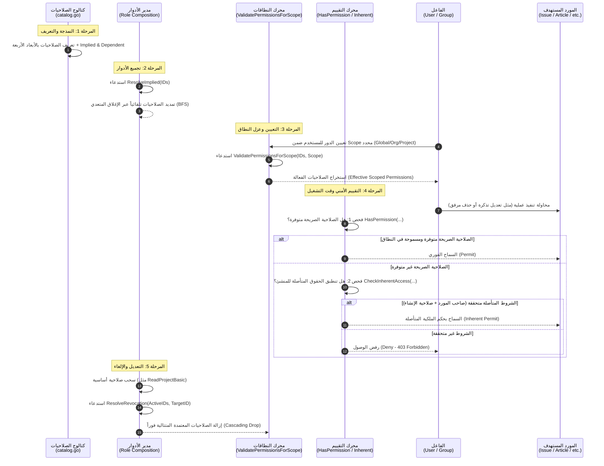
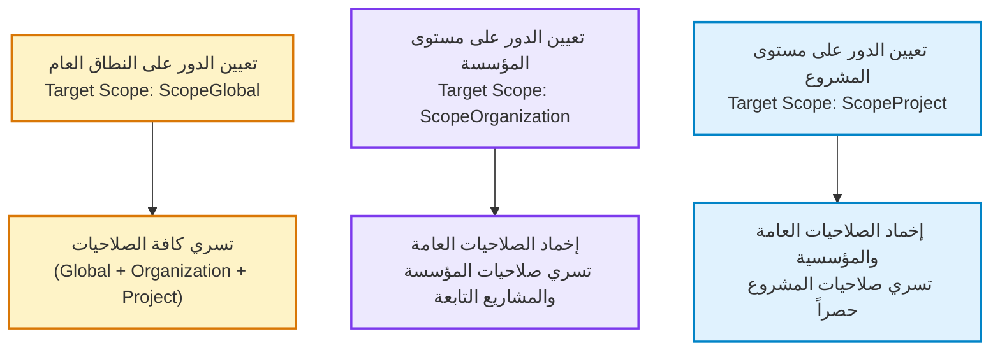
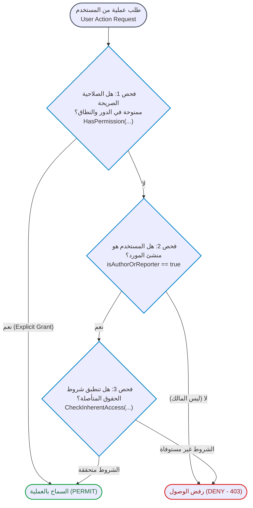

# دليل دورة حياة الصلاحيات (YouTrack Permissions Lifecycle Guide)

**الملف المصدري لنمذجة الصلاحيات:** [`internal/services/permissions_services/permission.go`](../../internal/services/permissions_services/permission.go)  
**محرك معالجة وتقييم دورة الحياة:** [`internal/services/permissions_services/service.go`](../../internal/services/permissions_services/service.go)  
**كتالوج الصلاحيات الافتراضي:** [`internal/services/permissions_services/catalog.go`](../../internal/services/permissions_services/catalog.go)  
**حالات الاختبار والتحقق:** [`internal/services/permissions_services/service_test.go`](../../internal/services/permissions_services/service_test.go)  
**النطاق المعماري:** إدارة دورة حياة الصلاحية والتحكم في الوصول المتقدم (Permission Lifecycle & Advanced RBAC)

---

## 1. مقدمة: فلسفة دورة حياة الصلاحية (Lifecycle Philosophy)

في أنظمة التحكم في الوصول القائمة على الأدوار المتقدمة (Hierarchical & Scoped RBAC) مثل **JetBrains YouTrack**، ليست الصلاحية مجرد مؤشر ثنائي بسيط (`Boolean Flag`) محفوظ في قاعدة البيانات؛ بل هي **كائن أمني خاضع لدورة حياة محكمة ومتعددة المراحل**.

تمر الصلاحية عبر ست مراحل رئيسية:

1. **التعريف والنمذجة الهيكلية (Definition & Modeling):** صياغة الصلاحية بأبعادها الأربعة وحياكة شبكة الاعتمادات البينية.
2. **التجميع في الأدوار وحل التبعيات (Role Composition & Graph Resolution):** حساب الإغلاق المتعدي للصلاحيات الضمنية تلقائياً عند الإضافة.
3. **التعيين وعزل النطاق (Assignment & Scope Isolation):** ربط الدور بالفاعل (مستخدم أو مجموعة) وإخماد الصلاحيات غير الصالحة للنطاق الهدف.
4. **التقييم الديناميكي وقت التشغيل (Runtime Evaluation):** التحقق الثنائي عبر الصلاحيات الصريحة الفعالة أو الحقوق المتأصلة لملكية المورد.
5. **التعديل والإلغاء المتتالي (Modification & Cascading Revocation):** إبطال الصلاحيات التابعة وتحديث الذاكرة المخبأة لمنع الامتيازات الشبحية.
6. **التدقيق والحوكمة والامتثال (Auditing & Governance):** تتبع سجلات المنح والسحب وضمان مبدأ الحد الأدنى من الامتيازات.



---

## 2. المخطط التتابعي الشامل لدورة حياة الصلاحية (End-to-End Sequence)

يوضح المخطط التالي مسار تفاعل المكونات البرمجية المختلفة عبر مراحل دورة الحياة:



---

## 3. المرحلة 1: التعريف والنمذجة الهيكلية (Definition & Architectural Modeling)

### البنية البرمجية لكائن الصلاحية

تُولد الصلاحية كتعريف ثابت داخل المنظومة البرمجية محددة بـ 4 أبعاد معمارية عبر الهيكل البرمجي [`Permission`](../../internal/services/permissions_services/permission.go#L66-L77):

```go
type Permission struct {
 ID             string        `json:"id"`
 DisplayName    string        `json:"display_name"`
 Description    string        `json:"description"`
 IsGlobal       bool          `json:"is_global"`
 Module         ModuleType    `json:"module"`
 Entity         EntityType    `json:"entity"`
 Scope          ScopeLevel    `json:"scope"`
 Operation      OperationType `json:"operation"`
 ImpliedPerms   []string      `json:"implied_perms,omitempty"`
 DependentPerms []string      `json:"dependent_perms,omitempty"`
}
```

### الأبعاد الأربعة المؤطرة لكينونة الصلاحية

1. **أين تسري الصلاحية؟** [`ScopeLevel`](../../internal/services/permissions_services/permission.go#L4-L13):  
   - `ScopeGlobal`: مستوى الخادم والبنية التحتية.  
   - `ScopeOrganization`: مستوى المؤسسة وفروعها.  
   - `ScopeProject`: مستوى المشروع المستقل.
2. **في أي مجال وظيفي؟** [`ModuleType`](../../internal/services/permissions_services/permission.go#L16-L31):  
   - 12 وحدة وظيفية في المنظومة (مثل: `ModuleIssue`, `ModuleArticle`, `ModuleUser`, `ModuleSystem`).
3. **على أي مورد تستقر الصلاحية؟** [`EntityType`](../../internal/services/permissions_services/permission.go#L34-L49):  
   - 12 نوع كيان مستهدف (مثل: `EntityIssue`, `EntityAttachment`, `EntityComment`, `EntityOrganization`).
4. **ما هو الفعل المصرح به؟** [`OperationType`](../../internal/services/permissions_services/permission.go#L52-L63):  
   - 8 عمليات تشغيلية: `OpCreate`, `OpRead`, `OpUpdate`, `OpDelete`, `OpLink`, `OpShare`, `OpAdmin`, `OpSpecial`.

### بناء شبكة الاعتمادات البينية المسبقة (Bi-directional Dependency Graph)

لكل صلاحية علاقتان رئيسيتان تشكلان رسماً بيانياً موجهاً (Directed Graph) يحكم سلوك الإضافة والحذف:

- **الصلاحيات المتضمنة أو الضمنية (`ImpliedPerms`):**  
  هي الصلاحيات الأساسية الأدنى رتبة التي تلزم حتماً لتشغيل الصلاحية الحالية.  
  *مثال:* صلاحية `UPDATE_ISSUE` تتضمن ضمنياً `READ_ISSUE`؛ إذ لا يمكن عقلياً أو برمجياً تعديل تذكرة لا يستطيع المستخدم قراءتها.
- **الصلاحيات المعتمدة أو التابعة (`DependentPerms`):**  
  هي الصلاحيات الأعلى رتبة التي تبني فوق هذه الصلاحية ولا يمكنها العمل بدونها.  
  *مثال:* صلاحية `READ_PROJECT_BASIC` تمتلك صلاحيات معتمدة عليها مثل `CREATE_ISSUE` و`UPDATE_PROJECT`. إذا فُقدت قراءة المشروع الأساسية، تعطلت الصلاحيات التابعة بالكامل.

### التسجيل في كتالوج المنظومة (Default Catalog Registration)

تُسجل الصلاحيات وتُثبت في الذاكرة عبر دالة [`BuildDefaultCatalog()`](../../internal/services/permissions_services/catalog.go#L91):

- يُفهرس الكتالوج بواسطة خريطة مفاتيح `map[string]Permission`.
- يضمن الكتالوج خلو المعرّفات من التكرار وترتيبها deterministic في مصفوفة [`listOrdered`](../../internal/services/permissions_services/service.go#L26-L47).

---

## 4. المرحلة 2: التجميع في الأدوار وحل التبعيات (Role Composition & Graph Resolution)

في بيئات العمل، نادراً ما تُمنح الصلاحيات الذرية بشكل مباشر للمستخدمين؛ بل تُجمع داخل **أدوار (Roles)** (مثل: "System Administrator", "Project Manager", "Developer", "Reporter").

### الخوارزمية 1: التمدد التلقائي للصلاحيات الضمنية (Transitive Implication via BFS)

وفق مبادئ YouTrack: **"عند إضافة صلاحية إلى دور، تُضاف تلقائياً كافة الصلاحيات المتضمنة ضمنياً (Implied Permissions)"**.

تُنفذ هذه الخوارزمية في دالة [`ResolveImplied`](../../internal/services/permissions_services/service.go#L106-L145):

```go
func (s *Service) ResolveImplied(permissionIDs []string) []string {
 s.mu.RLock()
 defer s.mu.RUnlock()

 resultMap := make(map[string]struct{})
 var queue []string

 // 1. تهيئة الطابور بالصلاحيات المدخلة
 for _, id := range permissionIDs {
  if _, exists := s.catalog[id]; exists {
   if _, seen := resultMap[id]; !seen {
    resultMap[id] = struct{}{}
    queue = append(queue, id)
   }
  }
 }

 // 2. البحث بعرض الرسم البياني (BFS) لحساب الإغلاق المتعدي
 for len(queue) > 0 {
  currentID := queue[0]
  queue = queue[1:]

  if p, ok := s.catalog[currentID]; ok {
   for _, impliedID := range p.ImpliedPerms {
    if _, seen := resultMap[impliedID]; !seen {
     resultMap[impliedID] = struct{}{}
     queue = append(queue, impliedID)
    }
   }
  }
 }

 // 3. ترتيب النتائج بشكل حتمي
 out := make([]string, 0, len(resultMap))
 for id := range resultMap {
  out = append(out, id)
 }
 sort.Strings(out)
 return out
}
```

#### تتبع عملي للإغلاق المتعدي (Transitive Closure Walkthrough)

إذا قام مدير النظام بإضافة صلاحية واحدة فقط لدور معين:
$$\text{Input} = [\text{PermUpdateUser}]$$

1. يكتشف المحرك أن [`PermUpdateUser`](../../internal/services/permissions_services/catalog.go#L173) تتضمن:
   - [`PermUpdateSelf`](../../internal/services/permissions_services/catalog.go#L191) (`UPDATE_PROFILE`)
   - [`PermReadUserDetails`](../../internal/services/permissions_services/catalog.go#L162) (`READ_USER`)
2. ينتقل المحرك بعرض الشجرة (BFS) إلى `PermReadUserDetails` ويكتشف أنها تتضمن بدورها:
   - [`PermReadUserBasic`](../../internal/services/permissions_services/catalog.go#L151) (`READ_USER_BASIC`)
3. ينتج عن ذلك قائمة كاملة مكتفية ذاتياً وغير قابلة للانهيار:
   $$\text{Output} = [\text{READ\_USER\_BASIC}, \text{READ\_USER}, \text{UPDATE\_PROFILE}, \text{UPDATE\_USER}]$$

---

## 5. المرحلة 3: التعيين وعزل النطاق (Assignment & Scope Isolation)

عند ربط الدور بحساب مستخدم أو مجموعة مستخدمين، لا تسري الصلاحيات بشكل مطلق في الفراغ؛ بل يجب ربط التعيين بـ **نطاق سياقي (Assignment Context / Target Scope)**.



### خوارزمية تصفية وعزل النطاق البرمجية

تُطبق قواعد العزل في دالة [`ValidatePermissionsForScope`](../../internal/services/permissions_services/service.go#L189-L222):

```go
func (s *Service) ValidatePermissionsForScope(permissionIDs []string, targetScope ScopeLevel) []string {
 s.mu.RLock()
 defer s.mu.RUnlock()

 var valid []string
 for _, id := range permissionIDs {
  p, ok := s.catalog[id]
  if !ok {
   continue
  }

  switch targetScope {
  case ScopeGlobal:
   // التعيين العام يتيح سريان كافة الصلاحيات
   valid = append(valid, id)
  case ScopeOrganization:
   // تقتصر الصلاحيات على مستوى المؤسسة والمشاريع التابعة لها فقط
   if p.Scope == ScopeOrganization || p.Scope == ScopeProject {
    valid = append(valid, id)
   }
  case ScopeProject:
   // تقتصر الصلاحيات على مستوى المشروع حصراً، وتخمد الصلاحيات العامة والمؤسسية
   if p.Scope == ScopeProject {
    valid = append(valid, id)
   }
  }
 }
 sort.Strings(valid)
 return valid
}
```

### جدول إخماد وسريان الصلاحيات حسب نطاق التعيين

| صلاحية الصنف / مستوى النطاق | عند التعيين العام (`ScopeGlobal`) | عند التعيين على مؤسسة (`ScopeOrganization`) | عند التعيين على مشروع (`ScopeProject`) |
| :--- | :--- | :--- | :--- |
| **صلاحية عامة (`ScopeGlobal`)** (مثل: إنشاء مستخدم، إدارة عامة) | **سارية وفعالة** | **معطلة ومخمدة (Suppressed)** | **معطلة ومخمدة (Suppressed)** |
| **صلاحية مؤسسية (`ScopeOrganization`)** (مثل: تعديل مؤسسة) | **سارية وفعالة** | **سارية داخل المؤسسة ومشاريعها** | **معطلة ومخمدة (Suppressed)** |
| **صلاحية مشروع (`ScopeProject`)** (مثل: إنشاء تذكرة، تعديل مقال) | **سارية في جميع مشاريع النظام** | **سارية في مشاريع المؤسسة المحددة** | **سارية حصراً داخل هذا المشروع المحدد** |

---

## 6. المرحلة 4: التقييم الأمني وقت التشغيل (Runtime Evaluation & Authorization)

عندما يطلب الفاعل (مستخدم أو واجهة برمجة تطبيقات API) تنفيذ إجراء تشغيلي على كيان معين، يدخل محرك التحقق في **مسار فحص ثنائي ذكي (Dual-Track Evaluation Engine)**.



### المسار الأول: الصلاحيات الصريحة الممنوحة ([`HasPermission`](../../internal/services/permissions_services/service.go#L224-L232))

يتم فحص مصفوفة الصلاحيات الفعالة الناتجة من عمليتي التجميع والعزل:

- إذا كانت الصلاحية المطلوبة (مثل `UPDATE_ISSUE`) موجودة ضمن الصلاحيات الممنوحة للفاعل في هذا النطاق، يُمنح الإذن فوراً دون مزيد من الفحوصات.

### المسار الثاني: الحقوق المتأصلة لملكية الموارد ([`CheckInherentAccess`](../../internal/services/permissions_services/service.go#L234-L276))

إذا لم يكن المستخدم يملك الصلاحية الصريحة العامة، يفحص النظام علاقته بالكيان المعني:

1. **تذاكر صاحب البلاغ (Issue Reporter):**
   - قراءة الحقول العامة للتذكرة (`InherentReadOwnIssuePublicFields`) $\rightarrow$ يشترط فقط امتلاك صلاحية إنشاء التذاكر `CREATE_ISSUE`.
   - تعديل الحقول العامة للتذكرة (`InherentUpdateOwnIssuePublicFields`) $\rightarrow$ يشترط فقط امتلاك `CREATE_ISSUE`.
   - ربط التذكرة بقضايا أخرى (`InherentLinkOwnIssue`) $\rightarrow$ يشترط فقط امتلاك `CREATE_ISSUE`.
2. **ملفات رافع المرفق (File Attacher):**
   - تعديل بيانات المرفق أو تقييد رؤيته (`InherentModifyOwnAttachment`, `InherentRestrictOwnAttachment`) $\rightarrow$ يشترط امتلاك صلاحية رفع المرفقات `CREATE_ATTACHMENT_ISSUE`.
   - **حذف المرفق الذاتي (`InherentDeleteOwnAttachment`) $\rightarrow$ مسموح دائماً لأي مستخدم رفع الملف بنفسه دون الحاجة لأي صلاحية إضافية** (حماية فورية للخصوصية).
3. **التعليقات وسجلات العمل (Comments & Work Items):**
   - قراءة التعليق الخاص بالتذكرة $\rightarrow$ يشترط امتلاك `CREATE_COMMENT`.
   - قراءة سجل العمل الخاص بالمستخدم $\rightarrow$ يشترط امتلاك `CREATE_WORK_ITEM`.
   - قراءة وتعديل وحذف تعليقات المقالات التابعة للمستخدم $\rightarrow$ يشترط امتلاك `CREATE_ARTICLE_COMMENT`.

> [!IMPORTANT]
> **قاعدة أمنية حاسمة في YouTrack:**  
> لا يمنح النظام مقدم البلاغ حق **حذف تذكرته الخاصة** بالحقوق المتأصلة أبداً؛ بل يتطلب حذف التذاكر دائماً امتلاك صلاحية صريحة لـ `DELETE_ISSUE` لمنع التلاعب بسجلات المشروع وتاريخ تدقيق المشكلات.

---

## 7. المرحلة 5: التعديل، الإلغاء، وإبطال الذاكرة المخبأة (Modification & Cascading Revocation)

عندما تتغير متطلبات الأمان أو يغادر موظف دوره، تدخل الصلاحيات في مرحلة السحب والإلغاء.

### الخوارزمية 2: الإلغاء المتتالي للتبعيات (Cascading Revocation via Dependency Pruning)

وفق مبدأ YouTrack: **"عند إزالة صلاحية تعتمد عليها صلاحيات أخرى من دور، تُحذف الصلاحيات التابعة تلقائياً"**.

تُنفذ هذه الخوارزمية في دالة [`ResolveRevocation`](../../internal/services/permissions_services/service.go#L147-L187):

```go
func (s *Service) ResolveRevocation(activePermissionIDs []string, permissionToRemove string) []string {
 s.mu.RLock()
 defer s.mu.RUnlock()

 activeSet := make(map[string]struct{}, len(activePermissionIDs))
 for _, id := range activePermissionIDs {
  activeSet[id] = struct{}{}
 }

 // 1. وضع الصلاحية المستهدفة في طابور الحذف
 toDelete := make(map[string]struct{})
 queue := []string{permissionToRemove}
 toDelete[permissionToRemove] = struct{}{}

 // 2. البحث المتتالي عن جميع الصلاحيات التي تعتمد على الصلاحيات المحذوفة
 for len(queue) > 0 {
  curr := queue[0]
  queue = queue[1:]

  if p, ok := s.catalog[curr]; ok {
   for _, depID := range p.DependentPerms {
    if _, alreadyMarked := toDelete[depID]; !alreadyMarked {
     toDelete[depID] = struct{}{}
     queue = append(queue, depID)
    }
   }
  }
 }

 // 3. تصفية الصلاحيات الفعالة واستبعاد المحذوفات
 var remaining []string
 for id := range activeSet {
  if _, deleted := toDelete[id]; !deleted {
   remaining = append(remaining, id)
  }
 }
 sort.Strings(remaining)
 return remaining
}
```

#### تتبع عملي لعملية الإلغاء المتتالي (Cascading Prune Walkthrough)

افترض أن دوراً يمتلك الصلاحيات التالية:
$$\text{ActiveSet} = [\text{PermUpdateProject}, \text{PermReadProjectFull}, \text{PermReadProjectBasic}, \text{PermCreateIssue}]$$

إذا قرر مدير النظام إلغاء الصلاحية الجذرية:
$$\text{TargetToRemove} = \text{PermReadProjectBasic}$$

1. يكتشف المحرك أن `PermReadProjectBasic` مدرج في مصفوفة `DependentPerms` لكل من:
   - `PermReadProjectFull`
   - `PermCreateIssue`
2. يكتشف المحرك بدوره أن `PermReadProjectFull` تعتمد عليها صلاحية `PermUpdateProject`.
3. تُضاف جميع هذه الصلاحيات تباعاً إلى طابور الإلغاء (`toDelete`).
4. النتيجة المتبقية:
   $$\text{Remaining} = [\ ] \quad (\text{0 الصلاحيات المتبقية})$$
   *حيث سقطت كافة الصلاحيات التابعة وتجرد الدور بالكامل من أي حقوق غير صالحة للعمل بمفردها.*

### إبطال الذاكرة المخبأة ومنع الجلسات الشبحية (Cache Invalidation)

- عند حدوث أي تعديل في الأدوار أو تعيينات المستخدمين، يجب فوراً إبطال الذاكرة المخبأة لجلسات المستخدمين النشطة (`Token / Session Cache Invalidation`).
- يضمن هذا عدم استمرار المستخدم في امتلاك "امتيازات شبحية" (Ghost Privileges) اكتسبها قبل تعديل الدور.

---

## 8. المرحلة 6: التدقيق، المراقبة، والامتثال (Auditing & Governance)

تكتمل دورة حياة الصلاحيات بآليات التدقيق المستمر لحفظ سلامة النظام وسجلاته:

1. **سجلات الأحداث الأمنية (Security Event Logs):**
   - تسجيل كل حدث إنشاء دور، أو تعديله، أو إضافة صلاحية، أو سحبها، مع توثيق معرّف الفاعل (`Actor ID`)، ومعرّف المستفيد (`Target Principal`)، والنطاق (`Scope`)، والطابع الزمني الدقيق.
2. **فحص الصلاحيات المعطلة واليتيمة (Orphan & Stale Audit):**
   - الكشف عن أي تعيينات لأدوار على مشاريع أو مؤسسات تم حذفها أو أرشفتها وتنظيفها دورياً.
3. **مراجعات الامتثال (Compliance Reviews):**
   - التأكد المستمر من تطبيق مبدأ الحد الأدنى من الامتيازات (Principle of Least Privilege).
   - ضمان عدم وجود صلاحيات شاملة `ScopeGlobal` ممنوحة لأشخاص لا تتطلب طبيعة عملهم إدارة البنية التحتية للخادم.

---

## 9. جدول مقارنة شامل لمراحل دورة الحياة

| المرحلة | المدخلات الرئيسية | العمليات البرمجية في الكود | المخرجات | القاعدة الأمنية الحاكمة |
| :--- | :--- | :--- | :--- | :--- |
| **1. التعريف والتسجيل** | الأبعاد الأربعة (`Scope`, `Module`, `Entity`, `Op`) | [`BuildDefaultCatalog()`](../../internal/services/permissions_services/catalog.go#L91) | كائن [`Permission`](../../internal/services/permissions_services/permission.go#L66) مفهرس وثابت | ثبات الأبعاد ومنع تضارب المعرّفات |
| **2. تجميع الأدوار** | قائمة معرفات الصلاحيات الأولية | [`ResolveImplied()`](../../internal/services/permissions_services/service.go#L106) | إغلاق متعدٍ للصلاحيات المتضمنة | الإضافة التلقائية لكافة الصلاحيات الضمنية لمنع كسر الوظائف |
| **3. عزل النطاق** | الدور المجمع + نطاق التعيين Target Scope | [`ValidatePermissionsForScope()`](../../internal/services/permissions_services/service.go#L189) | مصفوفة الصلاحيات الفعالة للنطاق | منع تسرب الصلاحيات العامة والمؤسسية للمشاريع الفردية |
| **4. التقييم وقت التشغيل** | طلب العملية + سياق المورد + المستخدم | [`HasPermission()`](../../internal/services/permissions_services/service.go#L224) <br/> [`CheckInherentAccess()`](../../internal/services/permissions_services/service.go#L234) | قرار أمني قطعي (`Permit` أو `Deny`) | مسار فحص ثنائي: الصلاحيات الصريحة أو حقوق الملكية المتأصلة |
| **5. التعديل والإلغاء** | الصلاحية المستهدفة بالسحب + الصلاحيات النشطة | [`ResolveRevocation()`](../../internal/services/permissions_services/service.go#L147) | قائمة منقحة خالية من التبعيات اليتيمة | الإلغاء المتتالي الصارم لأي صلاحية تعتمد على الصلاحية المسحوبة |
| **6. الحوكمة والتدقيق** | سجلات العمليات والأحداث الأمنية | محركات المراقبة وتدقيق الوصول | تقارير الامتثال وسجلات التتبع الدائم | إثبات النزاهة وتطبيق مبدأ الحد الأدنى من الامتيازات |

---

## 10. المراجع والوثائق التكميلية في المشروع

- **تقرير البحث والمطابقة مع المصادر الرسمية لـ YouTrack:** [`docs/permissions/youtrack_official_permissions_lifecycle_research.md`](./youtrack_official_permissions_lifecycle_research.md)
- **تقرير نتائج الاختبارات المتقدمة وقياس الكفاءة:** [`docs/permissions/permissions_service_test_results.md`](./permissions_service_test_results.md)
- **المخطط المعماري لدورة حياة الصلاحيات:** [`docs/permissions/diagrams/permissions_lifecycle.mmd`](./diagrams/permissions_lifecycle.mmd)
- **دليل الحقوق المتأصلة للملكية:** [`docs/permissions/inherent_permissions_guide.md`](./inherent_permissions_guide.md)
- **دليل مستويات النطاق:** [`docs/permissions/scope_levels_guide.md`](./scope_levels_guide.md)
- **دليل تفصيل النطاقات والوحدات والموارد والعمليات:** [`docs/permissions/scopes_modules_entities_operations_guide.md`](./scopes_modules_entities_operations_guide.md)
- **دليل أنواع العمليات التشغيلية:** [`docs/permissions/operation_types_guide.md`](./operation_types_guide.md)
- **دليل كيانات يوتراك:** [`docs/permissions/youtrack_entities_guide.md`](./youtrack_entities_guide.md)
- **دليل وحدات يوتراك الوظيفية:** [`docs/permissions/youtrack_modules_guide.md`](./youtrack_modules_guide.md)
- **المرجع الشامل لجميع الصلاحيات:** [`docs/permissions/youtrack_permissions_reference.md`](./youtrack_permissions_reference.md)
- **مخطط أبعاد الصلاحيات الرباعية:** [`docs/permissions/diagrams/permissions_four_dimensions.mmd`](./diagrams/permissions_four_dimensions.mmd)
- **مخطط هيكلية النطاقات والوحدات والكيانات والعمليات:** [`docs/permissions/diagrams/scope_modules_entities_operations.mmd`](./diagrams/scope_modules_entities_operations.mmd)
