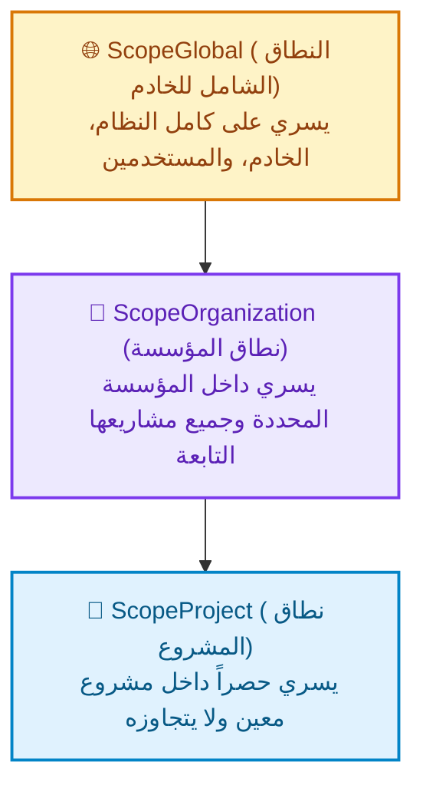
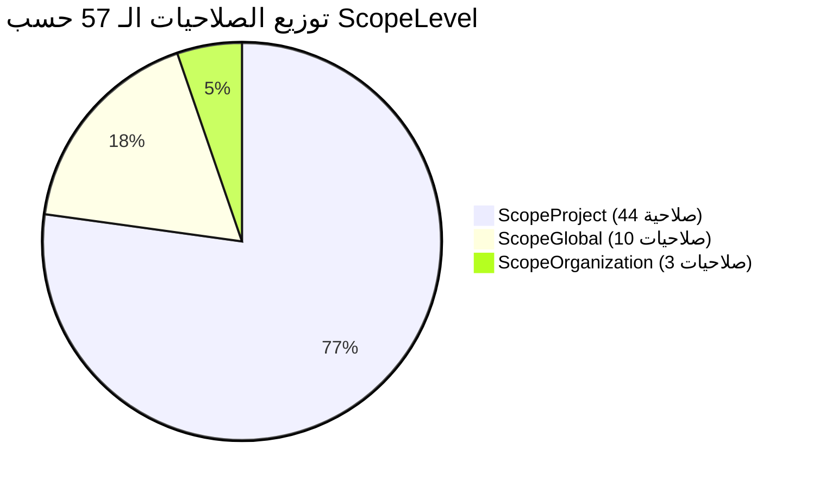

# دليل مستويات النطاق (YouTrack Scope Levels Guide)

**الملف المصدري البرمجي:** [`internal/services/permissions_services/permission.go`](../../internal/services/permissions_services/permission.go#L3-L13)  
**محرك التحقق والعزل:** [`internal/services/permissions_services/service.go`](../../internal/services/permissions_services/service.go#L189-L222)  
**كتالوج الصلاحيات:** [`internal/services/permissions_services/catalog.go`](../../internal/services/permissions_services/catalog.go)  
**النطاق المعماري:** حوكمة حدود الأمان والتحكم في الوصول المجزأ (Scoped Authorization Boundaries)

---

## 1. ما هو مستوى النطاق (`ScopeLevel`) في YouTrack؟

في أنظمة إدارة المشاريع وتتبع القضايا المتقدمة مثل **JetBrains YouTrack**، لا يُمنح المستخدم الصلاحيات بشكل مجرد أو عائم (مثل: "المستخدم فلان يملك صلاحية تعديل التذاكر")؛ بل يجب أن تقترن الصلاحية دائماً بـ **حدود مكانية وسياق تنفيذي** محدد يُعرف بـ **النطاق (Scope)**.

يمثل `ScopeLevel` **أفق ومستوى نفاذ الصلاحية**، ويحدد الحدود الجغرافية/التنظيمية التي تسري فيها القواعد الأمنية داخل النظام:

```go
// ScopeLevel defines the level at which a permission applies in YouTrack.
type ScopeLevel string

const (
 // ScopeGlobal applies system-wide across all organizations and projects.
 ScopeGlobal ScopeLevel = "GLOBAL"
 // ScopeOrganization applies within a specific organization hierarchy.
 ScopeOrganization ScopeLevel = "ORGANIZATION"
 // ScopeProject applies within a specific project.
 ScopeProject ScopeLevel = "PROJECT"
)
```

### الأهمية المعمارية لتحديد مستويات النطاق

1. **العزل الأمني الصارم ومنع تسرب الامتيازات (Scope Isolation):**  
   يمنع منح صلاحية حرجة (مثل تعديل مستخدم أو حذف مؤسسة) لمستخدم عندما يكون دوره محصوراً بمشروع واحد.
2. **دعم بيئات العمل متعددة المستأجرين (Multi-Tenancy Support):**  
   يتيح لعدة مؤسسات وشركات العمل على نفس خادم YouTrack المشترك، مع ضمان عدم تداخل صلاحيات المؤسسات أو تسرب بياناتها للمشاريع الأخرى.
3. **التحكم الدقيق متعدد المستويات (Granular RBAC):**  
   يمكن للمستخدم نفسه أن يكون **مطوراً عادياً** في "مشروع أ"، و**مدير مشروع** في "مشروع ب"، بينما ليس له أي حقوق إدارية على مستوى المؤسسة أو الخادم.
4. **التكامل مع الأبعاد الرباعية لنظام الصلاحيات:**  
   يكتمل تعريف الصلاحية في YouTrack من خلال تقاطع أربعة أبعاد:
   - **أين تسري الصلاحية؟** $\leftarrow$ [`ScopeLevel`](../../internal/services/permissions_services/permission.go#L4)
   - **في أي نطاق وظيفي؟** $\leftarrow$ [`ModuleType`](../../internal/services/permissions_services/permission.go#L16)
   - **على أي مورد؟** $\leftarrow$ [`EntityType`](../../internal/services/permissions_services/permission.go#L34)
   - **ما هو الإجراء المسموح به؟** $\leftarrow$ [`OperationType`](../../internal/services/permissions_services/permission.go#L52)

   > 📌 **المخططات والأدلة التكميلية:**
   > - مخطط التقاطع المفاهيمي الرباعي: [`permissions_four_dimensions.mmd`](./diagrams/permissions_four_dimensions.mmd).
   > - مخطط التفصيل الشجري لكل نطاق وما يحتويه من وحدات وموارد وإجراءات: [`scope_modules_entities_operations.mmd`](./diagrams/scope_modules_entities_operations.mmd).
   > - دليل تفصيل النطاقات والوحدات والموارد والعمليات: [`scopes_modules_entities_operations_guide.md`](./scopes_modules_entities_operations_guide.md).

---

## 2. الهيكلية الرأسية للنطاقات (Hierarchy Overview)

تترتب مستويات النطاق في YouTrack هرمياً من الأعلى سلطة والأوسع انتشاراً إلى الأكثر تخصيصاً وحصراً:



---

## 3. مقارنة شاملة بين المستويات الثلاثة

| الميزة / المعيار | `ScopeGlobal` (النطاق الشامل) | `ScopeOrganization` (نطاق المؤسسة) | `ScopeProject` (نطاق المشروع) |
| :--- | :--- | :--- | :--- |
| **القيمة النصية** | `"GLOBAL"` | `"ORGANIZATION"` | `"PROJECT"` |
| **الحدود والسياق** | النظام والخادم كاملاً عبر كل المؤسسات والمشاريع | مؤسسة محددة وحاويتها وفروع مشاريعها | مشروع محدد بعينه فقط |
| **طبيعة الموارد** | البنية التحتية، المستخدمين، إدارة النظام | إعدادات وسجلات وحوكمة المؤسسة | التذاكر، المقالات، التعليقات، المرفقات، أوقات العمل |
| **عدد الصلاحيات بالكود** | 10 صلاحيات شاملة | 3 صلاحيات مؤسسية | 44 صلاحية تشغيلية |
| **سلوك انتشار التعيين** | يمنح كل النطاقات (العامة والمؤسسية والمشاريع) | يمنح صلاحيات المؤسسة والمشاريع التابعة لها فقط | يمنح صلاحيات المشروع فقط، وتُلغى الصلاحيات العامة والمؤسسية |
| **أمثلة على الأدوار** | مدير النظام (System Admin)، مسؤول المستخدمين | مدير المؤسسة (Org Admin) | مدير المشروع (Project Lead)، مطور، مراقب |

---

## 4. شرح تفصيلي لكل مستوى نطاق

### 1. النطاق الشامل: `ScopeGlobal` (`"GLOBAL"`)

#### المفهوم البرمجي والمعماري

يمثل أعلى مستويات النفاذ الأمني في خادم YouTrack. الصلاحيات المصنفة ضمن هذا النطاق ترتبط ببيانات وإعدادات مشتركة وممتدة عبر كامل المنصة، ولا يمكن عزلها أو تقييدها بمشروع واحد أو مؤسسة واحدة دون التأثير على النظام العام.

#### الموارد والعمليات التي يشملها

1. **صلاحيات الإدارة التقنية المنخفضة (Low-Level Administration):**
   - قراءة إعدادات الخادم وتطبيقات النظام:  
     [`PermLowLevelAdminRead`](../../internal/services/permissions_services/catalog.go#L93) (`ADMIN_READ_APP`).
   - تعديل إعدادات الخادم والنسخ الاحتياطي والمجموعات:  
     [`PermLowLevelAdminWrite`](../../internal/services/permissions_services/catalog.go#L103) (`ADMIN_UPDATE_APP`).
2. **إدارة المستخدمين ككيانات بالخادم:**
   - إنشاء وحذف وتعديل سجلات المستخدمين، واستعراض تفاصيلهم:  
     [`PermCreateUser`](../../internal/services/permissions_services/catalog.go#L608), [`PermDeleteUser`](../../internal/services/permissions_services/catalog.go#L618), [`PermUpdateUser`](../../internal/services/permissions_services/catalog.go#L660), [`PermUpdateSelf`](../../internal/services/permissions_services/catalog.go#L650), [`PermReadUserDetails`](../../internal/services/permissions_services/catalog.go#L639), [`PermReadUserBasic`](../../internal/services/permissions_services/catalog.go#L629).
3. **إنشاء الحاويات الكبرى:**
   - إنشاء مؤسسات جديدة في النظام: [`PermCreateOrganization`](../../internal/services/permissions_services/catalog.go#L507).
   - إنشاء مشاريع جديدة في النظام: [`PermCreateProject`](../../internal/services/permissions_services/catalog.go#L553).

> [!NOTE]
> إنشاء المشاريع والمؤسسات هو صلاحية عامة (`ScopeGlobal`)، بينما تعديل أو حذف مشروع قائم بعد إنشائه هو صلاحية تتبع نطاق المشروع (`ScopeProject`) أو نطاق المؤسسة (`ScopeOrganization`).

---

### 2. نطاق المؤسسة: `ScopeOrganization` (`"ORGANIZATION"`)

#### 1 المفهوم البرمجي والمعماري

في بيئات الشركات المتعددة أو المنظمات الكبيرة المقسمة إلى فروع، تمثل **المؤسسة (Organization)** الحاوية الوسطى بين الخادم العام وبين المشاريع الفردية. يضمن هذا النطاق تمكين مسؤولي المؤسسة من إدارة مؤسستهم والمشاريع التابعة لها دون الحاجة لمنحهم صلاحيات مدير الخادم بالكامل.

#### 2 الموارد والعمليات التي يشملها

يركز هذا النطاق بشكل رئيسي على حوكمة كيان المؤسسة بحد ذاتها:

1. **استعراض المؤسسة:**  
   [`PermReadOrganization`](../../internal/services/permissions_services/catalog.go#L533) (`READ_ORGANIZATION`) — عرض بيانات المؤسسة ومشاريعها وأعضائها.
2. **تحديث بيانات المؤسسة:**  
   [`PermUpdateOrganization`](../../internal/services/permissions_services/catalog.go#L543) (`UPDATE_ORGANIZATION`) — تعديل بيانات المؤسسة، وإسناد المشاريع لها وإدارة حقوق الوصول الداخلية.
3. **حذف المؤسسة:**  
   [`PermDeleteOrganization`](../../internal/services/permissions_services/catalog.go#L522) (`DELETE_ORGANIZATION`) — الإزالة الكاملة لسجل المؤسسة من الخادم.

#### الوراثة إلى المشاريع (Inheritance Downwards)

الصلاحيات الممنوحة على مستوى المؤسسة تورث آلياً لكافة المشاريع التي تنتمي إلى هذه المؤسسة. وبالتالي، فإذا مُنح دور معين للمستخدم في نطاق المؤسسة، فإنه يملك الصلاحيات المؤسسية بالإضافة إلى صلاحيات المشاريع التابعة لها، ولكن **تُحجب عنه الصلاحيات العامة للخادم ككل**.

---

### 3. نطاق المشروع: `ScopeProject` (`"PROJECT"`)

#### 3.1  المفهوم البرمجي والمعماري

هو النطاق الأساسي والأكثر شيوعاً واستخداماً في دورة العمل اليومية في YouTrack. يمثل هذا النطاق حاجز الأمان الحقيقي للبيانات؛ حيث يمنع مستخدمي مشروع ما من الاطلاع على أو تعديل تذاكر ومقالات ومشاريع أخرى لا يملكون تصريحاً فيها.

#### 3.2 الموارد والعمليات التي يشملها

يشمل السواد الأعظم من صلاحيات الكتالوج (44 صلاحية)، موزعة على كافة وحدات التعاون:

1. **إدارة التذاكر (Issues):**  
   إنشاء، قراءة، تعديل، حذف، ربط، قراءة وتحديث الحقول السرية (`CREATE_ISSUE`, `READ_ISSUE`, `UPDATE_ISSUE`, `DELETE_ISSUE`, `LINK_ISSUE`, `READ_ISSUE_PRIVATE_FIELDS`...).
2. **قاعدة المعرفة والمقالات (Articles):**  
   إنشاء وتعديل وحذف وقراءة المقالات والتعليق عليها.
3. **التعليقات والمرفقات (Comments & Attachments):**  
   إضافة وتعديل وحذف المرفقات والتعليقات الخاصة بالتذاكر والمقالات.
4. **تتبع الوقت والجهد (Time Tracking / Work Items):**  
   تسجيل أوقات العمل وقراءة سجلات الجهد للمطورين داخل المشروع.
5. **مجلدات المراقبة والتنظيم (Watch Folders):**  
   مشاركة وإدارة الوسوم (Tags) والاستعلامات المحفوظة (Saved Queries) الخاصة بسياق المشروع.
6. **إدارة المشروع نفسه:**  
   استعراض وتعديل وأرشفة المشروع القائم:  
   [`PermReadProject`](../../internal/services/permissions_services/catalog.go#L583), [`PermUpdateProject`](../../internal/services/permissions_services/catalog.go#L593), [`PermDeleteProject`](../../internal/services/permissions_services/catalog.go#L573).

---

## 5. قواعد العزل والتحقق البرمجي (`ValidatePermissionsForScope`)

أحد أهم الأجزاء المعمارية في هذا المستودع هو كيفية **تصفية وحجب الصلاحيات** بناءً على النطاق المستهدف (`targetScope`) عند إسناد الأدوار للمستخدمين.

تتولى الدالة [`ValidatePermissionsForScope`](../../internal/services/permissions_services/service.go#L189-L222) في خدمة الصلاحيات تنفيذ هذه القواعد الصارمة:

```go
// ValidatePermissionsForScope filters permissions based on YouTrack scope isolation rules:
// - Global assignment: all permissions apply.
// - Organization assignment: global permissions no longer propagate and have no effect.
// - Project assignment: global and organization-level permissions have no effect.
func (s *Service) ValidatePermissionsForScope(permissionIDs []string, targetScope ScopeLevel) []string {
 s.mu.RLock()
 defer s.mu.RUnlock()

 var valid []string
 for _, id := range permissionIDs {
  p, ok := s.catalog[id]
  if !ok {
   continue
  }

  switch targetScope {
  case ScopeGlobal:
   // Global assignments allow all scopes to apply
   valid = append(valid, id)
  case ScopeOrganization:
   // Only organization and project permissions take effect
   if p.Scope == ScopeOrganization || p.Scope == ScopeProject {
    valid = append(valid, id)
   }
  case ScopeProject:
   // Only project-level permissions take effect
   if p.Scope == ScopeProject {
    valid = append(valid, id)
   }
  }
 }
 sort.Strings(valid)
 return valid
}
```

### كيف يفسر المحرك هذه القواعد؟

```mermaid
flowchart TD
    REQ(["صلاحية مطلوبة للتحقق"]) --> CHECK{"ما هو نطاق التعيين TargetScope؟"}

    CHECK -->|ScopeGlobal| ALLOW_ALL["✅ تسري الصلاحية أياً كان نطاقها<br/>(Global + Organization + Project)"]
    
    CHECK -->|ScopeOrganization| CHECK_ORG{"هل نطاق الصلاحية الأصلي<br/>Organization أو Project؟"}
    CHECK_ORG -->|نعم| ALLOW_ORG["✅ تسري الصلاحية داخل المؤسسة وفروعها"]
    CHECK_ORG -->|لا (Global)| DENY_ORG["❌ تُحجب الصلاحية فوراً<br/>(تمنع الصلاحيات العامة من السريان)"]

    CHECK -->|ScopeProject| CHECK_PROJ{"هل نطاق الصلاحية الأصلي<br/>Project فقط؟"}
    CHECK_PROJ -->|نعم| ALLOW_PROJ["✅ تسري الصلاحية داخل هذا المشروع فقط"]
    CHECK_PROJ -->|لا (Global أو Org)| DENY_PROJ["❌ تُحجب الصلاحية فوراً<br/>(تمنع تسرب الامتيازات العامة والمؤسسية)"]
```

### سيناريو واقعي لشرح سلوك العزل

تخيل أن دوراً يدعى **"مدير الفريق" (Team Lead Role)** يحتوي في حزمته على الصلاحيات التالية:

1. `CREATE_ISSUE` (نطاقها: `ScopeProject`)
2. `UPDATE_PROJECT` (نطاقها: `ScopeProject`)
3. `UPDATE_ORGANIZATION` (نطاقها: `ScopeOrganization`)
4. `CREATE_USER` (نطاقها: `ScopeGlobal`)

- **إذا أُسند هذا الدور لمستخدم في نطاق مشروع "مشروع ألف" (`ScopeProject`):**
  - الصلاحيات الفعالة: `CREATE_ISSUE` و `UPDATE_PROJECT` فقط.
  - الصلاحيات المحجوبة تلقائياً: `UPDATE_ORGANIZATION` و `CREATE_USER` (لأنهما تتجاوزان حدود المشروع).
- **إذا أُسند هذا الدور على مستوى مؤسسة "فرع الرياض" (`ScopeOrganization`):**
  - الصلاحيات الفعالة: `CREATE_ISSUE` و `UPDATE_PROJECT` و `UPDATE_ORGANIZATION`.
  - الصلاحية المحجوبة: `CREATE_USER` (لأن إنشاء المستخدمين اختصاص عام للمنصة ككل).
- **إذا أُسند هذا الدور على مستوى الخادم بالكامل (`ScopeGlobal`):**
  - تسري جميع الصلاحيات الأربع بلا أي قيود.

---

## 6. توزيع كتالوج الصلاحيات حسب مستويات النطاق

يعرف كتالوج الصلاحيات في ملف [`catalog.go`](../../internal/services/permissions_services/catalog.go) إجمالي **57 صلاحية**، تتوزع إحصائياً وبرمجياً على المستويات الثلاثة كالتالي:



### 1. قائمة الصلاحيات الشاملة (`ScopeGlobal`)

1. `ADMIN_READ_APP` — قراءة الإعدادات التقنية للخادم والمقاييس والمجموعات.
2. `ADMIN_UPDATE_APP` — تعديل إعدادات الخادم والنسخ الاحتياطي والمجموعات والأدوار.
3. `CREATE_ORGANIZATION` — إنشاء مؤسسة جديدة.
4. `CREATE_PROJECT` — إنشاء مشروع جديد.
5. `CREATE_USER` — إنشاء حسابات المستخدمين ودعوتهم.
6. `DELETE_USER` — حذف حسابات المستخدمين.
7. `READ_USER_BASIC` — استعراض البيانات الأساسية للمستخدمين (الاسم، المعرف، الصورة).
8. `READ_USER_DETAILS` — استعراض بيانات الملف الشخصي التفصيلية لكافة المستخدمين.
9. `UPDATE_SELF` — تعديل بيانات الأمان الشخصية (المصادقة الثنائية، الرموز).
10. `UPDATE_USER` — تعديل بيانات المستخدمين ودمج وحظر الحسابات.

### 2. قائمة الصلاحيات المؤسسية (`ScopeOrganization`)

1. `READ_ORGANIZATION` — قراءة بيانات المؤسسة ومشاريعها.
2. `UPDATE_ORGANIZATION` — تعديل بيانات المؤسسة وصلاحياتها.
3. `DELETE_ORGANIZATION` — إزالة المؤسسة من النظام.

### 3. قائمة صلاحيات المشاريع (`ScopeProject`)

تشمل الـ 44 صلاحية المتبقية التي تحكم التذاكر، المقالات، المرفقات، وسوم البحث، تتبع أوقات العمل، وإدارة المشاريع القائمة.

---

## 7. الخلاصة المعمارية للمطورين

1. **`ScopeLevel` ليس نوعاً تجميلياً؛** بل هو الركيزة الأساسية لمنع تصعيد الامتيازات (Privilege Escalation Protection).
2. عند إضافة أي صلاحية جديدة إلى [`catalog.go`](../../internal/services/permissions_services/catalog.go)، يجب اختيار `ScopeLevel` بعناية فائقة:
   - هل تمس الصلاحية كياناً مشتركاً بين جميع المؤسسات والمشاريع؟ $\rightarrow$ استخدم `ScopeGlobal`.
   - هل تمس الصلاحية إدارة منظمة بعينها ومشاريعها الفرعية؟ $\rightarrow$ استخدم `ScopeOrganization`.
   - هل تمس الصلاحية إجراءات العمل والبيانات التشغيلية لمشروع؟ $\rightarrow$ استخدم `ScopeProject`.
3. لا تعتمد فقط على فحص الصلاحية بالاسم في واجهات البرمجة؛ بل استدعِ دائماً [`ValidatePermissionsForScope`](../../internal/services/permissions_services/service.go#L193) لتصفية الصلاحيات وضمان سريانها في النطاق الصحيح قبل التخزين أو اتخاذ قرار التفويض.
