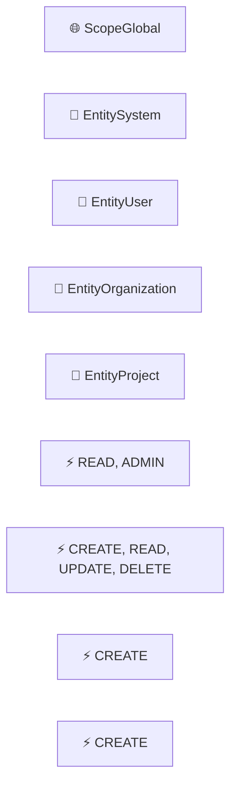
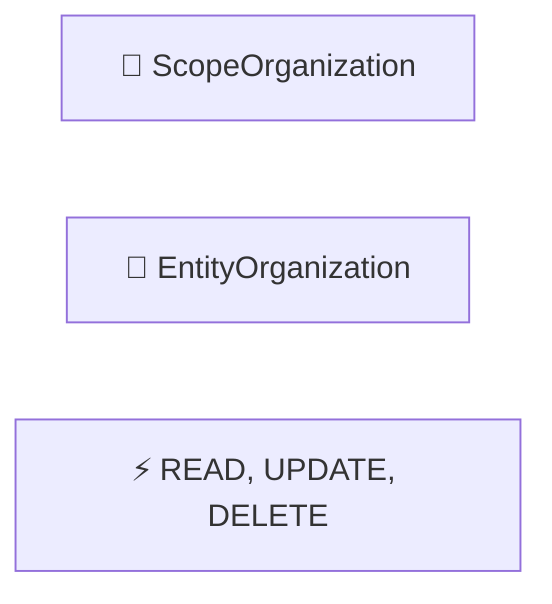
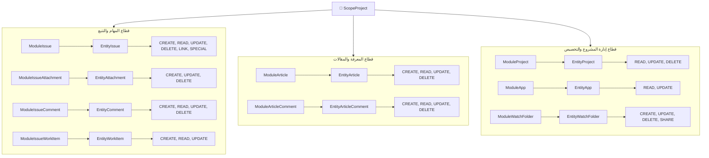

# دليل تفصيل النطاقات والموارد والعمليات الرسمية (Scoped Permissions Architecture Guide)

**الملف المصدري لأنواع الأبعاد:** [`internal/services/permissions_services/permission.go`](../../internal/services/permissions_services/permission.go)  
**كتالوج الصلاحيات الفعلي:** [`internal/services/permissions_services/catalog.go`](../../internal/services/permissions_services/catalog.go)  
**محرك التحقق والتصفية:** [`internal/services/permissions_services/service.go`](../../internal/services/permissions_services/service.go#L189-L222)  
**المخطط الرسومي الشجري:** [`docs/permissions/diagrams/scope_modules_entities_operations.mmd`](./diagrams/scope_modules_entities_operations.mmd)  
**مخطط الأبعاد الثلاثية:** [`docs/permissions/diagrams/permissions_four_dimensions.mmd`](./diagrams/permissions_four_dimensions.mmd)

---

## 1. نظرة عامة ومعمارية

يكتمل تعريف أي صلاحية في نظام **JetBrains YouTrack** عبر مسار هرمي ثلاثي معتمد يربط بين:

1. **النطاق (`ScopeLevel`):** أين تسري الصلاحية وما هو أفق وحدود تطبيقها؟
2. **المورد المستهدف (`EntityType`):** ما هو الكيان والبيانات المستهدفة بالحماية؟
3. **نوع الإجراء (`OperationType`):** ما هو الفعل المسموح تنفيذه على المورد؟

$$ \text{ScopeLevel} \xrightarrow{\text{يحكم}} \text{EntityType} \xrightarrow{\text{ينفذ}} \text{OperationType} $$

يقسم الكتالوج الصلاحيات الـ 57 في النظام إلى ثلاثة نطاقات رئيسية وفق الجدول الإحصائي التالي:

| مستوى النطاق (`ScopeLevel`)  عدد الموارد (`Entities`) | عدد الصلاحيات المباشرة | الغرض الأمني والمعماري |
| :--- | :---: | :---: | :--- |
| **`ScopeGlobal`** | 4 | 10 | إدارة إعدادات الخادم، حسابات المستخدمين، وحجز الموارد العليا (مؤسسات/مشاريع). |
| **`ScopeOrganization`** | 1 | 3 | حوكمة المؤسسة المستأجرة (Tenant Isolation) وإدارتها وحذفها. |
| **`ScopeProject`** | 9 | 44 | إدارة العمل اليومي المشترك: التذاكر، المقالات، التعليقات، المرفقات، وساعات العمل. |

---

## 2. تفصيل النطاق الأول: النطاق الشامل للخادم (`ScopeGlobal`)

### 2.1 المفهوم والهدف الأمني

هو أعلى درجات السلطة في النظام؛ ولا يُمنح هذا النطاق إلا للمسؤولين العموميين للنظام (System Administrators). الصلاحيات المندرجة تحته ذات طابع تأسيسي يؤثر على كامل الخادم، أو يمس البنية التحتية والمستخدمين في جميع المؤسسات.

### 2.2 الوحدات والموارد والعمليات التابعة له



#### جدول التفصيل البرمجي لنطاق `ScopeGlobal`

| المورد المستهدف (`Entity`) | نوع الإجراء (`Operation`) | مفتاح الصلاحية (`Permission ID`) | الوصف والوظيفة |
| :--- | :--- | :--- | :--- |
| `EntitySystem` | `OpRead` | `ADMIN_READ_APP` | قراءة إعدادات النظام المنخفضة، السجلات، والمقاييس. |
| `EntitySystem` | `OpAdmin` | `ADMIN_UPDATE_APP` | تعديل إعدادات النظام، التراخيص، وإدارة التكاملات. |
| `EntityUser` | `OpCreate` | `CREATE_USER` | إنشاء حسابات مستخدمين جديدة على الخادم. |
| `EntityUser` | `OpRead` | `READ_USER_BASIC` | قراءة البيانات العامة لحسابات المستخدمين. |
| `EntityUser` | `OpRead` | `READ_USER` | قراءة التفاصيل الكاملة للمستخدم (البريد، المجموعات، الأدوار). |
| `EntityUser` | `OpUpdate` | `UPDATE_PROFILE` | تحديث المستخدم لملفه الشخصي وإعداداته الذاتية. |
| `EntityUser` | `OpUpdate` | `UPDATE_USER` | تحديث وتعديل حسابات المستخدمين الآخرين وحالاتهم. |
| `EntityUser` | `OpDelete` | `DELETE_USER` | حذف أو حظر حسابات المستخدمين من الخادم. |
| `EntityOrganization` | `OpCreate` | `CREATE_ORGANIZATION` | إنشاء وتأسيس مؤسسة جديدة على مستوى الخادم. |
| `EntityProject` | `OpCreate` | `CREATE_PROJECT` | إنشاء وتأسيس مشروع جديد على مستوى الخادم. |

> 💡 **ملاحظة معمارية:** صلاحيات إنشاء المؤسسات والمشاريع (`CREATE_ORGANIZATION` و `CREATE_PROJECT`) تقع حصراً تحت `ScopeGlobal`، لأن إنشاء حاوية جديدة يتطلب تخصيص مساحة وتسمية على مستوى الخادم ككل لمنع تضارب المعرفات (Keys).

---

## 3. تفصيل النطاق الثاني: نطاق المؤسسة (`ScopeOrganization`)

### 3.1 المفهوم والهدف الأمني

يُمثّل هذا النطاق حدود العزل للمؤسسات المستأجرة (Multi-Tenancy Isolation). تقتصر الصلاحيات هنا على إدارة المؤسسة القائمة نفسها.

الصلاحيات الممنوحة في هذا النطاق **تورث تلقائياً للمشاريع التابعة للمؤسسة**، ولكنها **ممنوعة تماماً من التسرب للخارج** أو التعدي على مؤسسات أخرى.

### 3.2 الوحدات والموارد والعمليات التابعة له



#### جدول التفصيل البرمجي لنطاق `ScopeOrganization`

| المورد المستهدف (`Entity`) | نوع الإجراء (`Operation`) | مفتاح الصلاحية (`Permission ID`) | الوصف والوظيفة |
| :--- | :--- | :--- | :--- |
| `EntityOrganization` | `OpRead` | `READ_ORGANIZATION` | استعراض بيانات المؤسسة المعينة وقائمة المشاريع والمستخدمين المنتمين إليها. |
| `EntityOrganization` | `OpUpdate` | `UPDATE_ORGANIZATION` | تعديل إعدادات المؤسسة، الشعار، وإسناد المشاريع إليها. |
| `EntityOrganization` | `OpDelete` | `DELETE_ORGANIZATION` | إزالة المؤسسة وسجلاتها من النظام. |

> ⚠️ **العزل الصارم:** المستخدم الذي يمتلك دور "مدير مؤسسة" يملك فقط هذه الصلاحيات الثلاث على مستوى مؤسسته، ولا يستطيع إنشاء مؤسسة جديدة، ولا يستطيع العبث بإعدادات خادم YouTrack الشاملة.

---

## 4. تفصيل النطاق الثالث: نطاق المشروع (`ScopeProject`)

### 4.1 المفهوم والهدف الأمني

هو قلب نظام YouTrack والنطاق الأكثر تشعباً (يضم 44 صلاحية موزعة على 9 وحدات). ينظم هذا النطاق بيئة العمل المشتركة للفرق البرمجية وفرق الدعم داخل حدود مشروع محدد، ويمنع اطلاع أعضاء مشروع ما على بيانات ومشاكل مشروع آخر.

### 4.2 الوحدات والموارد والعمليات التابعة له



---

### 4.3 تفصيل الوحدات التسع داخل نطاق المشروع

#### 1. وحدة التذاكر والمهام (`ModuleIssue` $\rightarrow$ `EntityIssue`)

تشمل 12 صلاحية تغطي الدورة الكاملة لحياة التذكرة:

* **`OpCreate`:** `CREATE_ISSUE` (إنشاء تذكرة جديدة).
* **`OpRead`:**
  * `READ_ISSUE` (قراءة التذاكر العامة).
  * `PRIVATE_READ_ISSUE` (قراءة الحقول السرية والخاصة).
  * `READ_HIDDEN_STUFF` (تجاوز قيود الرؤية وقراءة العناصر المحجوبة).
* **`OpUpdate`:**
  * `UPDATE_ISSUE` (تحديث محتوى وبيانات التذكرة).
  * `PRIVATE_UPDATE_ISSUE` (تحديث الحقول السرية مثل التقديرات والتكاليف).
  * `UPDATE_WATCHERS` (إضافة وإزالة المتابعين للتذكرة).
* **`OpDelete`:** `DELETE_ISSUE` (حذف التذاكر نهائياً).
* **`OpLink`:** `LINK_ISSUE` (إنشاء وحذف الروابط التبعية بين التذاكر).
* **`OpSpecial`:**
  * `APPLY_COMMANDS_SILENTLY` (تنفيذ التعديلات والأوامر دون إرسال إشعارات بريدية).
  * `VIEW_VOTERS` (الاطلاع على قائمة المصوتين على المشكلة).
  * `VIEW_WATCHERS` (الاطلاع على قائمة متابعي التذكرة).

#### 2. وحدة المرفقات (`ModuleIssueAttachment` $\rightarrow$ `EntityAttachment`)

* **`OpCreate`:** `CREATE_ATTACHMENT_ISSUE` (رفع وإرفاق الملفات بالتذكرة).
* **`OpUpdate`:** `UPDATE_ATTACHMENT_ISSUE` (تعديل وصف المرفق وحقوق ظهوره).
* **`OpDelete`:** `DELETE_ATTACHMENT_ISSUE` (حذف المرفقات من التذكرة).

#### 3. وحدة تعليقات المهام (`ModuleIssueComment` $\rightarrow$ `EntityComment`)

* **`OpCreate`:** `CREATE_COMMENT` (إضافة تعليق جديد على التذكرة).
* **`OpRead`:** `READ_COMMENT` (قراءة التعليقات الموجودة).
* **`OpUpdate`:**
  * `UPDATE_COMMENT` (تعديل التعليق الخاص بالمستخدم).
  * `UPDATE_NOT_OWN_COMMENT` (تعديل تعليقات المستخدمين الآخرين).
* **`OpDelete`:**
  * `DELETE_COMMENT` (حذف التعليق الخاص).
  * `DELETE_NOT_OWN_COMMENT` (حذف تعليقات الآخرين وحذف التعليقات نهائياً).

#### 4. وحدة تتبع الجهد والوقت (`ModuleIssueWorkItem` $\rightarrow$ `EntityWorkItem`)

* **`OpCreate`:**
  * `CREATE_WORK_ITEM` (تسجيل ساعات العمل الخاصة بالمستخدم).
  * `CREATE_NOT_OWN_WORK_ITEM` (تسجيل ساعات العمل نيابة عن زملاء الفريق).
* **`OpRead`:** `READ_WORK_ITEM` (قراءة سجلات الوقت والجهد المبذول).
* **`OpUpdate`:**
  * `UPDATE_WORK_ITEM` (تعديل سجل الوقت الخاص).
  * `UPDATE_NOT_OWN_WORK_ITEM` (تعديل سجلات الوقت الخاصة بالمستخدمين الآخرين).

#### 5. وحدة المقالات وقاعدة المعرفة (`ModuleArticle` $\rightarrow$ `EntityArticle`)

* **`OpCreate`:** `CREATE_ARTICLE` (إنشاء صفحات ومقالات جديدة في قاعدة المعرفة).
* **`OpRead`:** `READ_ARTICLE` (استعراض وقراءة المقالات).
* **`OpUpdate`:** `UPDATE_ARTICLE` (تعديل وتحرير محتوى المقالات).
* **`OpDelete`:** `DELETE_ARTICLE` (حذف المقالات وأرشفتها).

#### 6. وحدة تعليقات المقالات (`ModuleArticleComment` $\rightarrow$ `EntityArticleComment`)

* **`OpCreate`:** `CREATE_ARTICLE_COMMENT` (التعليق على مقالات المعرفة).
* **`OpRead`:** `READ_ARTICLE_COMMENT` (قراءة النقاشات على المقالات).
* **`OpUpdate`:** `UPDATE_ARTICLE_COMMENT` (تعديل التعليق على المقال).
* **`OpDelete`:** `DELETE_ARTICLE_COMMENT` (إزالة التعليق من المقال).

#### 7. وحدة إدارة المشروع القائم (`ModuleProject` $\rightarrow$ `EntityProject`)

* **`OpRead`:**
  * `READ_PROJECT_BASIC` (رؤية اسم المشروع ومعرفه الأساسي).
  * `READ_PROJECT` (قراءة الإعدادات التفصيلية للمشروع، الحقول المخصصة والمراحل).
* **`OpUpdate`:** `UPDATE_PROJECT` (تعديل إعدادات المشروع وحقوله وإدارته).
* **`OpDelete`:** `DELETE_PROJECT` (أرشفة أو حذف المشروع نهائياً).

#### 8. وحدة تطبيقات المشروع (`ModuleApp` $\rightarrow$ `EntityApp`)

* **`OpRead`:** `READ_APP_CONTENT` (الاطلاع على محتوى التطبيقات والإضافات المثبتة في المشروع).
* **`OpUpdate`:** `UPDATE_APP_CONTENT` (تعديل وضبط وتخصيص إعدادات التطبيقات بالمشروع).

#### 9. وحدة مجلدات المراقبة والوسوم (`ModuleWatchFolder` $\rightarrow$ `EntityWatchFolder`)

* **`OpCreate`:** `CREATE_WATCH_FOLDER` (إنشاء وسوم Tags أو استعلامات بحث محفوظة Saved Searches خاصة بالمشروع).
* **`OpUpdate`:** `UPDATE_WATCH_FOLDER` (تحديث وتعديل معايير البحث والوسوم).
* **`OpDelete`:** `DELETE_WATCH_FOLDER` (حذف الوسوم وعمليات البحث).
* **`OpShare`:** `SHARE_WATCH_FOLDER` (مشاركة الوسوم والاستعلامات مع بقية أعضاء المشروع).

---

## 5. مصفوفة المقارنة والتقاطع الشاملة

تلخص المصفوفة التالية العلاقة التامة بين كل مستوى نطاق وما يندرج تحته:

| النطاق (`ScopeLevel`)  المورد (`EntityType`) | العمليات المتاحة (`OperationTypes`) | عدد الصلاحيات |
| :--- | :--- | :--- | :--- | :---: |
| **`GLOBAL`** | `SYSTEM` | `SYSTEM` | `READ`, `ADMIN` | 2 |
| **`GLOBAL`** | `USER` | `USER` | `CREATE`, `READ`, `UPDATE`, `DELETE` | 6 |
| **`GLOBAL`** | `ORGANIZATION` | `ORGANIZATION` | `CREATE` | 1 |
| **`GLOBAL`** | `PROJECT` | `PROJECT` | `CREATE` | 1 |
| **`ORGANIZATION`** | `ORGANIZATION` | `ORGANIZATION` | `READ`, `UPDATE`, `DELETE` | 3 |
| **`PROJECT`** | `ISSUE` | `ISSUE` | `CREATE`, `READ`, `UPDATE`, `DELETE`, `LINK`, `SPECIAL` | 12 |
| **`PROJECT`** | `ISSUE_ATTACHMENT` | `ATTACHMENT` | `CREATE`, `UPDATE`, `DELETE` | 3 |
| **`PROJECT`** | `ISSUE_COMMENT` | `COMMENT` | `CREATE`, `READ`, `UPDATE`, `DELETE` | 6 |
| **`PROJECT`** | `ISSUE_WORK_ITEM` | `WORK_ITEM` | `CREATE`, `READ`, `UPDATE` | 5 |
| **`PROJECT`** | `ARTICLE` | `ARTICLE` | `CREATE`, `READ`, `UPDATE`, `DELETE` | 4 |
| **`PROJECT`** | `ARTICLE_COMMENT` | `ARTICLE_COMMENT` | `CREATE`, `READ`, `UPDATE`, `DELETE` | 4 |
| **`PROJECT`** | `PROJECT` | `PROJECT` | `READ`, `UPDATE`, `DELETE` | 3 |
| **`PROJECT`** | `APP` | `APP` | `READ`, `UPDATE` | 2 |
| **`PROJECT`** | `WATCH_FOLDER` | `WATCH_FOLDER` | `CREATE`, `UPDATE`, `DELETE`, `SHARE` | 5 |
| **المجموع** | **12 وحدة مختلفة** | **12 مورداً مختلفاً** | **8 أنواع عمليات** | **57 صلاحية** |

---

## 6. قواعد النفاذ والعزل في الكود البرمجي

يتم إنفاذ هذه المصفوفة برمجياً عبر دالة التحقق والعزل [`ValidatePermissionsForScope`](../../internal/services/permissions_services/service.go#L189-L222):

```go
switch targetScope {
case ScopeGlobal:
    // الإسناد على مستوى الخادم: تسري جميع الصلاحيات
    valid = append(valid, id)

case ScopeOrganization:
    // الإسناد على مستوى المؤسسة: تسري فقط صلاحيات المؤسسة والمشاريع، وتُحجب الصلاحيات العامة للخادم
    if p.Scope == ScopeOrganization || p.Scope == ScopeProject {
        valid = append(valid, id)
    }

case ScopeProject:
    // الإسناد على مستوى المشروع: تسري حصراً صلاحيات المشروع، وتُحجب صلاحيات المؤسسة والخادم
    if p.Scope == ScopeProject {
        valid = append(valid, id)
    }
}
```

### خلاصة الأثر الأمني

1. **منع تسرب الامتيازات (Privilege Escalation Prevention):** إذا أُسند دور يحتوي على صلاحية مثل `ADMIN_UPDATE_APP` أو `CREATE_USER` لمستخدم في نطاق `ScopeProject`، فإن محرك التحقق يسقطها تلقائياً ويعتبرها باطلة ولا أثر لها.
2. **الوراثة المتسلسلة (Downward Cascading):** أي دور مؤسسي يتضمن صلاحيات التذاكر والمقالات يسري تلقائياً على جميع المشاريع التابعة لتلك المؤسسة فقط دون غيرها.
