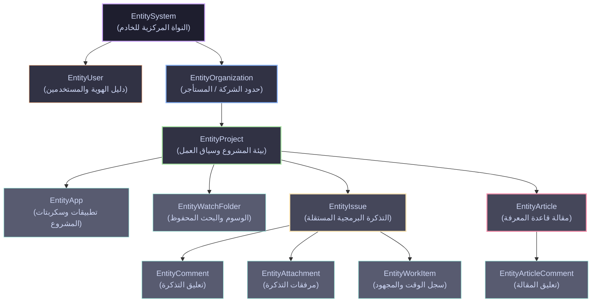

# الدليل المعماري لكيانات الموارد المدارة (EntityType Guide) في YouTrack

يقدم هذا المستند دليلاً شاملاً وتفصيلياً للموارد البرمجية المستهدفة بالحوكمة في نظام إدارة الصلاحيات لـ JetBrains YouTrack، والتي يتم تمثيلها برمجياً في الحزمة عبر النوع [`EntityType`](../../internal/services/permissions_services/permission.go#L33-L50).

---

## 1. ما هو مفهوم "كيان المورد" (`EntityType`)؟

في هندسة نظم التحكم بالوصول المبنية على السمات والأدوار (RBAC / ABAC)، ينقسم نموذج الأمان إلى ثلاثة أركان رئيسية:

1. **الفاعل (Subject):** المستخدم أو الحساب الخدمي أو الدور الذي يطلب الإجراء.
2. **الإجراء (Action / Operation):** الفعل المراد تنفيذه (قراءة، إنشاء، تعديل، حذف، مشاركة).
3. **المورد الهدف (Target Resource / Entity):** الكائن الرقمي الفعلي الذي يقع عليه الفعل وتُفرض عليه قيود الحوكمة.

يمثل النوع البرمجي `EntityType` هذا **المورد المستهدف بالحوكمة والأمان** داخل النظام.

```go
// EntityType represents the target resource being governed.
type EntityType string
```

### الفرق المعماري بين الموديول (`ModuleType`) والكيان (`EntityType`)

من الأخطاء الشائعة الخلط بين الموديول والكيان. في هذا النظام، تم الفصل بينهما بعناية:

| وجه المقارنة | الموديول الوظيفي (`ModuleType`) | كيان المورد (`EntityType`) |
| :--- | :--- | :--- |
| **الدور الأساسي** | تقسيم وظيفي/تنظيمي لقوائم الصلاحيات وكتالوج الخدمات | المورد البرمجي الفعلي (Domain Object) في قاعدة البيانات |
| **التطبيق العملي** | تصنيف الشاشات وأبواب الإعدادات في واجهة المستخدم (UI Category) | كائن التحقق الأمني ونقطة تطبيق السياسات (Policy Enforcement Point) |
| **علاقات التبعية** | مجموعات وظيفية مستقلة (مثلاً موديول التذاكر، موديول المقالات) | تسلسل هرمي للموارد (مؤسسة -> مشروع -> تذكرة -> تعليق/مرفق) |
| **الملكية الذاتية** | لا يحتوي على مفهوم الملكية الذاتية للمنشئ | مرتبط مباشرة بمفهوم الملكية والحقوق المتأصلة (`Inherent Rights`) |

---

## 2. التسلسل الهرمي للكيانات وعلاقات الاحتواء (Entity Hierarchy)

ترتبط كيانات YouTrack بعلاقات احتواء صارمة (Containment / Parent-Child Hierarchy)، حيث يرث المورد الفرعي قيود وسياق المورد الأب:



---

## 3. جدول المقارنة الشامل للكيانات الاثني عشر

يوضح الجدول التالي كافة قيم `EntityType`، نطاقاتها الأمنية، العمليات المدعومة، وعدد الصلاحيات المرتبطة بها في ملف الكتالوج [`catalog.go`](../../internal/services/permissions_services/catalog.go):

| # | الثابت البرمجي | القيمة النصية | النطاق الأمني (`ScopeLevel`) | العمليات المطبقة (`OperationType`) | عدد الصلاحيات | نموذج الملكية والحقوق المتأصلة |
| :-: | :--- | :--- | :--- | :--- | :-: | :--- |
| **1** | `EntitySystem` | `"SYSTEM"` | `ScopeGlobal` | `READ`, `ADMIN` | 2 | لا ينطبق (مستوى الإدارة العليا للنظام) |
| **2** | `EntityApp` | `"APP"` | `ScopeProject` | `READ`, `UPDATE` | 2 | عام على مستوى المشروع (مخصص للمطورين والمديرين) |
| **3** | `EntityArticle` | `"ARTICLE"` | `ScopeProject` | `CREATE`, `READ`, `UPDATE`, `DELETE` | 4 | يتبع سياسات القراءة العامة والتعديل/الحذف المقيد |
| **4** | `EntityArticleComment` | `"ARTICLE_COMMENT"` | `ScopeProject` | `CREATE`, `READ`, `UPDATE`, `DELETE` | 4 | يدعم حقوق المنشئ الذاتية لتحديث وحذف تعليقه الخاص |
| **5** | `EntityIssue` | `"ISSUE"` | `ScopeProject` | `CREATE`, `READ`, `UPDATE`, `DELETE`, `LINK`, `SPECIAL` | 12 | يدعم الحقوق المتأصلة للمُنشئ (قراءة/تحديث الحقول والربط) |
| **6** | `EntityAttachment` | `"ATTACHMENT"` | `ScopeProject` | `CREATE`, `UPDATE`, `DELETE` | 3 | يدعم حقوق المنشئ لتعديل وحذف وتقييد رؤية المرفق الخاص |
| **7** | `EntityComment` | `"COMMENT"` | `ScopeProject` | `CREATE`, `READ`, `UPDATE`, `DELETE` | 6 | تمييز صارم بين تعديل/حذف تعليق النفس وتعليقات الآخرين |
| **8** | `EntityWorkItem` | `"WORK_ITEM"` | `ScopeProject` | `CREATE`, `READ`, `UPDATE` | 5 | تمييز دقيق بين تسجيل الوقت الذاتي وتسجيل وتعديل وقت الآخرين |
| **9** | `EntityOrganization` | `"ORGANIZATION"` | `ScopeGlobal`, `ScopeOrganization` | `CREATE`, `READ`, `UPDATE`, `DELETE` | 4 | حاوية عزل مؤسسي لعدة مشاريع |
| **10** | `EntityProject` | `"PROJECT"` | `ScopeGlobal`, `ScopeProject` | `CREATE`, `READ`, `UPDATE`, `DELETE` | 5 | حاوية العمل الأساسية ومستوى تفويض الصلاحيات |
| **11** | `EntityUser` | `"USER"` | `ScopeGlobal` | `CREATE`, `READ`, `UPDATE`, `DELETE` | 6 | يدعم صلاحية تحديث الملف الشخصي الذاتي (`PermUpdateSelf`) |
| **12** | `EntityWatchFolder` | `"WATCH_FOLDER"` | `ScopeProject` | `CREATE`, `UPDATE`, `DELETE`, `SHARE` | 4 | ملكية فردية مع إمكانية المشاركة الجماعية |

---

## 4. شرح تفصيلي ومعمق لكل كيان (Deep Dive)

### 1. كيان النظام (`EntitySystem`)

* **التعريف البرمجي:** المورد الجذري الذي يمثل خادم YouTrack ككل وإعداداته التحتية.
* **الأصول المحمية:**
  * تكوينات خادم الويب، شهادات SSL، وإعدادات الاتصال بقاعدة البيانات.
  * إعدادات النسخ الاحتياطي (Backups)، سجلات النظام (Low-level logs)، والمقاييس (Metrics).
  * إعدادات المصادقة المركزية والتكاملات الجذرية (SAML, OAuth Hub, LDAP).
* **الصلاحيات المرتبطة في الكتالوج:**
  * `PermLowLevelAdminRead`: استعراض إعدادات الخادم والمقاييس دون إمكانية التعديل.
  * `PermLowLevelAdminWrite`: الصلاحية المطلقة لإدارة الخادم، النسخ الاحتياطية، وتثبيت التحديثات.
* **الأهمية الأمنية:** عزل هذا الكيان يمنع مديري المشاريع والشركات من العبث بالبنية التحتية للخادم.

---

### 2. كيان التطبيقات والامتدادات (`EntityApp`)

* **التعريف البرمجي:** يمثل البرمجيات النصية وسير العمل المؤتمت (Workflows & JS Apps) المربوطة بالمشاريع.
* **الأصول المحمية:**
  * قواعد الأتمتة (Statemachine, On-change, Scheduled rules).
  * سياسات اتفاقيات مستوى الخدمة (SLA Policies) وسكربتات التحقق البرمجية.
  * حزم الامتدادات المخصصة وإعدادات التصدير والأرشفة البرمجية.
* **الصلاحيات المرتبطة في الكتالوج:**
  * `PermReadAppContent`: قراءة الأكواد والملفات التكوينية وسجلات الأتمتة.
  * `PermUpdateAppContent`: إضافة وتعديل وحذف وتفعيل حزم الأتمتة البرمجية.
* **الأهمية الأمنية:** حماية المشروع من إدخال أكواد وسكربتات خبيثة قد تستنزف الموارد أو تعطل تدفق التذاكر.

---

### 3. كيان المقالات المعرفية (`EntityArticle`)

* **التعريف البرمجي:** يمثل المستندات وصفحات التوثيق في قاعدة المعرفة (Knowledge Base) داخل المشروع.
* **الأصول المحمية:**
  * نصوص المقالات التوثيقية، الأشجار الهرمية للصفحات (Sub-articles)، والمرفقات المضمنة داخل التوثيق.
  * إعدادات الرؤية والخصوصية للمقالات التوثيقية.
* **الصلاحيات المرتبطة في الكتالوج:**
  * `PermCreateArticle`: إنشاء مقالات جديدة تحت مظلة المشروع.
  * `PermReadArticle`: استعراض وقراءة المقالات المتاحة.
  * `PermUpdateArticle`: تعديل نصوص المقالات وإعادة ترتيب الهيكل الشجري.
  * `PermDeleteArticle`: حذف المقالات وأفرعها نهائياً.
* **الأهمية الأمنية:** تنظيم إدارة أصول المعرفة التقنية والمؤسسية مع الحفاظ على سلامة التوثيق المعتمد.

---

### 4. كيان تعليقات المقالات (`EntityArticleComment`)

* **التعريف البرمجي:** يمثل المحادثات والملاحظات المضافة أسفل صفحات قاعدة المعرفة لمناقشة محتوى التوثيق.
* **الأصول المحمية:**
  * نصوص التعليقات، الردود التراكمية، والإشارات الموجهة لمحرري التوثيق.
* **الصلاحيات المرتبطة في الكتالوج:**
  * `PermCreateArticleComment`: كتابة تعليق أو سؤال حول المقال.
  * `PermReadArticleComment`: قراءة التعليقات والردود.
  * `PermUpdateArticleComment`: تعديل محتوى التعليق.
  * `PermDeleteArticleComment`: حذف التعليق.
* **نموذج الحقوق المتأصلة:**
  * للمستخدم حق متأصل في قراءة، تعديل، وحذف تعليقه الخاص عبر `InherentReadOwnArticleComment`, `InherentUpdateOwnArticleComment`, و `InherentDeleteOwnArticleComment` دون الحاجة لصلاحيات إشرافية على باقي التعليقات.

---

### 5. كيان التذاكر (`EntityIssue`)

* **التعريف البرمجي:** المورد التشغيلي المركزي في YouTrack؛ يمثل المهمة، العيب البرمجي (Bug)، أو الميزة المطلوب تطويرها.
* **الأصول المحمية:**
  * عنوان التذكرة، وصفها، حالتها (State)، أولويتها، ومسؤولو التنفيذ (Assignees).
  * الحقول الخاصة والحساسة (Private Fields) مثل التقديرات المالية، معلومات العملاء، والبيانات الأمنية.
  * روابط العلاقات بين التذاكر (Duplicates, Depends on, Relates to).
  * قوائم المتابعين والمصوتين (Watchers & Voters).
* **الصلاحيات المرتبطة في الكتالوج (12 صلاحية):**
  * إنشاء وحذف وقراءة وتعديل التذكرة الأساسية (`PermCreateIssue`, `PermDeleteIssue`, `PermReadIssue`, `PermUpdateIssue`).
  * عزل الحقول الخاصة قراءة وتعديلاً (`PermReadIssuePrivateFields`, `PermUpdateIssuePrivateFields`).
  * إدارة العلاقات والروابط (`PermLinkIssue`).
  * الرقابة والمتابعة (`PermViewWatchers`, `PermUpdateWatchers`, `PermViewVoters`).
  * العمليات الاستثنائية (`PermApplyCommandsSilently`, `PermOverrideVisibility`).
* **نموذج الحقوق المتأصلة:**
  * يملك صاحب البلاغ/المُنشئ حق قراءة وتحديث الحقول العامة لتذكرته (`InherentReadOwnIssuePublicFields`, `InherentUpdateOwnIssuePublicFields`) وربطها بالتذاكر الأخرى (`InherentLinkOwnIssue`).

---

### 6. كيان المرفقات (`EntityAttachment`)

* **التعريف البرمجي:** الملفات، الصور، لقطات الشاشة، وملفات السجلات المرفوعة على التذاكر.
* **الأصول المحمية:**
  * المحتوى الثنائي للملفات (Binary data)، مسارات التخزين، والبيانات الوصفية للملف.
  * قيود الخصوصية والرؤية (Visibility Restrictions) المفروضة على كل ملف.
* **الصلاحيات المرتبطة في الكتالوج:**
  * `PermAddAttachment`: رفع ملف جديد وإلحاقه بالتذكرة.
  * `PermUpdateAttachment`: تعديل اسم المرفق أو خصائصه أو استبداله.
  * `PermDeleteAttachment`: حذف المرفق نهائياً من سجلات المشروع.
* **نموذج الحقوق المتأصلة:**
  * يملك رافع الملف حقوقاً متأصلة لمعالجة ملفه الخاص: `InherentModifyOwnAttachment`, `InherentDeleteOwnAttachment`, و `InherentRestrictOwnAttachment` لقفل رؤية الملف على مجموعات معينة.

---

### 7. كيان تعليقات التذاكر (`EntityComment`)

* **التعريف البرمجي:** المحادثات التفاعلية وسجلات النقاش الفني المتبادلة داخل التذكرة.
* **الأصول المحمية:**
  * نصوص التعليقات، التعديلات السابقة (History)، وإعدادات رؤية التعليق لفئات محددة.
* **الصلاحيات المرتبطة في الكتالوج (6 صلاحيات):**
  * `PermCreateIssueComment`: نشر تعليق جديد.
  * `PermReadIssueComment`: قراءة التعليقات العامة والمصرح بها.
  * `PermUpdateIssueComment`: تعديل التعليقات الشخصية.
  * `PermUpdateNotOwnIssueComment`: تعديل تعليقات الموظفين والعملاء الآخرين (إشراف ومراقبة).
  * `PermDeleteIssueComment`: حذف التعليق الشخصي.
  * `PermDeleteNotOwnAndPermanentCommentDelete`: حذف تعليقات الآخرين والحذف النهائي من السجلات.
* **نموذج الحقوق المتأصلة:**
  * يملك كاتب التعليق حق قراءة ومراجعة تعليقه عبر `InherentReadOwnIssueComment`.

---

### 8. كيان سجلات العمل وتتبع الوقت (`EntityWorkItem`)

* **التعريف البرمجي:** السجل الزمني الذي يوثق المجهود وساعات العمل المبذولة على المهام (Spent Time Tracking).
* **الأصول المحمية:**
  * المدة المستغرقة (Duration)، تاريخ التنفيذ، نوع العمل (Development, Testing, Documentation)، والوصف التشغيلي.
* **الصلاحيات المرتبطة في الكتالوج (5 صلاحيات):**
  * `PermCreateWorkItem`: تسجيل ساعات العمل الشخصية.
  * `PermCreateNotOwnWorkItem`: تسجيل ساعات عمل نيابة عن زميل أو فريق خارجي.
  * `PermReadWorkItem`: قراءة سجلات الوقت والجهد داخل التذكرة.
  * `PermUpdateWorkItem`: تعديل أو حذف سجل الوقت الشخصي.
  * `PermUpdateNotOwnWorkItem`: تعديل أو إلغاء سجلات الوقت للآخرين (مخصص لمديري المشاريع والمحاسبة).
* **نموذج الحقوق المتأصلة:**
  * للموظف حق متأصل لقراءة سجلاته الزمنية الخاصة عبر `InherentReadOwnWorkItem` لمتابعة إنجازه اليومي.

---

### 9. كيان المؤسسة (`EntityOrganization`)

* **التعريف البرمجي:** أعلى حاوية تنظيمية متعددة المستأجرين (Multi-Tenancy) تضم مجموعة مشاريع تابعة لشركة أو قطاع أعمال مستقل.
* **الأصول المحمية:**
  * بيانات الشركة/المؤسسة، شعارها، وقائمة المشاريع المرتبطة بها.
  * الحدود الأمنية الفاصلة بين الكيانات القانونية أو فروع الشركات.
* **الصلاحيات المرتبطة في الكتالوج:**
  * `PermCreateOrganization`: إنشاء مؤسسة جديدة (صلاحية عامة `ScopeGlobal`).
  * `PermReadOrganization`: استعراض بيانات المؤسسة والمشاريع المنضوية تحتها.
  * `PermUpdateOrganization`: تعديل بيانات المؤسسة وإعداداتها الإدارية.
  * `PermDeleteOrganization`: حذف المؤسسة وفك ارتباط مشاريعها.
* **الأهمية الأمنية:** ضمان عدم تسرب بيانات شركة إلى موظفي شركة أخرى في نفس الخادم.

---

### 10. كيان المشروع (`EntityProject`)

* **التعريف البرمجي:** الحاوية التشغيلية الأساسية التي تحتضن كافة التذاكر، المقالات، وسير العمل لفريق أو منتج محدد.
* **الأصول المحمية:**
  * مفتاح المشروع (Project Key)، الاسم، والوصف.
  * قوالب الحقول المخصصة (Custom Fields)، سير العمل، ولوحات أجايل (Agile Boards).
  * عضوية المستخدمين وفرق العمل والأدوار المخصصة داخل المشروع.
* **الصلاحيات المرتبطة في الكتالوج:**
  * `PermCreateProject`: إنشاء مشاريع جديدة على مستوى الخادم.
  * `PermReadProjectBasic`: قراءة البيانات الأساسية للمشروع (الاسم والمفتاح لغايات الإسناد والبحث).
  * `PermReadProjectFull`: قراءة التكوينات المعمارية وإعدادات الحقول وسير العمل الحساسة.
  * `PermUpdateProject`: تعديل إعدادات المشروع وحقوله وقواعده.
  * `PermDeleteProject`: أرشفة أو حذف المشروع بالكامل.
* **الأهمية الأمنية:** الفصل بين الرؤية السطحية (`Read Basic`) والوصول التكويني الكامل (`Read Full`) يحمي خصوصية الإعدادات الداخلية.

---

### 11. كيان المستخدم (`EntityUser`)

* **التعريف البرمجي:** يمثل الهوية الرقمية للمستخدم، سواء كان موظفاً، عميلاً، أو حساباً خدمياً.
* **الأصول المحمية:**
  * اسم الدخول (Username)، الاسم الظاهر، والصورة الرمزية (Avatar).
  * بيانات الاتصال الحساسة (البريد الإلكتروني، رقم الهاتف).
  * مفاتيح الوصول الشخصية (Permanent Tokens, API Keys, 2FA Settings).
  * سجلات الجلسات وعناوين الـ IP والمجموعات المنتمي إليها.
* **الصلاحيات المرتبطة في الكتالوج (6 صلاحيات):**
  * `PermCreateUser`: إضافة مستخدمين جدد إلى النظام.
  * `PermReadUserBasic`: قراءة الاسم والصورة (للإسناد في المهام والإشارة في المحادثات).
  * `PermReadUserDetails`: قراءة البريد الإلكتروني، المجموعات، والصلاحيات التفصيلية.
  * `PermUpdateUser`: تعديل حسابات المستخدمين الآخرين وصلاحياتهم ومجموعاتهم.
  * `PermUpdateSelf`: تمكين المستخدم من تحديث بياناته الذاتية (كلمة المرور، التنبيهات، الصورة).
  * `PermDeleteUser`: تعطيل أو حذف الحساب نهائياً.
* **الأهمية الأمنية:** التفرقة بين البيانات الأساسية (`Read Basic`) والتفصيلية (`Read Details`) تحمي خصوصية الموظفين والعملاء وتمنع استخراج بيانات الاتصال دون تفويض.

---

### 12. كيان مجلدات المتابعة والبحث (`EntityWatchFolder`)

* **التعريف البرمجي:** المورد المسؤول عن تصنيف وتنظيم تدفق العمل الشخصي والجماعي عبر الوسوم (Tags) وعمليات البحث المحفوظة (Saved Searches).
* **الأصول المحمية:**
  * نصوص استعلامات البحث الذكي (Search Queries).
  * معرّفات الوسوم وألوانها المميزة.
  * سياسات المشاركة (Share Settings) مع المستخدمين والفرق ومشاريع معينة.
* **الصلاحيات المرتبطة في الكتالوج:**
  * `PermCreateWatchFolder`: إنشاء وسم أو بحث مخصص جديد.
  * `PermUpdateWatchFolder`: تعديل شروط البحث أو خصائص الوسم.
  * `PermDeleteWatchFolder`: حذف الوسم أو البحث المحفوظ.
  * `PermShareWatchFolder`: مشاركة الوسم أو البحث مع الآخرين أو تعميمه على الفريق.
* **الأهمية الأمنية:** منع تلويث بيئة العمل بوسوم عشوائية أو تعميم استعلامات ثقيلة على مستوى المشروع دون تفويض.

---

## 5. الاستخدام البرمجي للكيانات في بنية المحرك (`permissions_services`)

يوفر كود الخدمة في الملف [`service.go`](../../internal/services/permissions_services/service.go) واجهة مرنة لاسترجاع وتصفية الصلاحيات بالاعتماد على الكيان:

```go
// GetPermissionsByEntity retrieves all permissions applicable to a specific EntityType.
func (s *Service) GetPermissionsByEntity(entity EntityType) []Permission {
    s.mu.RLock()
    defer s.mu.RUnlock()

    var result []Permission
    for _, p := range s.catalog {
        if p.Entity == entity {
            result = append(result, p)
        }
    }
    return result
}
```

### حالات الاستخدام التشغيلية (Use Cases)

1. **بناء شاشات إدارة الصلاحيات في واجهات المستخدم (UI Grouping):**
   * تجميع الصلاحيات حسب الكيان المستهدف يسهل على مديري النظام فهم نطاق كل صلاحية بدقة دون تشتيت.
2. **نقاط فرض السياسات الأمنية (Policy Enforcement Points - PEP):**
   * عند محاولة المستخدم تنفيذ عملية على تذكرة أو مرفق، يستعلم محرك السياسات عن الكيان المحدد (`EntityIssue` أو `EntityAttachment`) لتقييم الشروط الخاصة به وحقوق الملكية المتأصلة (`Inherent Rights`).
3. **التدقيق الأمني وحساب مصفوفات الوصول (Access Matrix Auditing):**
   * التحقق من جميع المسارات المؤدية للتأثير على كيان حساس مثل `EntityUser` أو `EntitySystem`.

---

## 6. مصفوفة أفضل الممارسات الأمنية لتوزيع الصلاحيات حسب الكيان

| الكيان المستهدف | الأدوار النموذجية الممنوحة | الممارسات والتوصيات الأمنية |
| :--- | :--- | :--- |
| `EntitySystem` | System Administrator فقط | قفل الوصول لمديري النظام ومنع منحه لمديري المشاريع أو الشركات |
| `EntityOrganization` | Organization Admin | تقييد صلاحيات الحذف والتعديل لقيادات القطاعات المؤسسية |
| `EntityProject` | Project Managers | حصر `ReadProjectFull` و `UpdateProject` بقادة المشاريع المعتمدين |
| `EntityApp` | Workflow Developers / Admins | عزل صلاحية `UpdateAppContent` لمنع تنفيذ نصوص أتمتة غير مفحوصة |
| `EntityIssue` | Developers, Reporters, QA | تمكين التفاعل العام مع قفل `PrivateFields` و `OverrideVisibility` |
| `EntityComment` | جميع أعضاء المشروع | منح صلاحية تعديل وحذف التعليق الذاتي، وقصر التعديل الشامل على المشرفين |
| `EntityAttachment` | Developers, QA | تمكين رفع المرفقات مع منح المستخدم حق تقييد رؤية مرفقاته الحساسة |
| `EntityWorkItem` | Developers, PMs, Accountants | حصر تسجيل الوقت للآخرين (`CreateNotOwnWorkItem`) بمديري الفرق فقط |
| `EntityArticle` | Technical Writers, Team Leads | منح القراءة للجميع وحصر الإنشاء والتعديل بالمحررين المعتمدين |
| `EntityUser` | HR, IT Support, System Admins | قصر قراءة التفاصيل الدقيقة وحذف المستخدمين على الدعم الفني والإدارة |
| `EntityWatchFolder` | جميع أعضاء الفريق | السماح بالإنشاء والاستخدام الفردي، وتقييد `Share` لتفادي الإزعاج الجماعي |

---

> تم إعداد هذا المرجع التوثيقي ليكون سجلاً معمارياً وهندسياً مكتملاً يوضح كافة تفاصيل الكيانات المدارة في الحزمة البرمجية [`permissions_services`](../../internal/services/permissions_services).
