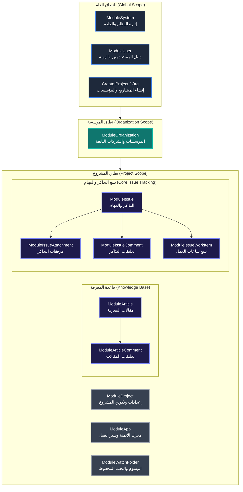

# دليل النطاقات الوظيفية وموديولات الصلاحيات في يوتراك (YouTrack Module Types Guide)

**الملف المصدري البرمجي:** [`internal/services/permissions_services/permission.go`](../../internal/services/permissions_services/permission.go)  
**سجل الصلاحيات:** [`internal/services/permissions_services/catalog.go`](../../internal/services/permissions_services/catalog.go)  
**الإصدار المعتمد:** YouTrack Server 2026.1 / 2026.2  

---

## 1. ما هو الموديول الوظيفي (`ModuleType`) في YouTrack؟

في نظام YouTrack والهندسة المعمارية لنظام الصلاحيات، يمثل نوع الموديول (`ModuleType`) **المجال الوظيفي والحدود الهيكلية (Functional Domain)** التي تُصنف الصلاحيات والموارد والكيانات تحت مظلتها.

```go
// ModuleType represents the functional domain in YouTrack.
type ModuleType string

const (
 ModuleSystem          ModuleType = "SYSTEM"
 ModuleApp             ModuleType = "APP"
 ModuleArticle         ModuleType = "ARTICLE"
 ModuleArticleComment  ModuleType = "ARTICLE_COMMENT"
 ModuleIssue           ModuleType = "ISSUE"
 ModuleIssueAttachment ModuleType = "ISSUE_ATTACHMENT"
 ModuleIssueComment    ModuleType = "ISSUE_COMMENT"
 ModuleIssueWorkItem   ModuleType = "ISSUE_WORK_ITEM"
 ModuleOrganization    ModuleType = "ORGANIZATION"
 ModuleProject         ModuleType = "PROJECT"
 ModuleUser            ModuleType = "USER"
 ModuleWatchFolder     ModuleType = "WATCH_FOLDER"
)
```

### الأهمية المعمارية لهذا التصنيف

1. **الفصل الدقيق للمسؤوليات (Domain Separation):** بدلاً من التعامل مع عشرات الصلاحيات كقائمة مسطحة ومبهمة، يتم ربط كل صلاحية بمجال وظيفي محدد يمثل جزءاً مستقلاً من دورة حياة العمل داخل النظام.
2. **عزل الموارد الفرعية المتفرعة (Sub-resource Isolation):** تمايز الموديولات الفرعية الخاصة بالتذاكر (مثل المرفقات والتعليقات وتتبع الوقت) يسمح بمنح صلاحيات دقيقة جداً (Granular Permissions)؛ مثلاً: تمكين عضو من إضافة مرفقات أو تعليقات دون السماح له بتعديل بيانات التذكرة نفسها أو حذفها.
3. **تحديد سياق النطاق (Scope Context):** كل موديول يرتبط بطبيعته بنطاق محدد (`ScopeGlobal`, `ScopeOrganization`, `ScopeProject`) يحدد أين تكون عملياته نافذة.
4. **تسهيل واجهة مصفوفة الصلاحيات (Role-Permission Matrix UI):** تجميع الصلاحيات في موديولات يمنح مسؤولي النظام واجهة منظمة وواضحة عند إعداد وتخصيص الأدوار (Roles).

---

## 2. جدول الموديولات الوظيفية الـ 12 الشامل

يوضح الجدول التالي توزيع الموديولات الوظيفية مع **التركيز الأساسي على حقل الوظيفة والمسؤولية التشغيلية** ومساحته الاستيعابية، مع دمج وضغط الحقول الفنية الجانبية لتوفير أقصى قدر من الوضوح المعماري:

| # | الموديول البرمجي والوظيفي | النطاق والكيان | العمليات والصلاحيات | الوظيفة والمسؤولية التشغيلية (التركيز الأساسي) |
| :-: | :--- | :-: | :-: | ---: |
| **1** | `ModuleSystem`<br>`"SYSTEM"`<br>*(إدارة النظام والخادم)* | `GLOBAL`<br>`EntitySystem` | `READ`<br>`ADMIN`<br>*(2 صلاحيات)* | <div dir="rtl">• **استقرار البنية التحتية:** التحكم الكامل في خادم YouTrack وإعدادات المنصة منخفضة المستوى والبيئة التشغيلية.<br>• **إدارة البيانات والحماية:** جدولة النسخ الاحتياطي التلقائي لقاعدة البيانات (Backups)، استعادة البيانات، وإدارة شهادات الأمان وSSL.<br>• **التكاملات والمقاييس:** ربط خوادم البريد (SMTP/IMAP)، فحص مؤشرات الأداء الحيوية (JVM & DB Metrics)، وسجلات التدقيق.<br>• **مستوى الحرج:** أقصى درجات الخطورة؛ أي خطأ تشغيلي هنا يسبب توقفاً كلياً للنظام، لذا يُحصر حصراً بمديري السيرفر (Global Admins).</div> |
| **2** | `ModuleApp`<br>`"APP"`<br>*(سير العمل والتشغيل الآلي)* | `PROJECT`<br>`EntityApp` | `READ`<br>`UPDATE`<br>*(2 صلاحيات)* | <div dir="rtl">• **هندسة محرك الأتمتة:** إدارة وتطوير سكريبتات الأتمتة (Workflows) وقواعد العمل البرمجية بلغة JavaScript داخل المشاريع.<br>• **تطبيق سياسات الخدمة (SLA):** برمجة ومراقبة اتفاقيات مستوى الخدمة والتصعيد التلقائي للمشاكل الحرجة وحساب أوقات الاستجابة.<br>• **الإجراءات المجدولة والمشروطة:** تفعيل قواعد التحقق التلقائي (Sanity Checks)، الردود الآلية، ومعالجة الأحداث عند التغيير (On-change).<br>• **المسؤولية التشغيلية:** فحص سجلات الأخطاء البرمجية (Workflow Logs) وتصدير الحزم التكوينية دون المساس ببيئة السيرفر العامة.</div> |
| **3** | `ModuleArticle`<br>`"ARTICLE"`<br>*(قاعدة المعرفة والتوثيق)* | `PROJECT`<br>`EntityArticle` | `CREATE`, `READ`<br>`UPDATE`, `DELETE`<br>*(4 صلاحيات)* | <div dir="rtl">• **هندسة التوثيق المؤسسي:** بناء وإدارة شجرة المعرفة (Knowledge Base) ومستندات المشاريع وأدلة السياسات والتعليمات الفنية.<br>• **نقل التراكم المعرفي:** تمكين الفرق من حفظ التوثيق الهندسي، وثائق متطلبات المنتجات (PRDs)، والأسئلة الشائعة.<br>• **التحكم بالهيكل والخصوصية:** تنظيم تفريعات الصفحات، ضبط الترتيب الشجري، وتحديد المقالات العامة مقابل المقالات المحمية للفرق.<br>• **المسؤولية التشغيلية:** ضمان استمرارية وتحديث الوثائق الرسمية للمشروع، ومتابعة سجل التعديلات التاريخي لكل مقال.</div> |
| **4** | `ModuleArticleComment`<br>`"ARTICLE_COMMENT"`<br>*(تعليقات مقالات المعرفة)* | `PROJECT`<br>`EntityArticleComment` | `CREATE`, `READ`<br>`UPDATE`, `DELETE`<br>*(4 صلاحيات)* | <div dir="rtl">• **المراجعة التعاونية:** توفير قناة تفاعلية لإبداء الملاحظات والنقاش الفني حول محتوى المقالات والسياسات الموثقة قبل اعتمادها.<br>• **عزل صلاحيات النشر:** السماح للموظفين والعملاء بتقديم تعليقات واستفسارات دون منحهم حق تعديل أصل الوثيقة الفنية لمنع تشويهها.<br>• **الحقوق الذاتية:** تمكين كاتب التعليق من تعديل أو حذف تعليقه الذاتي فوراً لتصحيح ملاحظاته ومواكبة النقاش بحرية.<br>• **المسؤولية التشغيلية:** تنشيط الحوار البنّاء حول التوثيق الفني، ومتابعة ردود أصحاب الوثائق على استفسارات الفرق المعنية.</div> |
| **5** | `ModuleIssue`<br>`"ISSUE"`<br>*(إدارة المهام والتذاكر)* | `PROJECT`<br>`EntityIssue` | `CREATE`, `READ`, `UPDATE`<br>`DELETE`, `LINK`, `SPECIAL`<br>*(12 صلاحية)* | <div dir="rtl">• **المحرك التشغيلي اليومي:** إدارة دورة حياة التذاكر بجميع أنواعها (Bugs, Features, Tasks, User Stories) من الإنشاء حتى الإغلاق.<br>• **ضبط الحقول والبيانات الحساسة:** حوكمة الحقول العامة وتأمين الحقول الخاصة (مثل التكاليف المالية، والتقديرات السرية للمطورين).<br>• **شبكة العلاقات التبادلية:** ربط التذاكر ببعضها (الاعتماديات، التكرار، والمهام الفرعية) للحفاظ على مسار العمل الرشيق (Agile).<br>• **التحكم بالتفاعل والإشعارات:** إدارة المراقبين (Watchers) والمصوتين، وتنفيذ الأوامر البرمجية بصمت لتفادي إزعاج الفرق بالإشعارات.</div> |
| **6** | `ModuleIssueAttachment`<br>`"ISSUE_ATTACHMENT"`<br>*(مرفقات التذاكر والملفات)* | `PROJECT`<br>`EntityAttachment` | `CREATE`<br>`UPDATE`, `DELETE`<br>*(3 صلاحيات)* | <div dir="rtl">• **المستودع الرقمي للوسائط:** إدارة وتأمين الملفات، لقطات الشاشة، تسجيلات الشاشة، وسجلات الأعطال (Logs) المرفقة بالمهام.<br>• **حوكمة التخزين السحابي والمحلي:** التحكم في السعات التخزينية ومنع إغراق السيرفر بالملفات غير المصرح بها أو الفيروسات.<br>• **السرية وتقييد الظهور:** فرض قيود رؤية صارمة على المرفقات الحساسة (مثل شهادات الأمان أو بيانات الدفع) لقصرها على مجموعات محددة.<br>• **المسؤولية التشغيلية:** فصل إذن رفع الملفات عن حق تعديل التذاكر لحماية نزاهة المرفقات ومنع التلاعب بملفات الآخرين.</div> |
| **7** | `ModuleIssueComment`<br>`"ISSUE_COMMENT"`<br>*(تعليقات ومحادثات التذاكر)* | `PROJECT`<br>`EntityComment` | `CREATE`, `READ`<br>`UPDATE`, `DELETE`<br>*(6 صلاحيات)* | <div dir="rtl">• **التواصل الميداني الفوري:** تسيير النقاشات التشغيلية المباشرة بين المطورين، مديري المشاريع، ومختبري الجودة والعملاء.<br>• **توثيق مسار الحل:** تسجيل خطوات استكشاف الأخطاء، القرارات المعمارية، ونتائج الاختبارات داخل سجل التذكرة الدائم.<br>• **التوجيه عبر الإشارات:** استدعاء أعضاء الفرق بالاسم (@mentions) وتوجيه المهام والاستفسارات بدقة داخل المحادثة.<br>• **الإشراف الإداري (Moderation):** عزل حق النقاش الذاتي عن حق مديري المشاريع في تعديل أو حذف تعليقات الآخرين المسيئة أو الحساسة.</div> |
| **8** | `ModuleIssueWorkItem`<br>`"ISSUE_WORK_ITEM"`<br>*(تتبع الوقت وسجلات العمل)* | `PROJECT`<br>`EntityWorkItem` | `CREATE`<br>`READ`, `UPDATE`<br>*(5 صلاحيات)* | <div dir="rtl">• **إدارة الجهد والإنتاجية:** تسجيل الوقت الفعلي المبذول (Spent Time) على التذاكر ومقارنته بالتقديرات المبدئية (Estimations).<br>• **الارتباط المالي والتعاقدي:** توليد البيانات المرجعية الدقيقة لتقارير الفوترة للعملاء، وتحديد تكلفة المشاريع، وتقييم أداء الفرق.<br>• **حماية النزاهة التشغيلية:** تمكين الموظف من تسجيل وقته الذاتي، مع حصر تسجيل وتعديل أوقات الآخرين بقادة الفرق والمديرين.<br>• **المسؤولية التشغيلية:** منع التلاعب في السجلات الزمنية وضمان التزام الفرق بمتطلبات تسجيل ساعات العمل الميدانية.</div> |
| **9** | `ModuleOrganization`<br>`"ORGANIZATION"`<br>*(الهيكل المؤسسي للشركات)* | `GLOBAL`<br>`ORGANIZATION`<br>`EntityOrganization` | `CREATE`, `READ`<br>`UPDATE`, `DELETE`<br>*(4 صلاحيات)* | <div dir="rtl">• **إدارة التعددية التنظيمية (Multi-Tenancy):** هيكلة المؤسسات والشركات الفرعية وأقسام الأعمال المستقلة داخل خادم واحد.<br>• **تجميع وعزل المشاريع:** ضم المشاريع التابعة لكل شركة تحت مظلة موحدة مع تفويض الصلاحيات الإدارية لمديري المؤسسة.<br>• **منع تسرب البيانات:** فرض حدود عزل أمنية صارمة تمنع رؤية مشاريع وتذاكر شركة من قِبل موظفي شركة أو مؤسسة أخرى.<br>• **المسؤولية التشغيلية:** تسهيل الحوكمة المركزية للمؤسسات القابضة مع منح استقلالية تامة للإدارات التابعة لها.</div> |
| **10** | `ModuleProject`<br>`"PROJECT"`<br>*(إدارة وتكوين المشاريع)* | `GLOBAL`<br>`PROJECT`<br>`EntityProject` | `CREATE`, `READ`<br>`UPDATE`, `DELETE`<br>*(5 صلاحيات)* | <div dir="rtl">• **هيكلة بيئة العمل:** إنشاء المشاريع، ضبط المعرفات (Project Keys)، واختيار منهجيات العمل (Scrum, Kanban).<br>• **حوكمة الفرق والأدوار:** إدارة عضوية المشاريع، توزيع الأدوار والصلاحيات، وتعيين قادة الفرق ومديري المشاريع.<br>• **تخصيص قواعد المشروع:** تحديد الحقول الإلزامية والاختيارية، مراحل سير التذاكر (States)، واللوحات المرتبطة بالمشروع.<br>• **طبقات الرؤية (Basic vs Full):** التمييز بين ظهور اسم المشروع في القوائم والبحث، وبين الوصول الكامل لإعداداته الحساسة.</div> |
| **11** | `ModuleUser`<br>`"USER"`<br>*(دليل المستخدمين والهوية)* | `GLOBAL`<br>`EntityUser` | `CREATE`, `READ`<br>`UPDATE`, `DELETE`<br>*(6 صلاحيات)* | <div dir="rtl">• **دورة حياة الهوية الرقمية:** إنشاء حسابات الموظفين والعملاء، تفعيل وتعطيل الحسابات، وإدارة مجموعات العمل المركزية.<br>• **حماية البيانات الحساسة:** تأمين عناوين البريد الإلكتروني، سجلات تسجيل الدخول، الجلسات النشطة، وإعدادات المصادقة (2FA).<br>• **التمثيل الميداني في المهام:** توفير بيانات الهوية الأساسية (الاسم والصورة) ليتمكن الفريق من إسناد المهام واختيار المسؤولين.<br>• **السيادة على الملف الشخصي:** تمكين المستخدمين من تحديث بياناتهم الذاتية (كلمة المرور، الصورة، الإشعارات) بأمان.</div> |
| **12** | `ModuleWatchFolder`<br>`"WATCH_FOLDER"`<br>*(الوسوم والبحث المحفوظ)* | `PROJECT`<br>`EntityWatchFolder` | `CREATE`, `UPDATE`<br>`DELETE`, `SHARE`<br>*(4 صلاحيات)* | <div dir="rtl">• **أدوات الإنتاجية والتنظيم:** إنشاء وإدارة الوسوم الذكية (Tags)، استعلامات البحث المخصص المعقدة، ومجلدات المتابعة.<br>• **التعاون ومشاركة الرؤية:** مشاركة لوحات البحث والوسوم مع الفرق وأعضاء المشروع لتوحيد طوابير العمل ومتابعة الحالات الحرجة.<br>• **المراقبة والتنبيهات الميدانية:** تتبع التذاكر ذات الأولوية وتوليد تنبيهات مخصصة للمطورين عند تغير معايير البحث الذكي.<br>• **المسؤولية التشغيلية:** تمكين الفرق من بناء بيئة عمل مخصصة دون الحاجة لمنحهم صلاحيات إدارية على هيكل المشروع.</div> |

---

## 3. شرح تفصيلي ومعمق لكل موديول

### 1. موديول النظام (`ModuleSystem`)

- **القيمة الثابتة:** `ModuleSystem = "SYSTEM"`
- **النطاق:** `ScopeGlobal` (عام على مستوى خادم YouTrack بالكامل).
- **الهدف الوظيفي:**
  يتحكم هذا الموديول في العمليات الحساسة وإعدادات البنية التحتية منخفضة المستوى (Low-Level Administration). يمس هذا الموديول استقرار وأمن الخادم مباشرة ولا يمكن تقييده بمشروع أو مؤسسة محددة.
- **الصلاحيات التابعة له:**
  - `PermLowLevelAdminRead` (`ADMIN_READ_APP`): استعراض إعدادات النظام، قياسات الأداء (Metrics)، سجلات التدقيق والتكاملات وقوائم المجموعات.
  - `PermLowLevelAdminWrite` (`ADMIN_UPDATE_APP`): إدارة خيارات النسخ الاحتياطي لقاعدة البيانات، تكوينات البريد، والشهادات وتكاملات Hub المركزية.
- **ملاحظة أمنية:** لا يُمنح هذا الموديول إلا لمديري النظام (System Administrators) لأن صلاحية الكتابة فيه تتيح الوصول والتعديل على مستوى بيئة التشغيل.

---

### 2. موديول التطبيقات وسير العمل (`ModuleApp`)

- **القيمة الثابتة:** `ModuleApp = "APP"`
- **النطاق:** `ScopeProject` (مستوى المشروع).
- **الهدف الوظيفي:**
  يختص هذا الموديول بإدارة الأتمتة البرمجية (Workflows) وقواعد العمل وقواعد اتفاقية مستوى الخدمة (SLA Policies) المكتوبة بلغة JavaScript داخل المشاريع.
- **الصلاحيات التابعة له:**
  - `PermReadAppContent` (`READ_APP_CONTENT`): قراءة نصوص وسكربتات سير العمل والاطلاع على التكوينات وسجلات تشغيل الـ Workflows.
  - `PermUpdateAppContent` (`UPDATE_APP_CONTENT`): إنشاء، استيراد، وتعديل وحذف سكربتات الأتمتة وقواعد الـ SLA وربطها بالمشاريع.
- **أهميته في YouTrack:** يتيح للمطورين ومديري العمليات بناء سيناريوهات عمل مخصصة (Custom Actions، On-Change Rules، Scheduled Rules) لكل مشروع بشكل مستقل وآمن.

---

### 3. موديول المقالات وقاعدة المعرفة (`ModuleArticle`)

- **القيمة الثابتة:** `ModuleArticle = "ARTICLE"`
- **النطاق:** `ScopeProject` (مستوى المشروع).
- **الهدف الوظيفي:**
  يمثل نظام إدارة المعرفة (Knowledge Base) في YouTrack؛ حيث يتيح للفرق كتابة التوثيق الفني، سياسات المنتجات، ومشاركتها داخلياً أو خارجياً ضمن هيكل شجري متسلسل.
- **الصلاحيات التابعة له:**
  - `PermCreateArticle` (`CREATE_ARTICLE`): إنشاء مقالات ومستندات جديدة في شجرة المعرفة التابعة للمشروع.
  - `PermReadArticle` (`READ_ARTICLE`): قراءة مقالات قاعدة المعرفة العامة وغير المقيدة.
  - `PermUpdateArticle` (`UPDATE_ARTICLE`): تعديل محتوى المقالات وهيكلها وتغيير ترتيبها في الشجرة.
  - `PermDeleteArticle` (`DELETE_ARTICLE`): حذف المقالات من قاعدة المعرفة.

---

### 4. موديول تعليقات المقالات (`ModuleArticleComment`)

- **القيمة الثابتة:** `ModuleArticleComment = "ARTICLE_COMMENT"`
- **النطاق:** `ScopeProject` (مستوى المشروع).
- **الهدف الوظيفي:**
  المناقشات والتعليقات التفاعلية الموجهة حصراً لمقالات قاعدة المعرفة. تم فصله عن `ModuleArticle` لتوفير أمان وصلاحيات مستقلة بين مَن يكتب ويوثق المقال ومَن يناقشه أو يقدم ملاحظات عليه.
- **الصلاحيات التابعة له:**
  - `PermCreateArticleComment` (`CREATE_ARTICLE_COMMENT`): إضافة تعليقات وملاحظات على المقالات.
  - `PermReadArticleComment` (`READ_ARTICLE_COMMENT`): قراءة التعليقات الموجودة على المقالات.
  - `PermUpdateArticleComment` (`UPDATE_ARTICLE_COMMENT`): تعديل التعليقات المنشورة.
  - `PermDeleteArticleComment` (`DELETE_ARTICLE_COMMENT`): إزالة التعليقات من المقالات.
- **الحقوق المتأصلة (Inherent Rights):**
  - كاتب التعليق يمتلك تلقائياً حق تعديل وحذف تعليقه الذاتي دون الحاجة لمنحه صلاحية إدارة تعليقات الآخرين (`InherentUpdateOwnArticleComment`, `InherentDeleteOwnArticleComment`).

---

### 5. موديول التذاكر الرئيسي (`ModuleIssue`)

- **القيمة الثابتة:** `ModuleIssue = "ISSUE"`
- **النطاق:** `ScopeProject` (مستوى المشروع).
- **الهدف الوظيفي:**
  المحرك الأساسي والقلب النابض لنظام YouTrack؛ حيث يعالج تتبع المهام، الأخطاء البرمجية (Bugs)، طلبات الميزات (Features)، وتغيير الحالات والحقول المخصصة.
- **الصلاحيات التابعة له:**
  - `PermCreateIssue` (`CREATE_ISSUE`): فتح بلاغات وتذاكر جديدة في المشروع.
  - `PermReadIssue` (`READ_ISSUE`): استعراض التذاكر والحقول العامة.
  - `PermUpdateIssue` (`UPDATE_ISSUE`): تحديث بيانات وحالات التذكرة والحقول العامة.
  - `PermDeleteIssue` (`DELETE_ISSUE`): الحذف النهائي للتذاكر من المشروع.
  - `PermLinkIssue` (`LINK_ISSUE`): ربط التذاكر ببعضها (Relates to, Depends on, Subtask of).
  - `PermReadIssuePrivateFields` (`PRIVATE_READ_ISSUE`) & `PermUpdateIssuePrivateFields` (`PRIVATE_UPDATE_ISSUE`): التحكم بالحقول الحساسة أو المقيدة أمنياً (مثل تقديرات التكلفة، الحقول الداخلية للمطورين).
  - `PermApplyCommandsSilently` (`APPLY_COMMANDS_SILENTLY`): تنفيذ الأوامر دون إرسال إشعارات بريدية مزعجة للمتابعين.
  - `PermOverrideVisibility` (`READ_HIDDEN_STUFF`): تجاوز قيود الرؤية وقراءة العناصر المحجوبة.
  - `PermUpdateWatchers`, `PermViewWatchers`, `PermViewVoters`: إدارة ومتابعة قائمة المصوتين والمراقبين للتذكرة.
- **الحقوق المتأصلة (Inherent Rights):**
  - يحصل منشئ التذكرة (Reporter) تلقائياً على حق استعراض وتحديث الحقول العامة لتذكرته، وإضافة روابط لها، دون اشتراط صلاحيات تحديث كامل المشروع.

---

### 6. موديول مرفقات التذاكر (`ModuleIssueAttachment`)

- **القيمة الثابتة:** `ModuleIssueAttachment = "ISSUE_ATTACHMENT"`
- **النطاق:** `ScopeProject` (مستوى المشروع).
- **الهدف الوظيفي:**
  إدارة الملفات الرقمية، الصور، المستندات، وسجلات الأخطاء (Log Files) المرفقة بالتذاكر، مع ضبط دقيق لسياسات الخصوصية الخاصة بها.
- **الصلاحيات التابعة له:**
  - `PermAddAttachment` (`CREATE_ATTACHMENT_ISSUE`): إرفاق ملفات وصور داخل التذكرة.
  - `PermUpdateAttachment` (`UPDATE_ATTACHMENT_ISSUE`): تعديل أسماء المرفقات أو تغيير مستوى ظهورها.
  - `PermDeleteAttachment` (`DELETE_ATTACHMENT_ISSUE`): حذف مرفقات التذاكر.
- **الحقوق المتأصلة (Inherent Rights):**
  - من يرفع المرفق يملك تلقائياً حق حذفه أو تقييد ظهوره بمجموعات معينة (`InherentRestrictOwnAttachment`, `InherentDeleteOwnAttachment`).
- **سبب الفصل كـ موديول مستقل:** الحماية من رفع ملفات ضارة أو تسريب مستندات حساسة عبر فصل إذن إرفاق الملفات عن إذن كتابة التعليقات أو تعديل التذاكر.

---

### 7. موديول تعليقات التذاكر (`ModuleIssueComment`)

- **القيمة الثابتة:** `ModuleIssueComment = "ISSUE_COMMENT"`
- **النطاق:** `ScopeProject` (مستوى المشروع).
- **الهدف الوظيفي:**
  إدارة المحادثات، التفاعل اليومي بين المطورين والعملاء، الاستفسارات، وتحديثات التقدم داخل التذاكر.
- **الصلاحيات التابعة له:**
  - `PermCreateIssueComment` (`CREATE_COMMENT`): إضافة تعليق في التذكرة.
  - `PermReadIssueComment` (`READ_COMMENT`): قراءة التعليقات.
  - `PermUpdateIssueComment` (`UPDATE_COMMENT`): تعديل التعليقات الشخصية.
  - `PermUpdateNotOwnIssueComment` (`UPDATE_NOT_OWN_COMMENT`): تعديل تعليقات المستخدمين الآخرين (صلاحية الإشراف).
  - `PermDeleteIssueComment` (`DELETE_COMMENT`): حذف التعليقات الشخصية.
  - `PermDeleteNotOwnAndPermanentCommentDelete` (`DELETE_NOT_OWN_COMMENT`): حذف تعليقات المستخدمين الآخرين وحذفها نهائياً من السجل.
- **الحقوق المتأصلة (Inherent Rights):**
  - المستخدم قادر دائماً على قراءة تعليقاته الذاتية وتعديلها وفق سياق المشاركة.

---

### 8. موديول بنود العمل والوقت (`ModuleIssueWorkItem`)

- **القيمة الثابتة:** `ModuleIssueWorkItem = "ISSUE_WORK_ITEM"`
- **النطاق:** `ScopeProject` (مستوى المشروع).
- **الهدف الوظيفي:**
  نظام تتبع الوقت والجهد الزمني (Time Tracking & Work Logs) المبذول على التذاكر والمهام.
- **الصلاحيات التابعة له:**
  - `PermCreateWorkItem` (`CREATE_WORK_ITEM`): تسجيل وقت عمل شخصي (Spent Time) على التذكرة.
  - `PermReadWorkItem` (`READ_WORK_ITEM`): قراءة سجلات الوقت والجهد المبذول في التذكرة.
  - `PermUpdateWorkItem` (`UPDATE_WORK_ITEM`): تعديل سجل الوقت الذاتي للمستخدم.
  - `PermCreateNotOwnWorkItem` (`CREATE_NOT_OWN_WORK_ITEM`): تسجيل ساعات عمل نيابة عن زملاء آخرين.
  - `PermUpdateNotOwnWorkItem` (`UPDATE_NOT_OWN_WORK_ITEM`): تعديل أو حذف ساعات العمل المسجلة باسم أشخاص آخرين.
- **الأهمية الإدارية والمالية:** يُعتمد عليه في استخراج تقرير الفوترة، حساب تكاليف المشاريع، واحتساب رواتب وساعات المهام.

---

### 9. موديول المؤسسة (`ModuleOrganization`)

- **القيمة الثابتة:** `ModuleOrganization = "ORGANIZATION"`
- **النطاق:** يجمع بين `ScopeGlobal` (للإنشاء والحذف) و `ScopeOrganization` (للتعديل والقراءة).
- **الهدف الوظيفي:**
  إدارة الهياكل التنظيمية الكبرى والشركات التابعة في بيئات العمل الضخمة ومتعددة المستأجرين (Multi-tenancy / Multi-company).
- **الصلاحيات التابعة له:**
  - `PermCreateOrganization` (`CREATE_ORGANIZATION`): إنشاء مؤسسة جديدة في السيرفر (Global).
  - `PermReadOrganization` (`READ_ORGANIZATION`): استعراض بيانات المؤسسة والمشاريع التابعة لها.
  - `PermUpdateOrganization` (`UPDATE_ORGANIZATION`): تعديل إعدادات المؤسسة ونقل المشاريع تحت مظلتها.
  - `PermDeleteOrganization` (`DELETE_ORGANIZATION`): حذف المؤسسة وحل ارتباط مشاريعها.
- **مفهوم العزل المؤسسي:** تجميع المشاريع داخل مؤسسة يتيح منح "مدير مؤسسة" صلاحية التحكم بجميع مشاريع شركته دون أن يرى مشاريع الشركات أو المؤسسات الأخرى على نفس السيرفر.

---

### 10. موديول المشروع (`ModuleProject`)

- **القيمة الثابتة:** `ModuleProject = "PROJECT"`
- **النطاق:** يجمع بين `ScopeGlobal` (للإنشاء) و `ScopeProject` (للإدارة الداخلية والتعديل والقراءة).
- **الهدف الوظيفي:**
  إدارة الحاويات الهيكلية للمشاريع وإعداداتها العامة، مثل رمز المشروع (Project Key)، الفرق، الحقول الافتراضية، ولوحات الأجايل المرتبطة.
- **الصلاحيات التابعة له:**
  - `PermCreateProject` (`CREATE_PROJECT`): صلاحية عامة لإنشاء مشروع جديد في النظام.
  - `PermReadProjectBasic` (`READ_PROJECT_BASIC`): قراءة المعلومات الأساسية للمشروع (الاسم، المعرّف، الشعار) لتمكين ظهوره في القوائم المنسدلة.
  - `PermReadProjectFull` (`READ_PROJECT`): قراءة تفاصيل المشروع الشاملة وإعداداته الداخلية.
  - `PermUpdateProject` (`UPDATE_PROJECT`): تعديل إعدادات المشروع، تعيين المديرين، وتغيير الحقول التكوينية.
  - `PermDeleteProject` (`DELETE_PROJECT`): أرشفة أو حذف المشروع نهائياً.

---

### 11. موديول المستخدمين وإدارة الهوية (`ModuleUser`)

- **القيمة الثابتة:** `ModuleUser = "USER"`
- **النطاق:** `ScopeGlobal` (عام على مستوى النظام).
- **الهدف الوظيفي:**
  إدارة دورة حياة الحسابات ودليل الهوية (Directory & Identity Management)، المجموعات، ومصادقة المستخدمين.
- **الصلاحيات التابعة له:**
  - `PermCreateUser` (`CREATE_USER`): دعوة وإنشاء مستخدمين جدد في السيرفر.
  - `PermReadUserBasic` (`READ_USER_BASIC`): استعراض الأسماء والصور الشخصية للمستخدمين لاختيارهم في حقول التذاكر (Assignee / Submitter).
  - `PermReadUserDetails` (`READ_USER`): قراءة البيانات الحساسة (البريد الإلكتروني، تفاصيل الحساب، الجلسات النشطة).
  - `PermUpdateUser` (`UPDATE_USER`): تعديل صلاحيات وحسابات المستخدمين وحظرهم أو تفعيلهم.
  - `PermDeleteUser` (`DELETE_USER`): حذف المستخدمين ومسح بياناتهم.
  - `PermUpdateSelf` (`UPDATE_PROFILE`): تمكين المستخدم من تحديث بياناته الشخصية (كلمة المرور، الإشعارات، الصورة) بنفسه.

---

### 12. موديول مجلدات المتابعة والوسوم (`ModuleWatchFolder`)

- **القيمة الثابتة:** `ModuleWatchFolder = "WATCH_FOLDER"`
- **النطاق:** `ScopeProject` (مع خيارات مشاركة شخصية وعامة).
- **الهدف الوظيفي:**
  التحكم في الوسوم الذكية (Tags)، عمليات البحث المحفوظة (Saved Searches)، التقارير، ولوحات المراقبة المخصصة التي يُنشئها المستخدمون لمتابعة التذاكر وتصنيفها.
- **الصلاحيات التابعة له:**
  - `PermCreateWatchFolder` (`CREATE_WATCH_FOLDER`): إنشاء وسوم أو عمليات بحث محفوظة جديدة.
  - `PermUpdateWatchFolder` (`UPDATE_WATCH_FOLDER`): تعديل معايير البحث، اللون، والتصنيف للوسوم ومجلدات المتابعة.
  - `PermDeleteWatchFolder` (`DELETE_WATCH_FOLDER`): حذف الوسوم وعمليات البحث المحفوظة.
  - `PermShareWatchFolder` (`SHARE_WATCH_FOLDER`): مشاركة الوسوم وعمليات البحث المحفوظة مع الفرق أو مجموعات المستخدمين أو جعلها عامة.
- **أهميته في تجربة المستخدم:** يوفر إمكانية التعاون الجماعي في مراقبة الأعمال المعلقة وتنظيم طوابير العمل عبر وسوم مشتركة دون منح المستخدمين صلاحيات إدارية عامة.

---

## 4. المخطط الهيكلي للنطاقات والموديولات (Architecture Hierarchy)



---

## 5. مصفوفة مقارنة الفروق والعلاقات التبادلية

| مقارنة بين موديولين | وجه الشبه | وجه الاختلاف وسبب الفصل |
| :--- | :--- | :--- |
| **`ModuleIssueComment`** مقابل **`ModuleArticleComment`** | كلاهما يتيح كتابة ومناقشة نصوص تفاعلية مع دعم الـ Markdown والإشارات. | تعليقات التذاكر مرتبطة بدورة حياة البلاغ وتؤثر على إشعارات التحديث للمطورين، بينما تعليقات المقالات موجهة للمراجعة المعرفية وتخضع لسياسات نشر مختلفة تماماً. |
| **`ModuleIssue`** مقابل **`ModuleIssueWorkItem`** | كلاهما يعمل داخل المشروع على نفس التذكرة. | تتبع الوقت له أثر مالي وتعاقدي وإداري. قد يحق للمتدرب أو العميل الخارجي رؤية التذكرة والتعليق عليها، بينما يُحظر عليه رؤية ساعات عمل المطورين أو تكلفة الإنجاز. |
| **`ModuleIssue`** مقابل **`ModuleIssueAttachment`** | المرفق يتبع التذكرة ويزيد من إيضاح تفاصيلها. | المرفقات تتطلب معالجة خاصة لاستهلاك التخزين وحماية الملفات التنفيذية أو السرية (مثل شهادات الـ SSL أو السجلات الحساسة). |
| **`ModuleOrganization`** مقابل **`ModuleProject`** | كلاهما يمثل حاوية للأعمال والفرق. | المؤسسة هي المظلة العليا (Parent Container) متعددة المشاريع، تُستخدم لتقسيم السيرفر بين شركات أو قطاعات أعمال مختلفة. |
| **`ModuleSystem`** مقابل **`ModuleApp`** | كلاهما يتعلق بالتشغيل والبرمجة. | `System` عام على مستوى الخادم بالكامل، بينما `App` محصور في مشاريع معينة ويتحكم في نصوص الأتمتة البرمجية (JS Workflows) الخاصة بتلك المشاريع فقط. |

---

## 6. استهلاك `ModuleType` برمجياً في الكود

في كود تطبيقنا بلغة Go، يُستخدم `ModuleType` كعنصر رئيسي في هيكل الصلاحية:

```go
type Permission struct {
 ID             string        `json:"id"`
 DisplayName    string        `json:"display_name"`
 Description    string        `json:"description"`
 IsGlobal       bool          `json:"is_global"`
 Module         ModuleType    `json:"module"`          // <--- النطاق الوظيفي
 Entity         EntityType    `json:"entity"`          // الكيان البرمجي
 Scope          ScopeLevel    `json:"scope"`           // مستوى النطاق
 Operation      OperationType `json:"operation"`       // نوع العملية
 ImpliedPerms   []string      `json:"implied_perms,omitempty"`
 DependentPerms []string      `json:"dependent_perms,omitempty"`
}
```

### فوائد هذا النموذج في محرك التحقق (Evaluation Engine)

1. **فلترة الصلاحيات حسب الموديول (Filtering by Domain):** يمكن للاستعلام البرمجي استرجاع كافة صلاحيات موديول معين بضغطة واحدة، مثلاً:

   ```go
   func GetPermissionsByModule(catalog Catalog, mod ModuleType) []Permission
   ```

2. **التحقق الهيكلي من صحة التعيين (Integrity Validation):** التأكد من أن الصلاحيات التابعة لموديول معين لا تُمنح بنطاق متعارض مع طبيعتها (مثلاً: منع إعطاء صلاحية من `ModuleSystem` في نطاق `ScopeProject`).
3. **التكامل مع واجهات برمجة التطبيقات (REST & GraphQL APIs):** تصنيف النتائج ضمن شجرة بيانات منطقية أثناء استعلام واجهة المستخدم عن صلاحيات المستخدم الحالي.
