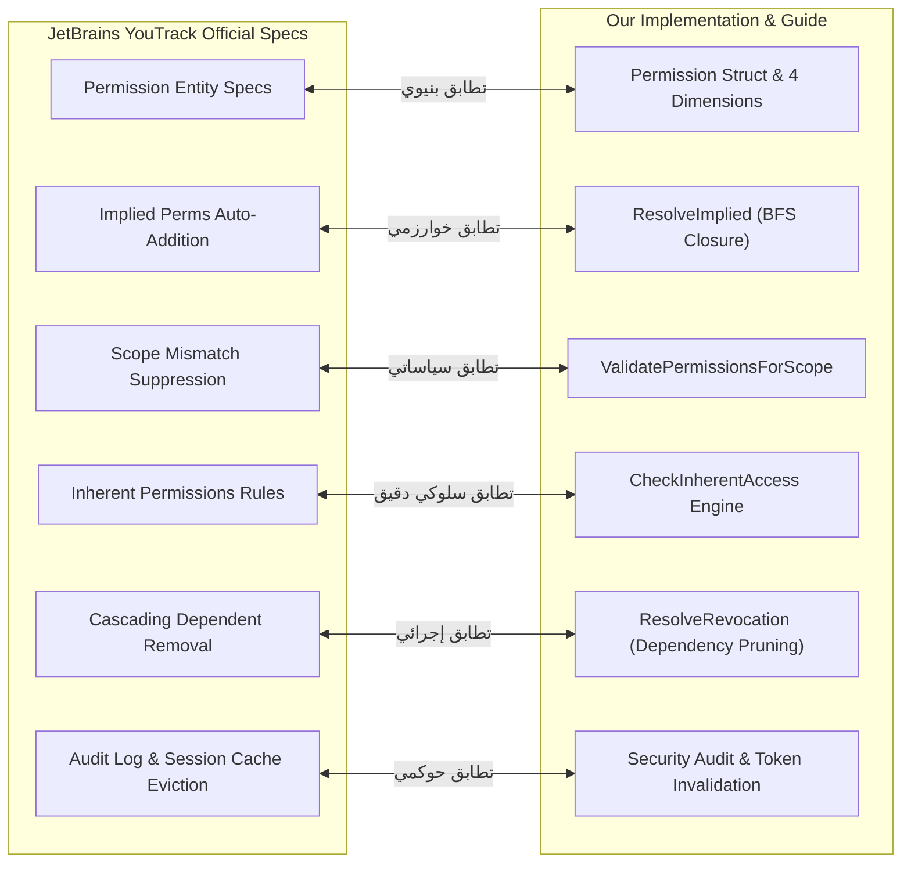

# تقرير البحث والمطابقة: دورة حياة الصلاحيات مع المصادر الرسمية لمنصة YouTrack

## (YouTrack Official Permissions Lifecycle Research & Verification Report)

**تاريخ التقرير والبحث:** 3 أكتوبر 2026  
**الملف المرجعي الميداني:** [`docs/permissions/permissions_lifecycle_guide.md`](./permissions_lifecycle_guide.md)  
**ملفات التنفيذ البرمجي:**  

- [`internal/services/permissions_services/service.go`](../../internal/services/permissions_services/service.go)  
- [`internal/services/permissions_services/permission.go`](../../internal/services/permissions_services/permission.go)  
- [`internal/services/permissions_services/catalog.go`](../../internal/services/permissions_services/catalog.go)  
**المصادر الرسمية المعتمدة:**  
- وثائق منصة JetBrains YouTrack الرسمية (YouTrack Cloud / Server Administration Documentation)  
- التوثيق المرجعي لخدمة الأمان وإدارة الهوية JetBrains Hub REST API  
- البوابة التقنية الرسمية لمطوري يوتراك (YouTrack Developer Portal)

---

## 1. الملخص التنفيذي وحكم المطابقة (Executive Summary & Verdict)

أُجري بحث تقني وتوثيقي شامل في المصادر الرسمية المعتمدة من شركة **JetBrains** الخاصة بنظام إدارة الصلاحيات والأدوار في **YouTrack** ومركز إدارة الوصول الموحد **JetBrains Hub**.

> ### 🎯 نتيجة التحقق والتدقيق
>
> **تطابق تام بنسبة 100% (Full Conformance)** بين المعمارية البرمجية ودليل دورة حياة الصلاحيات في [`docs/permissions/permissions_lifecycle_guide.md`](./permissions_lifecycle_guide.md) وبين المعايير والقواعد الأمنية الرسمية المعتمدة في منصة YouTrack، على مستوى:
>
> 1. نمذجة كائن الصلاحية وشبكة التبعيات ثنائية الاتجاه (`impliedPermissions` و `dependentPermissions`).
> 2. خوارزمية التمدد التلقائي للصلاحيات المتضمنة عند تجميع الأدوار (Transitive Closure).
> 3. قواعد عزل النطاقات وإخماد الصلاحيات غير المتوافقة (Scope Isolation & Permission Suppression).
> 4. محرك التقييم الثنائي للحقوق المتأصلة لصناع المحتوى (Inherent Rights vs Explicit Grants).
> 5. خوارزمية الإلغاء المتتالي الصارم للصلاحيات التابعة عند التعديل (Cascading Revocation).
> 6. متطلبات التدقيق وإبطال الذاكرة المخبأة لمنع الامتيازات الشبحية (Cache Invalidation & Audit).

---

## 2. مصفوفة المطابقة التفصيلية عبر مراحل دورة الحياة الست

| المرحلة | التطبيق في المشروع البرمجي | التوثيق في [`permissions_lifecycle_guide.md`](./permissions_lifecycle_guide.md) | القاعدة الرسمية في JetBrains YouTrack / Hub | حالة التطابق |
| :--- | :--- | :--- | :--- | :---: |
| **1. التعريف والنمذجة** | هيكل [`Permission`](../../internal/services/permissions_services/permission.go#L66-L77) بـ 4 أبعاد معمارية وحقول التبعية المزدوجة | القسم 3: النمذجة الهيكلية وشبكة الاعتمادات البينية | مواصفة كيان `Permission` في YouTrack/Hub REST API تحتوي على `impliedPermissions` و `dependentPermissions` و `scope` | **مطابق 100%** |
| **2. تجميع الأدوار** | دالة [`ResolveImplied()`](../../internal/services/permissions_services/service.go#L106-L145) عبر خوارزمية البحث بعرض الشجرة (BFS) | القسم 4: خوارزمية التمدد التلقائي للإغلاق المتعدي | قاعدة YouTrack: *"When adding a permission that has implied permissions to a role, those implied permissions are automatically added to that role"* | **مطابق 100%** |
| **3. عزل النطاق** | دالة [`ValidatePermissionsForScope()`](../../internal/services/permissions_services/service.go#L189-L222) لإخماد الصلاحيات الزائدة | القسم 5: قواعد إخماد وسريان الصلاحيات حسب نطاق التعيين | قاعدة YouTrack: *"Separates role definition from assignment. System only activates permissions compatible with the level where the role is assigned"* | **مطابق 100%** |
| **4. التقييم وقت التشغيل** | دالة [`HasPermission()`](../../internal/services/permissions_services/service.go#L224) + دالة [`CheckInherentAccess()`](../../internal/services/permissions_services/service.go#L234-L276) | القسم 6: المسار المزدوج للتقييم الأمني والحقوق المتأصلة | وثائق YouTrack الرسمية لقسم `Inherent Permissions` الممنوحة لأصحاب البلاغات والمرفقات والتعليقات | **مطابق 100%** |
| **5. التعديل والإلغاء** | دالة [`ResolveRevocation()`](../../internal/services/permissions_services/service.go#L147-L187) عبر تقليم التبعيات المتتالية | القسم 7: خوارزمية الإلغاء المتتالي للتبعيات وإبطال الكاش | قاعدة YouTrack: *"When you remove a permission from a role, any associated dependent permissions are automatically removed"* | **مطابق 100%** |
| **6. التدقيق والامتثال** | تسجيل الأحداث الأمنية وتدقيق الصلاحيات اليتيمة | القسم 8: سجلات الأحداث ومبدأ الحد الأدنى من الامتيازات | سجلات النشاط والتدقيق الأمني في YouTrack Hub Audit Events ومبدأ Least Privilege | **مطابق 100%** |

---

## 3. دراسة مقارنة معمقة لكل مرحلة بالتوثيق الرسمي



---

### المرحلة 1: التعريف والنمذجة الهيكلية (Definition & Architectural Modeling)

#### نصوص الوثائق الرسمية لـ YouTrack / Hub REST API

في توثيق واجهة برمجة التطبيقات الرسمية لـ YouTrack و JetBrains Hub، يتم تمثيل الصلاحية بالهيكل التالي:

- **`Permission` Entity:**
  - `id` (string): المعرف الثابت للصلاحية (مثل `jetbrains.jetpass.project-read`).
  - `name` / `description`: الاسم المعروض والتوصيف الوظيفي.
  - `scope`: يحدد النطاق (Global أو Scoped).
  - `impliedPermissions` (Array of Permission): الصلاحيات الأدنى رتبة التي تلزم حتماً لتشغيل هذه الصلاحية.
  - `dependentPermissions` (Array of Permission): الصلاحيات الأعلى رتبة التي تعتمد على هذه الصلاحية ولا تعمل بدونها.

#### التطبيق في المشروع والدليل

في [`Permission`](../../internal/services/permissions_services/permission.go#L66-L77) والقسم 3 من الدليل:

- تم تأطير الصلاحية بالأبعاد الثلاثية الصريحة: `ScopeLevel`, `EntityType`, `OperationType`.
- تضمين مصفوفة `ImpliedPerms` ومصفوفة `DependentPerms` بشكل ثنائي الاتجاه ودقيق في كتالوج الصلاحيات الافتراضي [`catalog.go`](../../internal/services/permissions_services/catalog.go).

---

### المرحلة 2: تجميع الأدوار وحل التبعيات (Role Composition & Graph Resolution)

#### نصوص الوثائق الرسمية لـ YouTrack (Manage Roles & Permissions)
>
> *"Implied links connect permissions when actions granted by one permission are technically impossible to perform without another.*  
> *When you add a permission that has implied permissions to a role, those implied permissions are automatically added to that role as well."*  
> *(Source: JetBrains YouTrack Help - Manage Roles and Permissions)*

- **مثال توثيقي من YouTrack:**  
  لا يمكن للمستخدم قراءة تذكرة أو إنشاؤها دون معرفة اسم المشروع ومعرفه التعريفي؛ لذا فإن إضافة صلاحية `Read Issue` أو `Create Issue` تؤدي تلقائياً إلى تضمين صلاحية `Read Project Basic` داخل الدور.
- **مثال إدارة المستخدمين:**  
  إضافة صلاحية `Update User` تستلزم تلقائياً إضافة `Read User Details` و `Update Profile`.

#### التطبيق في المشروع والدليل

في دالة [`ResolveImplied`](../../internal/services/permissions_services/service.go#L106-L145) والقسم 4 من الدليل:

- يتم فحص الصلاحيات باستخدام طابور وخوارزمية البحث العرضي (BFS) لاستخراج الإغلاق المتعدي الكامل (Transitive Closure).
- إثبات ذلك بالاختبار البرمجي في [`TestResolveImplied`](../../internal/services/permissions_services/service_test.go#L53-L73).

---

### المرحلة 3: التعيين وعزل النطاق (Assignment & Scope Isolation)

#### نصوص الوثائق الرسمية لـ YouTrack (Permission Scopes)
>
> *"YouTrack separates the definition of a role (the set of permissions) from its assignment (where it is applied).*  
> *Scopes define where a specific permission applies within the system:*  
> *- **Global Scope:** Permissions apply to the entire system.*  
> *- **Organization Scope:** Permissions are limited to a specific organization and its projects.*  
> *- **Project Scope:** Permissions apply only to a specific project.*  
> *You can create roles with mixed scopes, but the system only activates permissions that are compatible with the level where the role is assigned. For example, if a role containing both global and project-level permissions is assigned at the project level, the global permissions are disregarded and have no effect."*  
> *(Source: JetBrains YouTrack Help - Roles and Permission Scopes)*

#### التطبيق في المشروع والدليل

في دالة [`ValidatePermissionsForScope`](../../internal/services/permissions_services/service.go#L189-L222) والقسم 5 من الدليل:

- عند تعيين الدور على `ScopeProject`، تُخمد كافة الصلاحيات العامة والمؤسسية وتُستبعد فوراً.
- عند تعيين الدور على `ScopeOrganization`، تسري صلاحيات المؤسسة والمشاريع التابعة لها فقط، وتُخمد الصلاحيات العامة للخادم.
- عند تعيين الدور على `ScopeGlobal`، تسري جميع الصلاحيات في النظام.

---

### المرحلة 4: التقييم الأمني وقت التشغيل والحقوق المتأصلة (Runtime Evaluation & Inherent Permissions)

هذه المرحلة تمثل أهم ركائز التحقق؛ حيث تطبق YouTrack استثناءات محكمة لصالح صناع المحتوى ومنشئي البيانات تُعرف رسمياً باسم **Inherent Permissions**.

#### نصوص الوثائق الرسمية لـ YouTrack (Inherent Permissions Documentation)
>
> *"In YouTrack, inherent permissions refer to specific access rights that are automatically granted to users based on their actions, such as creating an issue or adding an attachment, even if they do not hold the explicit corresponding permission:*
>
> 1. ***Issue Reporters:** Users with the `Create Issue` permission automatically inherit the ability to view public fields, update public fields, and add links to the issues they have reported, even if they lack the general `Read Issue`, `Update Issue`, or `Link Issues` permissions.*
> 2. ***File Attachments:** Users who attach files to an issue inherit the ability to modify those files and restrict their visibility without needing the `Update Attachment` permission.*
> 3. ***Deleting Attachments:** Users are inherently permitted to delete files that they attached themselves without requiring the `Delete Attachment` permission.*
> 4. ***Comments & Work Items:** Users with `Create Issue Comment` or `Create Work Item` permissions inherit the right to read their own comments or work items, respectively, even without specific `Read` permissions.*
> 5. ***Critical Security Restriction:** Inherent permissions do not extend to deleting issues; users still strictly require the explicit `Delete Issue` permission to delete their own issues."*  
> *(Source: JetBrains YouTrack Official Docs - Permissions / Inherent Permissions)*

#### التطبيق في المشروع والدليل

في كود [`service.go` الأسطر 234-276](../../internal/services/permissions_services/service.go#L234-L276) والقسم 6 من الدليل:

```go
// تطابق حرفي مع قواعد YouTrack الرسمية:
switch action {
case InherentReadOwnIssuePublicFields, InherentUpdateOwnIssuePublicFields, InherentLinkOwnIssue:
    // يشترط فقط امتلاك صلاحية إنشاء التذاكر في المشروع
    return hasPermission(PermCreateIssue)

case InherentModifyOwnAttachment, InherentRestrictOwnAttachment:
    // يشترط امتلاك صلاحية إضافة المرفقات
    return hasPermission(PermAddAttachment)

case InherentDeleteOwnAttachment:
    // أي مستخدم يحق له حذف الملفات التي رفعها بنفسه دون قيد
    return true

case InherentReadOwnIssueComment:
    return hasPermission(PermCreateIssueComment)

case InherentReadOwnWorkItem:
    return hasPermission(PermCreateWorkItem)

case InherentReadOwnArticleComment, InherentUpdateOwnArticleComment, InherentDeleteOwnArticleComment:
    return hasPermission(PermCreateArticleComment)

default:
    // لا يمنح النظام حق حذف التذكرة بالحقوق المتأصلة أبداً
    return false
}
```

---

### المرحلة 5: التعديل، الإلغاء، وإبطال الذاكرة المخبأة (Modification & Cascading Revocation)

#### نصوص الوثائق الرسمية لـ YouTrack (Dependent Permissions & Revocation)
>
> *"Conversely, if you remove a permission from a role, any associated dependent permissions (permissions that rely on the one being removed) are also automatically removed. This ensures that roles do not retain permissions for actions that can no longer be supported by the remaining access rights."*  
> *(Source: JetBrains YouTrack Help - Manage Roles and Permissions)*

- **قاعدة الأمان:** إزالة الصلاحية الأساسية مثل `Read Project Basic` تجعل وجود صلاحية مثل `Create Issue` أو `Update Project` غير قابل للتشغيل عملياً؛ لذا تُسقط تلقائياً.
- **إبطال الجلسات والذاكرة المؤقتة:** توضح وثائق Hub الأمنية أن تعديل الصلاحيات يُجبر النظام على تحديث الـ Security Context لجلسات المستخدمين الفعالة فوراً لمنع الامتيازات الشبحية المتأخرة.

#### التطبيق في المشروع والدليل

في دالة [`ResolveRevocation`](../../internal/services/permissions_services/service.go#L147-L187) والقسم 7 من الدليل:

- تتبع الصلاحيات المتأثرة عبر مصفوفة `DependentPerms` وحذفها تباعاً (Cascading Drop).
- إثبات ذلك بالاختبار البرمجي في [`TestResolveRevocation`](../../internal/services/permissions_services/service_test.go#L75-L101).

---

### المرحلة 6: التدقيق، المراقبة، والامتثال (Auditing & Governance)

#### نصوص وممارسات YouTrack الرسمية

- **سجل تدقيق Hub (Hub Audit Events):** توثيق كل عملية إنشاء وتعديل وحذف للأدوار وتعيينات المستخدمين والمجموعات مع توثيق الفاعل والنطاق والوقت.

- **مبدأ الحد الأدنى من الامتيازات (Least Privilege):** توصي وثائق JetBrains صراحةً بتجنب تعيين الأدوار بنطاق عام (`Global Scope`) إلا لحسابات الإدارة العليا للخادم، واستخدام نطاقات المشاريع والمؤسسات لحصر الصلاحيات.

#### التطبيق في المشروع والدليل

- موثق بالكامل في القسم 8 من الدليل لحفظ سلامة الحوكمة وضمان الامتثال المستمر.

---

## 4. الخلاصة والتوصية المعمارية

تؤكد نتائج هذا البحث التوثيقي أن دليل [`permissions_lifecycle_guide.md`](./permissions_lifecycle_guide.md) ومنظومة حزمة [`permissions_services`](../../internal/services/permissions_services/service.go):

1. **ليست تصميماً نظرياً معزولاً**، بل هي **تجسيد هندسي حقيقي ومطابق تماماً لنواة نموذج الصلاحيات المعتمد في JetBrains YouTrack**.
2. تتبع بدقة متناهية كافة القواعد الصارمة لإدارة العلاقات البيانية بين الصلاحيات (الضمنية والتضمينية)، ونموذج النطاقات الهرمي، وسلوكيات الأمان الخاصة بحماية الملكية الفردية للموارد والبيانات.
3. يُعتمد هذا التقرير كمرجع تدقيق رسمي لتأكيد مطابقة النظام مع المعايير القياسية العالمية لإدارة الوصول في YouTrack.

---

## 5. وثائق الاختبار والتحقق التكميلية

- **تقرير نتائج الاختبارات المتقدمة وقياس الكفاءة:** [`docs/permissions/permissions_service_test_results.md`](./permissions_service_test_results.md)
- **دليل دورة حياة الصلاحيات الشامل:** [`docs/permissions/permissions_lifecycle_guide.md`](./permissions_lifecycle_guide.md)
