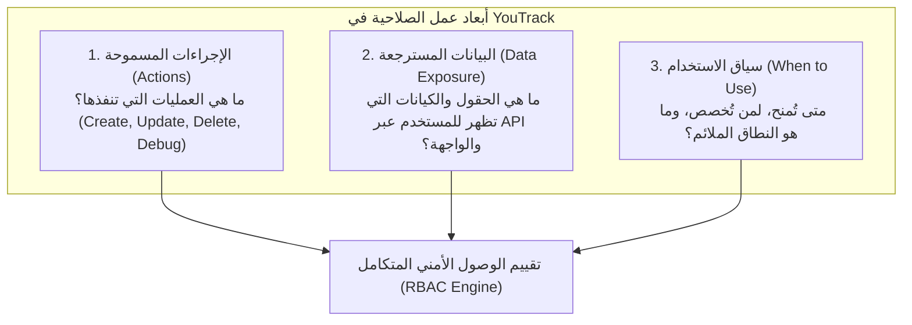
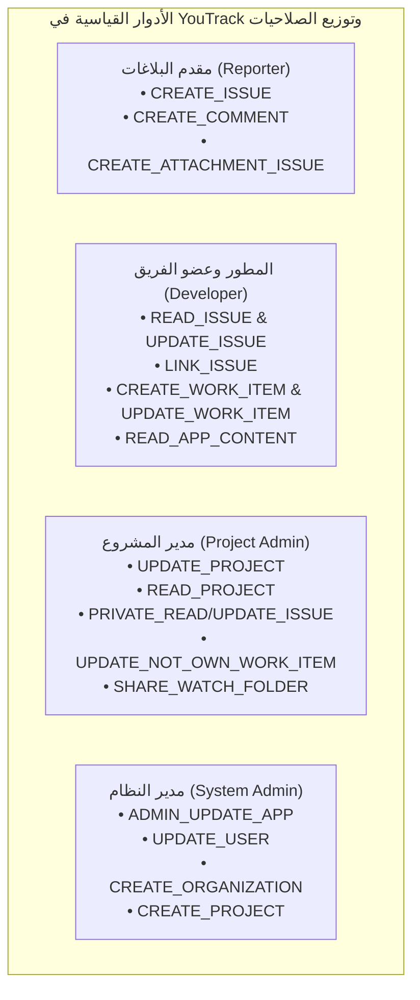

# دليل إجراءات الصلاحيات، البيانات المسترجعة، وسيناريوهات الاستخدام في YouTrack

## (YouTrack Permissions: Actions, Data Exposure, and Usage Guide)

**المصادر الرسمية المعتمدة:**

- [JetBrains YouTrack Server Documentation - Permissions Reference](https://www.jetbrains.com/help/youtrack/server/youtrack-permissions-reference.html)
- [JetBrains YouTrack DevPortal - REST API & App Extensions](https://www.jetbrains.com/help/youtrack/devportal/)
- [JetBrains YouTrack Server Documentation - Default Roles Comparison](https://www.jetbrains.com/help/youtrack/server/default-roles.html)
- **إصدار التوثيق المعتمد:** YouTrack Server / Cloud 2026.2 (September 2026 Build)
- **التكامل البرمجي للمشروع:** [`internal/services/permissions_services/catalog.go`](../../internal/services/permissions_services/catalog.go)

---

## 1. الإطار المفاهيمي: كيف تعمل صلاحيات YouTrack؟

في بنية YouTrack الأمنية، لا تقتصر الصلاحية على كونها مجرد "مفتاح منطقي" (Boolean Flag) يفتح أو يغلق الوصول، بل هي **محدد وظيفي وتفاعلي** يحكم ثلاثة أبعاد رئيسية:

1. **الإجراءات التنفيذية (Actions Performed):** العمليات المسموح للمستخدم أو النظام بتنفيذها (كتابة، تعديل، حذف، تشغيل سكربتات، إدارة تكاملات).
2. **إسقاط البيانات (Data Returned / Exposed):** مستوى البيانات التي تعود في استجابات REST API وتعرض على واجهة المستخدم. ففي غياب بعض الصلاحيات، لا يفشل الطلب دائماً بخطأ `403 Forbidden` بل قد يُرجع النظام بيانات **مُموّهة (Anonymized)** أو يحجب حقولاً معينة (مثل الحقول الخاصة أو بيانات المصوتين).
3. **سياق وسيناريو الاستخدام (When to Use):** تحديد الدور الوظيفي الأنسب والموقف العملي الذي يستدعي منح الصلاحية وفق مبدأ الحد الأدنى من الامتيازات (Principle of Least Privilege).

---

## 2. الدليل التفصيلي للصلاحيات حسب الوحدات والكيانات

---

### أولاً: وحدة النظام والعمليات العامة (System / Global Operations)

#### 1. القراءة الإدارية منخفضة المستوى (Low-level Admin Read)

- **المعرف البرمجي (Key):** `PermLowLevelAdminRead` (`ADMIN_READ_APP`)
- **النطاق المتاح (Scope):** عام فقط (`Global Scope`).
- **الإجراءات التي تعملها الصلاحية (Actions):**
  - استعراض إعدادات الخادم العامة والإشرافية ذات المستوى المنخفض.
  - قراءة ومراقبة القياسات ومؤشرات أداء النظام (System Metrics & Health Checks).
  - فحص قائمة التكاملات العامة مع الخدمات الخارجية (Third-party integrations) دون تعديلها.
  - استعراض قائمة المجموعات (Groups)، خصائصها، والمجموعات الفرعية (Subgroups).
  - استعراض جميع الأدوار (Roles) والصلاحيات المعرفة في النظام.
  - قراءة محتوى كافة التطبيقات (Apps)، مهام سير العمل (Workflows)، وقواعد اتفاقيات مستوى الخدمة (SLA Policies) على مستوى النظام ككل.
- **البيانات التي ترجعها أو تكشفها (Data Returned / Exposed):**
  - كائنات المجموعات والمجموعات الفرعية بكل تفاصيلها الهيكلية.
  - كائنات الأدوار وقوائم الصلاحيات المرتبطة بكل دور.
  - بيانات إحصائيات الخادم، استخدام الذاكرة، وقوائم الاتصالات النشطة.
  - إعدادات التكاملات العامة (مع حجب مفاتيح التشفير والرموز السرية).
- **متى تُستخدم (When to Use):**
  - تُمنح لمديري التدقيق الأمني (Security Auditors)، أو لمشرفي البنية التحتية والمراقبة (SRE / DevOps) الذين يحتاجون لمراقبة صحة الخادم وإعدادات الأمان دون امتلاك صلاحية تخريبية لتعديلها.
- **التبعيات والحقوق:** لا تتطلب صلاحيات سابقة.

---

#### 2. الكتابة الإدارية منخفضة المستوى (Low-level Admin Write)

- **المعرف البرمجي (Key):** `PermLowLevelAdminWrite` (`ADMIN_UPDATE_APP`)
- **النطاق المتاح (Scope):** عام فقط (`Global Scope`).
- **الإجراءات التي تعملها الصلاحية (Actions):**
  - التحكم الكامل في الإجراءات الإدارية المتقدمة على الخادم.
  - أخذ نسخ احتياطية لقاعدة البيانات واستعادتها (Database Backup & Restore).
  - إنشاء، تعديل، وتحديث وتهيئة التكاملات مع الخدمات الخارجية وموفري الهوية (SSO, LDAP, SAML).
  - إنشاء، تعديل، وحذف مجموعات المستخدمين (Groups CRUD).
  - إنشاء، تعديل، وحذف الأدوار وتعيين الصلاحيات المضمنة فيها (Roles CRUD).
  - تعديل وحذف التطبيقات والمهام البرمجية التي تحتوي على أدوات واجهة (Widgets) أو معالجات HTTP العامة (Global HTTP Handlers).
  - إدارة الاتصالات المشتركة على مستوى الخادم (Shared Server Connections).
- **البيانات التي ترجعها أو تكشفها (Data Returned / Exposed):**
  - الوصول الكامل وغير المقيد لجميع بيانات الخادم، السجلات المتقدمة (Diagnostic Logs)، ومفاتيح الربط والتوثيق.
- **متى تُستخدم (When to Use):**
  - محصورة حصراً بمسؤولي النظام الأساسيين (System Administrators / Superusers).
- **التبعيات والحقوق:**
  - تتضمن تلقائياً (`Implies`): `Low-level Admin Read` (`ADMIN_READ_APP`).

---

### ثانياً: وحدة التطبيقات والأتمتة (App & Workflow Executables)

#### 3. قراءة محتوى التطبيقات والسكربتات (Read App Content)

- **المعرف البرمجي (Key):** `PermReadAppContent` (`READ_APP_CONTENT`)
- **النطاق المتاح (Scope):** نطاق المشروع (`Project Scope`).
- **الإجراءات التي تعملها الصلاحية (Actions):**
  - استعراض الشفرة المصدرية لسكربتات التطبيقات المخصصة، نصوص سير العمل (Workflows)، وقواعد سياسات اتفاقية مستوى الخدمة (SLA Policies).
  - قراءة ملفات الإعداد (Configuration Files) والأرشيفات المصدرة (Export Archives).
  - استعراض سجلات التنفيذ التشغيلية (Execution Logs) لسكربتات المشاريع.
- **البيانات التي ترجعها أو تكشفها (Data Returned / Exposed):**
  - الكود البرمجي لسير العمل المكتوب بلغة JavaScript / YouTrack Workflows.
  - إعدادات المتغيرات وقيم الحقول المستخدمة في قواعد الأتمتة التابعة للمشاريع المخول بها.
- **متى تُستخدم (When to Use):**
  - تُمنح لمطوري مهام سير العمل (Workflow Developers)، ومهندسي الجودة لمراجعة قواعد العمل الآلية دون منحهم صلاحية لتغيير نصوص السكربتات المعتمدة.
- **ملاحظة:** تتيح الصلاحية للمستخدم قراءة السكربتات في أي مشروع يمتلك فيه هذه الصلاحية.

---

#### 4. تحديث وبرمجة التطبيقات والسكربتات (Update App Content)

- **المعرف البرمجي (Key):** `PermUpdateAppContent` (`UPDATE_APP_CONTENT`)
- **النطاق المتاح (Scope):** نطاق المشروع (`Project Scope`).
- **الإجراءات التي تعملها الصلاحية (Actions):**
  - إنشاء، استيراد، تعديل، وحذف سكربتات التطبيقات ومهام سير العمل وسياسات SLA.
  - تصحيح نصوص سير العمل تفاعلياً باستخدام مصحح الأخطاء عن بُعد (Remote Debugger).
  - رفع وتحديث ملفات تعريف الحزم والامتدادات التابعة للمشاريع.
- **البيانات التي ترجعها أو تكشفها (Data Returned / Exposed):**
  - جلسات التصحيح الحي (Live Debugging Sessions)، متغيرات الذاكرة أثناء تنفيذ السكربتات، وسجلات الأخطاء التفصيلية (Stack Traces).
- **متى تُستخدم (When to Use):**
  - تُمنح لمهندسي الأتمتة المعتمدين والمطورين المسؤولين عن كتابة واختبار نصوص سير العمل التلقائية الخاصة بمشاريع معينة.
- **التبعيات والحقوق:**
  - تتضمن تلقائياً (`Implies`): `Read App Content` (`READ_APP_CONTENT`).
- **شرط أمني رسمي:** لتعديل محتوى مرتبط بعدة مشاريع نشطة، يجب أن يمتلك المستخدم هذه الصلاحية في **جميع** المشاريع غير المؤرشفة المرتبط بها هذا المحتوى.

---

### ثالثاً: وحدة المقالات وقاعدة المعرفة (Articles & Knowledge Base)

#### 5. إنشاء مقال (Create Article)

- **المعرف البرمجي (Key):** `PermCreateArticle` (`CREATE_ARTICLE`)
- **النطاق المتاح (Scope):** نطاق المشروع (`Project Scope`).
- **الإجراءات التي تعملها الصلاحية (Actions):**
  - إضافة مقالات جديدة في قاعدة معرفة المشروع (Knowledge Base).
  - إنشاء مسودات المقالات (Article Drafts) ونشرها كصفحات فرعية أو رئيسية في شجرة المستندات.
- **البيانات التي ترجعها أو تكشفها (Data Returned / Exposed):**
  - بيانات المقال الجديد المنشأ ومساره التفرعي داخل قاعدة المعرفة.
- **متى تُستخدم (When to Use):**
  - لكُتّاب التوثيق الفني، مهندسي الدعم، وأعضاء الفرق المساهمين في إثراء قاعدة المعرفة.
- **التبعيات والحقوق:**
  - تتضمن تلقائياً (`Implies`): `Read Article` (`READ_ARTICLE`).

---

#### 6. قراءة المقالات (Read Article)

- **المعرف البرمجي (Key):** `PermReadArticle` (`READ_ARTICLE`)
- **النطاق المتاح (Scope):** نطاق المشروع (`Project Scope`).
- **الإجراءات التي تعملها الصلاحية (Actions):**
  - فتح وتصفح المقالات وقراءة محتواها النصي ومرفقاتها داخل المشروع.
  - استعراض سجل تعديل المقال (Article History / Revisions) والتنقل بين النسخ السابقة.
- **البيانات التي ترجعها أو تكشفها (Data Returned / Exposed):**
  - نصوص المقالات الكاملة (Markdown / WYSIWYG Content).
  - شجرة المقالات المرتبطة بالمشروع.
  - قائمة المساهمين وسجل تاريخ المقال.
- **متى تُستخدم (When to Use):**
  - لجميع أفراد الفريق والقراء والعملاء الداخليين الذين يحتاجون للاطلاع على سياسات العمل والتوثيق المكتبي.
- **شرط رسمي:** يشترط لظهور المقالات امتلاك المستخدم أيضاً لصلاحية `Read Project Basic` في نفس المشروع.

---

#### 7. تعديل المقالات (Update Article)

- **المعرف البرمجي (Key):** `PermUpdateArticle` (`UPDATE_ARTICLE`)
- **النطاق المتاح (Scope):** نطاق المشروع (`Project Scope`).
- **الإجراءات التي تعملها الصلاحية (Actions):**
  - تعديل عناوين ومحتويات المقالات المنشورة في قاعدة المعرفة.
  - نقل المقال ضمن شجرة المقالات أو ربطه بمقالات أخرى.
  - ضبط إعدادات الرؤية (Visibility) للمقال.
- **البيانات التي ترجعها أو تكشفها (Data Returned / Exposed):**
  - كائنات التعديل المحدثة ومقارنة الاختلافات (Diffs) بين الإصدارات.
- **متى تُستخدم (When to Use):**
  - لمديري المحتوى الفني ومحرري الوثائق.
- **التبعيات والحقوق:**
  - تتضمن تلقائياً (`Implies`): `Read Article` (`READ_ARTICLE`).

---

#### 8. حذف المقالات (Delete Article)

- **المعرف البرمجي (Key):** `PermDeleteArticle` (`DELETE_ARTICLE`)
- **النطاق المتاح (Scope):** نطاق المشروع (`Project Scope`).
- **الإجراءات التي تعملها الصلاحية (Actions):**
  - الحذف النهائي للمقالات وفروعها من شجرة المعرفة في المشروع.
- **البيانات التي ترجعها أو تكشفها (Data Returned / Exposed):**
  - تأكيد حذف الكائن وإزالته من الفهارس والبحث.
- **متى تُستخدم (When to Use):**
  - لقادة الفرق ومسؤولي التوثيق لتنظيف المحتوى القديم أو الملغى.
- **التبعيات والحقوق:**
  - تتضمن تلقائياً (`Implies`): `Read Article` (`READ_ARTICLE`).

---

### رابعاً: تعليقات المقالات (Article Comments)

#### 9. إنشاء تعليق على مقال (Create Article Comment)

- **المعرف البرمجي (Key):** `PermCreateArticleComment` (`CREATE_ARTICLE_COMMENT`)
- **النطاق المتاح (Scope):** نطاق المشروع (`Project Scope`).
- **الإجراءات التي تعملها الصلاحية (Actions):**
  - كتابة ونشر تعليقات جديدة على مقالات قاعدة المعرفة.
  - **الحقوق المتأصلة (Inherent Rights):** يكتسب صاحب التعليق تلقائياً حق قراءة وتعديل وحذف تعليقه الشخصي دون الحاجة لصلاحيات أخرى!
- **البيانات التي ترجعها أو تكشفها (Data Returned / Exposed):**
  - كائن التعليق الجديد المنشأ وظهوره في تسلسل المحادثة.
- **متى تُستخدم (When to Use):**
  - لجميع أعضاء الفريق لتشجيع النقاش وإبداء الملاحظات حول المقالات والتوثيق.
- **التبعيات والحقوق:**
  - تتضمن تلقائياً (`Implies`): `Read Article Comment` (`READ_ARTICLE_COMMENT`).

---

#### 10. قراءة تعليقات المقالات (Read Article Comment)

- **المعرف البرمجي (Key):** `PermReadArticleComment` (`READ_ARTICLE_COMMENT`)
- **النطاق المتاح (Scope):** نطاق المشروع (`Project Scope`).
- **الإجراءات التي تعملها الصلاحية (Actions):**
  - استعراض وقراءة التعليقات المكتوبة على مقالات قاعدة المعرفة.
- **البيانات التي ترجعها أو تكشفها (Data Returned / Exposed):**
  - نصوص التعليقات، مؤلفوها، وتاريخ نشرها.
- **متى تُستخدم (When to Use):**
  - للقراء لمتابعة المناقشات والتوضيحات المضافة على المقال.

---

#### 11. تعديل تعليقات المقالات (Update Article Comment)

- **المعرف البرمجي (Key):** `PermUpdateArticleComment` (`UPDATE_ARTICLE_COMMENT`)
- **النطاق المتاح (Scope):** نطاق المشروع (`Project Scope`).
- **الإجراءات التي تعملها الصلاحية (Actions):**
  - تعديل وتحرير التعليقات التي كتبها **مستخدمون آخرون** على المقالات.
- **البيانات التي ترجعها أو تكشفها (Data Returned / Exposed):**
  - نصوص التعليقات المحدثة وتاريخ آخر تعديل.
- **متى تُستخدم (When to Use):**
  - لمشرفي المحتوى (Moderators) لتصحيح الأخطاء اللغوية أو تعديل محتوى حساس نشره آخرون.
- **التبعيات والحقوق:**
  - تتضمن تلقائياً (`Implies`): `Read Article Comment` (`READ_ARTICLE_COMMENT`).

---

#### 12. حذف تعليقات المقالات (Delete Article Comment)

- **المعرف البرمجي (Key):** `PermDeleteArticleComment` (`DELETE_ARTICLE_COMMENT`)
- **النطاق المتاح (Scope):** نطاق المشروع (`Project Scope`).
- **الإجراءات التي تعملها الصلاحية (Actions):**
  - حذف التعليقات التي كتبها **مستخدمون آخرون** على المقالات.
- **البيانات التي ترجعها أو تكشفها (Data Returned / Exposed):**
  - إزالة التعليق من مسار نقاش المقال.
- **متى تُستخدم (When to Use):**
  - لمديري المشاريع والمشرفين لمسح التعليقات غير اللائقة أو المكررة.
- **التبعيات والحقوق:**
  - تتضمن تلقائياً (`Implies`): `Read Article Comment` (`READ_ARTICLE_COMMENT`).

---

### خامساً: وحدة التذاكر والبلاغات (Issues & Helpdesk Tickets)

> 💡 **ملاحظة رسمية من JetBrains:** تنطبق كافة صلاحيات التذاكر (Issues) أيضاً على تذاكر الدعم الفني في مشاريع الدعم (Helpdesk Tickets).

#### 13. إنشاء تذكرة (Create Issue)

- **المعرف البرمجي (Key):** `PermCreateIssue` (`CREATE_ISSUE`)
- **النطاق المتاح (Scope):** نطاق المشروع (`Project Scope`).
- **الإجراءات التي تعملها الصلاحية (Actions):**
  - إنشاء وإرسال بلاغات أو تذاكر جديدة في المشروع.
  - **الحقوق المتأصلة الاستثنائية لمقدم البلاغ (Reporter's Inherent Rights):**
    - استعراض الحقول العامة للتذكرة التي أنشأها بنفسه.
    - تعديل الحقول العامة لتذكرته الذاتية.
    - إضافة روابط (Links) لتذكرته الذاتية.
    - **كل ذلك سارٍ ومفعل حتى لو لم يمتلك الصلاحيات الصريحة:** `Read Issue`, `Update Issue`, `Link Issues`!
- **البيانات التي ترجعها أو تكشفها (Data Returned / Exposed):**
  - كائن التذكرة المنشأ حديثاً ورقم المعرف (`IDReadable` مثل `PRJ-101`).
- **متى تُستخدم (When to Use):**
  - لجميع أفراد المؤسسة، والمستخدمين الخارجيين وعملاء Helpdesk لتسجيل الطلبات والمشاكل.
- **التبعيات والحقوق:**
  - تتضمن تلقائياً (`Implies`): `Read Project Basic` (`READ_PROJECT_BASIC`) حتى يتمكن المستخدم من معرفة اسم ومعرف المشروع الموجه إليه التذكرة.

---

#### 14. قراءة التذكرة (Read Issue)

- **المعرف البرمجي (Key):** `PermReadIssue` (`READ_ISSUE`)
- **النطاق المتاح (Scope):** نطاق المشروع (`Project Scope`).
- **الإجراءات التي تعملها الصلاحية (Actions):**
  - استعراض التذاكر في قوائم البحث ولوحات أجايل وفتح التذكرة المفردة.
  - قراءة كافة الحقول العامة (Public Fields) مثل: العنوان، الوصف، الحالة، الأولوية، والنوع.
- **البيانات التي ترجعها أو تكشفها (Data Returned / Exposed):**
  - جميع الحقول العامة للتذكرة.
  - **ما لا تكشفه الصلاحية:** الحقول المصنفة على أنها سرية/خاصة (Private Fields)؛ حيث تُحجب من استجابة REST API ومن شاشة العرض ما لم يمتلك المستخدم الصلاحية الخاصة بها.
- **متى تُستخدم (When to Use):**
  - المطورون، مهندسو الاختبار، ومديرو المشاريع وجميع أعضاء فريق المشروع.
- **التبعيات والحقوق:**
  - تتضمن تلقائياً (`Implies`): `Read Project Basic` (`READ_PROJECT_BASIC`).

---

#### 15. تحديث التذكرة (Update Issue)

- **المعرف البرمجي (Key):** `PermUpdateIssue` (`UPDATE_ISSUE`)
- **النطاق المتاح (Scope):** نطاق المشروع (`Project Scope`).
- **الإجراءات التي تعملها الصلاحية (Actions):**
  - تعديل قيم الحقول العامة للتذاكر التي أنشأها أي شخص (تغيير الحالة State، الأولوية Priority، الشخص المعين Assignee، إلخ).
- **البيانات التي ترجعها أو تكشفها (Data Returned / Exposed):**
  - كائن التذكرة المحدث مع تسجيل الحدث في سجل النشاطات (Activity Stream).
- **متى تُستخدم (When to Use):**
  - للمطورين والمكلفين بحل المهام لإدارة دورة حياة التذكرة وتحويل حالتها.
- **استثناء خاص (Helpdesk):** في مشاريع الدعم الفني (Helpdesk)، يكون تعديل وصف التذكرة (Ticket Description) مقيداً وممنوعاً لجميع المستخدمين، ولا تؤثر صلاحية `Update Issue` على إمكانية تعديل الوصف.

---

#### 16. قراءة الحقول الخاصة للتذكرة (Read Issue Private Fields)

- **المعرف البرمجي (Key):** `PermReadIssuePrivateFields` (`PRIVATE_READ_ISSUE`)
- **النطاق المتاح (Scope):** نطاق المشروع (`Project Scope`).
- **الإجراءات التي تعملها الصلاحية (Actions):**
  - كشف وعرض الحقول التي تم وسمها كـ "حقول خاصة" (Private Fields) في إعدادات المشروع (مثل: التكلفة المالية، تفاصيل العقود، بيانات حساسة داخلية).
- **البيانات التي ترجعها أو تكشفها (Data Returned / Exposed):**
  - أسماء وقيم الحقول الخاصة في واجهة المستخدم واستجابات JSON لـ REST API.
  - بدون هذه الصلاحية، يتم إخفاء هذه الحقول تماماً من استجابة API وكأنها غير موجودة.
- **متى تُستخدم (When to Use):**
  - لمديري المشاريع، مسؤولي الحسابات، وفريق إدارة المنتج الذين يتعاملون مع معلومات تجارية أو فنية حساسة لا ينبغي إظهارها للمقاولين أو العملاء.
- **التبعيات والحقوق:**
  - تتضمن تلقائياً (`Implies`): `Read Project Basic` (`READ_PROJECT_BASIC`).

---

#### 17. تحديث الحقول الخاصة للتذكرة (Update Issue Private Fields)

- **المعرف البرمجي (Key):** `PermUpdateIssuePrivateFields` (`PRIVATE_UPDATE_ISSUE`)
- **النطاق المتاح (Scope):** نطاق المشروع (`Project Scope`).
- **الإجراءات التي تعملها الصلاحية (Actions):**
  - تعديل وإدخال قيم في الحقول الخاصة للتذكرة.
- **البيانات التي ترجعها أو تكشفها (Data Returned / Exposed):**
  - القيم المحدثة للحقول الخاصة مع حمايتها من وصول غير المخولين.
- **متى تُستخدم (When to Use):**
  - لمديري المشاريع ومسؤولي التقديرات المالية والسرية.
- **التبعيات والحقوق:**
  - تتضمن تلقائياً (`Implies`): `Read Issue Private Fields` (`PRIVATE_READ_ISSUE`) و `Update Issue` (`UPDATE_ISSUE`).

---

#### 18. حذف التذكرة (Delete Issue)

- **المعرف البرمجي (Key):** `PermDeleteIssue` (`DELETE_ISSUE`)
- **النطاق المتاح (Scope):** نطاق المشروع (`Project Scope`).
- **الإجراءات التي تعملها الصلاحية (Actions):**
  - حذف التذاكر نهائياً من المشروع.
  - **ملاحظة أمنية حاسمة:** حتى صاحب التذكرة ومقدم البلاغ (Reporter) **لا يستطيع** حذف تذكرته التي أنشأها بنفسه دون امتلاك هذه الصلاحية الصريحة!
- **البيانات التي ترجعها أو تكشفها (Data Returned / Exposed):**
  - إزالة التذكرة وتوابعها (مرفقات، تعليقات) من النظام.
- **متى تُستخدم (When to Use):**
  - مقتصرة على قادة المشاريع والمديرين الإداريين لتجنب فقدان البيانات بالخطأ.

---

#### 19. ربط التذاكر (Link Issues)

- **المعرف البرمجي (Key):** `PermLinkIssue` (`LINK_ISSUE`)
- **النطاق المتاح (Scope):** نطاق المشروع (`Project Scope`).
- **الإجراءات التي تعملها الصلاحية (Actions):**
  - إنشاء علاقات الروابط بين التذاكر (Depends on / Is required for, Relates to, Duplicates, Subtask).
- **البيانات التي ترجعها أو تكشفها (Data Returned / Exposed):**
  - مصفوفة الروابط (`links`) ضمن كائن التذكرة.
- **متى تُستخدم (When to Use):**
  - للمهندسين ومديري المشاريع لتنظيم علاقات التبعية والتكرار.
- **ملاحظة:** يمكن لمنشئ التذكرة ربط تذكرته تلقائياً بموجب حقوقه المتأصلة بشرط أن يمتلك صلاحية قراءة التذكرة الأخرى المراد الربط بها.

---

#### 20. تجاوز قيود الرؤية (Override Visibility Restrictions)

- **المعرف البرمجي (Key):** `PermOverrideVisibility` (`READ_HIDDEN_STUFF`)
- **النطاق المتاح (Scope):** نطاق المشروع (`Project Scope`).
- **الإجراءات التي تعملها الصلاحية (Actions):**
  - الاطلاع على التذاكر والتعليقات والمرفقات التي تم تقييد ظهورها (Restricted Visibility) لمجموعات أو مستخدمين معينين ليس من بينهم هذا المستخدم.
- **البيانات التي ترجعها أو تكشفها (Data Returned / Exposed):**
  - المحتوى السري والمخفي بالكامل الذي استثناه كاتب التذكرة أو التعليق.
- **متى تُستخدم (When to Use):**
  - حصراً لمدير المشروع أو مسؤول الامتثال الأمني الذي يحتاج للإشراف الشامل ومنع أي "نقاط عمياء" (Blind Spots) داخل المشروع.
- **التبعيات والحقوق:**
  - تتضمن تلقائياً (`Implies`): `Read Issue Private Fields` (`PRIVATE_READ_ISSUE`).

---

#### 21. تنفيذ الأوامر بصمت دون إشعارات (Apply Commands Silently)

- **المعرف البرمجي (Key):** `PermApplyCommandsSilently` (`APPLY_COMMANDS_SILENTLY`)
- **النطاق المتاح (Scope):** نطاق المشروع (`Project Scope`).
- **الإجراءات التي تعملها الصلاحية (Actions):**
  - تنفيذ أوامر تحديث التذاكر دفعة واحدة أو بشكل فردي دون إرسال رسائل إشعار بريدي أو تنبيهات للمتابعين والمشتركين.
- **البيانات التي ترجعها أو تكشفها (Data Returned / Exposed):**
  - نتائج تنفيذ الأوامر مع كتم مخرجات محرك الإشعارات (Silent Notification Suppression).
- **متى تُستخدم (When to Use):**
  - لعمليات ترحيل البيانات الضخمة (Bulk Migration)، تحديثات السكربتات المجدولة، أو التعديلات الإدارية العامة لتجنب إغراق صناديق بريد المستخدمين بآلاف الرسائل غير الضرورية.

---

#### 22. تحديث المتابعين (Update Watchers)

- **المعرف البرمجي (Key):** `PermUpdateWatchers` (`UPDATE_WATCHERS`)
- **النطاق المتاح (Scope):** نطاق المشروع (`Project Scope`).
- **الإجراءات التي تعملها الصلاحية (Actions):**
  - إضافة مستخدمين آخرين إلى قائمة المتابعين (Watchers) لتذكرة معينة لإلزامهم بتلقي التحديثات، أو إزالتهم منها.
- **البيانات التي ترجعها أو تكشفها (Data Returned / Exposed):**
  - تعديل قائمة المراقبين والمشتركين في التذكرة.
- **متى تُستخدم (When to Use):**
  - لمديري الفرق لضمان إشراك المعنيين ومتابعتهم لتطورات التذاكر الحرجة.

---

#### 23. عرض المتابعين (View Watchers)

- **المعرف البرمجي (Key):** `PermViewWatchers` (`VIEW_WATCHERS`)
- **النطاق المتاح (Scope):** نطاق المشروع (`Project Scope`).
- **الإجراءات التي تعملها الصلاحية (Actions):**
  - استعراض قائمة المستخدمين الذين يراقبون التذكرة (تظهر في الواجهة التفصيلية للتذكرة Single Issue View).
- **البيانات التي ترجعها أو تكشفها (Data Returned / Exposed):**
  - مصفوفة كائنات المستخدمين المتابعين (`watchers.issueWatchers`).
- **متى تُستخدم (When to Use):**
  - لمعرفة من يتلقى التنبيهات حول التذكرة لضمان عدم تسريب معلومات لأطراف غير معنية قبل النشر.
- **التبعيات والحقوق:**
  - تتضمن تلقائياً (`Implies`): `Read Project Basic` (`READ_PROJECT_BASIC`).

---

#### 24. عرض المصوّتين (View Voters)

- **المعرف البرمجي (Key):** `PermViewVoters` (`VIEW_VOTERS`)
- **النطاق المتاح (Scope):** نطاق المشروع (`Project Scope`).
- **الإجراءات التي تعملها الصلاحية (Actions):**
  - عرض قائمة المستخدمين الذين صوتوا لصالح التذكرة (تظهر في شاشة العرض الفردي للتذكرة).
- **البيانات التي ترجعها أو تكشفها (Data Returned / Exposed):**
  - أسماء وتفاصيل المستخدمين المصوتين (`voters.users`).
  - بدون هذه الصلاحية، يظهر فقط **عدد** الأصوات الإجمالي دون كشف هويات المصوتين.
- **متى تُستخدم (When to Use):**
  - لمديري المنتجات لتحليل شريحة العملاء أو المهندسين المهتمين بميزة معينة للتواصل المباشر معهم.
- **التبعيات والحقوق:**
  - تتضمن تلقائياً (`Implies`): `Read Project Basic` (`READ_PROJECT_BASIC`).

---

### سادساً: مرفقات التذاكر (Issue Attachments)

#### 25. إضافة مرفق (Add Attachment)

- **المعرف البرمجي (Key):** `PermAddAttachment` (`CREATE_ATTACHMENT_ISSUE`)
- **النطاق المتاح (Scope):** نطاق المشروع (`Project Scope`).
- **الإجراءات التي تعملها الصلاحية (Actions):**
  - رفع وإرفاق الملفات والصور والمستندات بالتذاكر.
  - **الحقوق المتأصلة لرافع الملف (Attacher's Inherent Rights):**
    - يحق لرافع الملف تعديله أو ضبط قيود ظهوره ورؤيته (Visibility Settings) تلقائياً دون الحاجة لصلاحية `Update Attachment`.
    - يحق له أيضاً حذف المرفق الذي رفعه بنفسه دون الحاجة لصلاحية `Delete Attachment`.
- **البيانات التي ترجعها أو تكشفها (Data Returned / Exposed):**
  - كائن المرفق متضمناً الرابط المباشر للملف، الحجم، والنوع (`mimeType`).
- **متى تُستخدم (When to Use):**
  - تمنح لكافة المستخدمين الذين يحتاجون لإرفاق لقطات شاشة أو ملفات سجلات (Logs).

---

#### 26. تعديل المرفقات (Update Attachment)

- **المعرف البرمجي (Key):** `PermUpdateAttachment` (`UPDATE_ATTACHMENT_ISSUE`)
- **النطاق المتاح (Scope):** نطاق المشروع (`Project Scope`).
- **الإجراءات التي تعملها الصلاحية (Actions):**
  - تعديل وتحديث بيانات المرفقات وتغيير إعدادات الرؤية والخصوصية للملفات المرفقة من قبل **مستخدمين آخرين**.
- **البيانات التي ترجعها أو تكشفها (Data Returned / Exposed):**
  - بيانات المرفق المحدثة.
- **متى تُستخدم (When to Use):**
  - لمديري المشاريع ومسؤولي الأمن لإخفاء مرفقات حساسة رفعها مستخدمون آخرون عن طريق الخطأ.

---

#### 27. حذف المرفقات (Delete Attachment)

- **المعرف البرمجي (Key):** `PermDeleteAttachment` (`DELETE_ATTACHMENT_ISSUE`)
- **النطاق المتاح (Scope):** نطاق المشروع (`Project Scope`).
- **الإجراءات التي تعملها الصلاحية (Actions):**
  - حذف أي ملف مرفق بالتذكرة حتى لو كان مرفوعاً من قبل مستخدمين آخرين.
- **البيانات التي ترجعها أو تكشفها (Data Returned / Exposed):**
  - مسح الملف نهائياً من خادم التخزين.
- **متى تُستخدم (When to Use):**
  - لمديري المشاريع لحذف المرفقات التالفة أو الضخمة أو التي تشكل خطراً أمنياً.

---

### سابعاً: تعليقات التذاكر (Issue Comments)

#### 28. إنشاء تعليق على تذكرة (Create Issue Comment)

- **المعرف البرمجي (Key):** `PermCreateIssueComment` (`CREATE_COMMENT`)
- **النطاق المتاح (Scope):** نطاق المشروع (`Project Scope`).
- **الإجراءات التي تعملها الصلاحية (Actions):**
  - إضافة تعليق جديد إلى تذكرة.
  - **الحقوق المتأصلة:** يستطيع كاتب التعليق قراءة تعليقه الذاتي دائماً دون امتلاك `Read Issue Comment`.
  - **تنبيه:** تعديل التعليق الذاتي يتطلب امتلاك صلاحية `Update Issue Comment`.
- **البيانات التي ترجعها أو تكشفها (Data Returned / Exposed):**
  - كائن التعليق المنشأ ومحتواه النصي.
- **متى تُستخدم (When to Use):**
  - تمنح لجميع المستخدمين والعملاء للتواصل حول التذكرة.

---

#### 29. قراءة تعليقات التذاكر (Read Issue Comment)

- **المعرف البرمجي (Key):** `PermReadIssueComment` (`READ_COMMENT`)
- **النطاق المتاح (Scope):** نطاق المشروع (`Project Scope`).
- **الإجراءات التي تعملها الصلاحية (Actions):**
  - استعراض كافة التعليقات العامة المكتوبة على التذاكر.
- **البيانات التي ترجعها أو تكشفها (Data Returned / Exposed):**
  - نصوص التعليقات وتواريخها وهوية كتابها.
- **متى تُستخدم (When to Use):**
  - تمنح كصلاحية أساسية لأي مستخدم لديه حق الاطلاع على التذاكر.

---

#### 30. تعديل التعليقات الشخصية (Update Issue Comment)

- **المعرف البرمجي (Key):** `PermUpdateIssueComment` (`UPDATE_COMMENT`)
- **النطاق المتاح (Scope):** نطاق المشروع (`Project Scope`).
- **الإجراءات التي تعملها الصلاحية (Actions):**
  - تعديل وتحرير التعليقات التي أضافها المستخدم نفسه إلى التذكرة.
  - **استثناء مشاريع Helpdesk:** في مشاريع الدعم الفني، يُحظر تعديل التعليقات العامة (Public Ticket Comments) للجميع، ولا تمكّن هذه الصلاحية المستخدم من تجاوز هذا الحظر على التعليقات العامة.
- **البيانات التي ترجعها أو تكشفها (Data Returned / Exposed):**
  - النص المحدث للتعليق وسجل التعديل.
- **متى تُستخدم (When to Use):**
  - لأعضاء الفريق لتصحيح ما كتبوه في تعليقاتهم.

---

#### 31. تعديل تعليقات الآخرين (Update Not Own Issue Comment)

- **المعرف البرمجي (Key):** `PermUpdateNotOwnIssueComment` (`UPDATE_NOT_OWN_COMMENT`)
- **النطاق المتاح (Scope):** نطاق المشروع (`Project Scope`).
- **الإجراءات التي تعملها الصلاحية (Actions):**
  - تعديل وتحرير التعليقات المكتوبة من قبل مستخدمين آخرين.
- **البيانات التي ترجعها أو تكشفها (Data Returned / Exposed):**
  - التعليق المعدل مع وسم بأنه عُدل بواسطة شخص آخر.
- **متى تُستخدم (When to Use):**
  - للمشرفين ومديري الفرق لإصلاح بيانات أو إزالة أسرار ومعلومات غير لائقة.
- **التبعيات والحقوق:**
  - تتضمن تلقائياً (`Implies`): `Read Issue Comment` (`READ_COMMENT`).

---

#### 32. حذف التعليق الشخصي (Delete Issue Comment)

- **المعرف البرمجي (Key):** `PermDeleteIssueComment` (`DELETE_COMMENT`)
- **النطاق المتاح (Scope):** نطاق المشروع (`Project Scope`).
- **الإجراءات التي تعملها الصلاحية (Actions):**
  - حذف التعليق الذي أضافه المستخدم نفسه.
- **البيانات التي ترجعها أو تكشفها (Data Returned / Exposed):**
  - إزالة التعليق من مسار نقاش التذكرة.
- **متى تُستخدم (When to Use):**
  - للمستخدمين العاديين لحذف تعليقاتهم الخاطئة.

---

#### 33. حذف تعليقات الآخرين والحذف الدائم (Delete Not Own and Permanent Comment Delete)

- **المعرف البرمجي (Key):** `PermDeleteNotOwnAndPermanentCommentDelete` (`DELETE_NOT_OWN_COMMENT`)
- **النطاق المتاح (Scope):** نطاق المشروع (`Project Scope`).
- **الإجراءات التي تعملها الصلاحية (Actions):**
  - حذف تعليقات الآخرين، وكذلك الحذف النهائي والدائم للتعليقات من قاعدة البيانات وسجلات النشاط.
- **البيانات التي ترجعها أو تكشفها (Data Returned / Exposed):**
  - إزالة نهائية لا يمكن التراجع عنها للكائنات.
- **متى تُستخدم (When to Use):**
  - لمديري المشاريع ومسؤولي النظام لإدارة المحتوى المسيء أو الحساس.
- **التبعيات والحقوق:**
  - تتضمن تلقائياً (`Implies`): `Read Issue Comment` (`READ_COMMENT`).

---

### ثامناً: وحدة تتبع الوقت وبنود العمل (Issue Work Items / Time Tracking)

#### 34. تسجيل بند عمل شخصي (Create Work Item)

- **المعرف البرمجي (Key):** `PermCreateWorkItem` (`CREATE_WORK_ITEM`)
- **النطاق المتاح (Scope):** نطاق المشروع (`Project Scope`).
- **الإجراءات التي تعملها الصلاحية (Actions):**
  - تسجيل ساعات أو دقائق العمل المبذولة (Spent Time) على تذكرة محددة باسم المستخدم نفسه.
  - **الحقوق المتأصلة:** يمكنه قراءة بنود عمله الشخصية حتى بدون صلاحية `Read Work Item`.
  - **تنبيه:** تعديل بند العمل الشخصي بعد تسجيله يتطلب صلاحية `Update Work Item`.
- **البيانات التي ترجعها أو تكشفها (Data Returned / Exposed):**
  - كائن بند العمل (الوقت المقضي، التاريخ، نوع العمل، الوصف).
- **متى تُستخدم (When to Use):**
  - لكافة المطورين والموظفين الذين يسجلون أوقات عملهم على التذاكر.

---

#### 35. تسجيل بند عمل بالنيابة عن الآخرين (Create Not Own Work Item)

- **المعرف البرمجي (Key):** `PermCreateNotOwnWorkItem` (`CREATE_NOT_OWN_WORK_ITEM`)
- **النطاق المتاح (Scope):** نطاق المشروع (`Project Scope`).
- **الإجراءات التي تعملها الصلاحية (Actions):**
  - إنشاء بند عمل وتعيين شخص آخر كمؤلف وساعي لهذا العمل (Log work on behalf of another user).
- **البيانات التي ترجعها أو تكشفها (Data Returned / Exposed):**
  - كائن بند العمل مسنداً للمستخدم المحدد.
- **متى تُستخدم (When to Use):**
  - لمديري المشاريع، المساعدين الإداريين، أو قادة الفرق لتسجيل ساعات العمل نيابة عن أعضاء فرقهم الميدانيين.
- **التبعيات والحقوق:**
  - تتضمن تلقائياً (`Implies`): `Create Work Item` (`CREATE_WORK_ITEM`).

---

#### 36. قراءة بنود العمل (Read Work Item)

- **المعرف البرمجي (Key):** `PermReadWorkItem` (`READ_WORK_ITEM`)
- **النطاق المتاح (Scope):** نطاق المشروع (`Project Scope`).
- **الإجراءات التي تعملها الصلاحية (Actions):**
  - عرض قائمة بنود العمل والوقت المقضي المسجل على التذاكر من قبل جميع المستخدمين.
- **البيانات التي ترجعها أو تكشفها (Data Returned / Exposed):**
  - تفاصيل الوقت المسجل لكل تذكرة، أسماء العاملين، الإجمالي الزمني (`spentTime`).
- **متى تُستخدم (When to Use):**
  - لأعضاء الفريق والمشرفين والمحاسبين لمراجعة سجلات الوقت وإعداد تقارير الإنجاز.

---

#### 37. تعديل بند العمل الشخصي (Update Work Item)

- **المعرف البرمجي (Key):** `PermUpdateWorkItem` (`UPDATE_WORK_ITEM`)
- **النطاق المتاح (Scope):** نطاق المشروع (`Project Scope`).
- **الإجراءات التي تعملها الصلاحية (Actions):**
  - تعديل الساعات أو التاريخ أو الوصف لبنود العمل التي أنشأها المستخدم بنفسه.
- **البيانات التي ترجعها أو تكشفها (Data Returned / Exposed):**
  - بيانات بند العمل المحدثة.
- **متى تُستخدم (When to Use):**
  - للموظف لتصحيح خطأ في الساعات المسجلة لنفسه.

---

#### 38. تعديل بنود عمل الآخرين (Update Not Own Work Item)

- **المعرف البرمجي (Key):** `PermUpdateNotOwnWorkItem` (`UPDATE_NOT_OWN_WORK_ITEM`)
- **النطاق المتاح (Scope):** نطاق المشروع (`Project Scope`).
- **الإجراءات التي تعملها الصلاحية (Actions):**
  - تعديل وتصحيح بنود العمل المسجلة من قبل مستخدمين آخرين.
  - إنشاء بنود عمل بالنيابة عن الآخرين أيضاً.
- **البيانات التي ترجعها أو تكشفها (Data Returned / Exposed):**
  - بيانات الساعات المعدلة للغير.
- **متى تُستخدم (When to Use):**
  - لمديري المشاريع والمحاسبين لضبط وتدقيق الساعات قبل إرسال الفواتير.
- **التبعيات والحقوق:**
  - تتضمن تلقائياً (`Implies`): `Read Work Item` (`READ_WORK_ITEM`) و `Update Work Item` (`UPDATE_WORK_ITEM`).

---

### تاسعاً: وحدة المؤسسات (Organization Management)

#### 39. إنشاء مؤسسة (Create Organization)

- **المعرف البرمجي (Key):** `PermCreateOrganization` (`CREATE_ORGANIZATION`)
- **النطاق المتاح (Scope):** عام فقط (`Global Scope`).
- **الإجراءات التي تعملها الصلاحية (Actions):**
  - إضافة كيان مؤسسة تنظيمي جديد لتجميع المشاريع والأدوار.
- **البيانات التي ترجعها أو تكشفها (Data Returned / Exposed):**
  - كائن المؤسسة المنشأة ومعرفها العام.
- **متى تُستخدم (When to Use):**
  - لمسؤولي الشركات القابضة أو الخوادم متعددة المستأجرين (Multi-tenant) لإنشاء فروع ومؤسسات جديدة.
- **التبعيات والحقوق:**
  - تتضمن تلقائياً (`Implies`): `Read Organization` (`READ_ORGANIZATION`).

---

#### 40. قراءة المؤسسة (Read Organization)

- **المعرف البرمجي (Key):** `PermReadOrganization` (`READ_ORGANIZATION`)
- **النطاق المتاح (Scope):** نطاق المؤسسة (`Organization Scope`).
- **الإجراءات التي تعملها الصلاحية (Actions):**
  - استعراض بيانات وخصائص المؤسسة والمشاريع التابعة لها.
  - **ميزة استثنائية مشروطة:** المستخدم الذي يمتلك هذه الصلاحية بالإضافة لصلاحية `Read Project Full` في مشروع واحد على الأقل تابع للمؤسسة، يتمكن من **عرض قائمة الأدوار ومصفوفة الصلاحيات** المعينة للمؤسسة.
- **البيانات التي ترجعها أو تكشفها (Data Returned / Exposed):**
  - الاسم، المعرف، المشاريع التابعة، والمجموعات المعينة على مستوى المؤسسة.
- **متى تُستخدم (When to Use):**
  - لمديري المشاريع ومسؤولي الفروع للاطلاع على الهيكل الإداري للمؤسسة.

---

#### 41. تحديث المؤسسة (Update Organization)

- **المعرف البرمجي (Key):** `PermUpdateOrganization` (`UPDATE_ORGANIZATION`)
- **النطاق المتاح (Scope):** نطاق المؤسسة (`Organization Scope`).
- **الإجراءات التي تعملها الصلاحية (Actions):**
  - تعديل خصائص المؤسسة، إضافة أو إزالة مشاريع تابعة لها، وإدارة تعيينات الوصول وحقوق المستخدمين داخل المؤسسة.
- **البيانات التي ترجعها أو تكشفها (Data Returned / Exposed):**
  - خصائص المؤسسة وتوزيع المشاريع.
- **متى تُستخدم (When to Use):**
  - لمديري المؤسسات والفروع (Organization Administrators).
- **التبعيات والحقوق:**
  - تتضمن تلقائياً (`Implies`): `Read Organization` (`READ_ORGANIZATION`).

---

#### 42. حذف المؤسسة (Delete Organization)

- **المعرف البرمجي (Key):** `PermDeleteOrganization` (`DELETE_ORGANIZATION`)
- **النطاق المتاح (Scope):** نطاق المؤسسة (`Organization Scope`).
- **الإجراءات التي تعملها الصلاحية (Actions):**
  - الحذف النهائي لسجل المؤسسة من النظام وإلغاء ارتباط مشاريعها.
- **البيانات التي ترجعها أو تكشفها (Data Returned / Exposed):**
  - إزالة الكيان التنظيمي.
- **متى تُستخدم (When to Use):**
  - لكبار الإداريين عند حل فرع أو إغلاق قسم تنظيمي.
- **التبعيات والحقوق:**
  - تتضمن تلقائياً (`Implies`): `Read Organization` (`READ_ORGANIZATION`).

---

### عاشراً: وحدة المشاريع (Projects)

#### 43. إنشاء مشروع (Create Project)

- **المعرف البرمجي (Key):** `PermCreateProject` (`CREATE_PROJECT`)
- **النطاق المتاح (Scope):** عام فقط (`Global Scope`).
- **الإجراءات التي تعملها الصلاحية (Actions):**
  - إنشاء مشاريع جديدة بالكامل في النظام وتهيئتها واختيار قوالبها (Scrum, Kanban, Helpdesk).
- **البيانات التي ترجعها أو تكشفها (Data Returned / Exposed):**
  - كائن المشروع الجديد المنشأ وإعداده الأولي.
- **متى تُستخدم (When to Use):**
  - لقادة أقسام التطوير ورؤساء قطاعات الأعمال لفتح مساحات عمل ومشاريع جديدة.

---

#### 44. قراءة الخصائص الأساسية للمشروع (Read Project Basic)

- **المعرف البرمجي (Key):** `PermReadProjectBasic` (`READ_PROJECT_BASIC`)
- **النطاق المتاح (Scope):** نطاق المشروع (`Project Scope`).
- **الإجراءات التي تعملها الصلاحية (Actions):**
  - عرض الخصائص العامة الأساسية للمشروع: اسم المشروع (`name`)، الوصف (`description`)، الشعار (`iconUrl`)، وهوية مالك المشروع (`leader`).
  - **ميزة مجمعة هامة:** عند دمج هذه الصلاحية مع صلاحية `Read User Basic`، يتمكن المستخدم من **عرض قائمة أعضاء فريق المشروع بالكامل (Project Team)**.
  - بدون هذه الصلاحية، لا يستطيع المستخدم حتى رؤية التذاكر لأن معرفة سياق المشروع هي متطلب تقني مسبق لأي عملية داخل المشروع.
- **البيانات التي ترجعها أو تكشفها (Data Returned / Exposed):**
  - كائن `Project` الأساسي فقط دون إعدادات الحقول أو الصلاحيات التفصيلية.
- **متى تُستخدم (When to Use):**
  - هي الصلاحية الأساسية الأدنى لكل مستخدم يمتلك حق الدخول على المشروع.

---

#### 45. قراءة الخصائص الكاملة للمشروع (Read Project Full)

- **المعرف البرمجي (Key):** `PermReadProjectFull` (`READ_PROJECT`)
- **النطاق المتاح (Scope):** نطاق المشروع (`Project Scope`).
- **الإجراءات التي تعملها الصلاحية (Actions):**
  - الاطلاع على جميع خصائص المشروع المتقدمة.
  - استعراض الأدوار والصلاحيات الممنوحة لفريق المشروع ومجموعات المستخدمين الأخرى المعينة في المشروع.
  - قراءة مصفوفات الوصول بدون إمكانية تعديل إعدادات المشروع (تعديل الإعدادات يتطلب `Update Project`).
- **البيانات التي ترجعها أو تكشفها (Data Returned / Exposed):**
  - الهيكل الأمني للمشروع، مصفوفات التعيين (`assignedRoles`)، إعدادات الحقول ولوحات العمل.
- **متى تُستخدم (When to Use):**
  - لمديري المشاريع والمراجعين وقادة الفرق التقنية.
- **التبعيات والحقوق:**
  - تتضمن تلقائياً (`Implies`): `Read Project Basic` (`READ_PROJECT_BASIC`).

---

#### 46. تحديث وإدارة المشروع (Update Project)

- **المعرف البرمجي (Key):** `PermUpdateProject` (`UPDATE_PROJECT`)
- **النطاق المتاح (Scope):** نطاق المشروع (`Project Scope`).
- **الإجراءات الشاملة التي تعملها الصلاحية (Comprehensive Actions):**
  هذه هي الصلاحية الإدارية المحورية في المشروع وتغطي 9 مجالات تشغيلية رئيسية:
  1. **المجموعات والأدوار:** إنشاء وقراءة وتعديل وحذف المجموعات والأدوار المخصصة داخل نطاق المشروع.
  2. **إدارة الإعدادات التشغيلية:** إدارة قائمة المعينين (Assignees)، الحقول المخصصة (Custom Fields)، إعدادات الرؤية، تتبع الوقت، وإعدادات Helpdesk.
  3. **مهام سير العمل (Workflows):** إنشاء وتعديل وإرفاق واستيراد مهام سير العمل التابعة للمشروع، وعرض سجلات تنفيذها.
  4. **التطبيقات:** استعراض وتثبيت وربط وإزالة وتكوين التطبيقات على مستوى المشروع.
  5. **البريد الإلكتروني:** تهيئة تكامل البريد وقواعد معالجة الرسائل الواردة.
  6. **أنظمة التحكم بالنسخ وخوادم البناء:** ربط وإدارة تكاملات VCS (GitHub, GitLab, Bitbucket) وخوادم التكامل المستمر (TeamCity, Jenkins).
  7. **قوالب الإشعارات المخصصة:** تخصيص قوالب التنبيهات على مستوى المشروع (عند تفعيل الميزة الاختيارية في النظام).
  8. **لوحات أجايل (Agile Boards):** ضبط إعدادات المشروع المتعلقة بالأعمدة ومسارات السباحة (Swimlanes) والمشاركة.
  9. **ملاحظة أمنية:** لا تشمل هذه الصلاحية العمليات العامة للخادم (مثل حذف سير عمل يمتلك Widget عام أو إدارة اتصالات الخادم المشتركة).
- **البيانات التي ترجعها أو تكشفها (Data Returned / Exposed):**
  - تحكم وقراءة كاملة لجميع شاشات التكوين والربط في لوحة إعدادات المشروع.
- **متى تُستخدم (When to Use):**
  - لمدير المشروع (Project Administrator) أو Scrum Master المعتمد للمشروع.
- **التبعيات والحقوق:**
  - تتضمن تلقائياً (`Implies`): `Read Project Full` (`READ_PROJECT`).

---

#### 47. حذف المشروع (Delete Project)

- **المعرف البرمجي (Key):** `PermDeleteProject` (`DELETE_PROJECT`)
- **النطاق المتاح (Scope):** نطاق المشروع (`Project Scope`).
- **الإجراءات التي تعملها الصلاحية (Actions):**
  - الحذف النهائي للمشروع وجميع التذاكر والمقالات والإعدادات التابعة له من النظام.
- **البيانات التي ترجعها أو تكشفها (Data Returned / Exposed):**
  - مسح شامل لبيانات المشروع.
- **متى تُستخدم (When to Use):**
  - محصورة بمديري النظام لتصفية المشاريع المنتهية أو الملغاة.
- **التبعيات والحقوق:**
  - تتضمن تلقائياً (`Implies`): `Read Project Full` (`READ_PROJECT`).

---

### حادي عشر: وحدة إدارة المستخدمين وحسابات الهوية (Users Management)

#### 48. إنشاء حساب مستخدم (Create User)

- **المعرف البرمجي (Key):** `PermCreateUser` (`CREATE_USER`)
- **النطاق المتاح (Scope):** عام فقط (`Global Scope`).
- **الإجراءات التي تعملها الصلاحية (Actions):**
  - إنشاء حسابات مستخدمين جديدة مباشرة في النظام.
  - إرسال دعوات التسجيل بالبريد الإلكتروني للمستخدمين الجدد لتفعيل حساباتهم بأنفسهم.
- **البيانات التي ترجعها أو تكشفها (Data Returned / Exposed):**
  - كائن المستخدم الجديد وروابط الدعوة.
- **متى تُستخدم (When to Use):**
  - لمسؤولي الموارد البشرية ومديري النظام لتسجيل الموظفين والعملاء الجدد.

---

#### 49. قراءة البيانات الأساسية للمستخدمين (Read User Basic)

- **المعرف البرمجي (Key):** `PermReadUserBasic` (`READ_USER_BASIC`)
- **النطاق المتاح (Scope):** عام فقط (`Global Scope`).
- **الإجراءات التي تعملها الصلاحية (Actions):**
  - استعراض قائمة المستخدمين المسجلين في النظام.
  - قراءة المعرف (`id`)، اسم المستخدم (`login`)، الاسم الظاهر (`name`)، والصورة الرمزية (`avatarUrl`).
  - بالاقتران مع صلاحية `Update Group` تتيح إدارة عضويات المجموعات.
  - **السلوك عند غياب الصلاحية (Anonymization Policy):**
    - المستخدم الذي **لا يمتلك** هذه الصلاحية يرى حسابات المستخدمين الآخرين **مجهولة الهوية تماماً (Anonymized)**؛ حيث يظهر الاسم كـ `Anonymous` واسم المستخدم كقيمة عشوائية مشفرة وتكون حقول البيانات الشخصية للقراءة فقط!
- **البيانات التي ترجعها أو تكشفها (Data Returned / Exposed):**
  - الهوية الأساسية للمستخدم دون كشف بريده الإلكتروني أو أرقام هواتفه أو إعداداته الأمنية.
- **متى تُستخدم (When to Use):**
  - تمنح كصلاحية افتراضية لأي مستخدم معتمد في النظام ليتمكن من التعاون وتعيين المهام لزملائه بأسمائهم الحقيقية.

---

#### 50. قراءة التفاصيل الموسعة للمستخدم (Read User Details)

- **المعرف البرمجي (Key):** `PermReadUserDetails` (`READ_USER`)
- **النطاق المتاح (Scope):** عام فقط (`Global Scope`).
- **الإجراءات التي تعملها الصلاحية (Actions):**
  - استعراض الملف التعريفي الكامل للمستخدمين: البريد الإلكتروني، جهات الاتصال، المجموعات التابع لها، وسجل التعيينات.
  - **ما لا تكشفه الصلاحية:** لا تمنح وصولاً إلى الإعدادات الشخصية ولا إلى تفاصيل أمان الحساب (مثل رموز 2FA وكلمات المرور).
- **البيانات التي ترجعها أو تكشفها (Data Returned / Exposed):**
  - الحقول الإضافية لملف المستخدم (`email`, `jabber`, `contacts`).
- **متى تُستخدم (When to Use):**
  - لمديري الفرق ومسؤولي المكاتب للدعم الإداري والتواصل مع الموظفين.
- **التبعيات والحقوق:**
  - تتضمن تلقائياً (`Implies`): `Read User Basic` (`READ_USER_BASIC`).

---

#### 51. تحديث الأمان الشخصي للمستخدم (Update Self)

- **المعرف البرمجي (Key):** `PermUpdateSelf` (`UPDATE_PROFILE`)
- **النطاق المتاح (Scope):** عام فقط (`Global Scope`).
- **الإجراءات التي تعملها الصلاحية (Actions):**
  - إدارة المستخدم لمعلومات أمان حسابه الشخصي (Account Security):
    - تغيير كلمة المرور الذاتية.
    - تهيئة وتحديث المصادقة الثنائية (Two-factor Authentication - 2FA).
    - إنشاء وإلغاء رموز الوصول الشخصية (Personal Access Tokens - PAT).
- **البيانات التي ترجعها أو تكشفها (Data Returned / Exposed):**
  - مفاتيح ورموز التوثيق الخاصة بالمستخدم صاحب الحساب فقط.
- **متى تُستخدم (When to Use):**
  - تمنح لجميع المستخدمين لتمكينهم من صيانة أمان حساباتهم وإصدار رموز للـ API.

---

#### 52. تعديل وإدارة حسابات المستخدمين (Update User)

- **المعرف البرمجي (Key):** `PermUpdateUser` (`UPDATE_USER`)
- **النطاق المتاح (Scope):** عام فقط (`Global Scope`).
- **الإجراءات الشاملة التي تعملها الصلاحية (Actions):**
  - تعديل بيانات أي مستخدم، تغيير بريده، وتعديل إعداداته الشخصية.
  - حظر المستخدمين (Ban / Revoke Access).
  - دمج حسابين لمستخدم واحد (Merge Accounts).
  - إخفاء الهوية قسرياً لحسابات المستخدمين المستقيلين (Anonymize User Data) للامتثال لقوانين حماية البيانات مثل GDPR.
  - إدارة إعدادات الأمان وإعادة تعيين كلمات المرور للآخرين.
  - استعراض وإدارة الوسوم ومجلدات المراقبة التي أنشأها مستخدمون آخرون.
- **البيانات التي ترجعها أو تكشفها (Data Returned / Exposed):**
  - تحكم كامل ببيانات جميع مستخدمي المنصة.
- **متى تُستخدم (When to Use):**
  - لمسؤولي الهوية والنظام (Hub / YouTrack Administrators).
- **التبعيات والحقوق:**
  - تتضمن تلقائياً (`Implies`): `Update Self` (`UPDATE_PROFILE`) و `Read User Details` (`READ_USER`).

---

#### 53. حذف حساب المستخدم (Delete User)

- **المعرف البرمجي (Key):** `PermDeleteUser` (`DELETE_USER`)
- **النطاق المتاح (Scope):** عام فقط (`Global Scope`).
- **الإجراءات التي تعملها الصلاحية (Actions):**
  - الحذف النهائي لسجلات حساب المستخدم من قاعدة البيانات بالكامل.
- **البيانات التي ترجعها أو تكشفها (Data Returned / Exposed):**
  - مسح الحساب وبياناته الشخصية.
- **متى تُستخدم (When to Use):**
  - لمسؤولي النظام فقط (يُفضل عمل Anonymize أو Ban في الحالات العادية للحفاظ على ترابط التذاكر السابقة).
- **التبعيات والحقوق:**
  - تتضمن تلقائياً (`Implies`): `Read User Details` (`READ_USER`).

---

### ثاني عشر: مجلدات المراقبة، الوسوم، وعمليات المشاركة (Watch Folders, Tags & Sharing)

#### 54. إنشاء مجلد مراقبة / وسم (Create Watch Folder / Tag)

- **المعرف البرمجي (Key):** `PermCreateWatchFolder` (`CREATE_WATCH_FOLDER`)
- **النطاق المتاح (Scope):** عام / مشروع (`Global / Project`).
- **الإجراءات التي تعملها الصلاحية (Actions):**
  - إنشاء وسوم جديدة (Tags).
  - حفظ عمليات البحث المفضلة (Saved Searches).
  - إنشاء لوحات معلومات ومجلدات متابعة خاصة بالمستخدم.
- **البيانات التي ترجعها أو تكشفها (Data Returned / Exposed):**
  - كائن الوسم أو البحث المحفوظ مع تعيين المالك تلقائياً للمنشئ.
- **متى تُستخدم (When to Use):**
  - لجميع المستخدمين لتمكينهم من تصنيف مهامهم ومتابعة استعلامات البحث المتكررة.

---

#### 55. تعديل وسم أو بحث محفوظ (Update Watch Folder / Tag)

- **المعرف البرمجي (Key):** `PermUpdateWatchFolder` (`UPDATE_WATCH_FOLDER`)
- **النطاق المتاح (Scope):** عام / مشروع (`Global / Project`).
- **الإجراءات التي تعملها الصلاحية (Actions):**
  - تعديل إعدادات الوسم (اللون، الاسم) أو تغيير استعلام البحث المحفوظ.
  - تعديل الكائنات التي يمتلك المستخدم حق تعديلها (`updateableBy`).
- **البيانات التي ترجعها أو تكشفها (Data Returned / Exposed):**
  - الكائن المحدث للوسم أو البحث.
- **متى تُستخدم (When to Use):**
  - للمستخدمين لتطوير فلاترهم الخاصة أو المشرفين لتعديل الوسوم المشتركة.

---

#### 56. حذف وسم أو بحث محفوظ (Delete Watch Folder / Tag)

- **المعرف البرمجي (Key):** `PermDeleteWatchFolder` (`DELETE_WATCH_FOLDER`)
- **النطاق المتاح (Scope):** عام / مشروع (`Global / Project`).
- **الإجراءات التي تعملها الصلاحية (Actions):**
  - حذف الوسوم وعمليات البحث المحفوظة من حساب المستخدم أو النظام.
- **البيانات التي ترجعها أو تكشفها (Data Returned / Exposed):**
  - إزالة الوسم وفك ارتباطه عن كافة التذاكر المرتبطة به.
- **متى تُستخدم (When to Use):**
  - للتخلص من الوسوم والعمليات القديمة.

---

#### 57. مشاركة الوسوم واللوحات ومجلدات المراقبة (Share Watch Folder)

- **المعرف البرمجي (Key):** `PermShareWatchFolder` (`SHARE_WATCH_FOLDER`)
- **النطاق المتاح (Scope):** عام / مشروع (`Global / Project`).
- **الإجراءات التي تعملها الصلاحية (Actions):**
  - مشاركة الوسوم، عمليات البحث المحفوظة، ولوحات أجايل (Agile Boards) ولوحات المؤشرات (Dashboards) مع مستخدمين آخرين أو مجموعات معينة.
  - ضبط صلاحيات المشاهدة (`visibleFor`) والتعديل (`updateableBy`) للكيانات المشتركة.
- **البيانات التي ترجعها أو تكشفها (Data Returned / Exposed):**
  - إتاحة الكائنات المشتركة ليتمكن المستهدفون من استخدامها والبحث عبرها.
- **متى تُستخدم (When to Use):**
  - لقادة الفرق ومسؤولي التخطيط لمشاركة لوحات العمل والوسوم القياسية مع كامل أعضاء الفريق.

---

## 3. مصفوفة مقارنة شاملة: الصلاحية، الإجراء، البيانات المكشوفة، والمستخدم المستهدف

| الصلاحية (Permission Key) | الإجراء المنفذ (Actions) | البيانات المكشوفة / المسترجعة (Data Exposed) | متى تُمنح ولمن؟ (When to Use) | التبعيات المتضمنة (Implies) |
| :--- | :--- | :--- | :--- | :--- |
| `ADMIN_READ_APP` | قراءة إعدادات الخادم والقياسات والمجموعات | المقاييس ومصفوفات الأدوار وإعدادات النظام | لمدققي الأمان ومهندسي SRE والمراقبة | لا يوجد |
| `ADMIN_UPDATE_APP` | إدارة الخادم والنسخ الاحتياطي والمجموعات والأدوار | وصول شامل لجميع سجلات وإعدادات النظام | حصراً لمسؤولي النظام (Super Admin) | `ADMIN_READ_APP` |
| `READ_APP_CONTENT` | استعراض كود السكربتات وسير العمل وسجلات SLA | نصوص JS وسجلات الأخطاء والإعدادات | لمطوري سير العمل ومراجعي الجودة | لا يوجد |
| `UPDATE_APP_CONTENT` | تعديل وبرمجة السكربتات وتصحيحها عن بعد | جلسات التصحيح الحي والتعديل البرمجي | لمهندسي الأتمتة المعتمدين | `READ_APP_CONTENT` |
| `CREATE_ARTICLE` | نشر مقالات جديدة في قاعدة المعرفة | معرف ومحتوى المقال الجديد ومساره | لكُتّاب التوثيق والمهندسين | `READ_ARTICLE` |
| `READ_ARTICLE` | قراءة المقالات وتاريخ المراجعات السابقة | نصوص المقالات وسجل التعديلات الكامل | لجميع أعضاء الفريق للاطلاع | لا يوجد (تتطلب `READ_PROJECT_BASIC`) |
| `UPDATE_ARTICLE` | تحرير وتعديل مقالات قاعدة المعرفة | نصوص المقال المحدثة وفروقات النسخ | لمحرري التوثيق ومديري المحتوى | `READ_ARTICLE` |
| `DELETE_ARTICLE` | مسح المقالات من قاعدة المعرفة نهائياً | حذف الكائن وإزالته من شجرة المعرفة | لقادة الفرق لتنظيف الوثائق الملغاة | `READ_ARTICLE` |
| `CREATE_ARTICLE_COMMENT` | كتابة تعليقات على مقالات المعرفة | ظهور التعليق + حق تعديل/حذف تعليقه ذاتياً | لجميع الموظفين لتشجيع النقاش الفني | `READ_ARTICLE_COMMENT` |
| `READ_ARTICLE_COMMENT` | قراءة التعليقات المكتوبة على المقالات | نصوص التعليقات وهوية المؤلفين | للقراء والمتابعين | لا يوجد |
| `UPDATE_ARTICLE_COMMENT` | تعديل تعليقات الآخرين على المقالات | التعليق المعدل وسجل التعديل | للمشرفين لمراجعة المحتوى وتصحيحه | `READ_ARTICLE_COMMENT` |
| `DELETE_ARTICLE_COMMENT` | حذف تعليقات الآخرين على المقالات | إزالة التعليق من المقال | لمديري المشاريع والمشرفين | `READ_ARTICLE_COMMENT` |
| `CREATE_ISSUE` | إنشاء تذاكر (حقوق ذاتية للقراءة والتعديل والربط) | رقم التذكرة ومعرفها وحقولها العامة | لجميع المستخدمين والعملاء للإبلاغ | `READ_PROJECT_BASIC` |
| `READ_ISSUE` | استعراض التذاكر وقراءة الحقول العامة | الحقول العامة (تحجب الحقول الخاصة) | لأعضاء الفريق والمطورين والعملاء | `READ_PROJECT_BASIC` |
| `UPDATE_ISSUE` | تعديل الحقول العامة للتذاكر وتغيير حالتها | قيم الحقول الجديدة وتحديث سجل النشاط | للمطورين والمكلفين بإنجاز المهام | لا يوجد |
| `PRIVATE_READ_ISSUE` | كشف الحقول الموسومة كـ "حقول خاصة" | قيم الحقول الحساسة والتجارية | للمديرين والمحاسبين الماليين | `READ_PROJECT_BASIC` |
| `PRIVATE_UPDATE_ISSUE` | إدخال وتعديل قيم الحقول الخاصة للتذاكر | القيم السرية المحدثة وتاريخ حفظها | لمديري المشاريع المعتمدين | `PRIVATE_READ_ISSUE`, `UPDATE_ISSUE` |
| `DELETE_ISSUE` | حذف التذاكر نهائياً من المشروع | إزالة التذكرة وتوابعها من النظام | للمديرين فقط لتجنب فقدان البيانات | لا يوجد |
| `LINK_ISSUE` | إنشاء علاقات التبعية والربط بين التذاكر | مصفوفة الروابط التبادلية | للمهندسين لتنظيم التبعيات البرمجية | لا يوجد |
| `READ_HIDDEN_STUFF` | تجاوز قيود الرؤية والاطلاع على المخفي | جميع التذاكر والتعليقات والمرفقات المقيدة | لمدير المشروع لمنع النقاط العمياء | `PRIVATE_READ_ISSUE` |
| `APPLY_COMMANDS_SILENTLY` | تعديل التذاكر دون إرسال إشعارات وتنبيهات | تعديل صامت وتثبيط محرك التنبيهات | لعمليات الترحيل الضخمة والتحديثات الكبرى | لا يوجد |
| `UPDATE_WATCHERS` | إضافة وإزالة مستخدمين لقائمة مراقبي التذكرة | قائمة المتابعين المعدلة | لمديري المشاريع لإلزام المعنيين بالمتابعة | لا يوجد |
| `VIEW_WATCHERS` | استعراض أسماء وهوية مراقبي التذكرة | مصفوفة المستخدمين المتابعين | لأعضاء الفريق قبل نشر محتوى حساس | `READ_PROJECT_BASIC` |
| `VIEW_VOTERS` | كشف هوية المصوتين للتذكرة | أسماء وتفاصيل المستخدمين المصوتين | لمديري المنتجات لدراسة متطلبات العملاء | `READ_PROJECT_BASIC` |
| `CREATE_ATTACHMENT_ISSUE` | رفع مرفقات وملفات وحذف/تعديل ملفاته الذاتية | رابط الملف، نوعه، وحجمه | لأي مستخدم يحتاج لرفع صور وسجلات | لا يوجد |
| `UPDATE_ATTACHMENT_ISSUE` | تعديل ملفات وقيود رؤية مرفقات الآخرين | خصائص المرفق وقيود ظهوره | للمشرفين لإخفاء مرفقات بالغة الحساسية | لا يوجد |
| `DELETE_ATTACHMENT_ISSUE` | حذف ملفات مرفقة رفعها مستخدمون آخرون | مسح الملف نهائياً من التخزين | للمديرين لتنظيف الملفات الضارة والضخمة | لا يوجد |
| `CREATE_COMMENT` | كتابة تعليق على تذكرة (مع حق قراءة تعليقه الذاتي) | كائن التعليق المنشأ ومحتواه | لجميع المستخدمين للتواصل والنقاش | لا يوجد |
| `READ_COMMENT` | قراءة التعليقات العامة المكتوبة على التذاكر | نصوص التعليقات وتواريخها وهوية كتابها | لجميع من لديه حق قراءة التذكرة | لا يوجد |
| `UPDATE_COMMENT` | تعديل التعليقات التي كتبها المستخدم نفسه | التعليق المعدل للمستخدم الذاتي | للموظفين لتصحيح ما كتبوه | لا يوجد |
| `UPDATE_NOT_OWN_COMMENT` | تعديل التعليقات التي كتبها مستخدمون آخرون | التعليق المحدث للغير | للمشرفين لتصحيح بيانات خاطئة للغير | `READ_COMMENT` |
| `DELETE_COMMENT` | حذف التعليق الذي أضافه المستخدم نفسه | إزالة التعليق من مسار المحادثة | للمستخدم لمسح تعليقه الشخصي | لا يوجد |
| `DELETE_NOT_OWN_COMMENT` | حذف تعليقات الآخرين والحذف الدائم للتعليقات | مسح نهائي غير قابل للاسترجاع للتعليقات | لمديري المشاريع لمسح التعليقات المسيئة | `READ_COMMENT` |
| `CREATE_WORK_ITEM` | تسجيل ساعات عمل شخصية (قراءة ذاتية متأصلة) | ساعات وتاريخ ونوع العمل المسجل للمستخدم | لجميع الموظفين لتسجيل أوقات العمل | لا يوجد |
| `CREATE_NOT_OWN_WORK_ITEM` | تسجيل ساعات عمل بالنيابة عن موظف آخر | بند العمل مسنداً للشخص الميداني | لمديري المشاريع والمساعدين الإداريين | `CREATE_WORK_ITEM` |
| `READ_WORK_ITEM` | الاطلاع على سجلات الوقت وبنود عمل الجميع | تفاصيل الوقت المسجل وإجمالي الساعات | للمشرفين والمحاسبين لإعداد الفواتير | لا يوجد |
| `UPDATE_WORK_ITEM` | تعديل ساعات عمل سجلها المستخدم لنفسه | الساعات والبيانات المصححة | للموظف لتعديل أوقاته الشخصية | لا يوجد |
| `UPDATE_NOT_OWN_WORK_ITEM` | تعديل ساعات سجلها آخرون والتسجيل بالنيابة | سجلات الساعات المحدثة للغير | لمديري المشاريع لضبط الفواتير والرواتب | `READ_WORK_ITEM`, `UPDATE_WORK_ITEM` |
| `CREATE_ORGANIZATION` | إنشاء كيان مؤسسة تنظيمي جديد | كائن المؤسسة ومعرفها العام | لمسؤولي الشركات القابضة والمستأجرين | `READ_ORGANIZATION` |
| `READ_ORGANIZATION` | قراءة بيانات المؤسسة واستعراض أدوارها | خصائص المؤسسة والمشاريع التابعة لها | لمديري الفروع ورؤساء الأقسام | لا يوجد |
| `UPDATE_ORGANIZATION` | تعديل بيانات المؤسسة وإدارة مشاريعها وأدوارها | تحديث تبعيات المؤسسة وحقوقها | لمديري المؤسسات والفروع | `READ_ORGANIZATION` |
| `DELETE_ORGANIZATION` | الحذف النهائي للمؤسسة وفك ارتباط مشاريعها | مسح الكيان التنظيمي | لكبار مسؤولي الخادم عند التصفية | `READ_ORGANIZATION` |
| `CREATE_PROJECT` | إنشاء مشاريع جديدة بالكامل في النظام | كائن المشروع الجديد وتهيئته الأولية | لمديري البرامج ورؤساء القطاعات | لا يوجد |
| `READ_PROJECT_BASIC` | قراءة اسم ووصف وشعار المشروع وفريقه | خصائص المشروع الأساسية وأعضاء الفريق | الصلاحية الدنيا الإلزامية لكل مستخدم مشروع | لا يوجد |
| `READ_PROJECT` | قراءة جميع خصائص المشروع المتقدمة وأدواره | مصفوفات الأدوار والصلاحيات للمشروع | للمراجعين وقادة الفرق ومديري المشاريع | `READ_PROJECT_BASIC` |
| `UPDATE_PROJECT` | إدارة إعدادات المشروع (حقول، تكاملات، سير عمل) | تحكم كامل بجميع شاشات تكوين المشروع | لمدير المشروع (Project Administrator) | `READ_PROJECT` |
| `DELETE_PROJECT` | الحذف النهائي للمشروع وتذاكره ومقالاته | مسح شامل لبيانات المشروع من النظام | حصراً لمديري النظام | `READ_PROJECT` |
| `CREATE_USER` | إنشاء حسابات جديدة وإرسال دعوات التسجيل | كائن المستخدم الجديد وروابط الدعوات | لمسؤولي التوظيف والموارد البشرية والمديرين | لا يوجد |
| `READ_USER_BASIC` | قراءة الهوية الأساسية (تمنع تمويه الحسابات) | المعرف، الاسم الحقيقي، الصورة، واسم الدخول | صلاحية قياسية تمنح لجميع المستخدمين | لا يوجد |
| `READ_USER` | قراءة تفاصيل الملف التعريفي والبريد وجهات الاتصال | البريد الإلكتروني وأرقام الاتصال والمجموعات | لمديري الفرق ومسؤولي التنسيق الداخلي | `READ_USER_BASIC` |
| `UPDATE_PROFILE` | إدارة أمان الحساب الذاتي (كلمة السر، 2FA، PAT) | مفاتيح ورموز التوثيق الشخصية | لجميع المستخدمين لإدارة أمان حساباتهم | لا يوجد |
| `UPDATE_USER` | تعديل حسابات الآخرين، حظرهم، دمجهم، وتمويههم | تحكم كامل بحسابات الهوية بالمنصة | لمسؤولي الهوية والنظام (Hub Admins) | `UPDATE_PROFILE`, `READ_USER` |
| `DELETE_USER` | الحذف النهائي لحساب المستخدم من قاعدة البيانات | مسح سجل المستخدم نهائياً | لمسؤولي النظام فقط (يُفضل Anonymize) | `READ_USER` |
| `CREATE_WATCH_FOLDER` | إنشاء وسوم خاصة وعمليات بحث مفضلة | كائن الوسم الجديد والبحث المفضل | للمستخدمين لتنظيم وتصنيف مهامهم اليومية | لا يوجد |
| `UPDATE_WATCH_FOLDER` | تعديل إعدادات الوسم والبحث المحفوظ | إعدادات الفلتر واللون والاستعلام المحدث | للمستخدمين لتطوير فلاترهم الخاصة | لا يوجد |
| `DELETE_WATCH_FOLDER` | حذف الوسم أو البحث المحفوظ | إزالة الوسم وفكه من التذاكر | للمستخدمين لتنظيف وسومهم القديمة | لا يوجد |
| `SHARE_WATCH_FOLDER` | مشاركة الوسوم وعمليات البحث ولوحات أجايل | إتاحة الكائنات للفرق وتعيين VisibleFor | لقادة الفرق لتوحيد اللوحات ومشاركتها | لا يوجد |

---

## 4. سيناريوهات الأدوار القياسية ومطابقة الصلاحيات (Role-to-Permission Mapping)

بناءً على وثائق YouTrack الرسمية حول **الأدوار الافتراضية (Default Roles)**، إليك التوليفة المعيارية لكل دور:

1. **دور الضيف / مقدم البلاغات (Reporter / Guest):**
   - يُمنح: `READ_PROJECT_BASIC` و `CREATE_ISSUE` و `CREATE_COMMENT` و `CREATE_ATTACHMENT_ISSUE`.
   - الاستفادة من **الحقوق المتأصلة (Inherent Rights)**: يمكنه تتبع تذكرته، الرد على الاستفسارات، وتعديل حقولها ورفع المرفقات دون الحاجة لمنحه صلاحيات واسعة تعرض تذاكر الآخرين.
2. **دور عضو الفريق / المطور (Developer / Team Member):**
   - يُمنح: حزمة التذاكر العامة (`READ_ISSUE`, `UPDATE_ISSUE`, `LINK_ISSUE`)، وحزمة التعليقات والمرفقات، وتتبع الوقت الشخصي (`CREATE_WORK_ITEM`, `UPDATE_WORK_ITEM`)، وقراءة المقالات (`READ_ARTICLE`).
3. **دور مدير المشروع (Project Administrator):**
   - يُمنح: `UPDATE_PROJECT` (التي تتضمن تلقائياً `READ_PROJECT` و `READ_PROJECT_BASIC`)، مع الحقول الخاصة (`PRIVATE_READ_ISSUE`, `PRIVATE_UPDATE_ISSUE`)، وإدارة بنود عمل الآخرين (`UPDATE_NOT_OWN_WORK_ITEM`).
4. **دور مسؤول النظام العام (System Administrator):**
   - يُمنح على المستوى العام (`Global Scope`): `ADMIN_UPDATE_APP` و `UPDATE_USER` و `CREATE_PROJECT` و `CREATE_ORGANIZATION`.

---

## 5. قواعد الحماية ومبدأ الحد الأدنى من الامتيازات (Least Privilege Guidelines)

1. **تجنب منح `READ_HIDDEN_STUFF` إلا للضرورة القصوى:** هذه الصلاحية تكسر حواجز السرية والخصوصية للمحتوى المقيد؛ منحها لغير المديرين التنفيذيين يهدد خصوصية مراسلات الدعم الفني وتذاكر الموارد البشرية الحساسة.
2. **استثمار الحقوق المتأصلة للمستخدمين:** لا تقم بمنح صلاحية `UPDATE_ISSUE` للعملاء الخارجيين حتى يتمكنوا من تعديل تذاكرهم، لأن صلاحية `CREATE_ISSUE` تمنحهم ذلك تلقائياً على تذاكرهم فقط وتمنعهم من العبث بتذاكر العملاء الآخرين.
3. **الفصل بين قراءة التفاصيل وقراءة الأمان:** صلاحية `READ_USER` تكشف عناوين البريد وأرقام الهواتف، بينما `READ_USER_BASIC` تكفي تماماً لأغلب فرق التطوير لمعرفة أسماء زملائهم وصورهم الرمزية دون انتهاك خصوصية بيانات الاتصال.
4. **عزل نطاق الصلاحيات (Scope Confinement):** احرص دائماً على تعيين الأدوار ضمن نطاق المشروع (`Project Scope`) وليس على مستوى المنصة ككل (`Global Scope`)؛ حيث أن منح دور عادي على المستوى العام سيجعل صلاحيات التذاكر والمقالات سارية ونافذة على كافة مشاريع المنصة بلا استثناء.

---

## 6. المراجع والمصادر الرسمية المعتمدة

- **وثائق الأذونات الرسمية:** [YouTrack Server 2026 Permissions Reference](https://www.jetbrains.com/help/youtrack/server/youtrack-permissions-reference.html)
- **وثائق دورة الحياة والأدوار:** [JetBrains YouTrack Default Roles](https://www.jetbrains.com/help/youtrack/server/default-roles.html)
- **بوابة المطورين:** [YouTrack DevPortal REST API Reference](https://www.jetbrains.com/help/youtrack/devportal/api-entity-Permission.html)
- **المطابقة البرمجية في المشروع:** [`internal/services/permissions_services/catalog.go`](../../internal/services/permissions_services/catalog.go)
