# مخطط شجرة الصلاحيات والعلاقات الضمنية (YouTrack Permissions Tree)

يقدم هذا الملف المخطط الشجري الكامل لجميع صلاحيات **JetBrains YouTrack** (57 صلاحية)، مع إظهار **الصلاحيات الضمنية (Implied Permissions)** والتلوين المعتمد بحسب **نطاق الصلاحية (Scope)**.

---

## 🎨 دليل ألوان النطاقات (Scope Legend)

| النطاق (Scope) | اللون في المخطط | كود اللون (Hex) | الوصف |
| :--- | :---: | :---: | :--- |
| **Global Scope (عام)** | 🟡 أصفر / كهرماني | `#FEF3C7` (حدود `#D97706`) | صلاحيات على مستوى النظام بالكامل |
| **Organization Scope (مؤسسة)** | 🟣 بنفسجي | `#EDE9FE` (حدود `#7C3AED`) | صلاحيات محصورة داخل حدود المؤسسة |
| **Project Scope (مشروع)** | 🔵 أزرق سماوي | `#E0F2FE` (حدود `#0284C7`) | صلاحيات سارية داخل المشاريع المعينة فقط |

> 🔗 **دلالة الأسهم في الشجرة:**  
> السهم `A --> B` يعني أن امتلاك الصلاحية `A` يمنح تلقائياً وبشكل ضمني الصلاحية `B` (**Implies Relationship**).

---

## 🌳 المخطط الشجري (Tree Diagram)

```mermaid
flowchart TD

    %% ---------------------------------------------------------------------
    %% أنماط النطاقات (Scope Styles)
    %% ---------------------------------------------------------------------
    classDef scopeGlobal fill:#FEF3C7,stroke:#D97706,stroke-width:2px,color:#92400E,font-weight:bold;
    classDef scopeOrg fill:#EDE9FE,stroke:#7C3AED,stroke-width:2px,color:#5B21B6,font-weight:bold;
    classDef scopeProj fill:#E0F2FE,stroke:#0284C7,stroke-width:2px,color:#075985,font-weight:bold;

    %% ---------------------------------------------------------------------
    %% 1. صلاحيات النظام (System)
    %% ---------------------------------------------------------------------
    subgraph SYSTEM ["النظام (System)"]
        ADMIN_UPDATE_APP["ADMIN_UPDATE_APP"]:::scopeGlobal --> ADMIN_READ_APP["ADMIN_READ_APP"]:::scopeGlobal
    end

    %% ---------------------------------------------------------------------
    %% 2. صلاحيات المؤسسات (Organizations)
    %% ---------------------------------------------------------------------
    subgraph ORGANIZATIONS ["المؤسسات (Organizations)"]
        CREATE_ORGANIZATION["CREATE_ORGANIZATION"]:::scopeGlobal --> READ_ORGANIZATION["READ_ORGANIZATION"]:::scopeOrg
        UPDATE_ORGANIZATION["UPDATE_ORGANIZATION"]:::scopeOrg --> READ_ORGANIZATION
        DELETE_ORGANIZATION["DELETE_ORGANIZATION"]:::scopeOrg --> READ_ORGANIZATION
    end

    %% ---------------------------------------------------------------------
    %% 3. صلاحيات المستخدمين (Users)
    %% ---------------------------------------------------------------------
    subgraph USERS ["المستخدمين (Users)"]
        CREATE_USER["CREATE_USER"]:::scopeGlobal
        UPDATE_USER["UPDATE_USER"]:::scopeGlobal --> UPDATE_PROFILE["UPDATE_PROFILE"]:::scopeGlobal
        UPDATE_USER --> READ_USER["READ_USER"]:::scopeGlobal
        DELETE_USER["DELETE_USER"]:::scopeGlobal --> READ_USER
        READ_USER --> READ_USER_BASIC["READ_USER_BASIC"]:::scopeGlobal
    end

    %% ---------------------------------------------------------------------
    %% 4. صلاحيات المشاريع والتذاكر (Projects & Issues)
    %% ---------------------------------------------------------------------
    subgraph PROJECTS_AND_ISSUES ["المشاريع والتذاكر (Projects & Issues)"]
        CREATE_PROJECT["CREATE_PROJECT"]:::scopeGlobal
        UPDATE_PROJECT["UPDATE_PROJECT"]:::scopeProj --> READ_PROJECT["READ_PROJECT"]:::scopeProj
        DELETE_PROJECT["DELETE_PROJECT"]:::scopeProj --> READ_PROJECT
        READ_PROJECT --> READ_PROJECT_BASIC["READ_PROJECT_BASIC"]:::scopeProj

        CREATE_ISSUE["CREATE_ISSUE"]:::scopeProj --> READ_PROJECT_BASIC
        READ_ISSUE["READ_ISSUE"]:::scopeProj --> READ_PROJECT_BASIC
        VIEW_VOTERS["VIEW_VOTERS"]:::scopeProj --> READ_PROJECT_BASIC
        VIEW_WATCHERS["VIEW_WATCHERS"]:::scopeProj --> READ_PROJECT_BASIC

        READ_HIDDEN_STUFF["READ_HIDDEN_STUFF"]:::scopeProj --> PRIVATE_READ_ISSUE["PRIVATE_READ_ISSUE"]:::scopeProj
        PRIVATE_READ_ISSUE --> READ_PROJECT_BASIC

        PRIVATE_UPDATE_ISSUE["PRIVATE_UPDATE_ISSUE"]:::scopeProj --> PRIVATE_READ_ISSUE
        PRIVATE_UPDATE_ISSUE --> UPDATE_ISSUE["UPDATE_ISSUE"]:::scopeProj

        DELETE_ISSUE["DELETE_ISSUE"]:::scopeProj
        LINK_ISSUE["LINK_ISSUE"]:::scopeProj
        UPDATE_WATCHERS["UPDATE_WATCHERS"]:::scopeProj
        APPLY_COMMANDS_SILENTLY["APPLY_COMMANDS_SILENTLY"]:::scopeProj
    end

    %% ---------------------------------------------------------------------
    %% 5. مرفقات التذاكر (Attachments)
    %% ---------------------------------------------------------------------
    subgraph ISSUE_ATTACHMENTS ["مرفقات التذاكر (Attachments)"]
        CREATE_ATTACHMENT_ISSUE["CREATE_ATTACHMENT_ISSUE"]:::scopeProj
        UPDATE_ATTACHMENT_ISSUE["UPDATE_ATTACHMENT_ISSUE"]:::scopeProj
        DELETE_ATTACHMENT_ISSUE["DELETE_ATTACHMENT_ISSUE"]:::scopeProj
    end

    %% ---------------------------------------------------------------------
    %% 6. تعليقات التذاكر (Comments)
    %% ---------------------------------------------------------------------
    subgraph ISSUE_COMMENTS ["تعليقات التذاكر (Comments)"]
        CREATE_COMMENT["CREATE_COMMENT"]:::scopeProj
        UPDATE_COMMENT["UPDATE_COMMENT"]:::scopeProj
        DELETE_COMMENT["DELETE_COMMENT"]:::scopeProj
        UPDATE_NOT_OWN_COMMENT["UPDATE_NOT_OWN_COMMENT"]:::scopeProj --> READ_COMMENT["READ_COMMENT"]:::scopeProj
        DELETE_NOT_OWN_COMMENT["DELETE_NOT_OWN_COMMENT"]:::scopeProj --> READ_COMMENT
    end

    %% ---------------------------------------------------------------------
    %% 7. بنود وتتبع العمل (Work Items)
    %% ---------------------------------------------------------------------
    subgraph WORK_ITEMS ["بنود وتتبع العمل (Work Items)"]
        CREATE_NOT_OWN_WORK_ITEM["CREATE_NOT_OWN_WORK_ITEM"]:::scopeProj --> CREATE_WORK_ITEM["CREATE_WORK_ITEM"]:::scopeProj
        UPDATE_NOT_OWN_WORK_ITEM["UPDATE_NOT_OWN_WORK_ITEM"]:::scopeProj --> READ_WORK_ITEM["READ_WORK_ITEM"]:::scopeProj
        UPDATE_NOT_OWN_WORK_ITEM --> UPDATE_WORK_ITEM["UPDATE_WORK_ITEM"]:::scopeProj
    end

    %% ---------------------------------------------------------------------
    %% 8. المقالات (Articles)
    %% ---------------------------------------------------------------------
    subgraph ARTICLES ["المقالات (Articles)"]
        CREATE_ARTICLE["CREATE_ARTICLE"]:::scopeProj --> READ_ARTICLE["READ_ARTICLE"]:::scopeProj
        UPDATE_ARTICLE["UPDATE_ARTICLE"]:::scopeProj --> READ_ARTICLE
        DELETE_ARTICLE["DELETE_ARTICLE"]:::scopeProj --> READ_ARTICLE
    end

    %% ---------------------------------------------------------------------
    %% 9. تعليقات المقالات (Article Comments)
    %% ---------------------------------------------------------------------
    subgraph ARTICLE_COMMENTS ["تعليقات المقالات (Article Comments)"]
        CREATE_ARTICLE_COMMENT["CREATE_ARTICLE_COMMENT"]:::scopeProj --> READ_ARTICLE_COMMENT["READ_ARTICLE_COMMENT"]:::scopeProj
        UPDATE_ARTICLE_COMMENT["UPDATE_ARTICLE_COMMENT"]:::scopeProj --> READ_ARTICLE_COMMENT
        DELETE_ARTICLE_COMMENT["DELETE_ARTICLE_COMMENT"]:::scopeProj --> READ_ARTICLE_COMMENT
    end

    %% ---------------------------------------------------------------------
    %% 10. محتوى التطبيقات (Apps)
    %% ---------------------------------------------------------------------
    subgraph APPS ["محتوى التطبيقات (Apps)"]
        UPDATE_APP_CONTENT["UPDATE_APP_CONTENT"]:::scopeProj --> READ_APP_CONTENT["READ_APP_CONTENT"]:::scopeProj
    end

    %% ---------------------------------------------------------------------
    %% 11. الوسوم والبحث المحفوظ (Watch Folders)
    %% ---------------------------------------------------------------------
    subgraph WATCH_FOLDERS ["الوسوم والبحث المحفوظ (Watch Folders)"]
        CREATE_WATCH_FOLDER["CREATE_WATCH_FOLDER"]:::scopeProj
        UPDATE_WATCH_FOLDER["UPDATE_WATCH_FOLDER"]:::scopeProj
        DELETE_WATCH_FOLDER["DELETE_WATCH_FOLDER"]:::scopeProj
        SHARE_WATCH_FOLDER["SHARE_WATCH_FOLDER"]:::scopeProj
    end
```

---

## 📋 جدول تفصيل علاقات التضمين الضمنية (Implied Permissions Table)

| الصلاحية الممنوحة | النطاق | الصلاحيات المتضمنة تلقائياً (Implied) | نطاق الصلاحية المتضمنة |
| :--- | :---: | :--- | :---: |
| `ADMIN_UPDATE_APP` | GLOBAL | `ADMIN_READ_APP` | GLOBAL |
| `CREATE_ORGANIZATION` | GLOBAL | `READ_ORGANIZATION` | ORGANIZATION |
| `UPDATE_ORGANIZATION` | ORGANIZATION | `READ_ORGANIZATION` | ORGANIZATION |
| `DELETE_ORGANIZATION` | ORGANIZATION | `READ_ORGANIZATION` | ORGANIZATION |
| `DELETE_USER` | GLOBAL | `READ_USER` | GLOBAL |
| `UPDATE_USER` | GLOBAL | `UPDATE_PROFILE`, `READ_USER` | GLOBAL |
| `READ_USER` | GLOBAL | `READ_USER_BASIC` | GLOBAL |
| `UPDATE_PROJECT` | PROJECT | `READ_PROJECT` (وبالتالي `READ_PROJECT_BASIC`) | PROJECT |
| `DELETE_PROJECT` | PROJECT | `READ_PROJECT` (وبالتالي `READ_PROJECT_BASIC`) | PROJECT |
| `READ_PROJECT` | PROJECT | `READ_PROJECT_BASIC` | PROJECT |
| `CREATE_ISSUE` | PROJECT | `READ_PROJECT_BASIC` | PROJECT |
| `READ_ISSUE` | PROJECT | `READ_PROJECT_BASIC` | PROJECT |
| `VIEW_VOTERS` | PROJECT | `READ_PROJECT_BASIC` | PROJECT |
| `VIEW_WATCHERS` | PROJECT | `READ_PROJECT_BASIC` | PROJECT |
| `PRIVATE_READ_ISSUE` | PROJECT | `READ_PROJECT_BASIC` | PROJECT |
| `READ_HIDDEN_STUFF` | PROJECT | `PRIVATE_READ_ISSUE` (وبالتالي `READ_PROJECT_BASIC`) | PROJECT |
| `PRIVATE_UPDATE_ISSUE` | PROJECT | `PRIVATE_READ_ISSUE`, `UPDATE_ISSUE` | PROJECT |
| `UPDATE_NOT_OWN_COMMENT` | PROJECT | `READ_COMMENT` | PROJECT |
| `DELETE_NOT_OWN_COMMENT` | PROJECT | `READ_COMMENT` | PROJECT |
| `CREATE_NOT_OWN_WORK_ITEM` | PROJECT | `CREATE_WORK_ITEM` | PROJECT |
| `UPDATE_NOT_OWN_WORK_ITEM` | PROJECT | `READ_WORK_ITEM`, `UPDATE_WORK_ITEM` | PROJECT |
| `CREATE_ARTICLE` | PROJECT | `READ_ARTICLE` | PROJECT |
| `UPDATE_ARTICLE` | PROJECT | `READ_ARTICLE` | PROJECT |
| `DELETE_ARTICLE` | PROJECT | `READ_ARTICLE` | PROJECT |
| `CREATE_ARTICLE_COMMENT` | PROJECT | `READ_ARTICLE_COMMENT` | PROJECT |
| `UPDATE_ARTICLE_COMMENT` | PROJECT | `READ_ARTICLE_COMMENT` | PROJECT |
| `DELETE_ARTICLE_COMMENT` | PROJECT | `READ_ARTICLE_COMMENT` | PROJECT |
| `UPDATE_APP_CONTENT` | PROJECT | `READ_APP_CONTENT` | PROJECT |

---

## 📁 ملفات المخطط في مجلد `docs`

- [docs/permissions_tree.mmd](file:///home/osm/StudioProjects/permissions_youtrack/docs/permissions_tree.mmd): المخطط الأصلي بصيغة Mermaid الخالصة.
- [docs/permissions_tree.svg](file:///home/osm/StudioProjects/permissions_youtrack/docs/permissions_tree.svg): المخطط المُصدّر رسومياً كملف SVG عالي الدقة.
- [docs/permissions_tree.md](file:///home/osm/StudioProjects/permissions_youtrack/docs/permissions_tree.md): هذا المستند التوثيقي التفاعلي.
