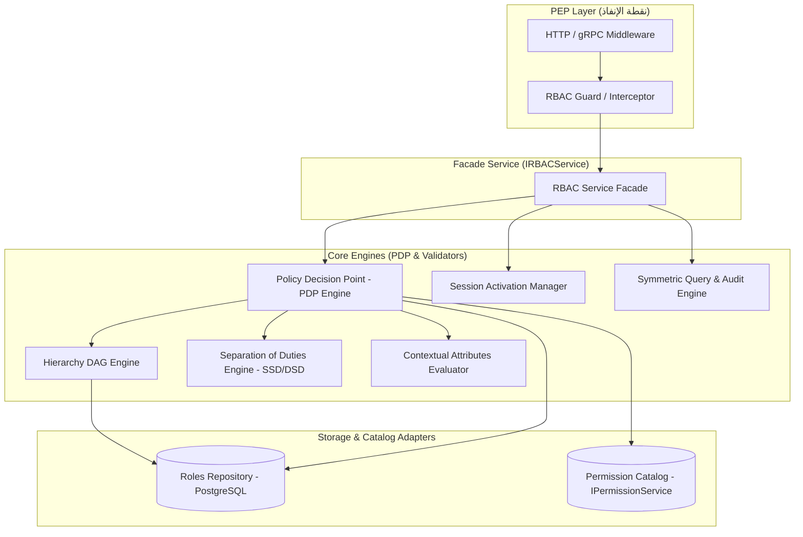
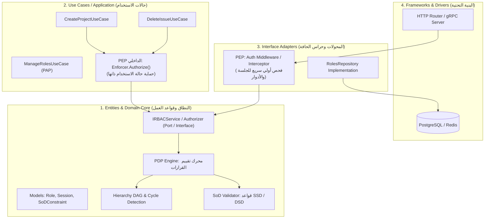

# الخطة التنفيذية الشاملة لبناء محرك نظام الأمان (RBAC Engine)

## بناء وتطوير المحرك داخل حزمة `internal/services/rbac` استناداً إلى المعايير الدولية (NIST / ANSI INCITS 359)

---

## 1. الرؤية الهندسية والأهداف (Architecture Vision & Objectives)

تهدف هذه الخطة التنفيذية إلى تحويل المبادئ والمعايير الموثقة في [الدليل المرجعي الشامل لنظام RBAC](file:///home/osm/StudioProjects/permissions_youtrack/docs/comprehensive_rbac_security_architecture_and_lifecycle_guide.md) إلى **محرك أمان برمجي متكامل، عالي الأداء، ومقاوم للأخطاء (Fault-tolerant & High-Performance)** مكتوب بلغة Go داخل المجلد:
`internal/services/rbac`

### الأهداف الأساسية للمحرك

1. **الامتثال الصارم لمعيار ANSI/INCITS 359:**
   تحقيق المستويات الأربعة المعيارية:
   * **Core RBAC:** إدارة وتعيين الأدوار والصلاحيات والجلسات.
   * **Hierarchical RBAC:** دعم وراثة الأدوار عبر شبكات توجيه غير دائرية (DAG) مع كشف الحلقات الدائرية (Cycle Detection).
   * **Constrained RBAC:** إنفاذ قيود فصل المهام الاستاتيكية (**SSD**) والديناميكية (**DSD**).
   * **Symmetric RBAC:** توفير قدرات الاستعلام المتماثل ثنائي الاتجاه للمراجعة والتدقيق والامتثال.
2. **معمارية التفويض المنفصل (Decoupled PDP/PEP Architecture):**
   فصل نقطة اتخاذ القرار (**PDP - Policy Decision Point**) عن نقاط الإنفاذ (**PEP - Policy Enforcement Point**).
3. **الدعم الهجين الممتد بالسياق (Hybrid RBAC + ABAC):**
   تقييم سمات البيئة والسياق (النطاق المؤسسي Scope، حالة المورد، الوقت، والشبكة) دون التسبب في معضلة "انفجار الأدوار".
4. **الأداء الفائق والأمان الافتراضي:**
   * اعتماد مبدأ **الرفض التلقائي الافتراضي (Fail-Closed / Default Deny)**.
   * تقييم الصلاحيات بسرعة ميكروثانية باستخدام هياكل بيانات في الذاكرة (In-Memory Bitsets/HashMaps) مع آليات مزامنة آمنة للخيوط (`sync.RWMutex`).
5. **التكامل السلس مع الكود الحالي:**
   الربط المحكم مع مستودع البيانات [repositories.RolesService](file:///home/osm/StudioProjects/permissions_youtrack/internal/repositories/roles.go) ونظام كتالوج الصلاحيات [IPermissionService](file:///home/osm/StudioProjects/permissions_youtrack/internal/services/permissions/service.go).

---

## 2. الهيكلية المعمارية لحزمة `internal/services/rbac`

```text
internal/services/rbac/
├── types.go                 # النماذج والهياكل الأساسية (Role, Permission, Session, Assignment, SoD)
├── errors.go                # أخطاء النطاق المعيارية (ErrCircularInheritance, ErrSSDViolation, ...)
├── hierarchy.go             # محرك شجرة ووراثة الأدوار (DAG Graph, Cycle Detection, Transitive Closure)
├── sod.go                   # محرك فصل المهام الاستاتيكي والديناميكي (SSD & DSD Validator)
├── pdp.go                   # نقطة اتخاذ القرار (Policy Decision Point Engine)
├── pep.go                   # نقطة الإنفاذ (Policy Enforcement Point & Middlewares)
├── context.go               # سياق الطلب وتقييم السمات الهجينة (Hybrid RBAC+ABAC Context)
├── session.go               # إدارة الجلسات وتفعيل الأدوار مع فحص DSD
├── symmetric.go             # محرك الاستعلام المتماثل والتدقيق والحوكمة (Symmetric Queries)
├── service.go               # واجهة الخدمة الموحدة (IRBACService) وتنفيذها (Facade Pattern)
├── hierarchy_test.go        # اختبارات الوراثة وكشف الدورات
├── sod_test.go              # اختبارات قيود فصل المهام
├── pdp_test.go              # اختبارات قرارات التفويض والسرعة
└── service_test.go          # اختبارات التكامل الشاملة للمحرك
```



---

## 3. المراحل التنفيذية المتسلسلة (Implementation Phases)

---

### المرحلة 0: النماذج الأساسية وعقود الواجهات (Domain Modeling & Contracts) - [مكتملة ✅]

**الهدف:** وضع حجر الأساس البرمجي لجميع الكيانات والأنواع والواجهات والأخطاء المعيارية.

#### المهام التنفيذية

1. **إنشاء ملف `types.go`:**
   * تعريف هيكل الدور (`Role`):

     ```go
     type RoleID string

     type Role struct {
         ID          RoleID            `json:"id"`
         Name        string            `json:"name"`
         Description string            `json:"description"`
         Permissions []string          `json:"permissions"`
         Parents     []RoleID          `json:"parents,omitempty"` // للأدوار الموروثة
         IsImmutable bool              `json:"immutable"`
         Metadata    map[string]string `json:"metadata,omitempty"`
     }
     ```

   * تعريف هياكل التعيين (`UserAssignment`):

     ```go
     type UserAssignment struct {
         UserID    string     `json:"user_id"`
         RoleIDs   []RoleID   `json:"role_ids"`
         Scope     string     `json:"scope,omitempty"`     // e.g. project_id or global
         ExpiresAt *time.Time `json:"expires_at,omitempty"` // لدعم JIT
     }
     ```

   * تعريف قيود فصل المهام (`SoDConstraint`):

     ```go
     type SoDType string
     const (
         StaticSoD  SoDType = "STATIC"  // SSD
         DynamicSoD SoDType = "DYNAMIC" // DSD
     )

     type SoDConstraint struct {
         ID          string   `json:"id"`
         Name        string   `json:"name"`
         Type        SoDType  `json:"type"`
         Roles       []RoleID `json:"roles"`
         MaxAllowed  int      `json:"max_allowed"` // عادة 1 لمنع الجمع بين دورين متضاربين
         Description string   `json:"description"`
     }
     ```

   * تعريف طلب وقرار التفويض (`AccessRequest` & `Decision`):

     ```go
     type AccessRequest struct {
         SubjectID  string                 // المستخدم أو الحساب الخدمي
         RoleIDs    []RoleID               // الأدوار النشطة في الجلسة
         Permission string                 // الصلاحية المطلوبة
         Resource   string                 // المورد المستهدف
         Scope      string                 // النطاق المؤسسي
         Context    map[string]interface{} // سمات السياق (ABAC)
     }

     type Decision struct {
         Allowed   bool      `json:"allowed"`
         Reason    string    `json:"reason"`
         EvaluatedAt time.Time `json:"evaluated_at"`
     }
     ```

2. **إنشاء ملف `errors.go`:**
   * تعريف أخطاء النطاق الصريحة:
     `ErrRoleNotFound`, `ErrCircularInheritance`, `ErrSSDViolation`, `ErrDSDViolation`, `ErrRoleImmutable`, `ErrAccessDenied`, `ErrSessionExpired`.

#### معايير القبول (DoD)

* جميع الهياكل تلتزم بتنسيق JSON المعياري.
* تطابق حقول `Role` مع التوقعات الموجودة في `internal/repositories/roles.go`.
* التغطية التوثيقية الكاملة للرموز بأسلوب Go Doc.

---

### المرحلة 1: محرك هرمية الأدوار وكشف الحلقات الدائرية (Hierarchical RBAC Engine) - [مكتملة ✅]

**الهدف:** تنفيذ دعم وراثة الأدوار الشجرية والشبكية (DAG) وحساب الإغلاق المتعدي (Transitive Closure) مع المنع الصارم للحلقات الدائرية.

#### المهام التنفيذية

1. **إنشاء ملف `hierarchy.go`:**
   * بناء هيكل المخطط الموجه `RoleGraph`:

     ```go
     type RoleGraph struct {
         mu    sync.RWMutex
         nodes map[RoleID]*Role
         edges map[RoleID][]RoleID // Parent -> Children
     }
     ```

   * تطبيق خوارزمية كشف الدورات (Cycle Detection) باستخدام **DFS مع الألوان الثلاثة (White/Gray/Black)** أو **خوارزمية كان (Kahn's Algorithm)**:
     * منع إضافة أي حافة `Parent -> Child` تؤدي إلى دورة دائرية مع إرجاع `ErrCircularInheritance`.
   * تطبيق دالة حساب الصلاحيات الفعالة الشاملة:
     `GetEffectivePermissions(roleID RoleID) ([]string, error)`
     * دمج الصلاحيات المباشرة للدور مع كافة الصلاحيات الموروثة من جميع الأسلاف (Ancestors).
   * تطبيق دالة استخراج كافة الأدوار الموروثة:
     `GetInheritedRoles(roleID RoleID) ([]RoleID, error)`
2. **إنشاء ملف `hierarchy_test.go`:**
   * اختبار الوراثة البسيطة (A -> B).
   * اختبار الوراثة المتعددة والماسية (Diamond Inheritance: A -> B, C -> D).
   * اختبار كشف الحلقات الذاتية والممتدة (Self-loop & Multi-node cycle) والتحقق من رفضها الحتمي.

#### معايير القبول (DoD)

* اجتياز اختبارات الوراثة بنسبة تغطية 100%.
* زمن استعلام الصلاحيات الفعالة أقل من 10 ميكروثانية بفضل التخزين المؤقت الداخلي للمخطط.

---

### المرحلة 2: محرك قيود فصل المهام (Constrained RBAC: SSD & DSD) - [مكتملة ✅]

**الهدف:** منع الاحتيال وتضارب المصالح عبر التطبيق الرياضي لقيود الفصل الاستاتيكي والديناميكي وفق معيار ANSI 359.

#### المهام التنفيذية

1. **إنشاء ملف `sod.go`:**
   * هيكل مدير قيود فصل المهام `SoDManager`:

     ```go
     type SoDManager struct {
         mu          sync.RWMutex
         constraints map[string]SoDConstraint
     }
     ```

   * تنفيذ فحص **الفصل الاستاتيكي للمهام (Static SoD - SSD):**
     `ValidateUserAssignment(assignedRoles []RoleID, newRole RoleID) error`
     * فحص الأدوار الفعالة (المباشرة والموروثة عبر `RoleGraph`).
     * إذا كان تعيين الدور الجديد يجعل إجمالي الأدوار المنتمية لقيد SSD يتجاوز `MaxAllowed`، يتم رفض العملية فوراً بـ `ErrSSDViolation`.
   * تنفيذ فحص **الفصل الديناميكي للمهام (Dynamic SoD - DSD):**
     `ValidateSessionActivation(activeRoles []RoleID, roleToActivate RoleID) error`
     * فحص الجلسة الجارية: هل يؤدي تفعيل الدور في هذه الجلسة إلى تفعيل دورين متعارضين في قيد DSD؟
     * في حال التعارض يُرفض التفعيل بـ `ErrDSDViolation`.
2. **إنشاء ملف `sod_test.go`:**
   * اختبار محاكاة قيود المحاسبة (منشئ أمر الدفع مقابل معتمد الدفع).
   * اختبار تعارض الأدوار الموروثة غير المباشرة (Conflicting Inherited Roles).
   * اختبار تفعيل الأدوار في جلسات منفصلة (السماح بها في DSD ومنعها في نفس الجلسة).

#### معايير القبول (DoD)

* منع تعيين أي أدوار متضاربة استاتيكياً.
* منع تفعيل أي أدوار متضاربة ديناميكياً في نفس الجلسة مع إمكانية امتلاكها بالتوازي.

---

### المرحلة 3: محرك اتخاذ القرار والإنفاذ (PDP & PEP Pipeline) - [مكتملة ✅]

**الهدف:** بناء المحرك المركزي لتقييم طلبات الوصول وتوفير واجهات الإنفاذ للحماية البرمجية.

#### المهام التنفيذية

1. **إنشاء ملف `pdp.go`:**
   * واجهة ومحرك `IPDPEngine`:

     ```go
     type IPDPEngine interface {
         Evaluate(ctx context.Context, req AccessRequest) Decision
     }
     ```

   * خوارزمية التقييم الصارمة:
     1. فحص مبدئي: إذا كانت قائمة الأدوار فارغة أو الصلاحية فارغة $\rightarrow$ قرار `Deny` فوري.
     2. استخراج الصلاحيات الفعالة لكافة الأدوار النشطة بالطلب (مع حل الوراثة عبر `hierarchy`).
     3. فحص حل الصلاحيات الضمنية والتبعية (Integration with `IPermissionService.ResolveImplied`).
     4. فحص مطابقة الصلاحية المطلوبة.
     5. في حال المطابقة، يتم تمرير الطلب لفاحص السمات السياقية (المرحلة 4).
     6. إرجاع قرار تفصيلي يشمل سبب المنح أو الرفض وتوقيت التقييم.
2. **إنشاء ملف `pep.go`:**
   * بناء `Enforcer`:

     ```go
     type Enforcer struct {
         pdp IPDPEngine
     }
     func (e *Enforcer) Authorize(ctx context.Context, req AccessRequest) error
     func (e *Enforcer) RequirePermission(perm string) func(next Handler) Handler
     ```

   * توفير معترِضات (Guards) تدعم التكامل مع معالجات الطلبات مع تسجيل الأحداث الأمنية (Audit Logging).
3. **إنشاء ملف `pdp_test.go`:**
   * اختبارات حالات المنح المباشر والممنوح عبر الوراثة والمنح عبر الصلاحيات الضمنية.
   * اختبارات الرفض الافتراضي عند عدم وجود تطابق (Default Deny).

#### معايير القبول (DoD)

* تقييم القرار في زمن استجابة قياسي فائق السرعة.
* انعدام أي حالات تسريب للصلاحيات مع إرجاع أسباب واضحة في سجلات التدقيق.

---

### المرحلة 4: الامتداد الهجين وتقييم السياق (Hybrid RBAC + ABAC Context) - [مكتملة ✅]

**الهدف:** كسر معضلة "انفجار الأدوار" بالسماح بفرض شروط ديناميكية على مستوى النطاق والمورد والبيئة.

#### المهام التنفيذية

1. **إنشاء ملف `context.go`:**
   * تعريف مقيّم الشروط السياقية `AttributeEvaluator`:

     ```go
     type AttributeEvaluator func(ctx context.Context, req AccessRequest) (bool, string)
     ```

   * بناء شروط مسبقة شائعة قابلة لإعادة الاستخدام:
     * **مطابقة النطاق المؤسسي (Scope Matcher):** التحقق من أن نطاق الدور يغطي المورد المطلوب (مشروع معين، مؤسسة كاملة، أو مساحة عالمية Global).
     * **شرط الملكية الذاتية (Inherent Ownership Condition):** التحقق مما إذا كان المستخدم هو صاحب الكائن/التقرير (Reporter/Author) بالتكامل مع `CheckInherentAccess`.
     * **شروط النافذة الزمنية (Time-Window / JIT Expiry):** فحص صلاحية التعيين الزمني.
2. دمج مقيّم السمات داخل خط أنابيب `PDP`:
   * إذا اجتاز المستخدم فحص الدور (RBAC Check)، يُشترط اجتياز كافة شروط السمات (ABAC Check) ليصدر قرار `Allow`.

#### معايير القبول (DoD)

* إمكانية استخدام نفس الدور العام (مثل `Developer`) مع تقييده لمشروع محدد برمجياً دون تكرار إنشاء الأدوار.

---

### المرحلة 5: إدارة الجلسات والوصول المؤقت (Session Manager & JIT Access) - [مكتملة ✅]

**الهدف:** إدارة تفعيل الأدوار لحظياً داخل الجلسات ودعم التزويد المؤقت ذو الصلاحية المحدودة زمنياً (Just-In-Time).

#### المهام التنفيذية

1. **إنشاء ملف `session.go`:**
   * هيكل الجلسة `Session`:

     ```go
     type Session struct {
         ID          string               `json:"id"`
         UserID      string               `json:"user_id"`
         ActiveRoles map[RoleID]time.Time `json:"active_roles"` // الدور ووقت الانتهاء
         CreatedAt   time.Time            `json:"created_at"`
         ExpiresAt   time.Time            `json:"expires_at"`
     }
     ```

   * دوال إدارة الجلسة:
     * `CreateSession(userID string, initialRoles []RoleID) (*Session, error)`
     * `ActivateRole(sessionID string, role RoleID, ttl time.Duration) error` (مع فحص DSD الإلزامي)
     * `DeactivateRole(sessionID string, role RoleID) error`
     * `GetActivePermissions(sessionID string) ([]string, error)`
2. تصفية الأدوار المنتهية تلقائياً عند كل استعلام (Auto-eviction of expired JIT roles).

#### معايير القبول (DoD)

* ضمان عدم استمرار أي دور مؤقت (JIT) بعد انتهاء مدة الـ TTL المحددة له.
* فرض قيد DSD عند محاولة تفعيل دور إضافي في جلسة قائمة.

---

### المرحلة 6: الاستعلام المتماثل والحوكمة والتدقيق (Symmetric RBAC & Governance) - [مكتملة ✅]

**الهدف:** الالتزام بالمستوى الرابع ANSI 359 لدعم التدقيق الأمني ومراجعة الاعتمادات والامتثال.

#### المهام التنفيذية

1. **إنشاء ملف `symmetric.go`:**
   * توفير دوال الاستعلام ثنائي الاتجاه المعتمدة:
     * **من منظور المستخدم:** `GetUserEffectivePermissions(userID string) ([]string, error)`
     * **من منظور الكائن/الصلاحية (المتعاكس):** `GetUsersWithPermission(permKey string) ([]string, error)`
     * **استعلام تضاربات الأدوار القائمة:** `AuditSoDViolations() ([]SoDViolationReport, error)`
     * **كشف الأدوار المهجورة (Stale Roles):** `FindStaleRoles(unusedSince time.Duration) ([]RoleID, error)`
2. توفير تقارير التدقيق المتوافقة مع معايير SOX و ISO 27001.

#### معايير القبول (DoD)

* إمكانية الإجابة اللحظية على استفسار التدقيق: "من يملك صلاحية حذف المشاريع في النظام بأكمله؟" بدقة 100%.

---

### المرحلة 7: واجهة الخدمة الموحدة والتكامل مع التخزين (Facade & Storage Integration) - [مكتملة ✅]

**الهدف:** تجميع مكونات المحرك في واجهة واحدة موحدة (`IRBACService`) وربطها مع قاعدة البيانات.

#### المهام التنفيذية

1. **إنشاء ملف `service.go`:**
   * تعريف الواجهة الموحدة الشاملة:

     ```go
     type IRBACService interface {
         // إدارة الأدوار والوراثة (PAP)
         CreateRole(ctx context.Context, role *Role) (*Role, error)
         GetRole(ctx context.Context, id RoleID) (*Role, error)
         UpdateRole(ctx context.Context, role *Role) (*Role, error)
         DeleteRole(ctx context.Context, id RoleID) error
         AddRoleInheritance(ctx context.Context, parent, child RoleID) error
         
         // قيود فصل المهام (SoD)
         AddSoDConstraint(ctx context.Context, constraint SoDConstraint) error
         
         // التعيين والتزويد (Provisioning)
         AssignRoleToUser(ctx context.Context, userID string, role RoleID, scope string, ttl *time.Duration) error
         RevokeRoleFromUser(ctx context.Context, userID string, role RoleID, scope string) error
         
         // إدارة الجلسات (Sessions & Activation)
         CreateSession(ctx context.Context, userID string, roles []RoleID) (*Session, error)
         ActivateRoleInSession(ctx context.Context, sessionID string, role RoleID) error
         
         // اتخاذ القرار والإنفاذ (PDP / PEP)
         Authorize(ctx context.Context, req AccessRequest) (bool, error)
         Evaluate(ctx context.Context, req AccessRequest) Decision
         
         // الاستعلام المتماثل والتدقيق (Symmetric RBAC)
         GetEffectivePermissions(ctx context.Context, roleID RoleID) ([]string, error)
         GetUsersWithPermission(ctx context.Context, permission string) ([]string, error)
         AuditCompliance(ctx context.Context) (*ComplianceReport, error)
     }
     ```

2. **التكامل مع `repositories.RolesService` و `IPermissionService`:**
   * استخدام المستودع لحفظ وقراءة الأدوار في PostgreSQL.
   * استخدام كتالوج الصلاحيات للتحقق من شرعية مسميات الصلاحيات وفك الصلاحيات الضمنية.

#### معايير القبول (DoD)

* عمل الحزمة كوحدة مستقلة ومتماسكة يمكن حقنها في أي جزء من المشروع عبر نمط حقن التبعيات (Dependency Injection).

---

### المرحلة 8: الاختبارات المتقدمة، محاكاة الأداء والتحقق الصارم (Benchmarking & Verification) - [مكتملة ✅]

**الهدف:** التأكد من صمود المحرك تحت الضغط العالي والتحقق من متانة التزامن والأمان.

#### المهام التنفيذية

1. **إنشاء اختبارات التزامن (Concurrency & Race Conditions):**
   * تشغيل اختبارات مكثفة مع راية الفحص `-race` للتحقق من أمان القراءة والكتابة المتزامنة على المخطط والجلسات.
2. **اختبارات الأداء القياسية (Benchmarks):**
   * قياس زمن استدعاء `Evaluate`: الهدف $\le 5\,\mu\text{s}$ لكل طلب في الذاكرة.
   * قياس استهلاك الذاكرة وتفادي التخصيصات غير الضرورية (Zero/Low Allocation).
3. **اختبارات الحالات الحدية (Edge Cases):**
   * محاولة إحداث Deadlocks في شجرة الأدوار.
   * محاولة تجاوز قيود SoD عبر الوراثة المتعددة المتداخلة.

#### معايير القبول (DoD)

* تغطية اختبارات إجمالية تفوق 90%.
* اجتياز كامل اختبارات `go test -race -bench=.` بنجاح تام.

---

## 4. مصفوفة تتبع المتطلبات والاعتمادية (Traceability & Dependency Matrix)


| المرحلة | الاعتماديات السابقة | الملفات المستهدفة | معيار النجاح الرئيسي |
| :--- | :--- | :--- | :--- |
| **المرحلة 0** | لا يوجد | `types.go`, `errors.go` | جاهزية العقود والهياكل المعيارية |
| **المرحلة 1** | المرحلة 0 | `hierarchy.go`, `hierarchy_test.go` | كشف الدورات بنسبة 100% وحساب الوراثة بدقة |
| **المرحلة 2** | المرحلة 1 | `sod.go`, `sod_test.go` | منع انتهاكات SSD و DSD استاتيكياً وديناميكياً |
| **المرحلة 3** | المرحلة 1, 2 | `pdp.go`, `pep.go`, `pdp_test.go` | تنفيذ قرارات Fail-Closed فائقة السرعة |
| **المرحلة 4** | المرحلة 3 | `context.go` | تقييم شروط النطاق والملكية دون انفجار الأدوار |
| **المرحلة 5** | المرحلة 2, 3 | `session.go` | دعم فترات الصلاحية (TTL) والتفعيل المشروط بـ DSD |
| **المرحلة 6** | المرحلة 1, 3 | `symmetric.go` | استعلامات معكوسة لحظية (Who has permission X?) |
| **المرحلة 7** | المراحل 0-6 | `service.go`, `service_test.go` | واجهة موحدة `IRBACService` مربوطة مع PostgreSQL |
| **المرحلة 8** | المرحلة 7 | `*_benchmark_test.go` | سرعة تقييم $\le 5\,\mu\text{s}$ وخلو تام من تضارب الخيوط |

---

## 5. إرشادات وتوجيهات التنفيذ (Engineering Guidelines)

1. **الصرامة والأمان الافتراضي (Fail-Closed by Design):**
   في أي حالة غير مؤكدة، أو عند حدوث خطأ غير متوقع أثناء القراءة، يجب أن يكون القرار الافتراضي دائماً هو **الرفض (`Deny`)**.
2. **عزل التزامن (Thread Safety):**
   يجب حماية جميع المخططات والجلسات والذاكرة المؤقتة بـ `sync.RWMutex`. يجب تفضيل قفل القراءة (`RLock`) في عمليات الاستعلام والتفويض، وقفل الكتابة (`Lock`) فقط عند تعديل الأدوار أو القيود.
3. **تجنب التبعيات الدائرية مع باقي الحزم:**
   يجب أن تكون حزمة `internal/services/rbac` نقية معمارياً وتعتمد فقط على الواجهات (`Interfaces`) للاتصال بمستودعات البيانات وكتالوج الصلاحيات، مما يتيح اختبارها عبر Mocking كامل ومستقل.
4. **التوافق التام مع Go Idiomatic Standards:**
   التزام كامل بمعايير التسمية، وتمرير `context.Context` كأول معامل في كافة دوال الواجهات، ومعالجة الأخطاء الصريحة دون استخدام `panic`.

---

## 6. تكامل محرك RBAC مع المعمارية النظيفة (Clean Architecture Integration)

في **المعمارية النظيفة (Clean Architecture)**، لا يُوضع نظام الأمان في مكان واحد ككتلة صلبة، بل **يتوزع وفق معمارية التفويض المنفصل (Decoupled PEP / PDP)** عبر طبقات المعمارية المختلفة استناداً إلى **مبدأ عكس التبعية (Dependency Inversion Principle - DIP)** ومبدأ **الدفاع في العمق (Defense in Depth)**.

المحرك الذي تم بناؤه في `internal/services/rbac` يتوزع بدقة على النحو التالي:



### 1. في قلب النطاق: طبقة الكيانات (Entities & Domain Layer)

* **نماذج الأمان الجوهرية:** كينونة الدور (`Role`)، الصلاحية (`Permission`)، قيود فصل المهام (`SoDConstraint`)، وشروط الوراثة.
* **محرك شجرة الوراثة (`RoleGraph` DAG):** كشف الحلقات الدائرية (Cycle Detection) وحساب الإغلاق المتعدي للصلاحيات هي **قواعد عمل مؤسسية صرفة (Enterprise Business Rules)** لا تعتمد على أي إطار خارجي أو قاعدة بيانات.
* **محرك قيود فصل المهام (`SoDManager`):** منطق منع الجمع بين الأدوار المتضاربة (SSD) وتفعيلها (DSD) ينتمي لصلب النطاق.
* **منفذ الواجهة (Port / Interface):** واجهة مجردة مثل `IRBACService` أو `Authorizer` تُعرف هنا، لكي تعتمد عليها طبقة حالات الاستخدام دون أن تعرف تفاصيل التنفيذ الداخلي (تطبيق مبدأ DIP).

---

### 2. في طبقة حالات الاستخدام (Use Cases / Application Layer)

* **نقطة الإنفاذ الداخلية (Internal PEP - Defense in Depth):**
  الخطأ الشائع في بعض التطبيقات هو فحص الصلاحيات فقط في الـ HTTP Middleware؛ إذا استُدعي الـ Use Case لاحقاً عبر Background Worker أو gRPC أو CLI Command، يصبح النظام مخترقاً!
  لذلك، في المعمارية النظيفة، يُحقن الـ `Authorizer` داخل كل Use Case:

  ```go
  type DeleteIssueUseCase struct {
      repo       IssueRepository
      authorizer rbac.IRBACService // حقن منفذ الأمان (Port)
  }

  func (uc *DeleteIssueUseCase) Execute(ctx context.Context, cmd DeleteIssueCommand) error {
      // 1. فحص الصلاحية داخل حالة الاستخدام نفسها
      err := uc.authorizer.Authorize(ctx, rbac.AccessRequest{
          SubjectID:  cmd.UserID,
          RoleIDs:    cmd.ActiveRoles,
          Permission: "DELETE_ISSUE",
          Resource:   cmd.IssueID,
          Scope:      cmd.ProjectID,
          Context:    map[string]any{"owner_id": cmd.IssueOwnerID},
      })
      if err != nil {
          return err // ErrAccessDenied
      }

      // 2. تنفيذ منطق العمل بعد التأكد التام
      return uc.repo.Delete(ctx, cmd.IssueID)
  }
  ```

* **حالات استخدام إدارة الأمان (PAP Use Cases):**
  عمليات إنشاء الأدوار، منح الأدوار للمستخدمين، وتفعيل جلسات الـ JIT تكون عبارة عن Use Cases مستقلة تستدعي المحرك.

---

### 3. في طبقة محولات الواجهات (Interface Adapters / Presentation)

* **نقطة الإنفاذ الخارجية لحراسة البوابة (Edge PEP - HTTP Middleware / Interceptor):**
  * اعتراض الطلب فور وصوله من الـ Router (Gin/Echo/Chi).
  * فك الـ Token واستخراج معرّف المستخدم وجلسة العمل (`Session`).
  * استدعاء الـ `SessionManager` للتحقق من عدم انتهاء الجلسة واستخراج الأدوار النشطة.
  * إجراء فحص سريع (Coarse-Grained Check): هل يملك المستخدم الصلاحية المبدئية لدخول هذا المسار؟ إذا لا $\rightarrow$ إرجاع `403 Forbidden` فوراً وتوفير موارد السيرفر (**Fast Fail**).

---

### 4. في طبقة البنية التحتية (Frameworks & Drivers / Infrastructure)

* تطبيق واجهة المستودع `RoleRepository` باستخدام **PostgreSQL / PGX** لحفظ واسترجاع الأدوار.
* تخزين جلسات العمل (`SessionManager`) المؤقتة في **Redis** بدلاً من الذاكرة المحلية إذا كان النظام موزعاً على عدة خوادم (Distributed Sessions).

---

### جدول المقارنة المعمارية للمحرك

| المكون الأمني في المحرك | مكانه في المعمارية النظيفة | الدور الوظيفي |
| :--- | :--- | :--- |
| **`Role`, `RoleGraph`, `SoD`** | **Domain Entities & Logic** | قواعد الأمان والوراثة وفصل المهام الخالصة المستقلة عن أي إطار. |
| **`PDPEngine` (نقطة القرار)** | **Domain / Application Service** | تقييم طلبات الوصول وتطبيق سياسة الرفض الافتراضي (Fail-Closed). |
| **`Enforcer` (نقطة الإنفاذ - PEP)** | **Adapters (Middlewares) + Use Cases** | حراسة المداخل السريعة (Edge) وحماية حالات الاستخدام (Use Case Guards). |
| **`SessionManager` & JIT** | **Application Services** | إدارة سياق الجلسات والتفعيل المؤقت للأدوار مع فحص DSD. |
| **`RoleRepository`** | **Infrastructure Layer** | التخزين الدائم للأدوار في قاعدة البيانات وتنفيذ واجهة الـ Port. |
