# مخطط الطبقات لاعتماديات صلاحية Read Project Basic

## (Hierarchical Dependency Layers of Read Project Basic)

**تاريخ التوليد:** 10 أكتوبر 2026  
**الملف البرمجي المرتبط:** [`internal/services/permissions_services/permissions.go`](file:///home/osm/StudioProjects/permissions_youtrack/internal/services/permissions_services/permissions.go)  
**ملف المخطط الصوري (SVG):** [`docs/read_project_basic_layers.svg`](file:///home/osm/StudioProjects/permissions_youtrack/docs/read_project_basic_layers.svg)  
**ملف كود المخطط (Mermaid):** [`docs/read_project_basic_layers.mmd`](file:///home/osm/StudioProjects/permissions_youtrack/docs/read_project_basic_layers.mmd)  

---

## 1. نظرة عامة ودليل الألوان (Legend & Layer Concepts)

في نظام **YouTrack**، تمثل صلاحية **`Read Project Basic`** حجر الأساس (Root Anchor) لجميع العمليات التي تتم داخل سياق المشروع (`ScopeProject`). يوضح هذا المخطط تصنيف جميع الصلاحيات الـ 18 المرتبطة بها عبر **4 طبقات هيكلية (Layers 0 to 3)**:

| الطبقة (Layer) | التصنيف | عدد الصلاحيات | اللون في المخطط | آلية السقوط عند إلغاء `Read Project Basic` |
| :--- | :--- | :---: | :---: | :--- |
| **الطبقة 0 (Layer 0)** | الصلاحية الجذرية (Core Anchor) | 1 | 🟣 بنفسجي غامق (`#1E1B4B`) | هي الصلاحية المستهدفة بالسحب أو الإلغاء. |
| **الطبقة 1 (Layer 1)** | اعتماديات مباشرة في الكود (1st Degree) | 6 | 🟢 أخضر زمردي (`#064E3B`) | تسقط **فوراً ومباشرة** لأنها تذكر صراحة `Implies Read Project Basic`. |
| **الطبقة 2 (Layer 2)** | اعتماديات متعدية في الكود (2nd Degree) | 4 | 🟠 كهرماني/بني (`#78350F`) | تسقط **تلقائياً بالتعدي** عبر وسيط من الطبقة 1. |
| **المسار السياقي (L1 & L2 & L3)** | مسار المقالات والتعليقات (وثائق YouTrack) | 8 | 🟣 بنفسجي ساطع (`#581C87`) | اعتماديات **سياقية ووظيفية** في واجهة المنصة (مربوطة بخطوط منقطة). |

---

## 2. المخطط التفاعلي الهرمي للطبقات (Interactive Diagram)

```mermaid
flowchart TB

    %% -------------------------------------------------------------------------
    %% إعدادات التنسيق والألوان العامة (Themes & Styling)
    %% -------------------------------------------------------------------------
    classDef layer0 fill:#1E1B4B,stroke:#6366F1,stroke-width:3px,color:#FFFFFF,font-weight:bold;
    classDef layer1Code fill:#064E3B,stroke:#10B981,stroke-width:2px,color:#FFFFFF,font-weight:bold;
    classDef layer2Code fill:#78350F,stroke:#F59E0B,stroke-width:2px,color:#FFFFFF,font-weight:bold;
    classDef layerArticle fill:#581C87,stroke:#A855F7,stroke-width:2px,color:#FFFFFF,font-weight:bold;
    classDef layerComment fill:#4A044E,stroke:#E879F9,stroke-width:2px,color:#FFFFFF,font-weight:bold;

    %% -------------------------------------------------------------------------
    %% الطبقة 0: الجذر الأساسي (Layer 0 - Root Anchor)
    %% -------------------------------------------------------------------------
    subgraph L0 ["الطبقة 0: الصلاحية الجذرية للمشروع (Core Anchor)"]
        RPB["READ_PROJECT_BASIC<br/><b>Read Project Basic</b><br/><i>(معلومات وهوية المشروع الأساسية)</i>"]:::layer0
    end

    %% -------------------------------------------------------------------------
    %% الطبقة 1: الاعتماديات المباشرة المسجلة في الكود (Layer 1 - Direct Dependents)
    %% -------------------------------------------------------------------------
    subgraph L1 ["الطبقة 1: الاعتماديات المباشرة في الكود (Direct Code Dependents - 1st Degree)"]
        direction TB
        subgraph L1_PROJ ["إدارة تفاصيل المشروع"]
            RPF["READ_PROJECT<br/><b>Read Project Full</b>"]:::layer1Code
        end

        subgraph L1_ISSUES ["عمليات التذاكر الأساسية"]
            CI["CREATE_ISSUE<br/><b>Create Issue</b>"]:::layer1Code
            RI["READ_ISSUE<br/><b>Read Issue</b>"]:::layer1Code
            RIPF["PRIVATE_READ_ISSUE<br/><b>Read Issue Private Fields</b>"]:::layer1Code
            VV["VIEW_VOTERS<br/><b>View Voters</b>"]:::layer1Code
            VW["VIEW_WATCHERS<br/><b>View Watchers</b>"]:::layer1Code
        end

        subgraph L1_DOCS ["مسار المعرفة (في الوثائق الرسمية)"]
            RA["READ_ARTICLE<br/><b>Read Article</b><br/><i>(مشروط بـ Read Project Basic)</i>"]:::layerArticle
        end
    end

    %% -------------------------------------------------------------------------
    %% الطبقة 2: الاعتماديات المتعدية - الدرجة الثانية (Layer 2 - Transitive Dependents)
    %% -------------------------------------------------------------------------
    subgraph L2 ["الطبقة 2: الاعتماديات المتعدية - الدرجة الثانية (Transitive Dependents - 2nd Degree)"]
        direction TB
        subgraph L2_PROJ_MGMT ["إدارة وتعديل وحذف المشروع"]
            UP["UPDATE_PROJECT<br/><b>Update Project</b>"]:::layer2Code
            DP["DELETE_PROJECT<br/><b>Delete Project</b>"]:::layer2Code
        end

        subgraph L2_ISSUE_PRIV ["الحقول والقيود الخاصة بالتذاكر"]
            OVR["READ_HIDDEN_STUFF<br/><b>Override Visibility</b>"]:::layer2Code
            UIPF["PRIVATE_UPDATE_ISSUE<br/><b>Update Private Fields</b>"]:::layer2Code
        end

        subgraph L2_ARTICLE_OPS ["عمليات مقالات قاعدة المعرفة"]
            CA["CREATE_ARTICLE<br/><b>Create Article</b>"]:::layerArticle
            UA["UPDATE_ARTICLE<br/><b>Update Article</b>"]:::layerArticle
            DA["DELETE_ARTICLE<br/><b>Delete Article</b>"]:::layerArticle
            RAC["READ_ARTICLE_COMMENT<br/><b>Read Article Comment</b>"]:::layerArticle
        end
    end

    %% -------------------------------------------------------------------------
    %% الطبقة 3: الاعتماديات المتعدية - الدرجة الثالثة (Layer 3 - Tertiary Dependents)
    %% -------------------------------------------------------------------------
    subgraph L3 ["الطبقة 3: الاعتماديات المتعدية - الدرجة الثالثة (Transitive Dependents - 3rd Degree)"]
        subgraph L3_COMMENTS ["عمليات تعليقات المقالات"]
            CAC["CREATE_ARTICLE_COMMENT<br/><b>Create Article Comment</b>"]:::layerComment
            UAC["UPDATE_ARTICLE_COMMENT<br/><b>Update Article Comment</b>"]:::layerComment
            DAC["DELETE_ARTICLE_COMMENT<br/><b>Delete Article Comment</b>"]:::layerComment
        end
    end

    %% -------------------------------------------------------------------------
    %% الروابط المباشرة من الجذر (Direct Links from L0)
    %% -------------------------------------------------------------------------
    RPB --> RPF
    RPB --> CI
    RPB --> RI
    RPB --> RIPF
    RPB --> VV
    RPB --> VW

    %% الرابط السياقي للمقالات في الوثائق
    RPB -.-> RA

    %% -------------------------------------------------------------------------
    %% روابط الطبقة الثانية (L1 -> L2)
    %% -------------------------------------------------------------------------
    RPF --> UP
    RPF --> DP

    RIPF --> OVR
    RIPF --> UIPF

    RA -.-> CA
    RA -.-> UA
    RA -.-> DA
    RA -.-> RAC

    %% -------------------------------------------------------------------------
    %% روابط الطبقة الثالثة (L2 -> L3)
    %% -------------------------------------------------------------------------
    RAC -.-> CAC
    RAC -.-> UAC
    RAC -.-> DAC
```



---

## 3. الجدول التفصيلي لطبقات الصلاحيات الـ 18 ومسار سقوطها

| # | الصلاحية (`DisplayName`) | المعرف البرمجي (`PermKey`) | الطبقة (`Layer`) | نوع الاعتمادية | الصلاحية الوسيطة التي ترتبط بها | مسار السقوط المتسلسل (`Revocation Chain`) |
| :-: | :--- | :--- | :---: | :--- | :--- | :--- |
| **0** | **Read Project Basic** | `PermReadProjectBasic` | **0** | **الجذر (Root)** | - | الصلاحية الأساسية الملغاة. |
| **1** | **Read Project Full** | `PermReadProjectFull` | **1** | مباشر بالكود | `Read Project Basic` | تسقط مباشرة: `RPB` $\to$ `RPF`. |
| **2** | **Create Issue** | `PermCreateIssue` | **1** | مباشر بالكود | `Read Project Basic` | تسقط مباشرة: `RPB` $\to$ `CI`. |
| **3** | **Read Issue** | `PermReadIssue` | **1** | مباشر بالكود | `Read Project Basic` | تسقط مباشرة: `RPB` $\to$ `RI`. |
| **4** | **Read Issue Private Fields** | `PermReadIssuePrivateFields` | **1** | مباشر بالكود | `Read Project Basic` | تسقط مباشرة: `RPB` $\to$ `RIPF`. |
| **5** | **View Voters** | `PermViewVoters` | **1** | مباشر بالكود | `Read Project Basic` | تسقط مباشرة: `RPB` $\to$ `VV`. |
| **6** | **View Watchers** | `PermViewWatchers` | **1** | مباشر بالكود | `Read Project Basic` | تسقط مباشرة: `RPB` $\to$ `VW`. |
| **7** | **Update Project** | `PermUpdateProject` | **2** | متعدٍ بالكود | `Read Project Full` | `RPB` $\to$ `RPF` $\to$ `UP`. |
| **8** | **Delete Project** | `PermDeleteProject` | **2** | متعدٍ بالكود | `Read Project Full` | `RPB` $\to$ `RPF` $\to$ `DP`. |
| **9** | **Override Visibility Restrictions** | `PermOverrideVisibility` | **2** | متعدٍ بالكود | `Read Issue Private Fields` | `RPB` $\to$ `RIPF` $\to$ `OVR`. |
| **10** | **Update Issue Private Fields** | `PermUpdateIssuePrivateFields` | **2** | متعدٍ بالكود | `Read Issue Private Fields` | `RPB` $\to$ `RIPF` $\to$ `UIPF`. |
| **11** | **Read Article** | `PermReadArticle` | **1 (سياقي)** | شرط سياقي بالوثائق | `Read Project Basic` | شرط فتح مقالات المشروع في واجهة يوتراك. |
| **12** | **Create Article** | `PermCreateArticle` | **2 (سياقي)** | متعدٍ عبر المقال | `Read Article` | `RPB` $\dashrightarrow$ `RA` $\to$ `CA`. |
| **13** | **Update Article** | `PermUpdateArticle` | **2 (سياقي)** | متعدٍ عبر المقال | `Read Article` | `RPB` $\dashrightarrow$ `RA` $\to$ `UA`. |
| **14** | **Delete Article** | `PermDeleteArticle` | **2 (سياقي)** | متعدٍ عبر المقال | `Read Article` | `RPB` $\dashrightarrow$ `RA` $\to$ `DA`. |
| **15** | **Read Article Comment** | `PermReadArticleComment` | **2 (سياقي)** | متعدٍ عبر المقال | `Read Article` | `RPB` $\dashrightarrow$ `RA` $\dashrightarrow$ `RAC`. |
| **16** | **Create Article Comment** | `PermCreateArticleComment` | **3 (سياقي)** | متعدٍ عبر تعليق المقال | `Read Article Comment` | `RPB` $\dashrightarrow$ `RA` $\dashrightarrow$ `RAC` $\to$ `CAC`. |
| **17** | **Update Article Comment** | `PermUpdateArticleComment` | **3 (سياقي)** | متعدٍ عبر تعليق المقال | `Read Article Comment` | `RPB` $\dashrightarrow$ `RA` $\dashrightarrow$ `RAC` $\to$ `UAC`. |
| **18** | **Delete Article Comment** | `PermDeleteArticleComment` | **3 (سياقي)** | متعدٍ عبر تعليق المقال | `Read Article Comment` | `RPB` $\dashrightarrow$ `RA` $\dashrightarrow$ `RAC` $\to$ `DAC`. |

---

## 4. الشرح التفصيلي للطبقات وسلوك المحرك البرمجي

### 1. الطبقة 0 (الجذر الأساسي - Core Anchor)

- **`Read Project Basic`**: في نموذج JetBrains Hub/YouTrack، هذه الصلاحية تمنح رؤية اسم ومعرف وشعار المشروع.
- بدون هذه الصلاحية، لا يظهر المشروع في قائمة المشاريع للمستخدم أساساً، وبالتالي يصبح الوصول لأي كيان فرعي مستحيلاً تقنياً.

### 2. الطبقة 1 في الكود (الاعتماد المباشر - 1st Degree)

- مسجلة نصاً في كود `permissions.go` السطر 419:

  ```go
  DependentPerms: []PermKey{
      PermReadProjectFull,
      PermCreateIssue,
      PermReadIssue,
      PermReadIssuePrivateFields,
      PermViewVoters,
      PermViewWatchers,
  }
  ```

- كل صلاحية من هذه الصلاحيات الست تنص حرفياً في توثيق JetBrains الرسمي على: *(Implies Read Project Basic)*.

### 3. الطبقة 2 في الكود (الاعتماد المتعدي - 2nd Degree)

- لا ترتبط مباشرة بـ `Read Project Basic`، بل ترتبط بعقد الطبقة الأولى:
  - `Update Project` و `Delete Project` ترتبطان بـ `Read Project Full`.
  - `Override Visibility` و `Update Issue Private Fields` ترتبطان بـ `Read Issue Private Fields`.
- **سلوك الكود وقت الإلغاء:** عند استدعاء دالة `ResolveRevocation(active, PermReadProjectBasic)`، يقوم محرك البحث العرضي (BFS) في ملف [`service.go`](file:///home/osm/StudioProjects/permissions_youtrack/internal/services/permissions_services/service.go#L110) بزيارة الطبقة 1 ثم تتبع فروعها إلى الطبقة 2 وإلغاء الصلاحيات الأربع تلقائياً.

### 4. مسار المقالات (الطبقات 1 و 2 و 3 السياقية بالوثائق الرسمية)

- في وثائق YouTrack، تم التنصيص على:
  > *"Note that users are only able to view articles in projects where they have the Read Project Basic permission."*
- لذلك فإن مقالات قاعدة المعرفة وتعليقاتها الـ 8 تفقد جدواها وإمكانية فتحها وظيفياً في واجهة المنصة عند فقدان `Read Project Basic`، مع أنها في الكود الحالي غير مربوطة برابط `Implied` صريح بين `Read Article` و `Read Project Basic`.
