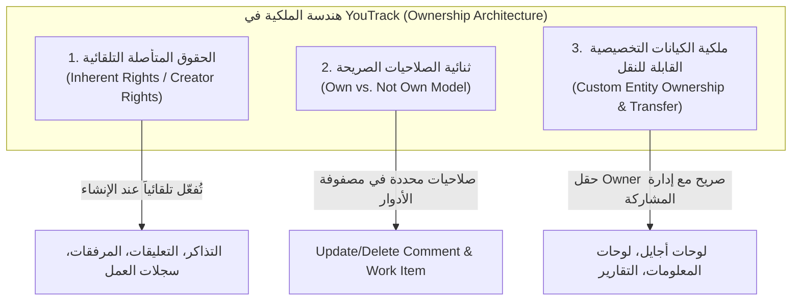
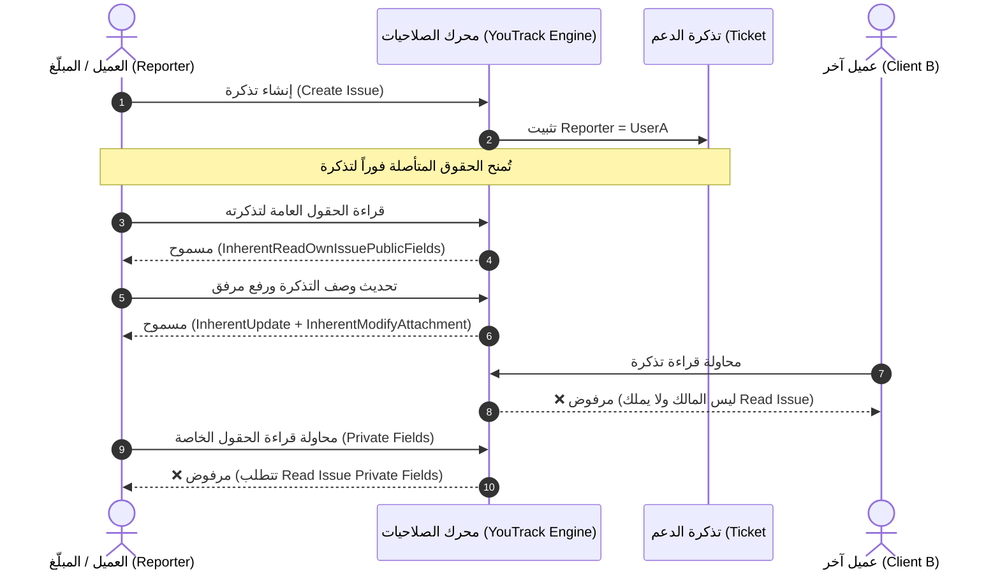

# بحث معماري: مفهوم الملكية المتأصلة (Inherent Ownership) في نظام صلاحيات YouTrack

> **توثيق رسمي وبحث تحليلي مستند إلى المصادر الرسمية لمنصة JetBrains YouTrack**  
> **تاريخ الإعداد:** 2026-10-04  
> **المصادر الرسمية المعتمدة:**
>
> - [JetBrains YouTrack Documentation - Permissions Reference](https://www.jetbrains.com/help/youtrack/devportal/Permissions.html)
> - [JetBrains YouTrack Documentation - Default Roles & Permissions](https://www.jetbrains.com/help/youtrack/server/roles.html)
> - [JetBrains YouTrack Documentation - Helpdesk Projects & Reporter Access](https://www.jetbrains.com/help/youtrack/server/helpdesk-reporters.html)
> - [JetBrains YouTrack Documentation - Managing Dashboards, Agile Boards, and Reports Ownership](https://www.jetbrains.com/help/youtrack/server/dashboards-and-widgets.html)

---

## 1. المقدمة والمفهوم الرسمي للملكية المتأصلة (Inherent Permissions)

في أنظمة التحكم في الوصول التقليدية القائمة على الأدوار الصرفة (**Pure RBAC**)، تُمنح الصلاحيات عادةً بشكل عام ومجرد على مستوى نطاق المشروع أو النظام (Project/Global Scope). في مثل هذا النموذج، إذا أراد مستخدم تعديل مشكلة قام بإنشائها بنفسه، يجب منحه صلاحية عامة مثل `Update Issue`، مما يفتح الباب أمنياً لتعديل مشكلات الآخرين، أو يتطلب تعقيد الأدوار بشكل هائل.

لحل هذه المعضلة الهندسية، تقدم منصة **JetBrains YouTrack** مفهوماً محورياً يسمى رسميًا في وثائقها:  
> **"Inherent Permissions"** (الحقوق المتأصلة) أو **حقوق ملكية منشئ المحتوى (Creator/Reporter Rights)**.

### النص الصريح في التوثيق الرسمي لـ YouTrack
>
> *"When you have permission to create an entity in YouTrack, you automatically inherit the permission to read your own content, even if you do not have the general Read permission for that entity type."*
>
> *"Issue reporters always have permission to view and update public fields and add links to the issues they created. Consequently, users with the Create Issue permission can perform these actions on the issues they reported, even without explicit Read Issue, Update Issue, or Link Issues permissions."*

### جوهر المفهوم

الملكية المتأصلة هي **امتياز وصول تلقائي مشتق من العلاقة الوجودية بين المستخدم والمورد الذي أنشأه بنفسه (Relationship/Ownership-Derived Access)**؛ حيث يكفي امتلاك المستخدم للحد الأدنى من الصلاحية التمكينية (مثل صلاحية الإنشاء `Create`) ليتولى محرك الصلاحيات تلقائياً منحه حزمة حقوق قراءة وتعديل وإدارة محصورة على المورد الخاص به دون المساس بموارد الآخرين.

---

## 2. الأركان المعمارية الثلاثة لنظام الملكية في YouTrack

لا يتعامل YouTrack مع الملكية كخاصية هامشية، بل يقسمها معمارياً عبر ثلاثة مستويات متكاملة:



---

### الركن الأول: الحقوق المتأصلة التلقائية لمنشئ المحتوى (Inherent Rights)

تنشأ هذه الحقوق ديناميكياً عند تحقق شرطين معاً:

1. أن يكون المستخدم هو منشئ أو مبلّغ الكيان (`IsAuthor == true` أو `IsReporter == true`).
2. أن يمتلك المستخدم الصلاحية التمكينية لإنشاء ذلك الكيان في نطاق المشروع المعني.

#### جدول الحقوق المتأصلة الرسمية حسب المصادر

| الكيان (Entity) | الصلاحية التمكينية المطلوبة | الحقوق المتأصلة الممنوحة تلقائياً للمالك | الصلاحيات العامة التي يتم الاستغناء عنها |
| :--- | :--- | :--- | :--- |
| **التذكرة (Issue)** | `Create Issue` | • قراءة الحقول العامة للتذكرة (`Read Public Fields`)<br>• تعديل الحقول العامة للتذكرة (`Update Public Fields`)<br>• إضافة روابط للتذكرة (`Link Issues`) | `Read Issue`<br>`Update Issue`<br>`Link Issues` |
| **تعليق التذكرة (Issue Comment)** | `Create Issue Comment` | • قراءة التعليق الخاص بالمستخدم (`Read Own Comment`) | `Read Issue Comment` |
| **سجل العمل (Work Item)** | `Create Work Item` | • قراءة سجل الوقت والأنشطة الخاصة به (`Read Own Work Item`) | `Read Work Item` |
| **المرفق (Attachment)** | `Add Attachment` | • تعديل بيانات المرفق الخاص به<br>• تقييد رؤية المرفق لمجموعات معينة (`Restrict Visibility`) | `Update Attachment` |
| **حذف المرفق (Delete Attachment)** | **لا يشترط أي صلاحية إضافية!** | • **يحق لأي مستخدم حذف الملفات التي أرفقها بنفسه** | `Delete Attachment` |
| **تعليق مقال المعرفة (Article Comment)** | `Create Article Comment` | • قراءة وتحديث وحذف تعليقه الخاص على المقال | `Read / Update / Delete Article Comment` |

---

### الركن الثاني: ثنائية الصلاحيات في مصفوفة الأدوار (Own vs. Not Own)

في الحالات التي تتجاوز الحقوق المتأصلة التلقائية، يعتمد YouTrack رسمياً نمط تقسيم أزواج الصلاحيات إلى صنفين:

1. **صلاحية الكيان المملوك (Own Entity Permission):** وتكون مشمولة ضمن الأدوار المعيارية للمساهمين العاديين.
2. **صلاحية كيانات الآخرين (Not Own Entity Permission):** وتكون محصورة عادةً بمدراء المشاريع أو مشرفي النظام.

#### الأمثلة الرسمية من قاموس صلاحيات YouTrack

| الصلاحية الخاصة بملكيات المستخدم | الصلاحية المكافئة الخاصة بملكيات الآخرين | الوصف الأمني والتشغيلي |
| :--- | :--- | :--- |
| `Update Issue Comment` | `Update Not Own Issue Comment` | تعديل نص تعليق كتبه المستخدم نفسه مقابل تعديل تعليقات كتبها زملاؤه. |
| `Delete Issue Comment` | `Delete Not Own and Permanent Comment Delete` | حذف التعليق الخاص مقابل الحذف الدائم أو حذف تعليقات المستخدمين الآخرين. |
| `Create Work Item` | `Create Not Own Work Item` | تسجيل ساعات عمل لنفسه مقابل تسجيل ساعات عمل بالنيابة عن موظف آخر. |
| `Update Work Item` | `Update Not Own Work Item` | تعديل فترات ومدة العمل التي سجلها بنفسه مقابل تعديل سجلات فريق العمل. |
| `Delete Work Item` | `Delete Not Own Work Item` | حذف مدخلات وقته الخاص مقابل حذف مدخلات أعضاء المشروع الآخرين. |
| `Update Article Comment` | `Update Not Own Article Comment` | تعديل تعليقات المقالات التابعة للمستخدم مقارنة بتعليقات الآخرين. |
| `Delete Article Comment` | `Delete Not Own Article Comment` | حذف تعليق المستخدم على المقال مقارنة بحذف تعليقات الآخرين. |

---

### الركن الثالث: الكيانات المستقلة القابلة للملكية ونقلها (Entity Ownership & Transfer)

لا تقتصر الملكية في YouTrack على التذاكر وعناصرها التابعة، بل تمتد لتشمل الموارد التخصيصية الكبرى (Custom Objects):

- **لوحات أجايل (Agile Boards)**
- **لوحات المعلومات (Dashboards)**
- **التقارير (Reports)**
- **عمليات البحث المحفوظة (Saved Searches)**
- **العلامات (Tags)**

#### آليات الملكية الرسمية لهذه الكيانات

1. **حقل المالك الصريح (`Owner`):** عند إنشاء لوحة أو تقرير، يُسجل منشئها كمالك رئيسي يتمتع بسلطة حصرية على ضبط الإعدادات وحذف الكيان.
2. **تنفيذ التقارير بصلاحيات المالك (Execution Context):** في محرك تقارير YouTrack، يتم جلب البيانات وحساب الإحصائيات **استناداً إلى صلاحيات مالك التقرير (`Report Owner's Permissions`)**، مما يتيح له مشاركة نتائج التقرير مع مستخدمين قد لا يملكون الصلاحية المباشرة للاستعلام عن كافة المشاريع المتضمنة.
3. **ميزة نقل الملكية (`Change Owner`):**
   - يستطيع المالك أو المشرف تحويل ملكية اللوحة أو لوحة المعلومات إلى مستخدم آخر.
   - تحذر وثائق YouTrack من أن نقل الملكية إلى مستخدم لا يملك مجموعات الصلاحيات اللازمة قد يؤدي إلى فقدان الوصول أو تعطل لوحة التحكم الإدارية.
4. **اشتراط صلاحيات المشاركة (`Share Custom View`):** لا تكفي الملكية الفردية لمشاركة اللوحة أو لوحة المعلومات مع الآخرين؛ بل تشترط منصة YouTrack امتلاك المالك لصلاحية `Share Custom View` لحماية بيئة العمل من المشاركات العشوائية.

---

## 3. دراسة حالة واقعية: كيف يُشغّل YouTrack منظومة Helpdesk عبر الملكية المتأصلة؟

تُعد مشاريع مكتب الدعم الفني (**Helpdesk Projects**) في YouTrack النموذج المثالي الحي لتطبيق مفهوم الملكية المتأصلة:



### القواعد التشغيلية لمستخدمي Helpdesk Reporters

1. **عزل التذاكر بالكامل (Strict Ticket Isolation):** يملك العميل الخارجي دور `Reporter` الذي يحتوي فقط على `Create Issue` و `Add Attachment` و `Create Issue Comment`.
2. بفضل **الملكية المتأصلة**:
   - يرى العميل تذاكره التي أرسلها فقط، دون أن يتمكن إطلاقاً من قراءة تذاكر العملاء الآخرين في نفس المشروع.
   - يستطيع تحديث تذكرته والرد بالتعليقات وإرفاق ملفات وتوضيح المشكلة.
3. يستثني YouTrack موظفي الدعم الفني (**Agents**) تلقائياً من نمط الـ Reporter؛ لأنهم يحملون أدواراً صريحة مرتفعة تتيح لهم التعامل مع تذاكر كافة العملاء.

---

## 4. الثوابت الأمنية والحدود الصارمة (Security Invariants & Non-Inherent Rights)

لضمان سلامة وأمان المنظومة، وضعت JetBrains خطوطاً حمراء حاسمة لما **لا** يمكن للملكية المتأصلة تجاوزه:

### 1. لا يوجد حذف متأصل للتذاكر (`No Inherent Delete Issue`)
>
> **قاعدة أمنية مطلقة:** لا يستطيع أي مستخدم - مهما كانت رتبته أو صفته كمنشئ للتذكرة - أن يحذف تذكرته الخاصة دون امتلاك الصلاحية الصريحة `Delete Issue` على مستوى المشروع.  
> **العلة الهندسية:** التذاكر جزء من سجل التدقيق المؤسسي والمالي والتشغيلي للشركة؛ السماح للمبلّغ بحذف تذكرته متى شاء قد يخفي أدلة أو يتلف بيانات تتبع الوقت وتكاليف المشروع.

### 2. حرمة الحقول الخاصة (`Private Fields Protection`)

الحقوق المتأصلة تنحصر فقط في **الحقول العامة (Public Fields)**. إذا احتوت التذكرة على حقول خاصة (مثل: التكلفة، ملاحظات الفريق الداخلية، تقديرات الأجور)، فلن يتمكن منشئ التذكرة من الاطلاع عليها أو تعديلها ما لم يُمنح صراحة:

- `Read Issue Private Fields`
- `Update Issue Private Fields`

### 3. خضوع الملكية لقيود الرؤية الصريحة (`Visibility Restrictions`)

إذا قام مهندس الدعم أو المشرف بتحديد ظهور تعليق معين أو مرفق أو التذكرة ككل لمجموعة مخصصة (مثلاً: `Visible to: Developers Only`)، فإن منشئ التذكرة الخارجي يُحجب عنه ذلك المحتوى حتى لو كان هو صاحب التذكرة الأصلية، ما لم يكن منتمياً للمجموعة المحددة في قيد الرؤية.

### 4. استثناء حذف المرفقات التلقائي (`Delete Own Attachment Invariant`)

بخلاف التذاكر، سمح YouTrack لأي مستخدم بحذف الملفات والمرفقات التي قام برفعها بنفسه دون اشتراط أي صلاحية إدارية خاصة، وذلك لتمكين المستخدم من سحب بيانات شخصية أو حساسة قد يكون رفعها بالخطأ، بينما لا يستطيع حذف مرفقات زملائه إلا بصلاحية `Delete Attachment`.

---

## 5. المقارنة الأكاديمية: الانتقال من RBAC إلى ReBAC

من الناحية الأكاديمية في هندسة البرمجيات وهندسة أمن المعلومات:

```
[Pure RBAC] ──(إضافة سياق المنشئ)──> [ABAC / ReBAC] ──(نظام YouTrack)──> [Hybrid RBAC + Inherent ReBAC]
```

- **Pure RBAC (التحكم القائم على الأدوار فقط):**
  القرار الأمني يعتمد فقط على: $\text{CanAccess}(User, Action, Role)$.
  عيبه: انفجار عدد الأدوار (Role Explosion) للحاجة لإنشاء أدوار من قبيل "مستخدم يعدل تذكرته فقط"، "مستخدم يعدل تذاكر غيره".

- **ReBAC / ABAC (التحكم القائم على العلاقات والخصائص):**
  القرار الأمني يعتمد على: $\text{CanAccess}(User, Action, Resource, Attributes, Relations)$.

- **نموذج YouTrack الهجين (Hybrid Model):**
  تدمج YouTrack بين بساطة أدوار RBAC على مستوى المشروع (Project Roles) وقوة علاقات ReBAC من خلال الملكية المتأصلة:
  $$\text{AccessGranted} = \text{HasExplicitPermission}(Role, Perm) \lor \left(\text{IsOwner}(User, Resource) \land \text{SatisfiesInherentCondition}(Action, BasePerm)\right)$$

---

## 6. المطابقة البرمجية في المشروع (`internal/services/permissions_services`)

يُترجم هذا البحث المعماري المستند للمصادر الرسمية بدقة في ملفات الكود المصدري للمشروع:

1. **التعريف البرمجي للثوابت في [`permission.go`](file:///home/osm/StudioProjects/permissions_youtrack/internal/services/permissions_services/permission.go#L61-L76):**

   ```go
   type InherentAction string

   const (
       InherentReadOwnIssuePublicFields   InherentAction = "READ_OWN_ISSUE_PUBLIC_FIELDS"
       InherentUpdateOwnIssuePublicFields InherentAction = "UPDATE_OWN_ISSUE_PUBLIC_FIELDS"
       InherentLinkOwnIssue               InherentAction = "LINK_OWN_ISSUE"
       InherentModifyOwnAttachment        InherentAction = "MODIFY_OWN_ATTACHMENT"
       InherentDeleteOwnAttachment        InherentAction = "DELETE_OWN_ATTACHMENT"
       InherentRestrictOwnAttachment      InherentAction = "RESTRICT_OWN_ATTACHMENT"
       InherentReadOwnIssueComment        InherentAction = "READ_OWN_ISSUE_COMMENT"
       InherentReadOwnWorkItem            InherentAction = "READ_OWN_WORK_ITEM"
       InherentReadOwnArticleComment      InherentAction = "READ_OWN_ARTICLE_COMMENT"
       InherentUpdateOwnArticleComment    InherentAction = "UPDATE_OWN_ARTICLE_COMMENT"
       InherentDeleteOwnArticleComment    InherentAction = "DELETE_OWN_ARTICLE_COMMENT"
   )
   ```

2. **محرك التحقق الأمني في [`service.go`](file:///home/osm/StudioProjects/permissions_youtrack/internal/services/permissions_services/service.go#L209-L250):**
   - تُطابق دالة [`CheckInherentAccess`](file:///home/osm/StudioProjects/permissions_youtrack/internal/services/permissions_services/service.go#L217) القواعد الرسمية المذكورة في توثيق JetBrains حرفياً:
     - اشتراط `PermCreateIssue` للوصول للحقول العامة وربط التذكرة.
     - اشتراط `PermAddAttachment` لتعديل المرفق أو تقييد رؤيته.
     - إعادة `true` دون قيد لـ `InherentDeleteOwnAttachment` مطابقةً للقاعدة الرسمية.
     - اشتراط `PermCreateIssueComment` لقراءة تعليق التذكرة.
     - اشتراط `PermCreateWorkItem` لقراءة سجل العمل.
     - اشتراط `PermCreateArticleComment` لقراءة وتحديث وحذف تعليقات المقال.

---

## 7. الخاتمة والاستنتاجات الأساسية

1. **الملكية المتأصلة (Inherent Permissions)** في YouTrack ليست مجرد دور إضافي، بل هي آلية محرك أمني ذكية تشتق الحقوق من علاقة الإنشاء.
2. تُحقق المنصة من خلال هذا المفهوم مبدأ **الحد الأدنى من الامتيازات (Principle of Least Privilege)** بأعلى كفاءة ممكنة، خصوصاً في بيئات المشاريع المختلطة ومكاتب الدعم الفني.
3. التمييز الواضح بين **Own** و **Not Own** في قاموس الصلاحيات الصريحة يمنع تصعيد الامتيازات ويضمن الشفافية والمساءلة الإدارية.
4. تظل الثوابت الأمنية (مثل منع الحذف التلقائي للتذاكر وحماية الحقول الخاصة) صمام الأمان الذي يحمي سلامة البيانات المؤسسية من أي تجاوز.
