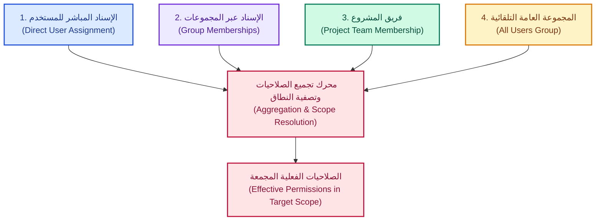
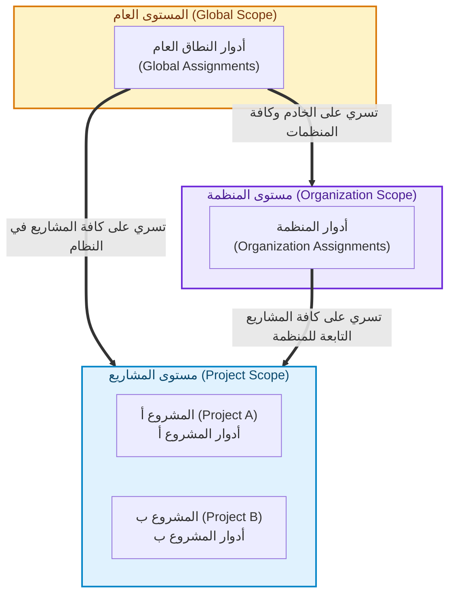

# دليل تجميع صلاحيات المستخدم وعلاقتها بالنطاقات في YouTrack

## (YouTrack User Permissions Aggregation & Scope Resolution Guide)

**المرجع البرمجي في المشروع:** [`internal/services/permissions_services/service.go`](../../internal/services/permissions_services/service.go#L189-L222)  
**كتالوج الصلاحيات:** [`internal/services/permissions_services/catalog.go`](../../internal/services/permissions_services/catalog.go)  
**دليل الأدوار الشامل:** [`youtrack_roles_comprehensive_guide.md`](./youtrack_roles_comprehensive_guide.md)  
**دليل مستويات النطاق:** [`../permissions/scope_levels_guide.md`](../permissions/scope_levels_guide.md)  
**المصدر المرجعي:** التوثيق الرسمي لمنصة JetBrains YouTrack (Cloud & Server - آخر إصدار 2026.2)

---

## فهرس المحتويات

1. [الخلاصة التنفيذية والنتائج الجوهرية](#1-الخلاصة-التنفيذية-والنتائج-الجوهرية)
2. [النموذج المعماري للصلاحيات في YouTrack](#2-النموذج-المعماري-للصلاحيات-في-youtrack)
3. [قواعد تنشيط الصلاحيات وتصفيتها حسب نطاق الإسناد](#3-قواعد-تنشيط-الصلاحيات-وتصفيتها-حسب-نطاق-الإسناد)
4. [مصادر تغذية صلاحيات المستخدم (قنوات الإسناد)](#4-مصادر-تغذية-صلاحيات-المستخدم-قنوات-الإسناد)
5. [خوارزمية تجميع الصلاحيات الفعالة (Effective Permissions Calculation)](#5-خوارزمية-تجميع-الصلاحيات-الفعالة-effective-permissions-calculation)
6. [الهرمية الرأسية والوراثة التنازلية بين النطاقات](#6-الهرمية-الرأسية-والوراثة-التنازلية-بين-النطاقات)
7. [الطبقات التكميلية بعد تجميع الصلاحيات (قيود الرؤية والحقول)](#7-الطبقات-التكميلية-بعد-تجميع-الصلاحيات-قيود-الرؤية-والحقول)
8. [سيناريوهات وحالات دراسية عملية واقعية](#8-سيناريوهات-وحالات-دراسية-عملية-واقعية)
9. [التكامل البرمجي مع محرك المشروع (Go Implementation)](#9-التكامل-البرمجي-مع-محرك-المشروع-go-implementation)
10. [المصادر والمراجع الرسمية](#10-المصادر-والمراجع-الرسمية)

---

## 1. الخلاصة التنفيذية والنتائج الجوهرية

بناءً على التوثيق الرسمي لشركة **JetBrains** لمنصة YouTrack:

1. **نموذج تجميع تراكمي بحت (Purely Additive / Union Model):**
   لا توجد في YouTrack أي صلاحية سلبية أو أمر حظر صريح (`Explicit Deny`). إذا كان لدى المستخدم أي دور — سواء أُسند إليه شخصياً، أو ورثه من مجموعة، أو من فريق مشروع — يمنحه صلاحية معينة في نطاق ما، فإن الصلاحية تُعتبر **ممنوحة ومفعّلة فوراً**.

2. **الفصل بين تعريف الدور وإسناده (Definition vs. Assignment):**
   الدور عبارة عن "حاوية صلاحيات". كل صلاحية داخل الدور لها نطاق ذاتي (`Intrinsic Scope: Global, Organization, or Project`). عند إسناد الدور في مستوى معين، يقوم YouTrack بتطبيق مصفاة تلقائية (`Scope Filter`) تفعل فقط الصلاحيات المتوافقة مع هذا المستوى وتهمل البقية.

3. **لا يُشترط الانتماء لمجموعة:**
   يمكن إسناد أي دور مباشرة للمستخدم الفردي (`Direct User Assignment`)، أو إسناده عبر مجموعات المستخدمين (`Group-based`)، أو عبر فرق المشاريع (`Project Teams`). الصلاحيات الفعلية هي حاصل جمع جميع هذه القنوات.

4. **السريان الهرمي التنازلي (Top-Down Propagation):**
   - الأدوار المسندة على المستوى **العام (Global)** تسري على مستوى النظام بالكامل وعلى كافة المنظمات والمشاريع.
   - الأدوار المسندة على مستوى **المنظمة (Organization)** تسري تلقائياً على كافة المشاريع التابعة لتلك المنظمة.
   - الأدوار المسندة على مستوى **المشروع (Project)** تنحصر صلاحياتها داخل حدود ذلك المشروع وموارده فقط.

---

## 2. النموذج المعماري للصلاحيات في YouTrack

يقوم نظام التحكم في الوصول (RBAC) في YouTrack على التمييز الدقيق بين مفهومين أساسيين:

```text
┌────────────────────────────────────────────────────────────────────────┐
│                        YouTrack Authorization Model                    │
├──────────────────────────────────┬─────────────────────────────────────┤
│    1. النطاق الذاتي للصلاحية     │        2. نطاق إسناد الدور           │
│   (Intrinsic Permission Scope)   │      (Role Assignment Scope)        │
├──────────────────────────────────┼─────────────────────────────────────┤
│ محفور في كود الصلاحية وتعريفها:   │ المكان/المستوى الذي يُسند فيه الدور: │
│ - Global Permission              │ - Global Scope                      │
│ - Organization Permission        │ - Organization Scope                │
│ - Project Permission             │ - Project Scope                     │
└──────────────────────────────────┴─────────────────────────────────────┘
```

> [!NOTE]
> هذا الفصل يمنح مسؤولي النظام مرونة عالية؛ فيمكن إنشاء دور مخصص يحتوي على مزيج من صلاحيات المشاريع وصلاحيات النظام، وحين يتم إسناد هذا الدور لمشروع محدد، سيتجاهل النظام تلقائياً الصلاحيات العامة دون الحاجة لإنشاء دورين منفصلين.

---

## 3. قواعد تنشيط الصلاحيات وتصفيتها حسب نطاق الإسناد

عند إسناد دور معين لمستخدم أو لمجموعة في نطاق مستهدف (`Target Scope`)، تنص وثائق JetBrains الرسمية على القواعد الصارمة التالية:

### قاعدة التصفية الرسمية (Disregard Rules)

- **عند الإسناد على المستوى العام (`Global Level`):**  
  جميع الصلاحيات الموجودة في الدور — بغض النظر عن نطاقها الذاتي (عامة، منظمة، مشروع) — تكون صالحة ومفعّلة وتطبّق عبر الخادم كاملاً وجميع مشاريعه.
- **عند الإسناد على مستوى المنظمة (`Organization Level`):**  
  يتم **إهمال الصلاحيات العامة (Globally scoped permissions are disregarded)** وليس لها أي أثر. وتُفعّل صلاحيات المنظمة والمشاريع لجميع المشاريع الواقعة تحت هذه المنظمة.
- **عند الإسناد على مستوى المشروع (`Project Level`):**  
  يتم **إهمال الصلاحيات العامة وصلاحيات المنظمة (Globally and organizationally scoped permissions are disregarded)**. وتطبّق فقط صلاحيات المشروع على ذلك المشروع بعينه.

### قاعدة الحماية عند الإسناد للمشروع (Project Scope Guard)
>
> [!IMPORTANT]
> تمنع منصة YouTrack تقنياً إسناد أي دور على مستوى المشروع ما لم يكن هذا الدور يحتوي على **صلاحية واحدة على الأقل بنطاق مشروع** (`Project-scoped permission`). الأدوار التي تتألف حصراً من صلاحيات عامة أو تنظيمية يُرفض إسنادها للمشاريع لأنها لن تؤدي لأي أثر تشغيلي داخل المشروع.

### مصفوفة تفعيل الصلاحيات حسب مستوى الإسناد

| النطاق الذاتي للصلاحية في الكتالوج | أُسندت في النطاق العام (Global) | أُسندت في نطاق المنظمة (Organization) | أُسندت في نطاق المشروع (Project) |
| :--- | :---: | :---: | :---: |
| **Global Permission** (مثل: `Create User`, `Manage Backup`) | ✅ مفعّلة على كامل الخادم | ❌ مُهملة (Disregarded) | ❌ مُهملة (Disregarded) |
| **Organization Permission** (مثل: `Update Organization`) | ✅ مفعّلة لكافة المنظمات | ✅ مفعّلة لهذه المنظمة ومشاريعها | ❌ مُهملة (Disregarded) |
| **Project Permission** (مثل: `Create Issue`, `Read Issue`) | ✅ مفعّلة لكافة مشاريع النظام | ✅ مفعّلة لكافة مشاريع المنظمة | ✅ مفعّلة لهذا المشروع فقط |

---

## 4. مصادر تغذية صلاحيات المستخدم (قنوات الإسناد)

تستمد الصلاحيات الفعلية لأي مستخدم من أربع قنوات إسناد رئيسية تتكامل وتتجمع معاً:



### 1. الإسناد المباشر للمستخدم (Direct User Assignment)

- يتم عبر حساب المستخدم: `Administration > Users > [المستخدم] > Roles`.

- يُسند الدور للمستخدم مباشرة في نطاق محدد (Global, Org, Project).
- ممتاز للحالات الخاصة والاستثنائية ومدراء المشاريع المحددين.

### 2. الإسناد عبر المجموعات (Group Memberships)

- يتم عبر المجموعات: `Administration > Groups > [المجموعة] > Roles`.

- كل مستخدم ينضم للمجموعة يرث تلقائياً جميع الأدوار المسندة لها بنطاقاتها.
- يدعم YouTrack **المجموعات المتداخلة (Subgroups / Nested Groups)**؛ فإذا كانت مجموعة (Developers) تنتمي لمجموعة (Engineering)، فإن أعضاء الأولى يرثون أدوار المجموعتين.

### 3. عضوية فريق المشروع (Project Team Membership)

- يتم عبر المشروع: `Projects > [المشروع] > Settings > People`.

- فريق المشروع هو بمثابة مجموعة مخصصة للمشروع؛ يتم تحديد دور افتراضي للفريق (مثل `Contributor`) أو أدوار متباينة للأعضاء داخل الفريق.
- إضافة مستخدم أو مجموعة لفريق المشروع تمنحه الدور المسند لفريق هذا المشروع تلقائياً.

### 4. المجموعة الافتراضية العامة (`All Users`)

- مجموعة مدمجة تلقائية ينتمي إليها **كل حساب مستخدم مسجل** في النظام بمجرد إنشائه.

- يُسند إليها افتراضياً دور `Observer` (أو دور مخصص للقراءة فقط).
- توفر الحد الأدنى الثابت من الصلاحيات (Baseline Permissions) مثل تسجيل الدخول وقراءة الملفات العامة والمشاريع المفتوحة.

---

## 5. خوارزمية تجميع الصلاحيات الفعالة (Effective Permissions Calculation)

### المعادلة الرياضية للتجميع التراكمي

لأي مستخدم $U$ في سياق تنفيذ عملية على مورد داخل المشروع $P$ التابع للمنظمة $O$:

$$\text{EffectivePerms}(U, P) = \bigcup \left[ \text{FilterScope}(R, \text{PROJECT}) \right]$$

حيث تمثل $R$ جميع الأدوار المسترجعة من الحالات التالية:

1. أي دور مُسند لـ $U$ بنطاق عام $\text{Global}$.
2. أي دور مُسند لـ $U$ بنطاق المنظمة $O$.
3. أي دور مُسند لـ $U$ بنطاق المشروع $P$.
4. لجميع المجموعات $G \in \text{Groups}(U)$:
   - أي دور مسند لـ $G$ بنطاق $\text{Global}$.
   - أي دور مسند لـ $G$ بنطاق $O$.
   - أي دور مسند لـ $G$ بنطاق $P$.
5. أي دور ممنوح لـ $U$ أو $G$ ضمن فريق المشروع $\text{ProjectTeam}(P)$.
6. أدوار المجموعة العامة $\text{All Users}$.

ثم تُطبّق دالة تصفية النطاق `FilterScope(Role, TargetScope)` لتفعيل الصلاحيات المتوافقة وإهمال غير المتوافقة.

### خوارزمية التقييم خطوة بخطوة عند طلب إجراء (Access Request Workflow)

```text
طلب وصول: المستخدم (U) يريد تنفيذ العملية (Action) التي تتطلب الصلاحية (P_req) على المورد في المشروع (TargetProject).
│
├── 1. استخراج النطاق المستهدف للمشروع والمنظمة الأم الحاضنة له: TargetOrg = GetOrg(TargetProject).
│
├── 2. تجميع كل المعرفات المرتبطة بالمستخدم:
│      Identities = { User_ID, All_Group_IDs(User), ProjectTeam(TargetProject), AllUsers_Group_ID }
│
├── 3. جلب جميع إسنادات الأدوار (Role Assignments) لجميع الهويات أعلاه حيث:
│      Scope ∈ { Global, TargetOrg, TargetProject }
│
├── 4. تصفية الصلاحيات داخل كل دور بحسب مستوى الإسناد (Disregard Rules):
│      - إذا كان إسناد الدور في Global        ──> تُقبل كافة صلاحيات الدور.
│      - إذا كان إسناد الدور في TargetOrg     ──> تُقبل فقط صلاحيات Org + Project (تُهمل Global).
│      - إذا كان إسناد الدور في TargetProject ──> تُقبل فقط صلاحيات Project (تُهمل Global و Org).
│
├── 5. دمج الصلاحيات الناتجة في مجموعة واحدة فريدة:
│      EffectivePermissionsSet = ⋃ (Filtered Permissions)
│
└── 6. التحقق النهائي:
       هـل (P_req ∈ EffectivePermissionsSet)؟
       ├── نعم ──> الانتقال إلى فحص قيود الرؤية للمحتوى (Content Visibility) ──> سماح (ALLOW).
       └── لا  ──> رفض فوري للوصول (DENY 403 Forbidden).
```

---

## 6. الهرمية الرأسية والوراثة التنازلية بين النطاقات

تنتقل الصلاحيات عبر النطاقات هرمياً من الأعلى سلطة للأدنى، وفق المخطط التالي:



### سلوك النطاقات الفرعية (Parent-Child Behavior)

1. **علاقة المنظمة بالمشروع:**
   إذا كان المشروع $P_1$ ينتمي للمنظمة $O_1$، فإن أي مستخدم مُنح دور `Contributor` في المنظمة $O_1$ سيملك تلقائياً صلاحيات `Contributor` في $P_1$ وجميع المشاريع الحالية والمستقبلية التابعة لـ $O_1$، دون الحاجة لإضافته لكل مشروع على حدة.
2. **عزل المنظمات:**
   صلاحيات المنظمة $O_1$ لا تتسرب أبداً إلى مشاريع المنظمة $O_2$.
3. **عزل المشاريع:**
   صلاحيات المشروع $P_1$ محصورة به، ولا تمنح أي وصول للمشروع $P_2$ حتى لو كانا ضمن نفس المنظمة.

---

## 7. الطبقات التكميلية بعد تجميع الصلاحيات (قيود الرؤية والحقول)

الحصول على الصلاحية من خلال الدور يمثل **شرطاً ضرورياً ولكنه ليس كافياً دائماً**؛ إذ يطبق YouTrack طبقة فحص إضافية للمحتوى والسياق:

### 1. الصلاحيات الذاتية لمنشئ الكيان (Inherent Rights)

- المستخدم الذي يبلغ عن تذكرة (`Reporter`) أو يكتب تعليقاً (`Author`) يحصل على حقوق تعديل وقراءة لبياناته حتى لو كان دوره الأساسي في المشروع هو `Observer` للقراءة فقط (وفق ضوابط محددة لإعدادات المشروع).

### 2. محددات رؤية التذاكر (Issue Visibility - "Visible to")

- إذا كانت التذكرة مقيدة بقائمة رؤية محددة: `Visible to: Developers Group`

- لن يتمكن المستخدم من قراءة التذكرة حتى لو كان يملك صلاحية `Read Issue` في المشروع، ما لم يكن حسابه أو إحدى مجموعاته مذكورة صراحة في قائمة `Visible to`.

### 3. وراثة قيود الرؤية في مقالات قاعدة المعرفة (Article Visibility Inheritance)

- تنص وثائق JetBrains على أن **المقالات الفرعية (Sub-articles) ترث تلقائياً قيود الرؤية المفروضة على المقال الأب (Parent Article)**.

- يمكنك زيادة التقييد على المقال الفرعي، ولكن **لا يمكنك جعل المقال الفرعي متاحاً لشريحة أوسع من المقال الأب**.
- تقييد رؤية المقال ينسحب تلقائياً على قسم التعليقات التابع له.

### 4. حماية الحقول المخصصة الخاصة (Private Custom Fields)

- حقول معينة (مثل التكلفة أو التقييم الداخلي) تتطلب صلاحية خاصة `Read Issue Private Fields` و `Update Issue Private Fields`.

- غياب هذه الصلاحية يحجب الحقل فقط دون حجب بقية التذكرة.

### 5. قيود مفاتيح الـ API ورموز الوصول (Permanent Access Tokens)

- لا يمكن لأي Token أن يحصل على صلاحيات تتجاوز الصلاحيات الفعلية للمستخدم الذي أنشأه. يتم تقاطع صلاحيات الـ Token المحددة أثناء إنشائه مع الصلاحيات الفعلية لحساب المستخدم في لحظة التنفيذ.

---

## 8. سيناريوهات وحالات دراسية عملية واقعية

### سيناريو 1: مستخدم يملك دورين مختلفين (مباشر وموروث)

- **المعطيات:**
  - المستخدم "أحمد" ينتمي لمجموعة `QA Team` التي تملك دور `Reporter` في المشروع `Alpha`.
  - قام مدير المشروع بمنح "أحمد" دور `Project Admin` بشكل **مباشر** في نفس المشروع `Alpha`.

- **النتيجة:**
  - يملك "أحمد" في المشروع `Alpha` كافة صلاحيات `Project Admin` + `Reporter`.
  - بما أن الصلاحيات تراكمية، فإن دور `Project Admin` الأوسع يطغى ويعطيه كافة الصلاحيات الإدارية، ولا يقيده دور `Reporter` الأدنى.

---

### سيناريو 2: دور عام مسند على مستوى المشروع

- **المعطيات:**
  - قام المسؤول بإنشاء دور مخصص اسمه `Custom Lead` ووضع فيه الصلاحيات التالية:
    1. `Create User` (نطاق عام Global)
    2. `Update Organization` (نطاق منظمة Organization)
    3. `Create Issue` (نطاق مشروع Project)
    4. `Update Issue` (نطاق مشروع Project)
  - تم إسناد هذا الدور للمستخدم "سارة" داخل مشروع `Mobile App` فقط.

- **النتيجة والتطبيق:**
  - يُسمح بالإسناد لأن الدور يحتوي على صلاحيات مشروع (`Create Issue`, `Update Issue`).
  - تُهمل الصلاحيات `Create User` و `Update Organization` تلقائياً ولن تتمكن سارة من استخدامها.
  - الصلاحيات الفعالة لـ "سارة" في `Mobile App` هي فقط: `Create Issue` و `Update Issue`.

---

### سيناريو 3: دور بمستوى المنظمة مقابل مشاريع متعددة

- **المعطيات:**
  - المنظمة `TechCorp` تضم ثلاثة مشاريع: `Backend`, `Frontend`, `DevOps`.
  - تم منح المستخدم "خالد" دور `Contributor` على مستوى المنظمة `TechCorp`.
  - تم منح المستخدم "خالد" دور `Observer` (مشاهد فقط) على مستوى مشروع `DevOps` مباشرة.

- **النتيجة:**
  - في مشروعي `Backend` و `Frontend`: "خالد" يملك صلاحيات `Contributor`.
  - في مشروع `DevOps`: الصلاحيات هي حاصل جمع `Contributor` (موروثة من المنظمة) + `Observer` (مباشرة). وبما أن `Contributor` تمنح التعديل والإنشاء، فسيتمكن خالد من التعديل والإنشاء في `DevOps` أيضاً (لأن الصلاحيات تتراكم ولا تلغي إحداها الأخرى).

---

## 9. التكامل البرمجي مع محرك المشروع (Go Implementation)

تمت ترجمة هذه القواعد بدقة متناهية داخل محرك المشروع في [`internal/services/permissions_services/service.go`](../../internal/services/permissions_services/service.go):

### كود تصفية النطاق الرسمي (Scope Isolation Filter)

```go
// ValidatePermissionsForScope filters permissions based on YouTrack scope isolation rules:
// - Global assignment: all permissions apply.
// - Organization assignment: global permissions no longer propagate and have no effect.
// - Project assignment: global and organization-level permissions have no effect.
func (s *Service) ValidatePermissionsForScope(permissionIDs []string, targetScope ScopeLevel) []string {
 s.mu.RLock()
 defer s.mu.RUnlock()

 var valid []string
 for _, id := range permissionIDs {
  p, ok := s.catalog[id]
  if !ok {
   continue
  }

  switch targetScope {
  case ScopeGlobal:
   // Global assignments allow all scopes to apply
   valid = append(valid, id)
  case ScopeOrganization:
   // Only organization and project permissions take effect
   if p.Scope == ScopeOrganization || p.Scope == ScopeProject {
    valid = append(valid, id)
   }
  case ScopeProject:
   // Only project-level permissions take effect
   if p.Scope == ScopeProject {
    valid = append(valid, id)
   }
  }
 }
 sort.Strings(valid)
 return valid
}
```

### كود فحص وجود الصلاحية (Union Membership Check)

```go
// HasPermission checks if the required permission is present in the list of granted permissions.
func (s *Service) HasPermission(grantedPermissions []string, requiredPermission string) bool {
 for _, p := range grantedPermissions {
  if p == requiredPermission {
   return true
  }
 }
 return false
}
```

---

## 10. المصادر والمراجع الرسمية

1. **إدارة صلاحيات الوصول والأدوار في YouTrack Cloud & Server:**  
   [JetBrains YouTrack Documentation - Manage Access Permissions](https://www.jetbrains.com/help/youtrack/cloud/manage-access-permissions.html)
2. **إسناد الأدوار للمستخدمين والمجموعات:**  
   [JetBrains YouTrack Documentation - Grant Roles to Users and Groups](https://www.jetbrains.com/help/youtrack/cloud/configure-access-for-a-user-group.html)
3. **إدارة صلاحيات المنظمات:**  
   [JetBrains YouTrack Documentation - Manage Organizations Access](https://www.jetbrains.com/help/youtrack/cloud/manage-organizations.html)
4. **إدارة فرق المشاريع:**  
   [JetBrains YouTrack Documentation - Manage Project Team and Access](https://www.jetbrains.com/help/youtrack/cloud/manage-project-team-and-access.html)
5. **وراثة رؤية المقالات في قاعدة المعرفة:**  
   [JetBrains YouTrack Documentation - Article Visibility and Inheritance](https://www.jetbrains.com/help/youtrack/cloud/knowledge-base-article-visibility.html)
